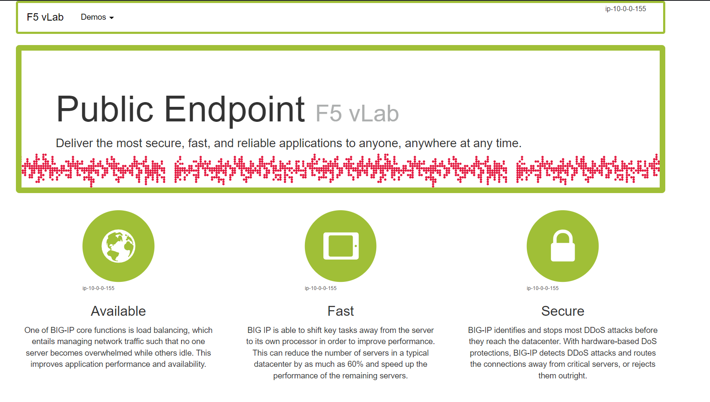
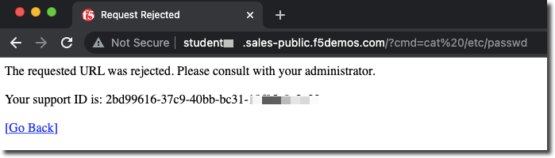
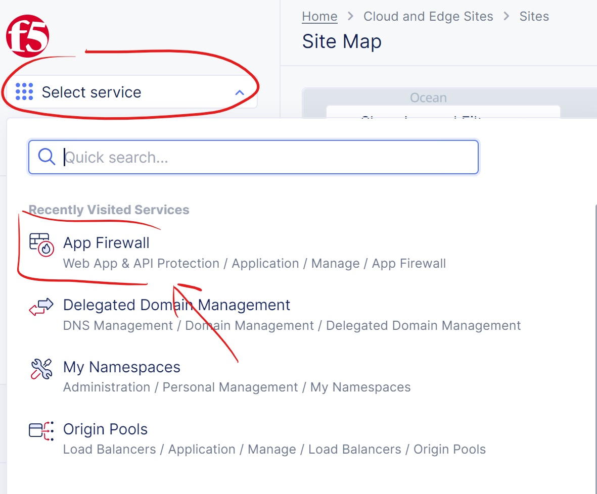

Lab 3: Protecting a Public and Private Endpoint
===============================================

During this lab you will be introduced to creating a WAF policy in F5 Distributed Cloud
and using that policy to protect your lab resource that is a "Public Endpoint"
in AWS (webserver with an EIP).

Task 1. Create WAF Policy
-------------------------

F5 Distributed Cloud WAF shares the same WAF engine that is used by F5 BIG-IP WAF and F5 NGINX App Protect.

The F5 Distributed Cloud WAF engine provides preset categories of rules to protect your web 
applications, provides the ability to run in a monitor or blocking mode, prevent 
false positives by excluding individual rules, IP addresses, or web application paths

In the next exercise you will configure a basic WAF policy 

Exercise 1: Create WAF Policy
^^^^^^^^^^^^^^^^^^^^^^^^^^^^^

We will create a blocking WAF policy.

#. Start in F5 Distributed Cloud Console and switch to the "Web App & API Protection" context. 

   It can be access either from the main Home page... 
  
   ...or via the "Select Service" menu on the top left corner of any other page:

   |select-service|
   
#. Ensure you are in the proper namespace (an adjective-animal combination) and not the default namespace. It is ok if you do not see your namespace as you will be defaulted to it as seen in your URI path as in the Introduction section.

   |namespace-selection|
#. Navigate the menu to go to "Manage"->"App Firewall". Click on *Add App Firewall*.

#. Enter the following variables:

   ================================= ============================================
   Variable                          Value
   ================================= ============================================
   Name                              blocking-app-firewall
   Enforcement Mode                  Blocking
   ================================= ============================================

   In this mode we change the policy to block attacks that are included in 
   the default policy.  Later we will look at how we can customize these settings.

   .. image:: _static/blocking-app-firewall-policy.png

#. Click the *Save and Exit* button to create the policy

Exercise 2: Configure WAF Policy
^^^^^^^^^^^^^^^^^^^^^^^^^^^^^^^^
#.

#.

#.

#. Under the *Web Application Firewall* section 

#. Choose the following options:

   =============================== =================================
   Variable                        Value
   =============================== =================================
   Web Application Firewall (WAF)  Enable
   Select App Firewall             [NAMESPACE]/blocking-app-firewall
   =============================== =================================

#. Click "*Save and Exit* to create the HTTP Load Balancer.

Once the HTTP Load Balancer has been deployed, you should now be able to go to the DNS name that you entered 
previously in a web browser.  The FQDN we used in our example is http://stable-sheep.lab-sec.f5demos.com.  
Your FQDN should follow the format of [unique name].[supplied domain name for your tenant].

.. note:: If you are having challenges connecting to the "f5demos.com" name you can also try connecting to the "ves.io" name.

Exercise 4: Verify Configuration
^^^^^^^^^^^^^^^^^^^^^^^^^^^^^^^^

The public demo app should look like the following:

In this topology we are sending traffic to an AnyCast IP that is hosted in F5 Distributed Cloud's Regional Edge.

We then connect to the AWS resource via it's Public IP address.  

Try adding the following to the URL "/?cat%20/etc/passwd".

You should see a block page.

Exercise 5: Performance and Security 
^^^^^^^^^^^^^^^^^^^^^^^^^^^^^^^^^^^^

#. Start in F5 Distributed Cloud Console and switch to the "Web App & API Protection" context. [You should already be here from previous lab]

   We can view details of successful requests and blocks by navigating to "Virtual Hosts"

#. Click on "Select service" and select "Load Balancers". Click "Virtual Hosts"->"HTTP Load Balancers" and click on your "global" Load Balancer

   .. image:: _static/performance-overview.png
      :width: 50%

   You will see a health score of your application as well as end to end latency of the connection.

   .. image:: _static/screenshot-global-vip-performance-dashboard.png
      :width: 50%

#. Click on "Requests" in the upper page navigation

   You should be able to view logs for individual requests.

   .. image:: _static/screenshot-global-vip-public-requests.png
      :width: 50%

#. Click on the "Performance Monitoring" dropdown and select "Security Monitoring".
#. Click on "Security Events"
   You will be able to see details of the security events.

   .. image:: _static/screenshot-global-vip-public-security-events.png

   Clicking on the arrow to the left of a security event will expand the details.

   .. image:: _static/screenshot-global-vip-public-security-events-details.png
      :width: 50%

Next we will demonstrate how we can securely connect to your private AWS resources via a AppMesh node.

.. |app-context| image:: _static/app-context.png
   :width: 75%

.. |namespace-selection| image:: _static/namespace-selection.png
   :width: 75%
.. |op-pool-basic| image:: _static/op-pool-basic.png
.. |lb-basic| image:: _static/lb-basic.png

.. |origin_pools_menu| image:: _static/origin_pools_menu.png
.. |origin_pools_add| image:: _static/origin_pools_add.png
.. |origin_pools_config| image:: _static/origin_pools_config.png
.. |origin_pools_config_api| image:: _static/origin_pools_config_api.png
.. |origin_pools_config_mongodb| image:: _static/origin_pools_config_mongodb.png
.. |origin_pools_show_child_objects| image:: _static/origin_pools_show_child_objects.png
.. |origin_pools_show_child_objects_status| image:: _static/origin_pools_show_child_objects_status.png
.. |http_lb_origin_pool_health_check| image:: _static/http_lb_origin_pool_health_check.png
.. |http_lb_origin_pool_health_check2| image:: _static/http_lb_origin_pool_health_check2.png
.. |op-add-pool| image:: _static/op-add-pool.png
.. |op-api-pool| image:: _static/op-api-pool.png
.. |op-spa-check| image:: _static/op-spa-check.png
.. |op-tshoot| image:: _static/op-tshoot.png

