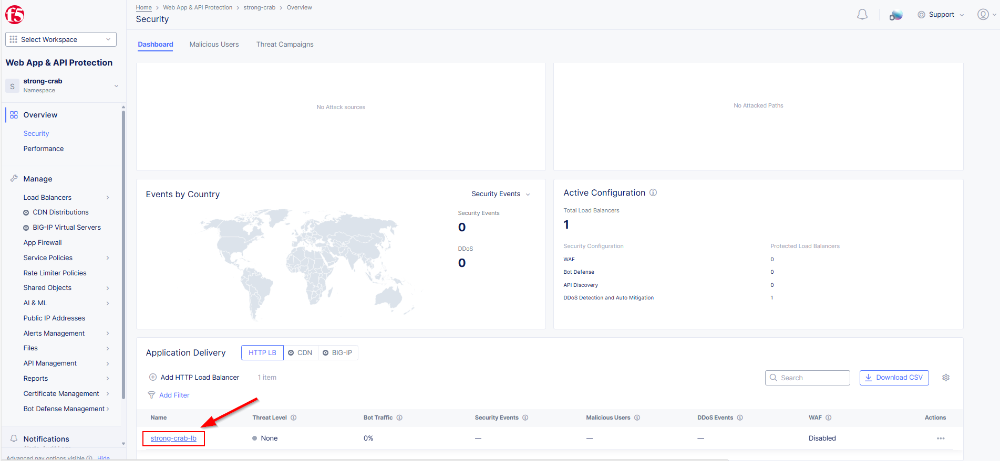

Lab 2: Adding a Bot Protection Profile and Testing 
==================================================

**Scenario Lab 2**

In the prior lab we discovered our airline application lacked proper security protections and was vulnerable.
The following lab tasks will strengthen our security posture and address the increase in Bot activity towards
your company's airline application.  We will leverage our Bot testing tool to validate our Bot protection policies 
and utilize security analytics to examine various requests.  
  

**Expected Lab Time: 30 minutes**

Task 1: Create a Bot Protection Profile  
~~~~~~~~~~~~~~~~~~~~~~~~~~~~~~~~~~~~~~~

In this task you will view recent requests and filter out specific requests from our test tool.  You will then work
on configuring a Bot Defense profile to protect our airline application Sign-In page.  We will initiate a Basic 
Credential Stuffing attack and observe related events using security analytics and making any necessary adjustments needed. 

+----------------------------------------------------------------------------------------------+
| 1. In the Distributed Cloud (XC) Console go to **Web App and API Protection** then click on  |
|                                                                                              |
|    **Overview** and finally **Security** (You may have to adjust the time filter as needed)  |                                                  
+----------------------------------------------------------------------------------------------+
| |lab1-task4-01|                                                                              |
+----------------------------------------------------------------------------------------------+
|    Scroll to the bottom and click on your HTTP Load Balancer                                 |
+----------------------------------------------------------------------------------------------+
| |lab1-task4-02|                                                                              |
+----------------------------------------------------------------------------------------------+
| 2. Now we are going to Click **Add Filter** and enter the following filter syntax            | 
|                                                                                              |
|    **Method In Post**.  As you type each word click on the syntax match that will appear     |
|                                                                                              |
|    in the dialogue box.                                                                      |
|                                                                                              |
|    See the example below on how your filter will appear as your create it                    |
+----------------------------------------------------------------------------------------------+
| |lab2-task1-01a|                                                                             |
|                                                                                              |
+----------------------------------------------------------------------------------------------+
|                                                                                              |
|   Here is what the filter should end up looking like when correctly created                  |
|                                                                                              |
+----------------------------------------------------------------------------------------------+
| |lab2-task1-01|                                                                              |
|                                                                                              |
+----------------------------------------------------------------------------------------------+
|    As you examine these **POST** requests can you see what endpoint is being targeted ?      |
+----------------------------------------------------------------------------------------------+
| |lab2-task1-03|                                                                              |
+----------------------------------------------------------------------------------------------+
| 3. In the Distributed Cloud (XC) Console, under HTTP Loadbalancers click the three dots      |
|                                                                                              |
|    under the **Action** column and select **Manage Configuration**                           |
+----------------------------------------------------------------------------------------------+
| |lab1-task2-01|                                                                              |
|                                                                                              |
+----------------------------------------------------------------------------------------------+
| 4. At the top right click **Edit Configuration** then Click **Bot Protection**. Now click    |
|                                                                                              |
|    on *Disable* and select **Enable Bot Defense Standard**                                   |
+----------------------------------------------------------------------------------------------+
| |lab2-task1-04|                                                                              |
+----------------------------------------------------------------------------------------------+
| 5. In the resulting Bot Defense Policy section, click the **Configure** link.                |
+----------------------------------------------------------------------------------------------+
| |lab2-task1-05|                                                                              |
+----------------------------------------------------------------------------------------------+
| 6. In the **Protected App Endpoints** window, click the **Configure** link under             |  
|                                                                                              |
|    **App Endpoint Type**                                                                     |
+----------------------------------------------------------------------------------------------+
| |lab2-task1-06|                                                                              |
+----------------------------------------------------------------------------------------------+
| 7. In the resulting window, click the **Add Item** in the App Endpoint Type section.         | 
+----------------------------------------------------------------------------------------------+
| |lab2-task1-07|                                                                              |
+----------------------------------------------------------------------------------------------+
| 8. In the resulting **App Endpoint Type** window, input the following values as shown:       |
|                                                                                              |
|    - **Metadata: Name:** *auth-bot*                                                          |
|    - **HTTP Methods:** *POST*                                                                |
|    - **Endpoint Label** *Undefined*                                                          |
|    - **Protocol:** *BOTH*                                                                    |
|    - **Path:Path Match:** *Prefix*                                                           |
|    - **Prefix:** */user/vipsignin*                                                           |
|    - **Bot Traffic Mitigation:Select Bot Mitigation Action:** *Flag*                         |
|    - **Bot Traffic Mitigation:Include Mitigation Headers:** *Append Headers*                 |
|    - **Inference Header Name** and **Automation Type Header Name** *As Defaults (unchanged)* |
|                                                                                              |
|    Once all of these settings are configured scroll to the bottom and click **Apply**        |
+----------------------------------------------------------------------------------------------+
| |lab2-task1-08|                                                                              |
|                                                                                              |
| |lab2-task1-09|                                                                              |
|                                                                                              |
+----------------------------------------------------------------------------------------------+
| 9. Next, click **Apply** on the **App Endpoint Type** screen                                 |
|                                                                                              |
+----------------------------------------------------------------------------------------------+
| |lab2-task1-10|                                                                              |
|                                                                                              |
+----------------------------------------------------------------------------------------------+
| 10. Next, click **Apply** on the **Protected App Endpoints** screen                          |
|                                                                                              |
+----------------------------------------------------------------------------------------------+
| |lab2-task1-11|                                                                              |
|                                                                                              |
+----------------------------------------------------------------------------------------------+
| 11. We can now see the **Bot Defense Policy** is now configured                              |
|                                                                                              |
+----------------------------------------------------------------------------------------------+
| |lab2-task1-12|                                                                              |
|                                                                                              |
+----------------------------------------------------------------------------------------------+
| 12. Use the left-hand navigation and click **Other Settings** or scroll to the bottom on the |
|                                                                                              |
|     **HTTP Load Balancer** screen, and click **Save and Exit.**                              |
+----------------------------------------------------------------------------------------------+
| |lab2-task1-13|                                                                              |
|                                                                                              |
+----------------------------------------------------------------------------------------------+
| 13. Now that we have a Bot Policy applied lets re-run the Basic Credential stuffing attack.  |
|                                                                                              |
|     From Windows Jump Host.  Click on **OpenBullet** then **Jobs** and the pencil/edit icon  |
|                                                                                              |
|     to the right.  We need to edit the *Skip** counter by highlighting the current number    |
|                                                                                              |
|     and type 0 (zero). Click **Accept** when done.                                           |
+----------------------------------------------------------------------------------------------+
| |lab1-task5-03|                                                                              |
+----------------------------------------------------------------------------------------------+
| 14. Check review the request logs.  Was anything flagged as a violation? Why or Why not ?    |
|                                                                                              |
| 15. Let's inspect the Security Analytics dashboard and any captured events.  Here we can     |  
|                                                                                              |
|     make policy changes by clicking on the three dots on the right-side of these events.     | 
|                                                                                              |
+----------------------------------------------------------------------------------------------+
| |lab2-task1-14|                                                                              |
+----------------------------------------------------------------------------------------------+
| 16. We can easily take action from the dashboard add the source IP to the Blocked Client List|
+----------------------------------------------------------------------------------------------+
| |lab2-task1-15|                                                                              |
|                                                                                              |
| |lab2-task1-16|                                                                              |
+----------------------------------------------------------------------------------------------+
| 17. By clicking on **Bot Defense** then **View in Bot Defense** we gain greater visibility   |
|                                                                                              |
|     on the various traffic types. Notice these requests are defined as **Bad Bot**           |
|                                                                                              |
+----------------------------------------------------------------------------------------------+
| |lab2-task1-17|                                                                              |
|                                                                                              |
| |lab2-task1-18|                                                                              |
|                                                                                              |
| |lab2-task1-19|                                                                              |
+----------------------------------------------------------------------------------------------+

Task 2: Compare requests with and without Bot Defense
~~~~~~~~~~~~~~~~~~~~~~~~~~~~~~~~~~~~~~~~~~~~~~~~~~~~~

For this task you will inspect the airline applications signin page all while attempting various 
failed login attempts.  We will learn the telemetry gleaned from this scoping exercise. Please 
ensure these tasks are run from the **Jump Host**

 
+----------------------------------------------------------------------------------------------+
| 1. From the Jump Host launch the Chrome Browser and click on the F5 Air bookmark             |
|                                                                                              |
|    Optionally you can type **http://airline-backend.f5se.com/user/vipsignin**                |
|                                                                                              |
| 2. Once loaded right click on the page and choose **Inspect** then navigate to the           |
|                                                                                              |
|    **Network** tab on the new right-hand side window. This will allow you to monitor what    |
|                                                                                              |
|    content is loaded and submitted during the interactions with the airline website.         |
|                                                                                              |
+----------------------------------------------------------------------------------------------+
| |lab2-task2-01|                                                                              |
+----------------------------------------------------------------------------------------------+
| 3. On the login prompt enter the following testing username: **john.smith@nobody.com**       |
|                                                                                              |
|    password: **test123** and then click **Confirm**.                                         |
|                                                                                              |
| 4. This should log you into the account but more important look on the right side panel      |
|                                                                                              |
|    finding the **vipsignin** POST request.  Clicking on this entry and you will see the POST |
|                                                                                              |
|    request that was created for your login.                                                  |
|                                                                                              |
| 5. Switch to the **Payload** tab and we can see the exact data that was submitted.           |
|                                                                                              |
|    The Username and Password are expected but we also see a tracking token (not used here)   |
+----------------------------------------------------------------------------------------------+                                                                                              
| |lab2-task2-02|                                                                              |
|                                                                                              |
+----------------------------------------------------------------------------------------------+
| 6. Open a new tab in Chrome and navigate to the frontend airline application website         |
|                                                                                              |
|    ** http://namespace.lab-sec.f5demos.com** and repeat steps 2-5, except the form data      |
|                                                                                              |
|    will appear differently.                                                                  |
|                                                                                              |
| 7. Refreshing the Bot Defense (Security Analytics Screen) we can see extra details.          | 
|                                                                                              |
|    This is telemetry data about the request that helps to identify human vs bot behavior,    |    
|                                                                                              |
|    among other things. If we see a violation being categorized as "Bad Bot" that means       | 
|                                                                                              |
|    the risk engine detected a bot based on signature information. Something about the request| 
|                                                                                              |
|    was flagged by a matching condition in the signature, no telemetry was required. This was |                                                                             
|                                                                                              |
|    the case with the basic credential stuffing attach.  The client for that attack can not   |
|                                                                                              |
|    render JavaScript, and is making direct HTTP requests, similar to using curl.             |
|                                                                                              |
+----------------------------------------------------------------------------------------------+
| |lab2-task2-05|                                                                              |
|                                                                                              |
| |lab2-task2-06|                                                                              |
+----------------------------------------------------------------------------------------------+

+----------------------------------------------------------------------------------------------+
| **End of Lab 2:**  This concludes Lab 2, feel free to review and test the configuration.     |
|                                                                                              |
|                                                                                              |
+----------------------------------------------------------------------------------------------+
| |labend|                                                                                     |
+----------------------------------------------------------------------------------------------+

.. |lab1-task4-01| image:: _static/lab1-task4-01.png
   :width: 800px

.. |labend| image:: _static/labend.png
   :width: 800px
      
