Lab 3: Human-Simulated Stuffing Attack
=======================================

**Scenario Lab 3**

In this lab, you will configure Openbullet to simulate human input on a selenium-controlled browser. 
Since a browser is being used as the client, the POST will contain javascript containing telemetry about 
the client. Note: Telemetry allows the engine to assign a risk factor to a threat. For some attacks, 
like a slow-moving “human” stuffing attack, the engine needs to see enough data to positively identify 
it as a bot. Therefore, for this attack, you may see some of the initial requests are logged as Human 
but quickly the bot will be flagged.

To run this attack, the workflow is the same as the Basic stuffing attack except you will use the Human 
config and Human credentials wordlist.

**Expected Lab Time: 30 minutes**

Task 1: Execute a Human Credential Stuffing Attack
~~~~~~~~~~~~~~~~~~~~~~~~~~~~~~~~~~~~~~~~~~~~~~~~~~

For this task you will create a Human credential stuffing attack with our test tool.  The workflow 
is the same as the Basic stuffing attack except you will use the Human config and Human credentials wordlist. 
We will end by reviewing the security requests logs as well as the Bot Defense dashboard for greater insights.

+----------------------------------------------------------------------------------------------+
|  1. RDP or Console into the Windows Jump Host, you can locate the password here:             |
|                                                                                              |
|     **(Password is located in the UDF Course Screen->Components->Jump Host->Details)**       |
|                                                                                              |
|  2. On the home screen double-click the OpenBullet 2 shortcut                                |
+----------------------------------------------------------------------------------------------+
| |lab1-task3-02|                                                                              |
+----------------------------------------------------------------------------------------------+                             
|  3. Click on **Configs** and double-click **"Human"** - this is our credential stuffing      |
|                                                                                              |
|     attack configuration that will simulate a basic Bot.                                     |
+----------------------------------------------------------------------------------------------+
| |lab3-task1-01|                                                                              |
|                                                                                              |
+----------------------------------------------------------------------------------------------+
| 4. Click the **Navigate to App** block and update the URL field with your load balancer      |
|                                                                                              |
|    namespace.  Click **Save** at the bottom when finished.                                   |
+----------------------------------------------------------------------------------------------+
| |lab3-task1-02|                                                                              |
|                                                                                              |
| |lab3-task1-03|                                                                              |
+----------------------------------------------------------------------------------------------+
| 5. From within the same window click **Jobs** then **New+** and finally **Multi-Run**        |
|                                                                                              |             
+----------------------------------------------------------------------------------------------+
| |lab3-task1-04|                                                                              |
|                                                                                              |
| |lab3-task1-05|                                                                              |
|                                                                                              |
+----------------------------------------------------------------------------------------------+

+----------------------------------------------------------------------------------------------+
| 6. In the new window, on the top left, click **"Select Config"** and then **Human**          |
|                                                                                              |
|    finally **Accept** at the bottom.                                                         |
+----------------------------------------------------------------------------------------------+
| |lab3-task1-06|                                                                              |
|                                                                                              |
| |lab3-task1-07|                                                                              |
+----------------------------------------------------------------------------------------------+
| 7. On the top right, click **Select Wordlist** and then **Credentials-Human** and finally    |
|                                                                                              |
|    **Accept** at the bottom.                                                                 |
+----------------------------------------------------------------------------------------------+
| |lab3-task1-08|                                                                              |
|                                                                                              |
| |lab3-task1-09|                                                                              |
+----------------------------------------------------------------------------------------------+
| 8. Now that we have added the **Human** Configuration along with the **Credentials-Human**   |
|                                                                                              |
|    we can finally click **Accept** at the bottom, this will save the Multi-Run Job setup     |
+----------------------------------------------------------------------------------------------+
| |lab3-task1-10|                                                                              |
+----------------------------------------------------------------------------------------------+
| 9. You should now see a second job titled **#[1-9]** **[Idle]**.  Hover over this second job |
|                                                                                              |
|    until a small hand appears then click.  A new window will open if you see **Skip: 11**    | 
|                                                                                              |
|    you will need to change this value. Over to the right click  **Options**.                 |
|                                                                                              |
+----------------------------------------------------------------------------------------------+
| |lab3-task1-11|                                                                              |
|                                                                                              |
| |lab3-task1-12|                                                                              |
|                                                                                              |
+----------------------------------------------------------------------------------------------+
| 10. Change the **Skip** value to 0 (zero) either by typing it or using the **minus** button  |
|                                                                                              |
|     finally clicking **Accept** at the bottom.  Now with the **Skip** value changed to "0"   |
|                                                                                              |
|     you can click **Start** to run the job.                                                  |
+----------------------------------------------------------------------------------------------+
| |lab3-task1-13|                                                                              |
|                                                                                              |
| |lab3-task1-14|                                                                              |
|                                                                                              |
+----------------------------------------------------------------------------------------------+

Task 2 : Review the Request Logs
~~~~~~~~~~~~~~~~~~~~~~~~~~~~~~~~

+----------------------------------------------------------------------------------------------+
| 1. Let's review our load balancer request logs - Go to **Web App and API Protection**        |
|                                                                                              |
|    then **Overview** and finally **Security**  (Adjust the time filter as needed)            |
|                                                                                              |    
+----------------------------------------------------------------------------------------------+
| |lab1-task4-01|                                                                              |     
+----------------------------------------------------------------------------------------------+
|   Scroll to the bottom and click on your HTTP Load Balancer then at the top **Requests**     |    
+----------------------------------------------------------------------------------------------+
| |lab1-task4-02|                                                                              |
+----------------------------------------------------------------------------------------------+
|   Add a filter for **Human** Bot requests. Click **Add Filter** and enter the following      |
|                                                                                              |
|   syntax **bot_defense.insight** **In** **HUMAN**. As you type each word click on the        |
|                                                                                              |
|   syntax match that will appear in the dialogue box.                                         |
+----------------------------------------------------------------------------------------------+
| |lab3-task2-01|                                                                              |
|                                                                                              |
+----------------------------------------------------------------------------------------------+
| 2. What were the results? How many POST requests were flagged as Human?                      |
|                                                                                              |
|    If you are one of the first students to run the attack, you may see it take up to 10      |
|                                                                                              |         
|    requests before positive bot idenfitication                                               |
|                                                                                              |
+----------------------------------------------------------------------------------------------+
| 3. Let's go review the Bot Defense Dashboard. We access this by clicking **Bot Defense**     |
|                                                                                              |
|    at the top of the screen (Next to Requests)                                               |
|                                                                                              |
|    Notice now we see **Telemetry Client** show up in the *Traffic Types*. This indicates     |
|                                                                                              |
|    javascript telemetry within the client browser identified the bot.                        |
+----------------------------------------------------------------------------------------------+
| |lab3-task2-02|                                                                              |
|                                                                                              |
| |lab3-task2-03|                                                                              |                                     
+----------------------------------------------------------------------------------------------+

+----------------------------------------------------------------------------------------------+
| **Lab 3 Summary**  This lab shows how Distributed Cloud's machine learning capabilities      |
|                                                                                              |
|   leverage telemetry in a browser request to identify a bot even if it is capable of         |
|                                                                                              |
|   simulating human activity.  This concludes Lab 3, feel free to review the configuration.   |
|                                                                                              |
+----------------------------------------------------------------------------------------------+
| |labend|                                                                                     |
+----------------------------------------------------------------------------------------------+

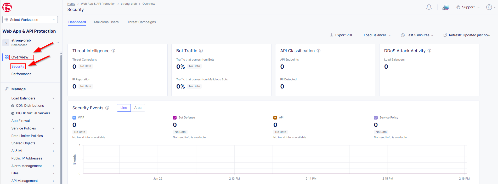
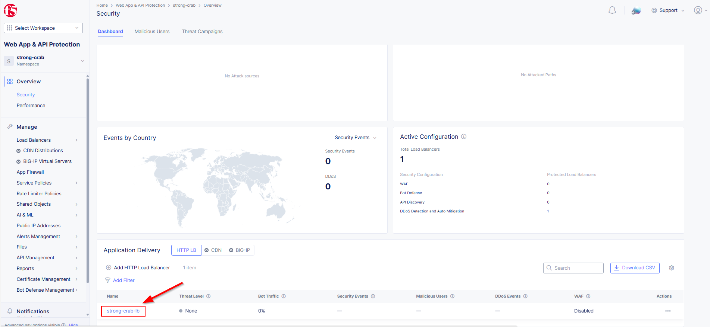
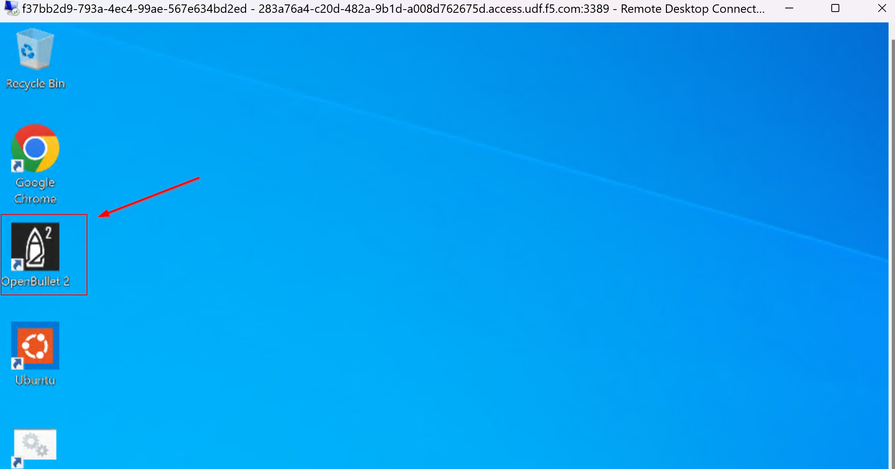
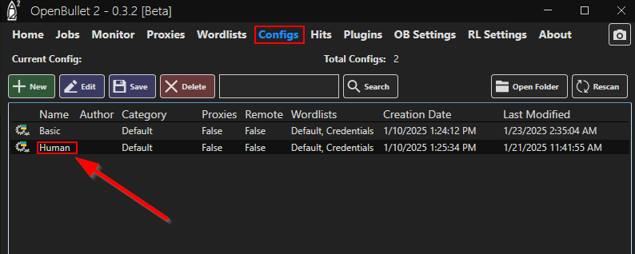
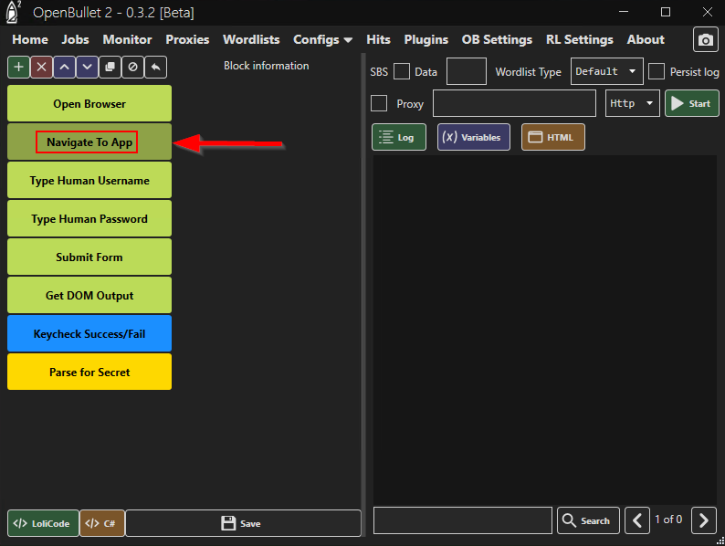
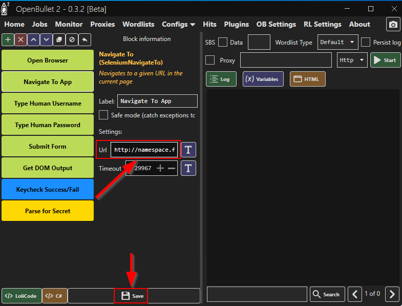
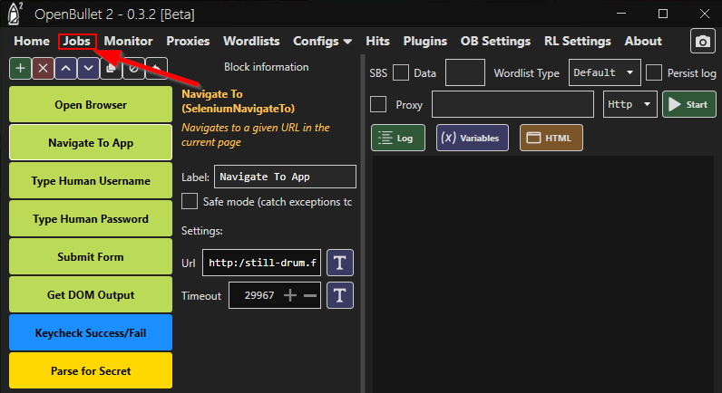
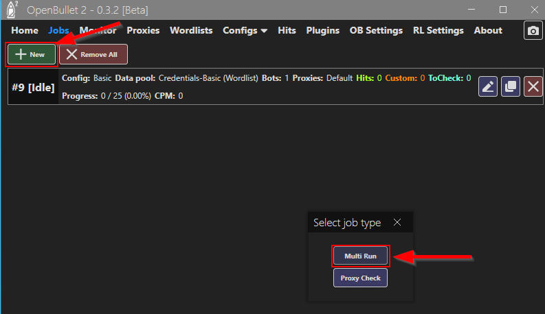
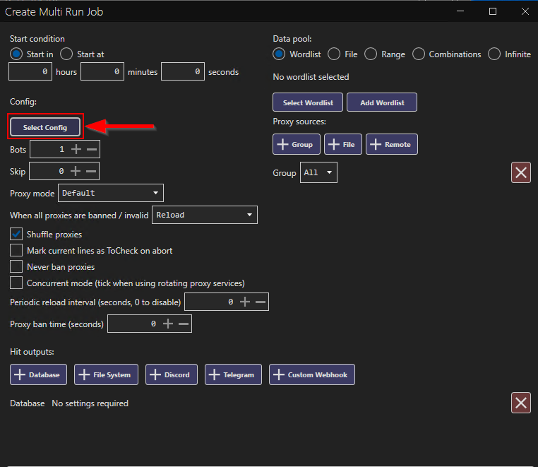
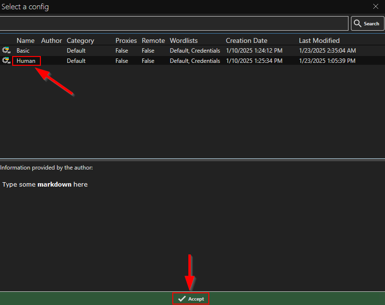
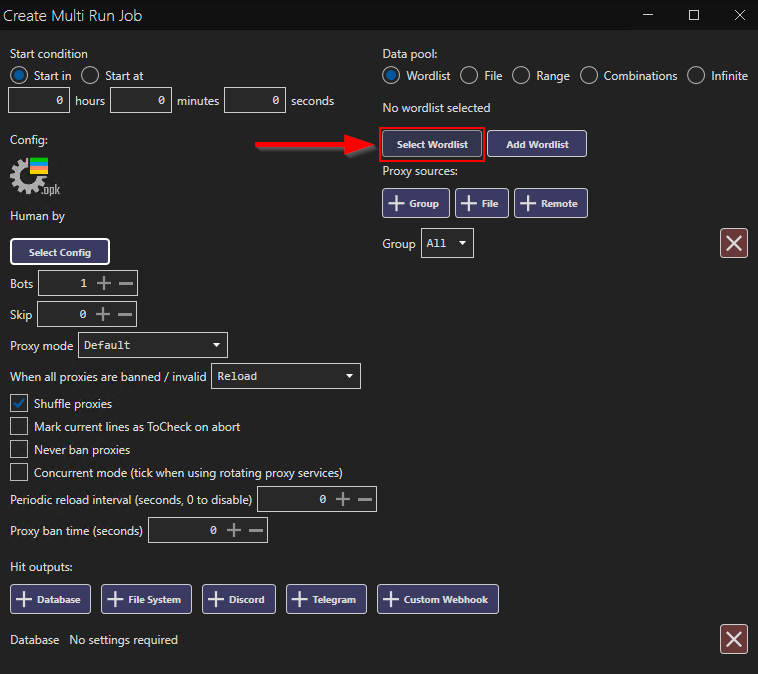
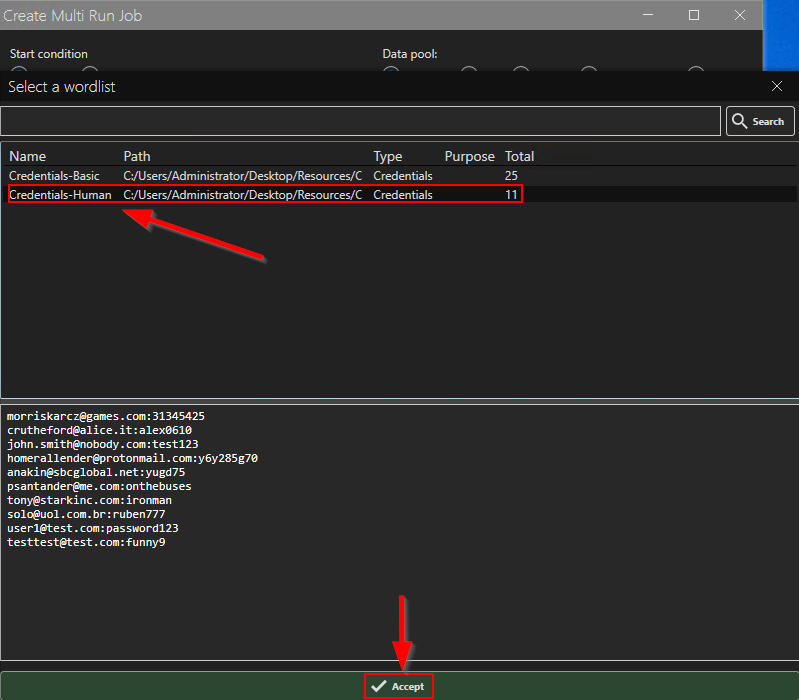
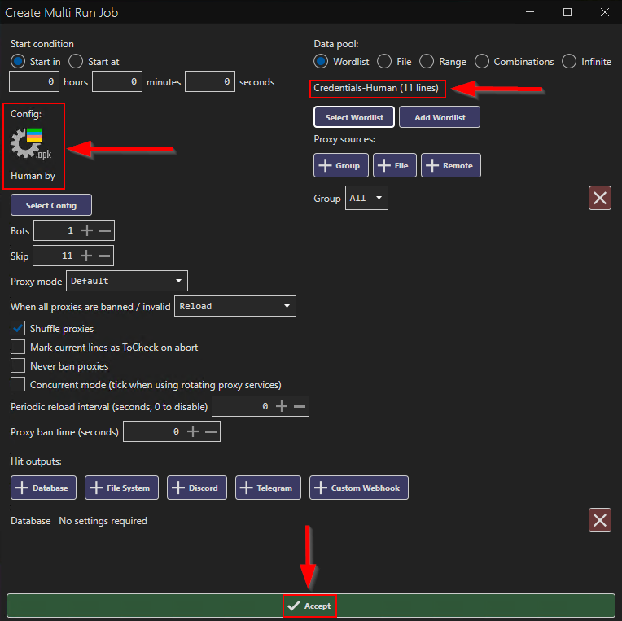
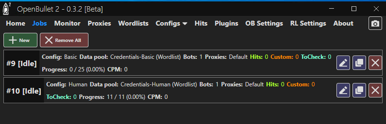
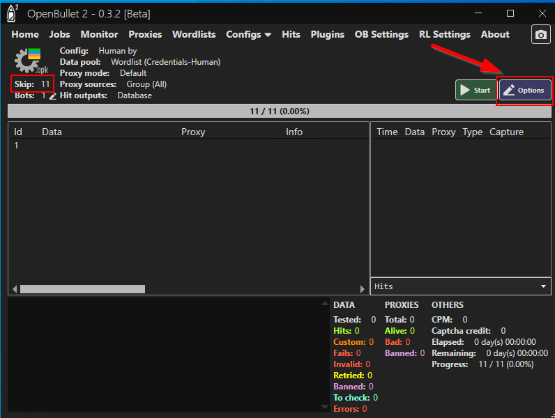
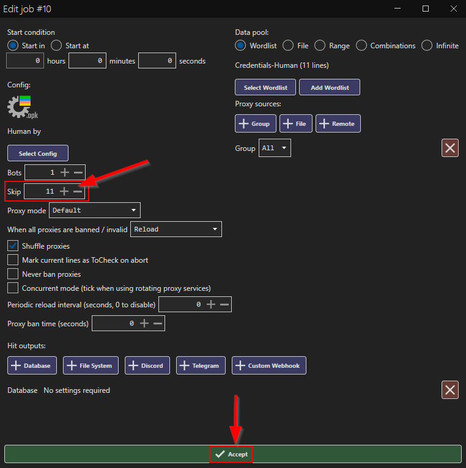
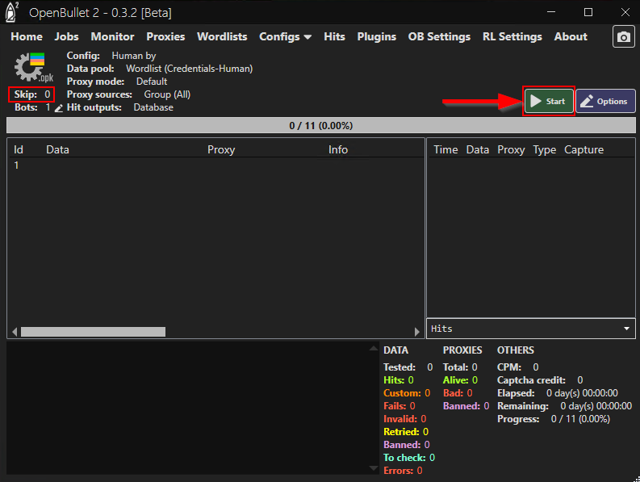
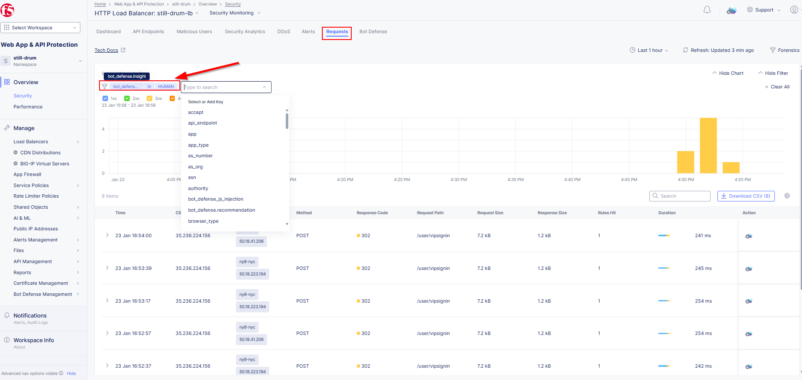
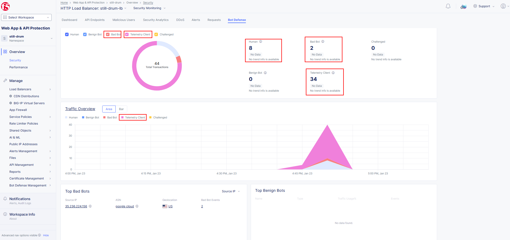
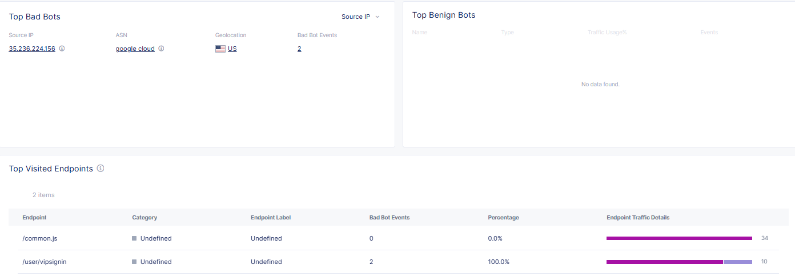
.. |labend| image:: _static/labend.png
   :width: 800px
      
