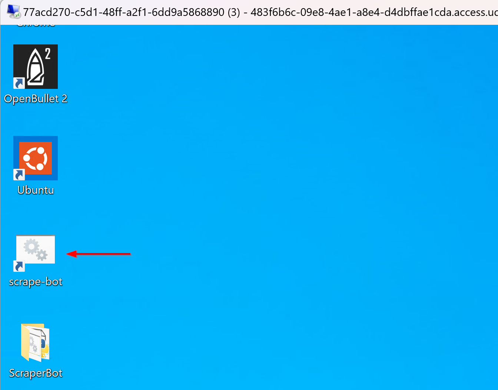

Lab 4: Defend Against an Ongoing Attack
=======================================

**Scenario Lab 4**

In this lab, you will put your new found Distributed Cloud security skills to test by defending 
against a persistent web-scraping attack. This lab is purposefully lean in screenshots and step by 
step directions as it requires you to use what you have learned for the shot at winning a gift card
if you are the first to mitigate the attack (for AppWorld 2025 live event only)

The F5 Air web application has a flight search feature that is being targeted by a nefarious 
black-market reseller. Examine the feature at **http://namespace.lab-sec.f5demos.com/flight** 
and search for flights.

Note: Only the year 2022 can be used as the backend db has not been updated

**Expected Lab Time: 30 minutes**

Task 1: Launch the attack
~~~~~~~~~~~~~~~~~~~~~~~~~

In this task you will utilize the scrape-bot script which will be leveraged against F5 Air.  Scrapers
like this are used today across many different industries - Insurance, Travel, Automotive, Financial 
to name a few.  This type of traffic is typically considered malicious unless previously approved.

+----------------------------------------------------------------------------------------------+
|  1. From the RDP Windows Jump Host, double-click **scrape-bot** and enter your namespace in  |
|                                                                                              |
|     the prompt.  Just the adjective-animal and nothing else.  Ignore any SSL errors.         |
+----------------------------------------------------------------------------------------------+
| |lab4-task1-01|                                                                              |
|                                                                                              |
| |lab4-task1-02|                                                                              |
|                                                                                              |
+----------------------------------------------------------------------------------------------+
|  2. The bot logs the scraped flight data to a file in the **ScrapeBot** folder called        |    
|                                                                                              |
|     *flightinfo.txt*, this can be found on the desktop right under the scrape-bot.           |
|                                                                                              |
|     The scraped flight data is then sold to fare brokers that compete with these prices,     |
|                                                                                              |
|     which in turn costs F5 Air money by losing customers.                                    |
|                                                                                              |
+----------------------------------------------------------------------------------------------+
| |lab4-task1-03|                                                                              |
+----------------------------------------------------------------------------------------------+ 

Task 2: Modify the Bot Security Policy
~~~~~~~~~~~~~~~~~~~~~~~~~~~~~~~~~~~~~~

In this activity you will review the logs and determine what the scraper-bot is attacking. You
will then use the information gleaned from the request logs to create an additional endpoint
rule to handle the scraper traffic.  Lastly you will check your request logs after adding the
scraper endpoint rule.  

+----------------------------------------------------------------------------------------------+
|  1. Review your request log and the application to determine which endpoint is being attacked|
|                                                                                              |
|     and which HTTP method is being used. If you need help refer to **Lab1 Task1 Steps 1->3** |
+----------------------------------------------------------------------------------------------+
|  2. Now that we discovered the attacked endpoint lets add it to our Bot Protection policy.   | 
|                                                                                              |
|     Following the directions from **Lab2 Task1 Steps 3 -> 9** we can add a new endpoint to   |
|                                                                                              |
|     your policy named *scraper-sec* based on what we discovered in our logs.                 |
|                                                                                              |
|     **Hint** Only one HTTP method is permitted in this new endpoint rule.                    |
|                                                                                              |
+----------------------------------------------------------------------------------------------+
|  3. Run the scraper attack and test your policy.  What do you see in your request logs?      |
|                                                                                              |
+----------------------------------------------------------------------------------------------+

Task 3: Place into Blocking Mode
~~~~~~~~~~~~~~~~~~~~~~~~~~~~~~~~

For this exercise you will work on putting Bot Protection endpoint policy into blocking mode. 
You will also customize a message for the Bot traffic mitigation response. Finally we need to 
verify that the policy is properly configured and mitigating the scraper attack.

+----------------------------------------------------------------------------------------------+
| 1. Once you are confident your policy is detecting the scraper activity, place it into       |
|                                                                                              |
|    blocking mode by going to your  **HTTP Loadbalancer** --> **Actions** -->                 |
|                                                                                              |
|    **Manage Configuration** --> **Edit Configuration** --> **Bot Protection** then click     |
|                                                                                              |
|    **Edit Configuration** (Under Bot Defense Policy). Now under **App Endpoint Type**        |
|                                                                                              |
|    click **Edit Configuration** and finally click **three dots** to the  right of            |
|                                                                                              |
|    *scraper-sec* endpoint type then **Edit**. Make sure to **Apply** and **Save** all changes|
+----------------------------------------------------------------------------------------------+
| |lab4-task3-01|                                                                              |
|                                                                                              |
| |lab4-task3-02|                                                                              |
|                                                                                              |
| |lab4-task3-03|                                                                              |
|                                                                                              |
+----------------------------------------------------------------------------------------------+
| 2. Scroll down to the Bot Traffic Mitigation and change the action from **Flag** to **Block**|                                                                                             
|                                                                                              |
|    Additionally change the text in the response body to *Scraping is BAD!!!*                 |
|                                                                                              |
+----------------------------------------------------------------------------------------------+
| |lab4-task3-04|                                                                              |
|                                                                                              |
+----------------------------------------------------------------------------------------------+
| 3. Re-Run the scraper-bot attack tool from the RDP Jump Host desktop                         |
|                                                                                              |
+----------------------------------------------------------------------------------------------+  

Task 4: Claim your prize if you're the first to complete this lab!
~~~~~~~~~~~~~~~~~~~~~~~~~~~~~~~~~~~~~~~~~~~~~~~~~~~~~~~~~~~~~~~~~~

+----------------------------------------------------------------------------------------------+
|    If your logs show the proper endpoint and method being blocked with the correct blocking  |
|                                                                                              |
|    page response, **let a lab assistant know. Congratulations!**  Go claim the gift card     |
|                                                                                              |
+----------------------------------------------------------------------------------------------+

+----------------------------------------------------------------------------------------------+
| **End of Lab 4:**  This concludes Lab 4, feel free to review and test the configuration.     |
|                                                                                              |
|                                                                                              |
+----------------------------------------------------------------------------------------------+
| |labend|                                                                                     |
+----------------------------------------------------------------------------------------------+

.. |lab4-task1-02| image:: _static/lab4-task1-02.png
   :width: 800px

.. |labend| image:: _static/labend.png
   :width: 800px
      
