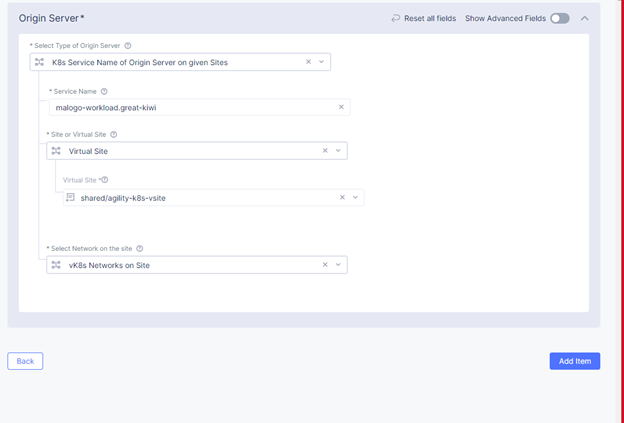
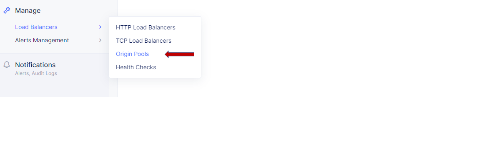
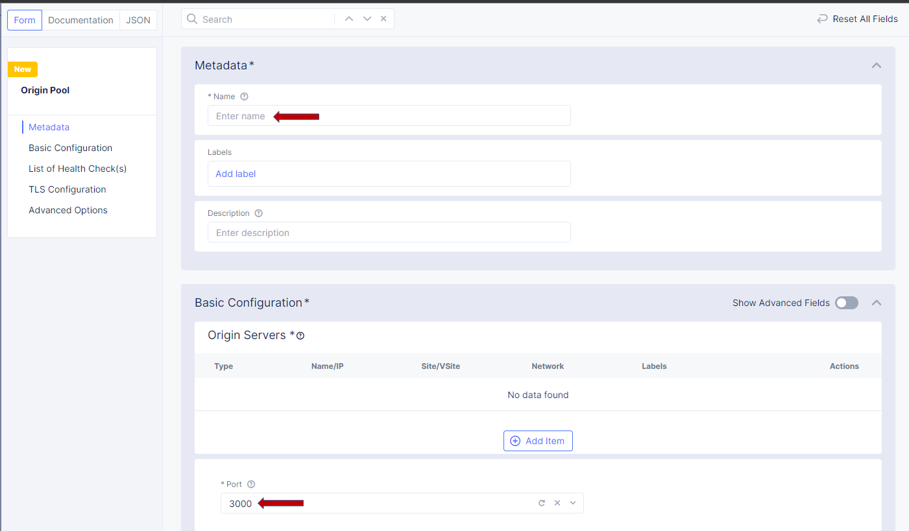
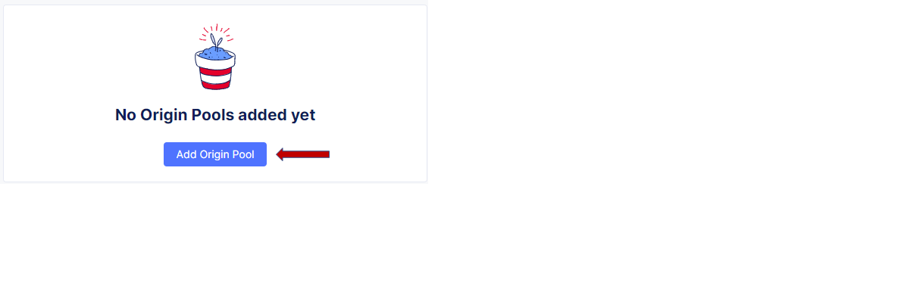

Lab 1 - Create Origin Pool
==========================

**Exercise 1: Create Origin Pool**

#. Navigate the left-side menu to **Manage -> Load Balancers**, then click **Origin Pools**.

   |origin_pool|
   
#. Click the **Add Origin Pool** button.

   |origin_pool_add|

#. On the New Origin Pool form:

	#. Enter a **Name** for your pool (ex: pool)
	#. Replace the **Port** value of *443* with *3000*
	#. Select **Add Item** under **Origin Servers**

   |origin_pool_name|

#. Complete the **Origin Server** section by make the following changes:

    - **Select Type of Origin Server**: K8s Service Name of Origin Server on given Sites
    - **Service Name**: agility.<your namespace> (eg: agility.loved-newt) - make a note to remember this in creation stage
    - **Site or Virtual Site**: Virtual Site select shared/agility-k82-site
    - **Select Network on the site**: vK8s Networks on Site

   |origin_pools_menu|
 
#. Click on **Apply** to return to the previous screen

#. Click the **Save and Exit** button to close the **Origin Pool** dialogue.

