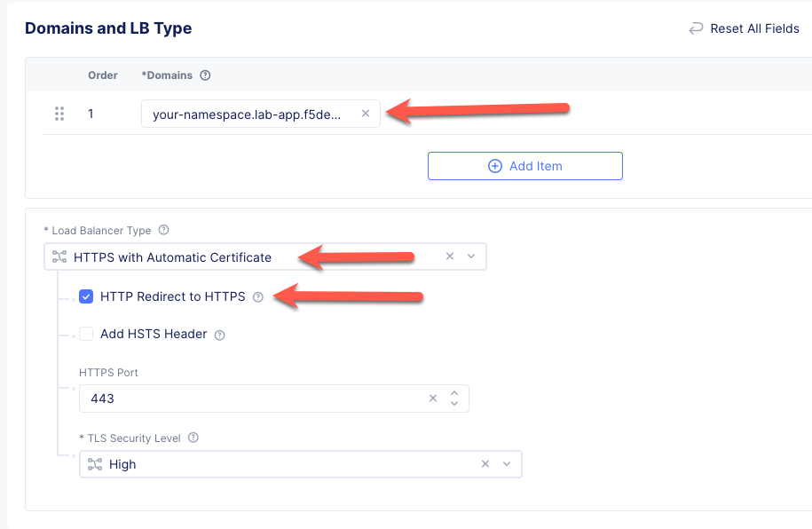
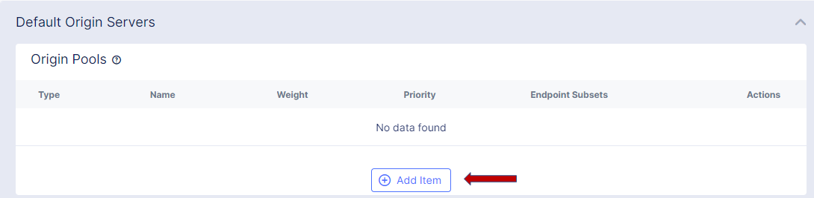
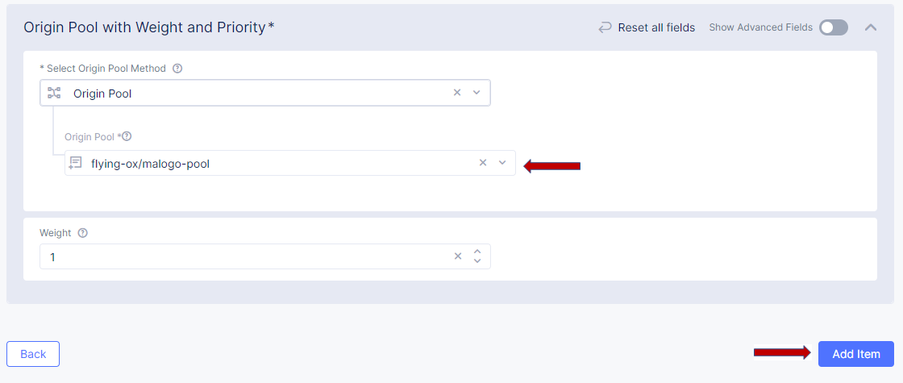
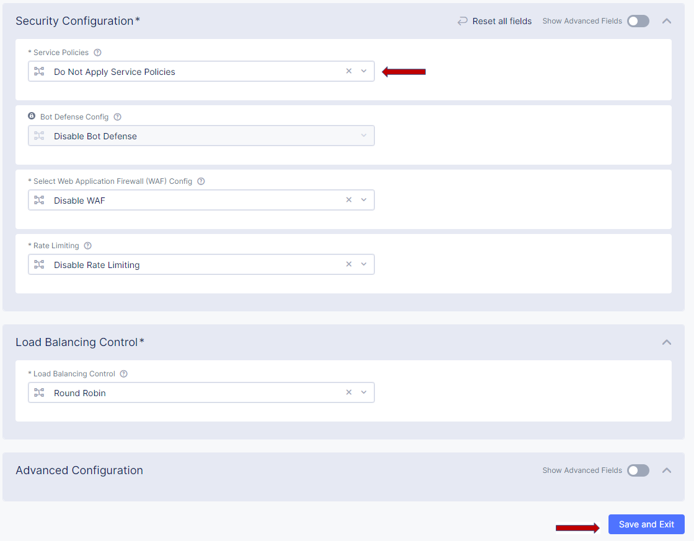

Lab 2 - Publish to the Internet
===============================

**Exercise 1: Create HTTP Load Balancer**

#. Navigate the left-side menu to **Manage -> Load Balancers -> HTTP Load Balancers**, then click **Add HTTP Load Balancer**.

    |add_HTTP|
   
#. Enter a name for your HTTP Load Balancer in the **Metadata** section.

    |http_name|

#. In the **Basic Configuration** Section make the following changes:

    - **List of Domains**: Use <your namespace>.lab-app.f5demos.com
    - **Select Type of Load Balancer**: HTTP
    - **Automatically Manage DNS Records**: Make sure this is checked

    |http_basic|

#. In the **Origin Pools** section click **Add Item**.

    |add_origin_server|

#. Select your **Origin Pool**, which was created earlier in this lab, and Click **Apply**

    |select_origin_pool|

#. In the Common Security Controls section change the **Service Policies** to *Do Not Apply Service Policies* then click **Save and Exit** at the bottom of the page.

    |security_configuration|
   
#. After a few moments you should see a screen like the following:

    |http_status|

.. NOTE::
  - Please wait for the **VIRTUAL_HOST_READY**

Now we are ready to test!

Open a browser tab and navigate to the domain you entered. 

In the example below it is *flying-ox.lab-app.f5demos.com*

Success will render a page like the following:

    |http_page|

Please note the country name. 

Refresh your browser a few times and notice what happens to the country name. 

Why?

This ends the lab.

.. |add_HTTP| image:: ../images/m-add-http.png
.. |http_name| image:: ../images/m-http-name.png

.. |http_status| image:: ../images/m-http-status.png
.. |http_page| image:: ../images/m-http-page.png