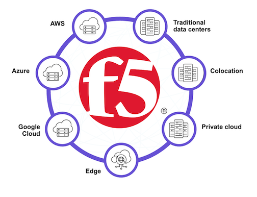

F5 Distributed Cloud: Policy Optimization in a Multicloud World
=====================================================

This hands-on lab environment highlights some of the introductory concepts of F5 Distributed Cloud Multi-cloud Networking.

**Your Role:** 
You are an engineer at ACME Corp tasked with connecting applications and services across multiple cloud environments. 

**Lab Objectives:**
Learn when and how to use F5 Distributed Cloud solutions to securely connect distributed environments:
* **Network Connect** - Layer 3/4 network connectivity and routing
* **App Connect** - Layer 7 application-level connectivity

|intro001|

**Lab Environment:**
This lab uses the **[F5XC MCN] Base Lab w/SMSv2** UDF Blueprint. Your lab environment has been pre-configured with the necessary infrastructure, allowing you to focus on learning F5 Distributed Cloud capabilities.

.. note:: The lab environment is automatically provisioned when you start the lab. All required Customer Edge (CE) nodes and infrastructure are built for you.

.. toctree::
   :maxdepth: 1
   :glob:

   intro
   narrative
   module*/module*

