Introduction: Accessing Lab Resources
=====================================

Welcome to this F5 Distributed Cloud Lab. The following tasks will guide you through the initial
access requirements for this lab. Lab attendees should have received an invitation email from 
F5 Distributed Cloud (no-reply@cloud.f5.com) to access the lab environment. Please check the email address used for course registration and its 
spam folder. If you have not received an email, please contact a member of the lab team.

The F5 Distributed Cloud Console is a SaaS-based control plane that provides a GUI and API for 
managing network, security, and compute services across on-premises data centers and public cloud 
environments (AWS, Azure, and GCP).

Task 1: Lab Environment
~~~~~~~~~~~~~~~~~~~~~~~

+----------------------------------------------------------------------------------------------+
| Your lab environment has been pre-configured and includes the following key components:      |
|                                                                                              |
| * **F5 Distributed Cloud Console** - SaaS-based management interface                         |
| * **F5 Distributed Cloud Global Network** - Globally distributed application delivery        |
| * **Customer Edge (CE) Node** - Pre-deployed in your lab environment (onsite UDF, Azure, AWS)|
| * **Cloud-hosted Applications** - Sample applications for testing connectivity               |
|                                                                                              |
| The diagram below shows how these components work together:                                  |
+----------------------------------------------------------------------------------------------+
| |intro001|                                                                                   |
+----------------------------------------------------------------------------------------------+

Task 2: F5 Distributed Cloud Console Login
~~~~~~~~~~~~~~~~~~~~~~~~~~~~~~~~~~~~~~~~~~

After joining the course, you should have received an invitation email from 
**F5 Distributed Cloud** (no-reply@cloud.f5.com) where you can accept the invitation then log in to the F5 Distributed Cloud Console.

|intro010|

.. NOTE:: The graphic above shows the running state (all greean) your UDF environment should be in before proceeding to F5 Dsitributed Cloud Console login.
   
The name of the F5 Distributed Cloud tenant that we will be using for this lab is **f5-xc-lab-mcn**
Additionally, the following are key configuration elements for this lab and will be used
throughout the lab tasks that follow.

* F5 Distributed Cloud Console: https://f5-xc-lab-mcn.console.ves.volterra.io/
* Delegated Domain: **lab-mcn.f5demos.com**

+----------------------------------------------------------------------------------------------+
| 1. Once all components of your lab blueprint are running, please log into the F5 Distributed |
|                                                                                              |
|    Cloud Lab Tenant and the OKTA SSO (Single Sign On) option.                                |
|                                                                                              |
|    https://f5-xc-lab-mcn.console.ves.volterra.io/                                            |
|                                                                                              |
| 2. You will be presented with the console login screen. Click "Sign in with Okta" to proceed.|
|                                                                                              |
| |intro011|                                                                                   |
+----------------------------------------------------------------------------------------------+

+----------------------------------------------------------------------------------------------+
| 3. When you first login, accept the Lab tenant EULA. Click the check box and then click      |
|                                                                                              |
|    **Accept and Agree**.                                                                     |
|                                                                                              |
| 4. Select all work domain roles and click **Next** to see various configuration options.     |
|                                                                                              |
|    Roles can be changed any time later if desired.                                           |
|                                                                                              |
| 5. Click the **Advanced** skill level to expose more menu options and then click **Get**     |
|                                                                                              |
|    **Started** to begin. You can change this setting after logging in as well.               |
|                                                                                              |
| 6. Several **Guidance ToolTips** will appear, you can safely close these as they appear.     |
+----------------------------------------------------------------------------------------------+
| |intro002|                                                                                   |
|                                                                                              |
| |intro003|                                                                                   |
|                                                                                              |
| |intro004|                                                                                   |
|                                                                                              |
| |intro005|                                                                                   |
+----------------------------------------------------------------------------------------------+

+----------------------------------------------------------------------------------------------+
| 7. You can adjust your work domains and skill level (not required) by clicking on the        |
|                                                                                              |
|    **Account** icon in the top right of the screen and then clicking on **Account Settings**.|
|                                                                                              |
| 8. In the resulting window you can observe the **Work domains and skill level** section and  |
|                                                                                              |
|    other administrative functions.                                                           |
|                                                                                              |
| .. note::                                                                                    |
|    *For the purposes of this lab, permissions have been restricted to lab operations.  As a* |
|                                                                                              |
|    *result some menus will be locked and not visible.*                                       |
+----------------------------------------------------------------------------------------------+
| |intro006|                                                                                   |
|                                                                                              |
| |intro007|                                                                                   |
+----------------------------------------------------------------------------------------------+

+----------------------------------------------------------------------------------------------+
| 9. **Namespaces**, which provide an environment for isolating configured applications or     |
|                                                                                              |
|    enforcing role-based access controls, are leveraged within the F5 Distributed Cloud       |
|                                                                                              |
|    Console.  For the purposes of this lab, each lab attendee has been provided a unique      |
|                                                                                              |
|    **namespace** which you will be defaulted to (in terms of GUI navigation) for all tasks   |
|                                                                                              |
|    performed through the course of this lab.                                                 |
|                                                                                              |
| 10. Click on the **Select Service** in the left-hand navigation. In the resulting fly out    |
|                                                                                              |
|     navigation, click **Web App & API Protection**.                                          |
|                                                                                              |
| 11. In the **Web App & API Protection** configuration screen observe the left navigation     |
|                                                                                              |
|     panel. Under the **Web App & API Protection**, note the **<adjective-animal>** namespace |
|                                                                                              |
|     that you have been assigned. Note the namespace as it will be used throughout the lab    |
|                                                                                              |
|     tasks that follow.                                                                       |
|                                                                                              |
| .. note::                                                                                    |
|    *Administratively, there are other ways to find namespaces. Due to access and permission* |
|                                                                                              |
|    *restrictions for this particular lab, those menus are not available.*                    |
+----------------------------------------------------------------------------------------------+
| |intro008|                                                                                   |
|                                                                                              |
| |intro009|                                                                                   |
+----------------------------------------------------------------------------------------------+

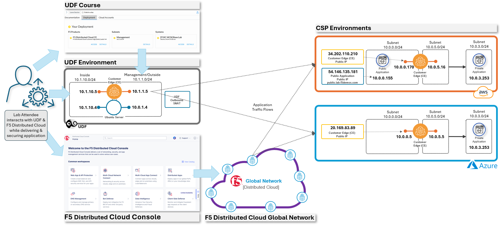
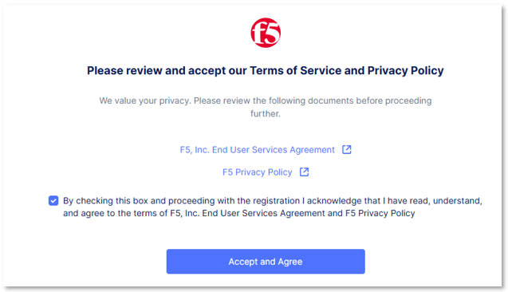
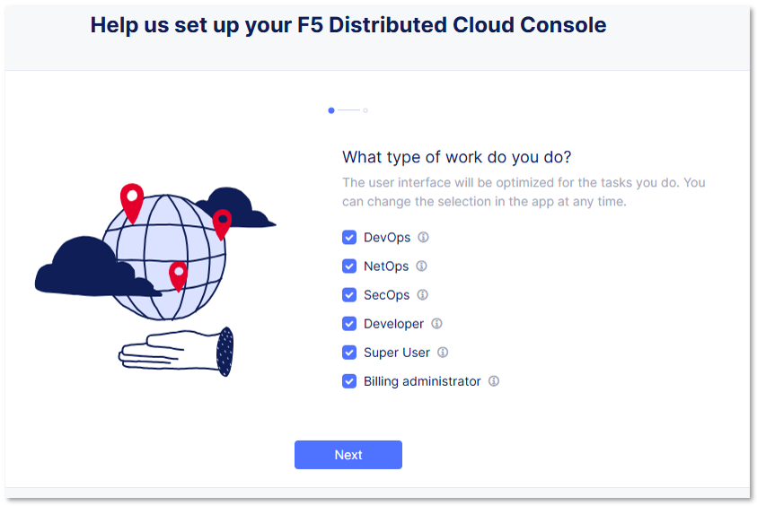
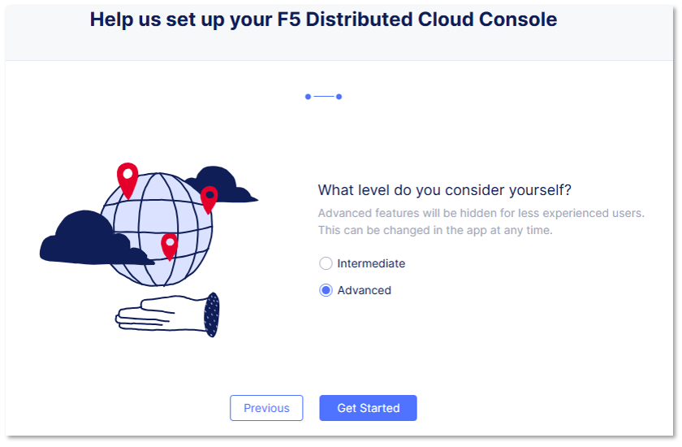
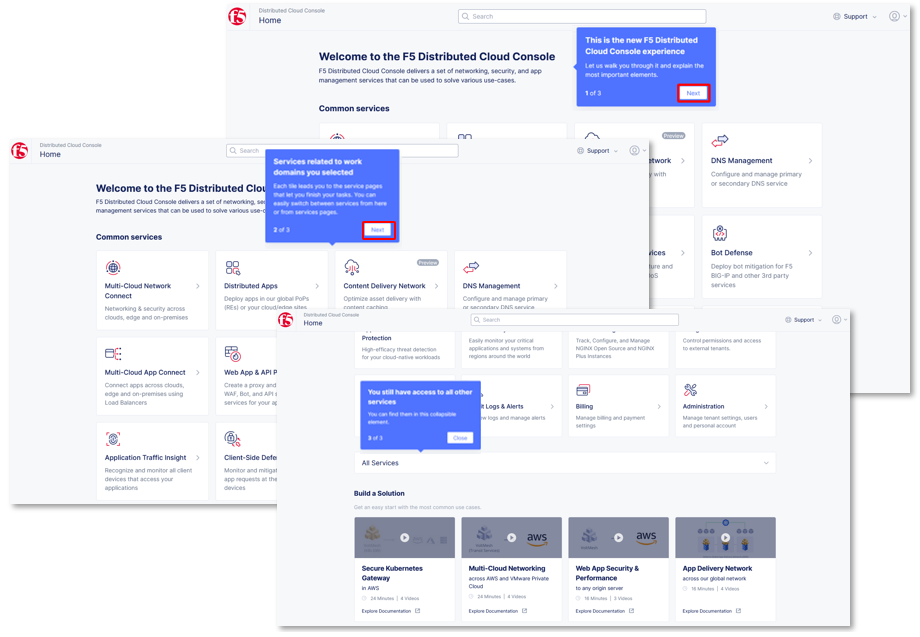
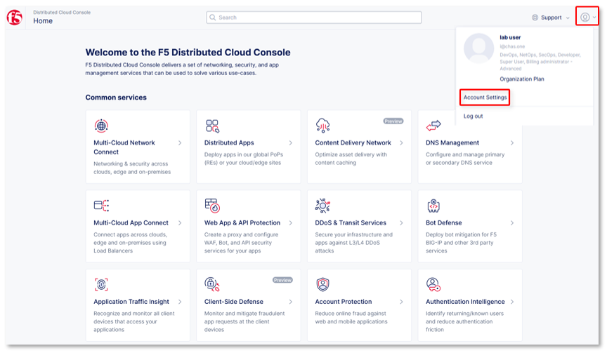
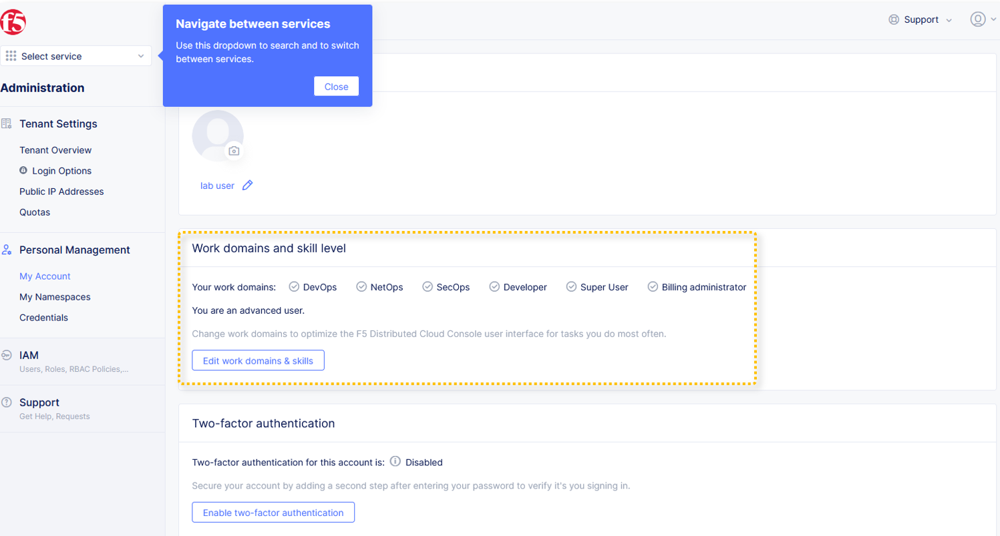
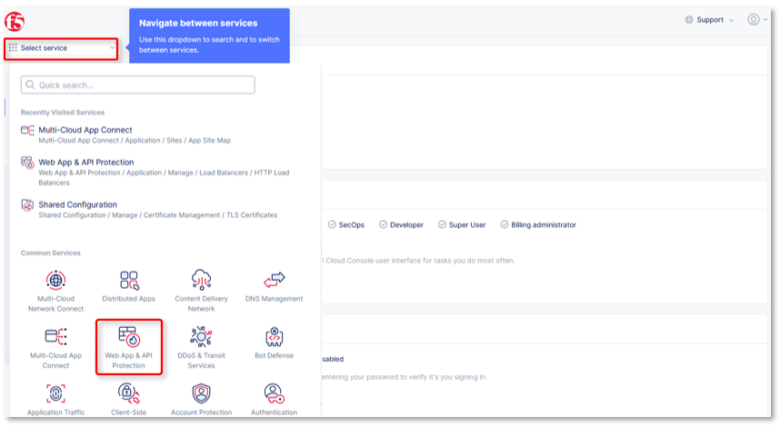
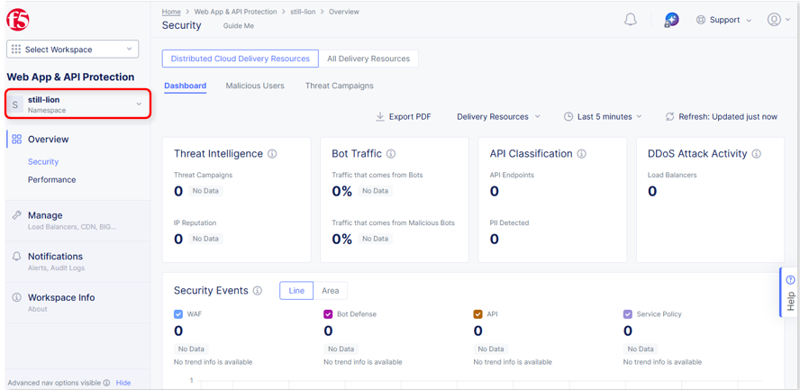
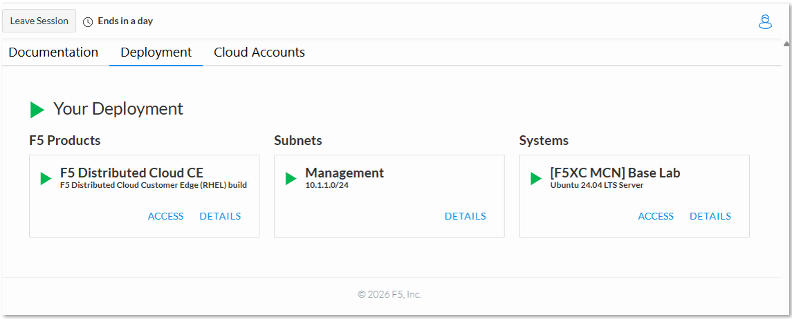
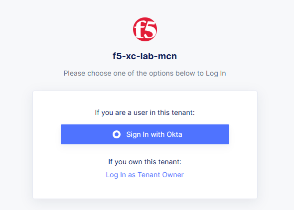