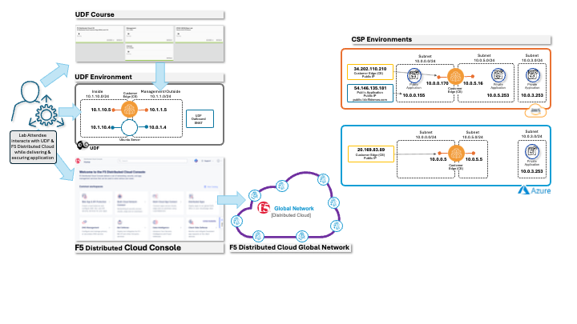
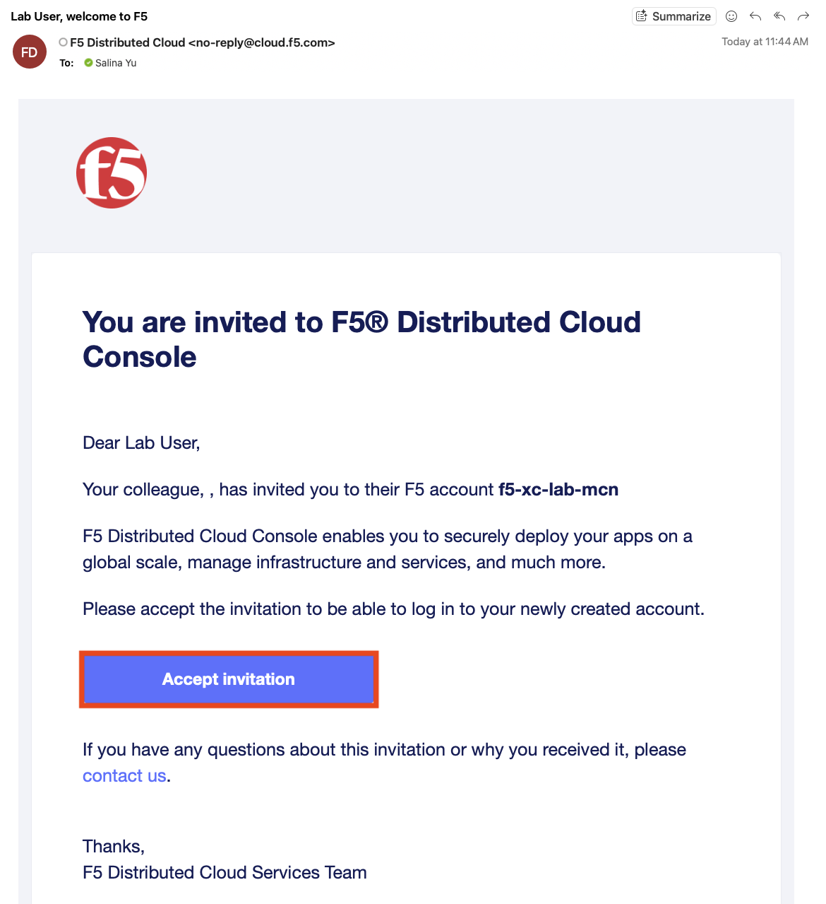
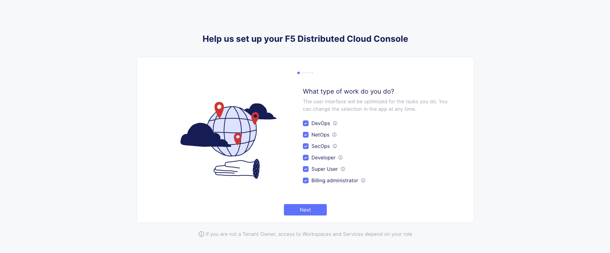
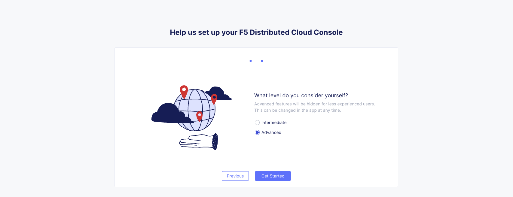
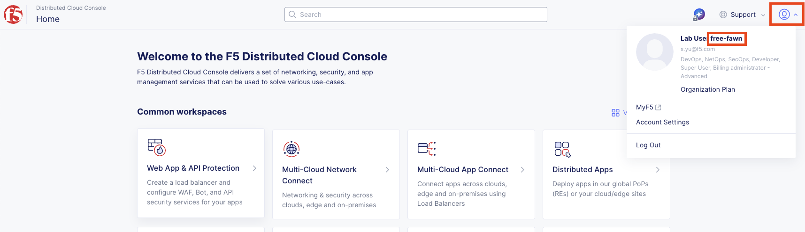

Introduction: Accessing Lab Resources
======================================

Welcome to this F5 Distributed Cloud Lab. The following tasks will guide you through the initial
access requirements for this lab. Lab attendees should have received an invitation email from
F5 Distributed Cloud (**no-reply@cloud.f5.com**) to access the lab environment. Please check 
the email address used for course registration and its spam folder. If you have not received 
an email, please contact a member of the lab team.

The F5 Distributed Cloud Console is a SaaS-based control plane that provides a GUI and API for
managing network, security, and compute services across on-premises data centers and public cloud
environments (AWS, Azure, and GCP).

Lab Environment
---------------

Your lab environment has been pre-configured and includes the following key components:

* **F5 Distributed Cloud Console** - SaaS-based management interface
* **F5 Distributed Cloud Global Network** - Globally distributed application delivery
* **Customer Edge (CE) Node** - Pre-deployed in your lab environment (onsite UDF, Azure, AWS)
   * The **Data Center** environment is emulated by the **F5 UDF** (Unified Demo Framework) and contains an Ubuntu Server and a Distributed Cloud CE (Customer Edge) Node that has been pre-configured and registered. 
   * The **AWS cloud environment** contains a prebuilt XC Node and a workload hosting a web frontend.  **You will not have access to the AWS console.**
   * The **Azure cloud environment** contains a prebuilt XC Node and a workload hosting a web frontend.  **You will not have access to the Azure console.**
* **Cloud-hosted Applications** - Sample applications for testing connectivity

.. Important:: While we are keeping the labs intentionally simple today with just a single Data Center and 2 Cloud Services Providers (CSP's), F5 Distributed Cloud supports much more advanced use-cases. 

The diagram below shows how these components work together:

|intro001|

Task 1: F5 Distributed Cloud Console Login
-------------------------------------------

After joining the course, you should have received an invitation email from
**F5 Distributed Cloud** (**no-reply@cloud.f5.com**) where you can accept the invitation 
then log in to the F5 Distributed Cloud Console.

|intro002|

.. note:: 
   Your UDF environment should be all up and running (all green) before proceeding to 
   F5 Distributed Cloud Console login.

**Lab Tenant Information:**

The name of the F5 Distributed Cloud tenant that we will be using for this lab is **f5-xc-lab-mcn**.

Additionally, the following are key configuration elements for this lab and will be used
throughout the lab tasks that follow:

* **F5 Distributed Cloud Console:** https://f5-xc-lab-mcn.console.ves.volterra.io/
* **Delegated Domain:** lab-mcn.f5demos.com

**Login Steps:**

1. Click the link above to navigate to the F5 Distributed Cloud Console login page.

2. Click the **Sign in with Okta** button to proceed to the SSO login page.

3. **Accept and Agree** to the End User Service Agreement and Privacy Policy.

4. Select all work domain roles and click **Next** to see various configuration options.

   |intro003|

5. Select the **Advanced** skill level to expose more menu options and then click 
   **Get Started** to begin.

   |intro004|

   .. note:: 
   You can adjust your work domains and skill level (not required) by clicking on the 
   **Account** icon in the top right of the screen and then clicking on **Account Settings**.

Task 2: Locate Your Namespace
------------------------------

**Namespaces**, which provide an environment for isolating configured applications or 
enforcing role-based access controls, are leveraged within the F5 Distributed Cloud Console. 
For the purposes of this lab, each lab attendee has been provided a unique **namespace** 
which you will be defaulted to (in terms of GUI navigation) for all tasks performed 
through the course of this lab.

6. You can find your assigned namespace by clicking on the account on the top right corner.

   |intro005|

Task 3: Preparation
-------------------

Before continuing with the lab, please update your namespace to dynamically update the guide.

.. raw:: html

   

     <label for="namespaceInput">Enter your namespace:</label>
     <input id="namespaceInput" type="text" placeholder="e.g. sassy-panda" />
     <button onclick="setNamespace()">Save</button>
   

   
   
<strong>Current namespace:</strong> &lt;namespace&gt;

.. note:: 
   Lab guides might need to be refreshed to get updated namespace to render.

