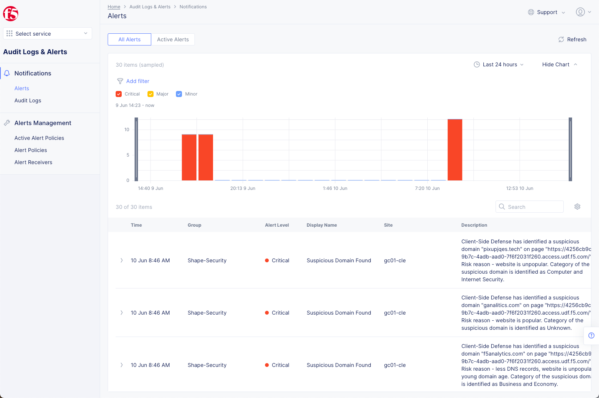

Using the Client Side Defense Dashboard
=======================================

Lab 2: Mitigate suspicious or allow unsuspicious domains
--------------------------------------------------------

Login to F5 Distributed Cloud using your own account and go to the Client-Side Defense dashboard.

|

.. note:: Part of the UDF Deployment is an iRule that both adds the required Telemetry to the Website and some "simulated" malicious JavaScript elements.  If you would like to have a look at this iRule, you can see the files here: |irule|

.. |irule| raw:: html

            <a href=./addClientSideDefense.tcl _target="_irule">addClientSideDefense.tcl</a>

|

Once you logged in, click on *Client-Side Defense*.

 .. image:: images/csd-dashboard.png

|

The CSD Dashboard displays the following tabs that you use for displaying data, and for deciding whether to mitigate or allow a suspicious domain.

 .. image:: images/csd-tabs.png

*Suspicious Domains:* When a web page with CSD protection is loaded on the end-user’s browser, scripts running on that web page interact with other domains. The Suspicious Domains list displays a list of the domains that those scripts interact with and which CSD detected to be potentially malicious.

*Mitigate List:* Displays a list of domains that the user has assigned for mitigation. When a domain is assigned for mitigation, CSD blocks that domain and it cannot be accessed by any script running on the end-user's browser when accessing a CSD protected web page.
    
*Allow List:* Displays a list of domains that the user has decided do not need mitigation and can be allowed free access.
    
*All Domains:* When a web page with CSD protection is loaded, scripts running on that web page interact with other domains. The All Domains list displays a list of the domains that those scripts interact with.

|

1. Viewing suspicious domains
 
 Click on suspicious domains to display the list of the potentially malicious domains. "Select Page" on the right allows to filter.

 .. image:: images/agility-suspicious-domains.png

 .. note:: If you do not see any domains, you may need to wait a few minutes.  Also, refreshing your JuiceShop site page can also help.  The requests are polled and sometimes not all of the requests are reviewed - it is roughly 1 in 5 or 10 requests.  
|

2. Adding a domain to the Mitigate List or Allow List
   
 Go to the row of the relevant domain and select the appropriate action on the right by clicking on the *three dots*. Our example shows how to add the domain jqwereid.online to the Mitigate List. It goes first in the state Added to Mitigated List (green) and change after some time to status Mitigated (blue). 
 Alternatively, you can add domains manually to the Mitigate List or Allow List by going to the Mitigate List or Allow List at the top and, click on *Add domain* and enter the domain name.

 .. image:: images/csd-mitigate.png

|

 Status - Added to Mitigated List

 .. image:: images/csd-mitigate-added.png

|

 Status - Mitigated

 .. image:: images/csd-mitigated.png

|

3. Show that requests from scripts to the mitigated domains are blocked
 
 Open the JuiceShop page (if not already open) and start the browser's DevTools.

 Have the network tab and console tab open as shown below
 
 .. image:: images/agility-demonstrating-csd_7.png

  Click the Clear button so that there are no files listed in the upper window.  
  If you need to open the Console, click on the 'Console' along the bottom of the Browser window.
 
 Copy & paste the following code into the console::

   var s = document.createElement('script')
   s.src = "https://fountm.online/"
   document.body.appendChild(s)

 Press enter and you should see a message like in the screenshot below and no request in the network tab.

 .. image:: images/agility-demonstrating-csd_3.png

Hitting Enter will execute the Pasted commands.

You can also clear the Console and Network screens if you like with the highlighted buttons.

 .. image:: images/agility-demonstrating-csd_4.png

This shows that the Domain has been Mitigated.

|

4. Show that requests from scripts to benign domains are allowed

 Copy & paste the following code into the console::

   var s = document.createElement('script')
   s.src = "https://www.google.com/"
   document.body.appendChild(s)

 Press enter and you should see that the request is successful and shows up in the network tab with the *status 200*

 .. image:: images/agility-demonstrating-csd_1.png

|1. Configure Logging
---------------------

 When you enable CSD, CSD automatically creates an Alert Receiver using the email address you entered for your account on Distributed Cloud Console. CSD also automatically creates an Alert Policy and adds a CSD alerts group to this policy. To ensure that you receive alerts when CSD detects suspicious activity, you need to verify your email on the Alert Receiver.
 Just modify the alert receiver email address accordingly if needed or use a different alert mechanism.

 .. image:: images/csd-alert-receiver.png

|

To verify, click the menu on the right and click "Verify Email"
|

 .. image:: images/agility-email-verification_2.png

and then enter the code you recieve in the "Enter Verification code" form

 .. image:: images/agility-email-verification_1.png

You can configure other alert systems as well

 .. image:: images/csd-alert-receiver-details.png

 Example for an alert email "Verify Email" 

 .. image:: images/alert-email.png

You can also see alerts interactively:

|

Appendix A - Artificially generate suspicious domains
=====================================================

1. Navigate to a website like https://db.aa419.org/fakebankslist.php to look for fake sites.

 .. note:: **DISCLAIMER:** artists against 419 ("aa419") identifies fraudulent websites and makes this data available as a public service. We discourage any form of communication with these websites. If you chose to communicate with them you do so at your own risk.

2. Use any of the following methods to add the code below to the html code of your testing website.

 - Local overrides in Chrome Developer Tools as described in **Appendix B** at the end of this document.
 - Local proxy like Charles proxy
 - Or just add the code to your testing web site but don't foget to remove it after the test.

.. note:: For demoing purposes, we have added already a similar code as shown below to the demo app JuiceShop. You can verify it by viewing the source code of the web page.

 You can use the code as shown below with the fake domains or replace the fake domains with the ones you want to use for the test::
  </script>

 .. note:: The browser doesn't send a request to the specified domains by adding or injecting the code as shown above.

|

 Example what you should see when you view the source code of the page.

 .. image:: images/csd-view-source-color.png

|

Appendix B - Injection using local Overrides in Chrome
======================================================

.. note:: This injection method can be used to inject code locally on your browser. The following example shows you how to inject code to artificially generate suspicious domains but of course you can also inject the CSD JavaScript from your tenant in addition, to test for instance a website you don't own. **The DevTools need to be kept open for the test.**

Set up local Overrides in Chrome DevTools
-----------------------------------------

#. Open Chrome DevTools.
#. Click on the *Sources* tab.
#. Click on the *Overrides* tab.
#. Click on *Select folder for overrides*.

 .. image:: images/csd-select-folder-overrides.png

|

5. Select which directory you want to save your changes to.
#. At the top of your window, click **Allow** to give DevTools read and write access to this directory.
#. Make sure *"Enable Local Overrides"* is checked.

 .. image:: images/csd-select-folder-overrides-selected.png

|

8. Click on the *Network tab*.
#. Open the page, in this example https://arcadia.emea.f5se.com/
#. Select the page or a file like index.html that you want to override. In our example "arcadia.emea.f5se.com". Just refresh if you don’t see it in the network tab.

 .. image:: images/csd-select-page.png

|

11. Right click on the code on the right side and select "Save for overrides".

 .. image:: images/csd-save-for-overrides.png

|

12. Make your code changes on the right side.
 
 .. image:: images/csd-add-injection-code.png

 **And make sure you save your changes afterwards e.g. with Ctrl+S or Command+S!**

.. note:: You won't see the overwritten code when you click on *view source code* in the page. If you want to check if the overwrite works, you can e.g. modifiy a title or a text on the page to see the changes on the screen.
