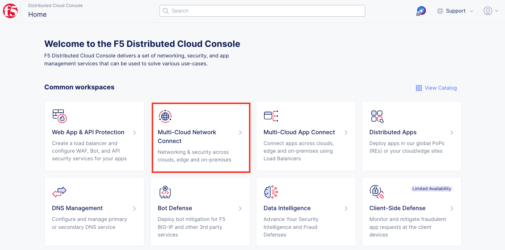
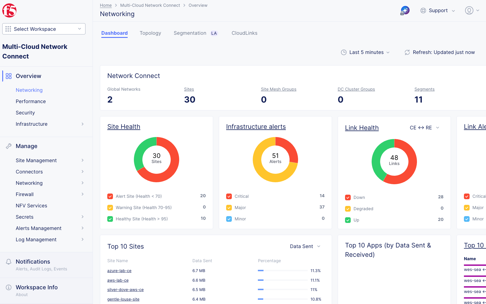
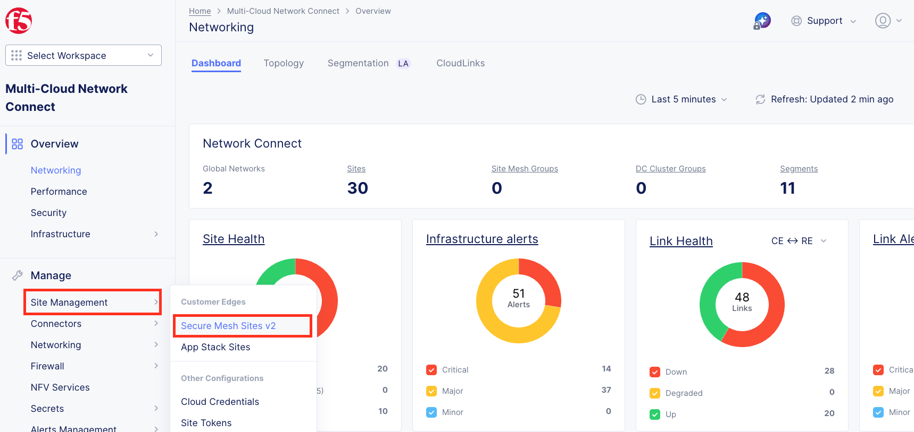
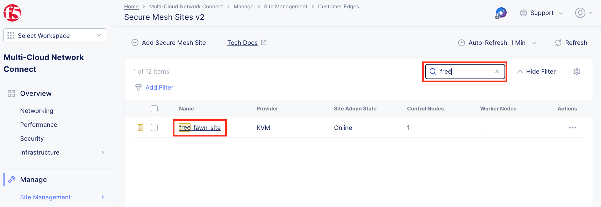
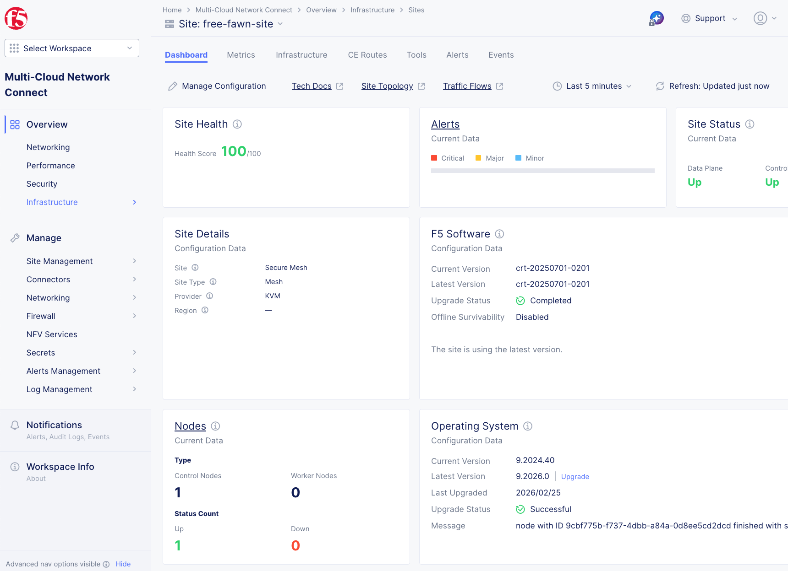
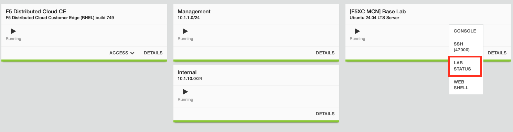
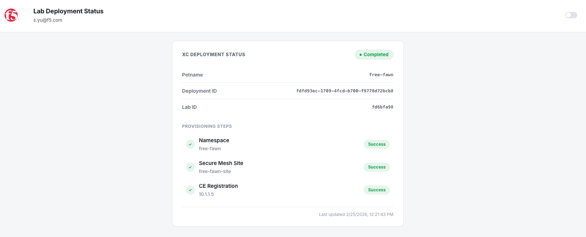

Lab 1: Exploring Your Pre-Configured Customer Edge (CE) Node
=============================================================

**Objective:**

* Navigate the F5 Distributed Cloud Console
* Explore the pre-configured UDF Lab Environment
* Review your deployed Customer Edge (CE) Node configuration
* Understand CE Node deployment architecture

For this lab, your Customer Edge (CE) Nodes have been pre-deployed in AWS, Azure and
your on-premises data center (UDF environment). This allows you to focus on understanding the
architecture and configuration rather than spending time on initial deployment.

.. note::
   In a production environment, you would download the CE Node image (OVA, QCOW2, or ISO)
   and deploy it on your chosen platform (VMware, KVM, Azure, AWS, etc.).

|lab001|

Prerequisite
------------

.. note::
   You should already be logged into your lab's Distributed Cloud Tenant. If not, review the
   course introduction for the login process.

.. warning::
   If you are experiencing issues accessing the Distributed Cloud Tenant, please alert one of
   the Lab Assistants.

Task 1: Navigate to Multi-Cloud Network Connect
------------------------------------------------

Your Customer Edge (CE) node has been fully deployed and registered in your lab environment.
In this task, you'll explore the Multi-Cloud Network Connect workspace to understand your
deployment.

1. From the F5 Distributed Cloud Console **Home** screen, click on the **Multi-Cloud Network Connect** tile.

   |lab002|

2. You will be presented with the **Multi-Cloud Network Connect** overview dashboard. This view
   provides a high-level summary of all Customer Edge deployments across your organization.

   |lab003|

Task 2: Locate Your Customer Edge Node
---------------------------------------

Each lab attendee has been assigned a unique Customer Edge node following the **<adjective-animal>**
naming convention identified in the lab introduction. If you haven't already done this in the 
Introduction: Accessing Lab Resources, you can find your assigned namespace by clicking on the 
account icon on the top right corner.

|lab004|

3. Using the left-hand navigation, from the **Manage** section, click on **Site Management**,
   then select **Secure Mesh Sites v2**.

   |lab005|

4. You will see all Secure Mesh Sites v2 (SMSv2) in the list that are in this tenant. Use the
   **Search** box to filter by your namespace name (**<your-namespace>**).

   |lab006|

5. Click on your site name to view detailed information about your CE node.

   |lab007|

Task 3: Review Your Customer Edge Configuration
------------------------------------------------

Now let's examine the configuration that was automatically deployed for your CE node.

6. Verify your CE node status:

   **Dashboard:**

   * **Site Health:** Should be 100% (green)
   * **Site Status:** Both Data Plane and Control Plane should be **Up**
   * **Nodes:** You should have 1 Control Node and it should be up

   .. note::
      If your node is not yet online, give it a few minutes to finish provisioning.
      You can check the progress from the lab deployment status (access from Ubuntu server
      in your UDF deployment).

   |lab008|

   |lab009|

   .. note::
      In production environments, the best practice is to deploy a 3-node cluster for high
      availability. For this lab, a single-node deployment is sufficient.

   .. important::
      Your CE node must be fully provisioned and **Online** before proceeding to Lab 2.
      If the health score is not 100% or the state is not online, please alert a Lab Assistant.

Task 4: What Happens During CE Deployment
------------------------------------------

Let's review what was automatically configured in your lab environment:

**What Happens During CE Deployment (FYI):**

While you didn't perform these steps in this lab, here's what occurs during a typical CE deployment:

1. **Download & Deploy:** Download the CE image then deploy it on your chosen platform
2. **Create Secure Mesh Site:** Create a secure mesh site in F5 Distributed Cloud Console
3. **Registration:** Node registers with F5 Distributed Cloud
4. **Provisioning:** Node downloads its configuration and establishes connectivity
5. **Activation:** Site becomes active and ready for traffic

.. tip::
   In a real-world deployment, the initial setup takes approximately 10-15 minutes after
   registration. The automation in this lab has completed all these steps for you.

Task 5: Review Network Topology
--------------------------------

This topology represents your distributed network infrastructure that will be used in subsequent
labs to demonstrate Network Connect and App Connect capabilities.

|lab010|

Lab Summary
-----------

**What You've Learned:**

* How to navigate the F5 Distributed Cloud Console
* Where to view Customer Edge node status and health
* What happens during a CE node deployment (conceptually)

**Your Environment:**

You now have a fully operational multi-cloud network infrastructure with CE nodes deployed in:

* **On-Premises:** UDF Data Center
* **AWS Cloud**
* **Azure Cloud**

In the next lab, you'll configure Network Connect to establish secure connectivity between
these sites.

.. important::
   Verify your CE node shows **100% health** and **Online** status before proceeding to Lab 2.

**End of Lab 1**

.. |lab004| image:: ../images/temp/lab1/lab1pic4.png
   :width: 800px

