Lab 2: Configuring Network Connect with Segments (L3/L4 Routing Firewall)
==========================================================================

**Objective:**

* Understand Network Segments and their isolation characteristics
* Attach a pre-configured segment to your CE site interface
* Test connectivity to AWS workloads before and after segment attachment
* Review routing information and understand route propagation
* Review Enhanced Firewall policies and their enforcement
* Verify firewall policy effectiveness through testing

In this lab, you will attach a pre-configured network segment to your CE site interface to enable 
connectivity to AWS workloads. You will then test connectivity and observe how Enhanced Firewall 
policies control traffic between segments.

.. note::
   Network segments provide isolation by default ("ships in the night"). Attaching a segment to 
   your CE interface enables connectivity while maintaining security boundaries between different 
   environments.

|lab001|

Prerequisite
------------

.. note::
   You should already be logged into your lab's Distributed Cloud Tenant and have completed Lab 1.

.. warning::
   If you are experiencing issues accessing the Distributed Cloud Tenant, please alert one of
   the Lab Assistants.

Task 1: Understanding the Lab Environment
------------------------------------------

**Narrative:**

You need to configure connectivity to meet ACME Corp's requirement: connect your Data Center network
to the AWS network. Only HTTP traffic to the node in AWS should be allowed from your Data Center, with
all other traffic controlled by firewall policies.

**Lab Environment Overview:**

* An Ubuntu Server in your UDF (Data Center) environment
* The AWS Ubuntu workload is shared across all lab attendees at **10.0.5.253**
* A pre-configured AWS segment (**appworld-aws-segment**) will be attached to your site
* Enhanced Firewall policies will control traffic between segments

.. note::
   The Data Center has a pre-configured route to 10.0.5.0/24 pointing to the Data Center CE Node.
   The AWS workload has a route to 10.1.10.0/24 pointing to the AWS CE Node.

|lab002|

Your goal is to attach the AWS segment to your CE site interface to enable connectivity between 
your UDF environment and the AWS workload.

**All traffic between networks will be routed through auto-provisioned, self-healing and encrypted
tunnels between the Customer Edges and F5 Regional Edges.**

Task 2: Understanding Network Segments
---------------------------------------

**What are Network Segments?**

Network segments are isolated Layer 3 network domains that provide:

* **Isolation:** Segments are isolated by default - traffic cannot flow between segments without
  explicit configuration ("ships in the night")
* **Flexibility:** Segments can span multiple sites and cloud environments
* **Security:** Each segment can have its own security policies and access controls

**Key Concepts:**

* **Segment:** An isolated network domain (e.g., "prod-segment", "dev-segment")
* **Segment Attachment:** Assigning a segment to a CE interface enables connectivity to that segment
* **Route Propagation:** Routes are automatically exchanged through Regional Edges when segments are attached
* **Enhanced Firewall:** Provides stateful firewall capabilities to control traffic between segments

Task 3: Test Connectivity to AWS Before Segment Attachment
-----------------------------------------------------------

Before attaching the segment, let's verify that there is no connectivity to the AWS workload.

1. From your UDF environment browser tab, click on **Access >> Web Shell** on the Ubuntu Client.
   This opens a new tab with a Web Shell.

   |lab003|

2. The Ubuntu server in AWS has IP address **10.0.5.253**

3. Type **ping -O 10.0.5.253** and press **Enter**. You **WILL NOT** get a response.

   .. note::
      -O is the uppercase letter "O"

   |lab004|

   Leave this ping running - we'll check back after attaching the segment to your CE (Customer Edge) site.

Task 4: Review Routing Information Before Attaching Segment to Your CE Site
----------------------------------------------------------------------------

Let's examine the routing information before we attach the segment to the interface.

4. Navigate to **Multi-Cloud Network Connect >> Manage >> Site Management >> Secure Mesh Site v2** and click on your
   **<your-namespace>-site**.

   |lab005|

5. Click on the **CE Routes** menu on the top, in the middle.

   |lab006|

6. On the right side of the screen, **Select Data** by choosing your node and review both **VIRTUAL_NETWORK_SITE_LOCAL** and **VIRTUAL_NETWORK_SITE_LOCAL_INSIDE** one at a time.

   |lab007|

7. Observe there isn't any route to 10.0.5.0/24 via enp0s5 nor enp0s6.

Task 5: Attach Segment to Your CE Site
---------------------------------------

You will now attach the pre-configured AWS segment to your CE site's interface.

8. Navigate back to the list of all Secure Mesh Sites v2 **Manage >> Site Management >> Secure Mesh Sites v2**.

9. Locate your UDF site (**<your-namespace>-site**) and click the three dots under **Actions**.

10. Select **Manage Configuration**.

    |lab008|

11. Click **Edit Configuration** on the top right.

    |lab009|

12. Click **Edit** (the pencil icon) to edit the CE node.

    |lab010|

13. Find the **enp0s6** interface and click **Edit** (the pencil icon).

    |lab011|

14. Configure your interface then click **Apply**:

    **IP Configuration:**

    ================================  ========================================
    Variable                          Value
    ================================  ========================================
    Select VRF                        Segment (Global VRF)
    Segment (Global VRF)              appworld-aws-segment
    ================================  ========================================

    ================================  ========================================
    Variable                          Value
    ================================  ========================================
    IPv4 Interface Address Method     Static IP
    IP address/Prefix Length         10.1.10.10/24
    Default Gateway                   10.1.10.1
    ================================  ========================================

    **Interface Settings:**

    ================================  ========================================
    Variable                          Value
    ================================  ========================================
    Select VRF                        Segment (Global VRF)
    Segment (Global VRF)              appworld-aws-segment
    ================================  ========================================

    |lab012|

15. Click **Apply** to save node interface changes.

    |lab013|

16. Click **Save Secure Mesh Site** to save your site configuration.

    |lab014|

Task 6: Test Connectivity to AWS After Segment Attachment
----------------------------------------------------------

Let's verify the connectivity to the AWS Ubuntu now.

17. Navigate back to the Ubuntu Web Shell tab.

18. You should be getting responses now!!

    |lab015|

19. Test the HTTP service. In the web shell type:

    **curl --head http://10.0.5.253**

    |lab016|

    You should receive a **200 OK** response from the nginx web server.

    .. important::
       If you are not getting a **200 OK** response or ping fails, please see a lab assistant
       before moving on.

Task 7: Review Routing Information
-----------------------------------

Let's examine the routing established by attaching the segment to the interface.

20. Navigate back to the list of all Secure Mesh Sites v2 **Manage >> Site Management >> Secure Mesh Sites v2** and click on your
    **<your-namespace>-site**.

21. Click on the **CE Routes** menu again.

22. **Select Data** by choosing your node and then select **appworld-aws-segment** this time, then click **Apply**.

    |lab017|

23. Observe the routes including the route to 10.0.5.0/24 via two REs (Regional Edges) that's closest to your CE node with **appworld-aws** site as Originating Site.

    |lab018|

Task 8: Understanding Enhanced Firewall Policies
-------------------------------------------------

Enhanced Firewall policies provide granular security controls that can be applied to sites to
control traffic between segments.

**Key Concepts:**

* **Enhanced Firewall:** Provides stateful firewall capabilities at the CE site
* **Traffic Filters:** Define source and destination criteria for firewall rules
* **Protocol Matching:** Allow or deny specific protocols (ICMP, TCP, UDP, etc.)
* **Default Deny:** Implicit deny ensures only explicitly allowed traffic passes

Task 9:Review Pre-Configured Firewall Policy (No Action Required)
------------------------------------------------------------------
.. important::
   Please do **NOT** edit the pre-configured firewall policy for this lab. This task is just to review the existing firewall policy that has been configured for the AWS site.

24. Navigate to **Multi-Cloud Network Connect >> Manage >> Firewall >> Enhanced Firewall Policies**. 

    |lab019|

25. Click on **Manage Configuration** from **Action** for the **appworld-fw** to review the Firewall Policy.

    |lab020|

26. Click on the **View Configuration** to review the configured rules in the firewall policy.

    |lab021|

27. Review the rules' order that ICMP traffic is set to be **Deny** and HTTP traffic is set to be **Allow**.

    |lab022|

Task 9: Apply Enhanced Firewall Policy (Instructor-Led)
--------------------------------------------------------

Your instructor will now apply an Enhanced Firewall policy to the AWS site to demonstrate
security controls.

.. note::
   This task will be performed by the instructor. The reason is that the AWS site of our lab environment is shared and we only want to have one person perform this action.

28. The instructor will edit the configuration of the AWS site and attach the **appworld-fw** firewall policy to the **appworld-aws** site.

   before applying the Network Firewall policy:
   |lab023|

   after applying the Network Firewall policy:
   |lab024|

29. After the instructor applies the firewall policy, wait approximately 30-60 seconds for the
    policy to propagate.

Task 10: Verify Firewall Policy Enforcement
--------------------------------------------

Let's verify that the firewall policy is working correctly.

30. Go back to your web shell.

31. Test ping again and you should not see any response because ICMP traffic is now being blocked:

    **ping -O 10.0.5.253**

    |lab025|

32. Test HTTP again (you should still receive a **200 OK** response because we allowed only HTTP in the firewall policy):

    **curl --head http://10.0.5.253**

    |lab026|

    .. tip::
       The Enhanced Firewall policy is now enforcing that only HTTP traffic is allowed
       to the AWS site. All ICMP traffic is denied.

Task 11: Review Firewall Events
--------------------------------

Let's review the firewall logs to see blocked and allowed traffic.

33. Navigate back to **Multi-Cloud Network Connect >> Manage >> Firewall >> Enhanced Firewall Policies** and click on the numbers under **Hits**.

    |lab027|

34. This will show you all the traffic that has been allowed or denied by the enhancedfirewall policy (may take a few minutes to populate).

    |lab028|

Lab Summary
-----------

**What You've Learned:**

* How network segments provide default isolation between environments
* How to attach pre-configured segments to CE site interfaces
* How to verify connectivity before and after segment attachment
* How to review routing information and understand route propagation through Regional Edges
* How Enhanced Firewall policies control traffic at the protocol level
* How to verify firewall policy enforcement through testing
* How to review firewall events and logs

**Key Takeaways:**

* **Segments** provide isolated network domains by default ("ships in the night")
* **Attaching segments** to CE interfaces enables connectivity while maintaining security boundaries
* **Route propagation** occurs automatically through Regional Edges when segments are attached
* **Enhanced Firewall policies** provide granular security control at the protocol and port level
* **Firewall events** provide visibility into allowed and denied traffic flows

**Your Environment:**

You now have connectivity between:

* **On-Premises:** UDF data center (10.1.10.0/24)
* **AWS Cloud:** AWS Ubuntu workload (10.0.5.0/24)

With Enhanced Firewall policies enforcing that only HTTP traffic is allowed to the AWS site, 
while ICMP traffic is denied.

In the next lab, you'll explore App Connect for application-level connectivity using Regional Edges.

.. important::
   Verify that HTTP connectivity works and ICMP is blocked before proceeding to Lab 3.

**End of Lab 2**

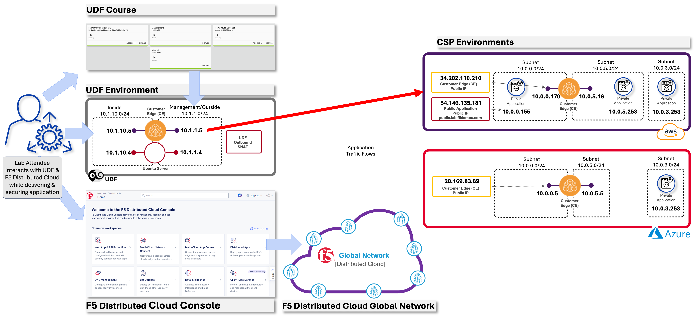
.. |lab002| image:: ../images/temp/lab2/lab2pic2.png
   :width: 800px
.. |lab003| image:: ../images/temp/lab2/lab2pic3.png
   :width: 800px
.. |lab004| image:: ../images/temp/lab2/lab2pic4.png
   :width: 800px
.. |lab005| image:: ../images/temp/lab2/lab2pic5.png
   :width: 800px
.. |lab006| image:: ../images/temp/lab2/lab2pic6.png
   :width: 800px
.. |lab007| image:: ../images/temp/lab2/lab2pic7.png
   :width: 800px
.. |lab008| image:: ../images/temp/lab2/lab2pic8.png
   :width: 800px
.. |lab009| image:: ../images/temp/lab2/lab2pic9.png
   :width: 800px
.. |lab010| image:: ../images/temp/lab2/lab2pic10.png
   :width: 800px
.. |lab011| image:: ../images/temp/lab2/lab2pic11.png
   :width: 800px
.. |lab012| image:: ../images/temp/lab2/lab2pic12.png
   :width: 800px
.. |lab013| image:: ../images/temp/lab2/lab2pic13.png
   :width: 800px
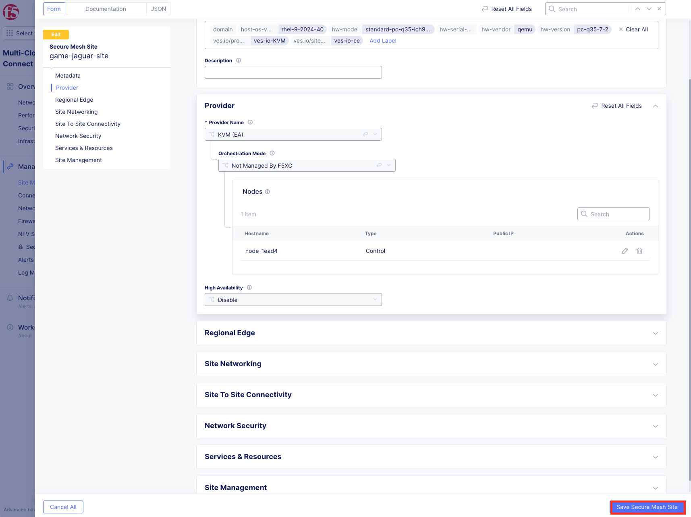
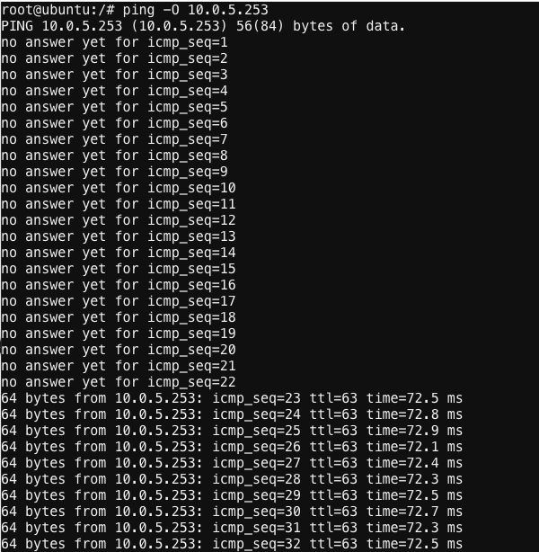
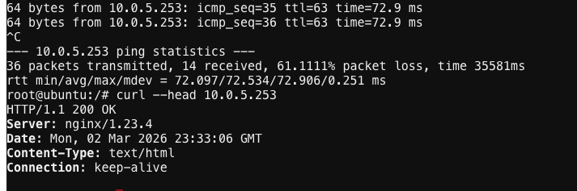
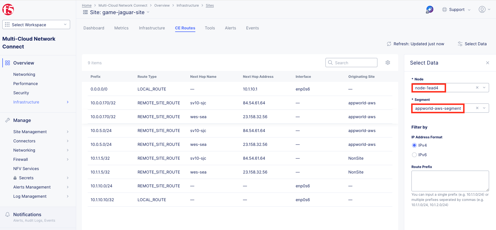
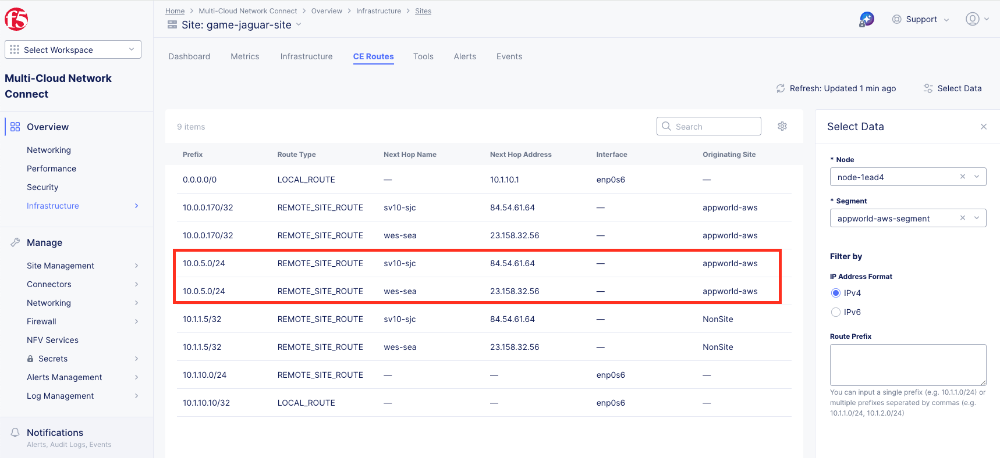
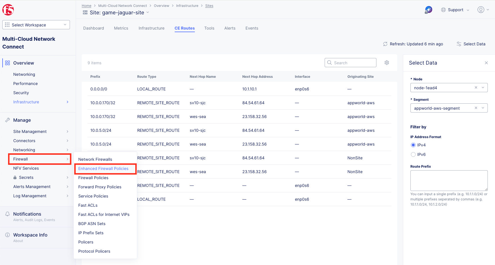
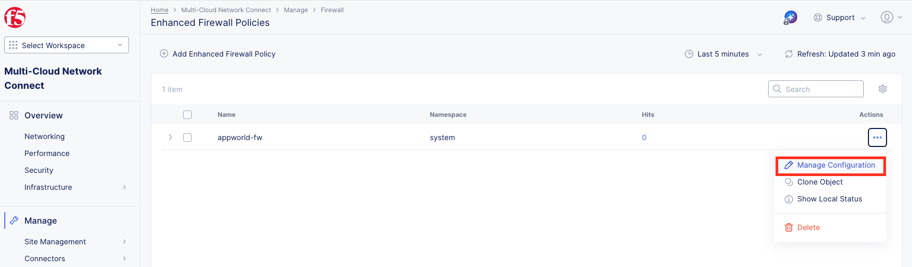
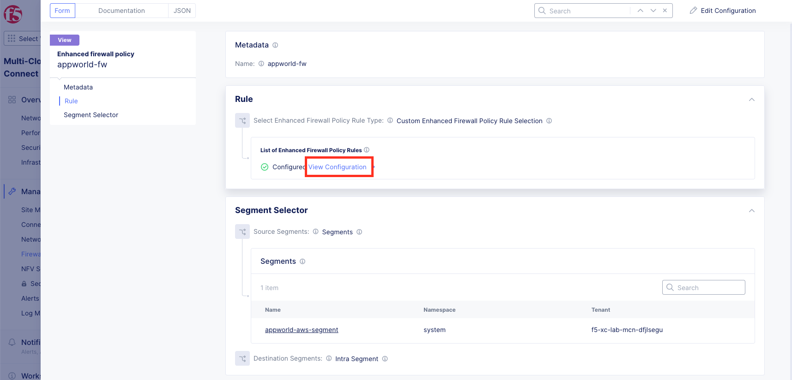
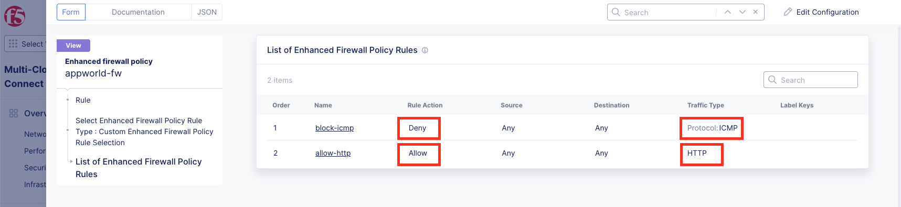
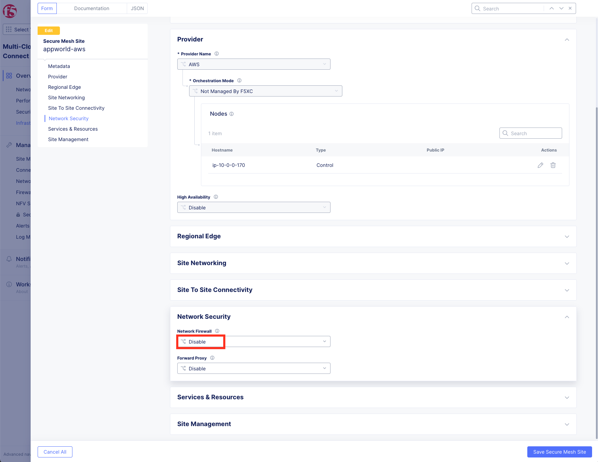
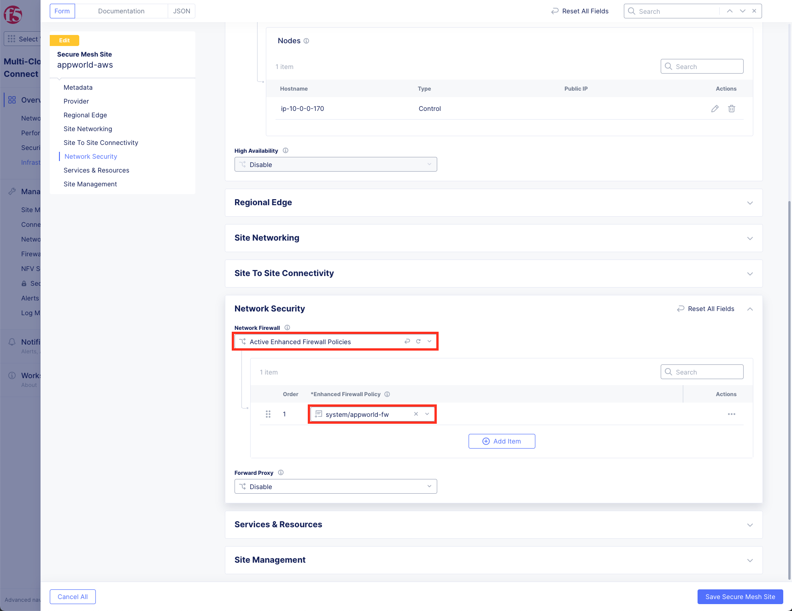
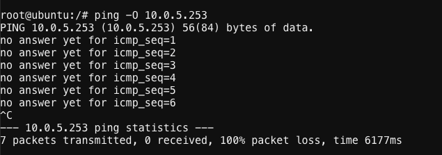
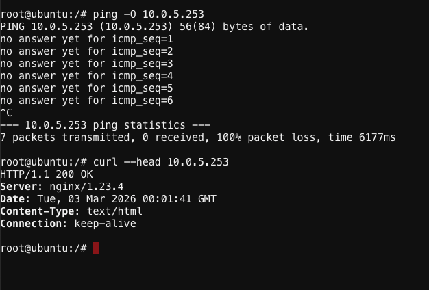
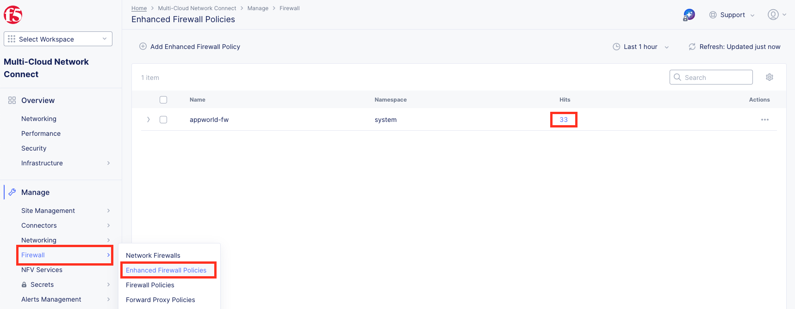
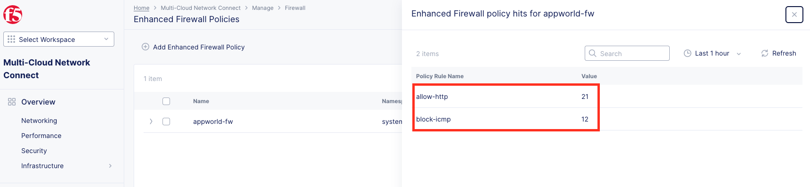
