Lab 2: Configuring Network Connect with Segments (L3/L4 Routing Firewall)
==========================================================================

**Objective:**

* Understand Network Segments and Segment Connectors
* Create network segments for isolated network domains
* Configure segment connectors to enable communication between segments
* Test connectivity and configure Enhanced Firewall for network security

In this lab, you will create network segments to provide isolated Layer 3 network domains, then use 
segment connectors to selectively enable secure communication between these environments.

.. note::
   Network segments provide isolation by default. Segment connectors selectively allow communication 
   between segments while maintaining security boundaries.

**Prerequisite**
----------------

   You should already be logged into your lab's Distributed Cloud Tenant and have completed Lab 1.

   If you are experiencing issues accessing the Distributed Cloud Tenant, please alert one of
   the Lab Assistants.

Task 1: Understanding the Lab Environment
------------------------------------------

**Narrative:**

You need to configure connectivity to meet ACME Corp's requirement: connect the Data Center network 
to the AWS network using network segments. The backend security device needs to scan the frontend in 
AWS on port 80, and all other ports must be blocked.

**Lab Environment Overview:**

* An Ubuntu Server in the UDF environment simulates the Data Center backend
* The AWS frontend workload is already deployed with a CE Node in AWS
* You will create network segments to isolate these environments

.. note::
   The Data Center backend has a pre-configured route to 10.0.5.0/24 pointing to the Data Center 
   CE Node. The AWS workload has a route to 10.1.10.0/24 pointing to the AWS CE Node.

|lab001|

Your goal is to create network segments and establish routing between these environments. Segments 
provide isolated network domains, and segment connectors allow controlled communication between them.

**All traffic between networks will be routed through auto-provisioned, self-healing and encrypted 
tunnels between the Customer Edges and F5 Regional Edges.**

Task 2: Understanding Network Segments
---------------------------------------

**What are Network Segments?**

Network segments are isolated Layer 3 network domains that provide:

* **Isolation:** Segments are isolated by default - traffic cannot flow between segments without 
  explicit configuration ("ships in the night")
* **Flexibility:** Segments can span multiple sites and cloud environments
* **Security:** Each segment can have its own security policies and access controls

**Key Concepts:**

* **Segment:** An isolated network domain (e.g., "prod-segment", "dev-segment")
* **Segment Connector:** Allows communication between two segments
* **Connector Types:**

  * **Direct:** Bidirectional communication between segments
  * **SNAT:** Unidirectional communication with source NAT from source to destination

Task 3: Create Network Segments
--------------------------------

You will now create network segments for your UDF site.

1. From the F5 Distributed Cloud Console, make sure you are still in **Multi-Cloud Network Connect**.

2. In the left-hand menu, navigate to **Manage >> Networking >> Segments**, click **Add Segment**.

|lab002|

3. Configure your segment then click **Add Segment**.

   **Create UDF Segment:**
   ================================  ========================================
   Variable                          Value
   ================================  ========================================
   Name                              <your-namespace>-udf-sg
   Description                       Data Center (UDF) network segment
   Connect to Internet               Allow traffic from this segment to the Internet
   ================================  ========================================

   |lab003|

4. For the purpose of this lab, the segment for AWS site (appworld-aws-segment) has already been created and attached to the interface of the CE node in AWS. Verify the segment that you just created and note that there is zero site that's connected to the segment that you just created.
   
   |lab004|

   .. note::
      These segments are now isolated from each other. No traffic can flow between them until 
      you create a segment connector.

Task 4: Attach Segment to Your CE Site
---------------------------------------

Now you need to attach your UDF segment to your CE site's interface.

5. Navigate to **Manage >> Site Management >> Secure Mesh Sites v2**.

6. Locate your UDF site (**<your-namespace>-site**) and click the three dots under **Actions**.

7. Select **Manage Configuration**.

   |lab005|

8. Click **Edit Configuration** in the top right, 
    
    |lab006|

9. Click **Edit** (the pencil icon) to edit the CE node.

    |lab007|

10. Click **Edit** (the pencil icon) to attach the segment to your node interface. In this case, we are attaching the segment to the SLI interface and leaving the SLO interface untouched.
   
    |lab008|

11.Configure your interface:

    IP Configuration:
   ================================  ========================================
   Variable                          Value
   ================================  ========================================
   IPv4 Interface Address Method     Static IP
   IPv4 address/Prefix Length        10.1.10.10/24
   Default Gateway                   10.1.10.1
   ================================  ========================================

    Interface Settings:
   ================================  ========================================
   Variable                          Value
   ================================  ========================================
   Select VRF                        Segment (Global VRF)
   Segment (Global VRF)              <your-namespace>-udf-sg
   ================================  ========================================

   |lab009| 

12. **Apply** interface changes then **Apply** node configuration changes.

13. Click **Save and Secure Mesh Site**.

14. Navigate back to **Manage >> Networking >> Segments** and find your segment 
    **<your-namespace>-udf-sg**.

15. Verify that your site is now attached to the segment (you should see 1 site connected).

    |lab010|

    .. note::
       Your UDF segment is now attached to your CE site. However, it is still isolated from the 
       AWS segment until you create a segment connector.

Task 5: Review Routing Information
-----------------------------------

Let's examine the routing established by attaching the segment to the interface.

16. Navigate to **Multi-Cloud Network Connect >> Infrastructure/Sites** and click on your 
    **"<your-namespace>-site"** site.

17. Click on the **CE Routes** menu on the top, right in the middle.

21. **Select Data** by choosing your node and the segment you just created, click **Apply**.

    |lab011| 

Task 6: Test Connectivity Before Segment Connector
---------------------------------------------------

Let's verify there is currently no connectivity between the UDF and AWS environments.

22. From your UDF environment browser tab, click on **Access >> Web Shell** on the Ubuntu Client. 
    This opens a new tab with a Web Shell.

23. The workload in AWS has IP address **10.0.5.253**

24. Type **ping -O 10.0.5.253** and press **Enter**. You **WILL NOT** get a response.

    .. note::
       -O is the uppercase letter "O"

    Leave this ping running - we'll check back after creating the segment connector.

Task 7: Understanding Segment Connectors
-----------------------------------------

**What are Segment Connectors?**

Segment connectors create connections between isolated network segments. Without a segment connector, 
segments cannot communicate - they remain "ships in the night."

**Segment Connector Types:**

* **Direct Connector:** Enables bidirectional communication. Routes are exchanged in both directions.
* **SNAT Connector:** Enables unidirectional communication from source to destination with source NAT 
  applied.

Task 8: Create a Segment Connector
-----------------------------------

Now let's create a segment connector to enable communication between your UDF segment and the AWS segment.

22. Navigate to **Manage >> Networking >> Segment Connectors**.

23. Click **Manage Segment Connector**.

24. Click **Add Item** for the segment connector:

    ================================  ========================================
    Variable                          Value
    ================================  ========================================
    Source Segment                    <your-namespace>-udf-sg
    Destination Segment               appworld-aws-segment
    Type                              Direct
    ================================  ========================================

    |lab012|

    .. note::
       The **Direct** connector type allows bidirectional communication between the two segments. 
       Routes will be exchanged in both directions. If you needed unidirectional communication 
       with source NAT, you would select **SNAT** instead.

25. Click **Apply** to create the segment connector then **Save Segment Connection**.

Task 8: Verify Connectivity After Segment Connector
----------------------------------------------------

26. Wait approximately 30-60 seconds for the segment connector to propagate and routes to be exchanged.

27. Check back on your web shell tab with the ping running. **Success!!**

    |lab013|

    .. tip::
       To remove this connectivity, simply delete the segment connector. Segments revert to their 
       default isolated state when no connector exists.

Task 9: Review Routing Information
-----------------------------------

.. |lab001| image:: ../images/temp/lab2/placeholder_pics.jpg
   :width: 800px
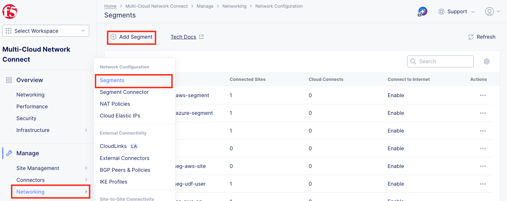
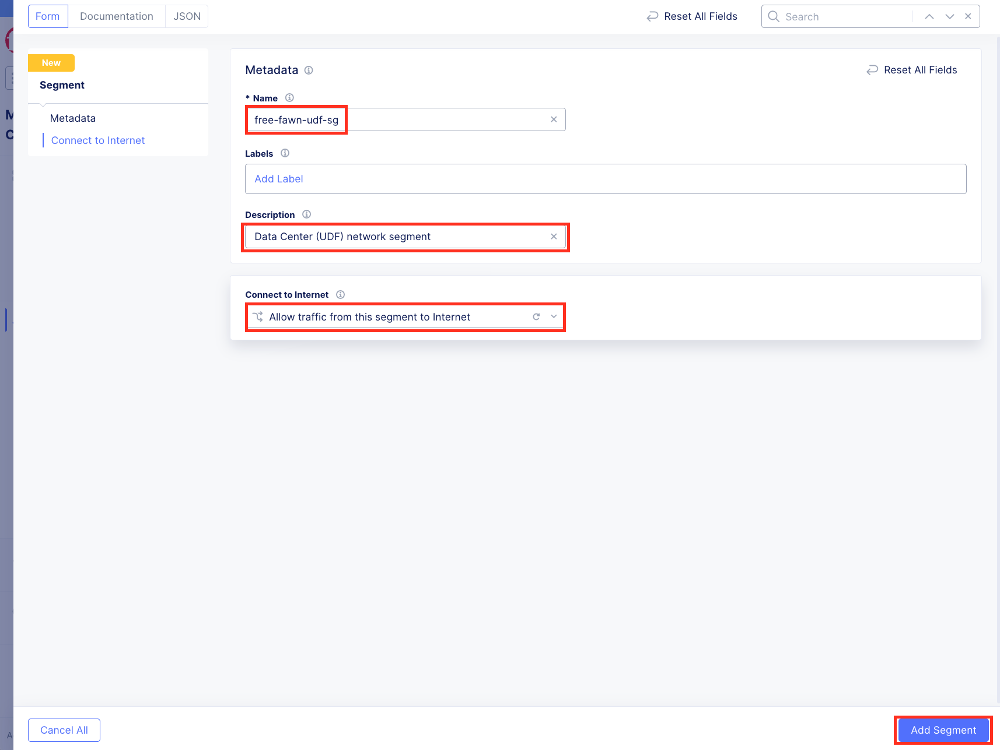
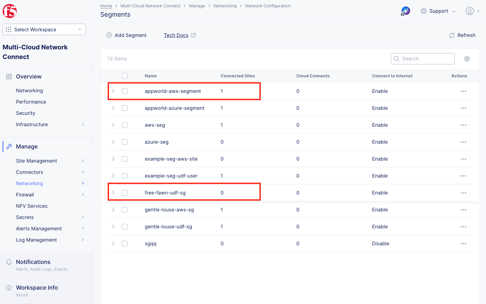
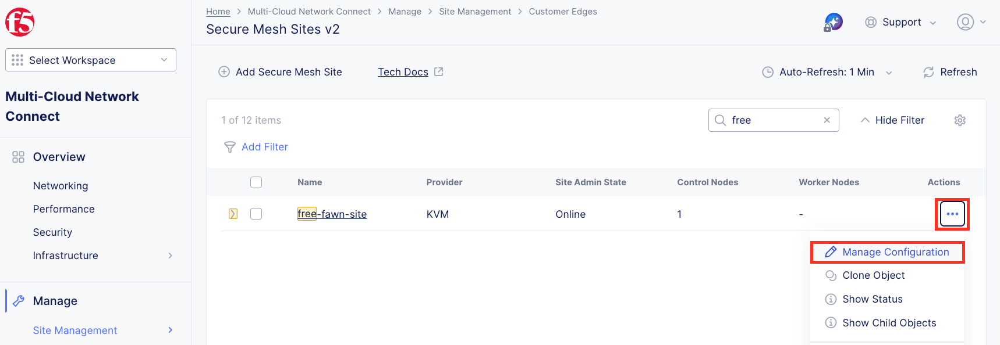
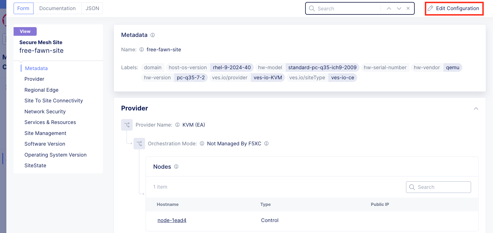
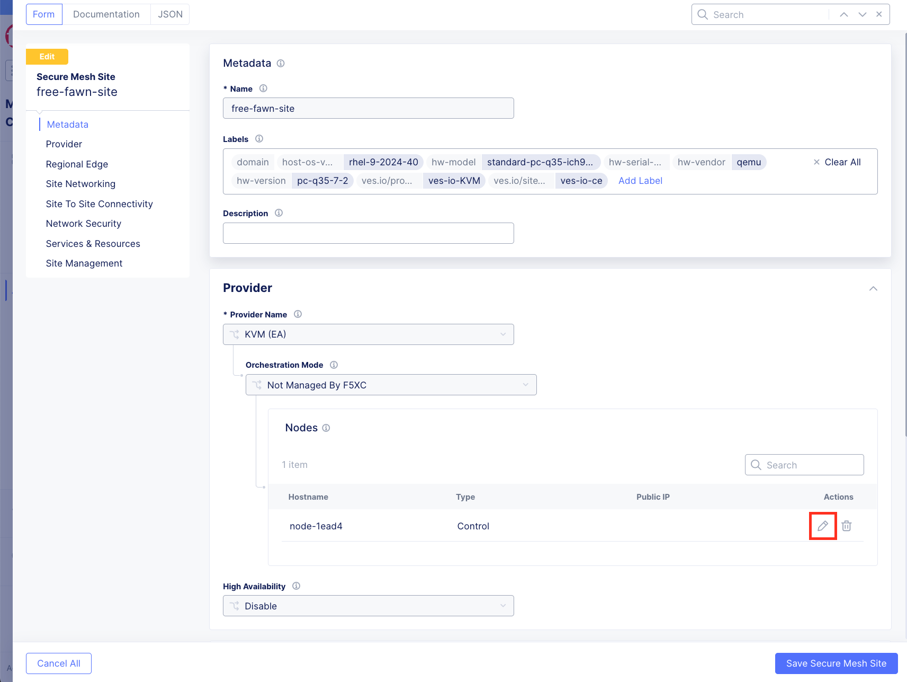
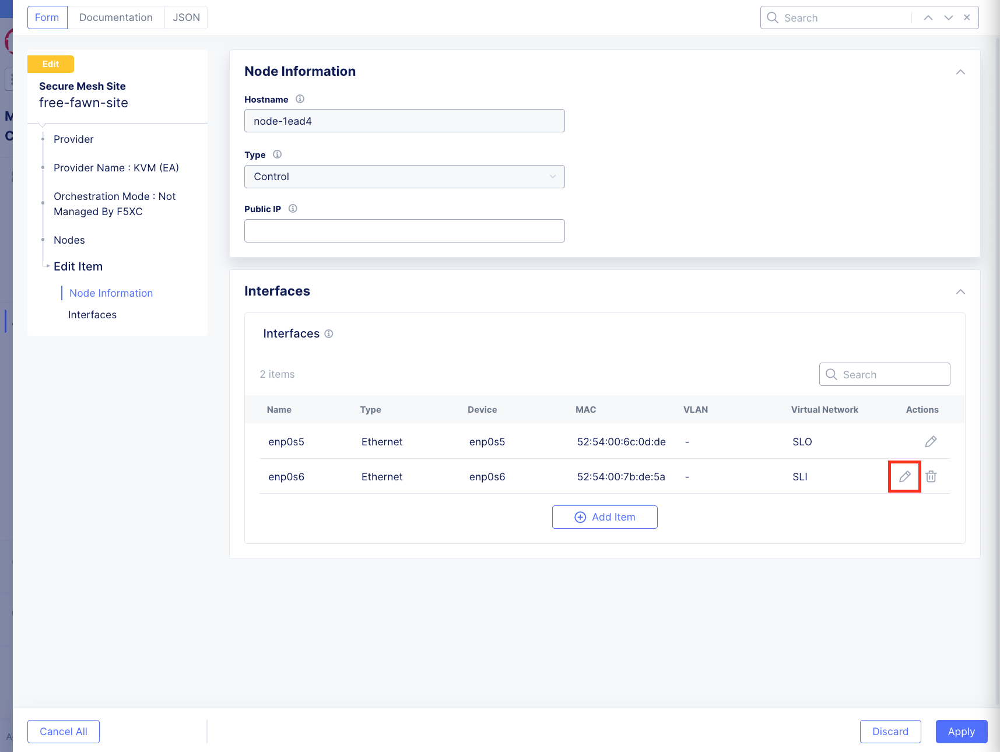
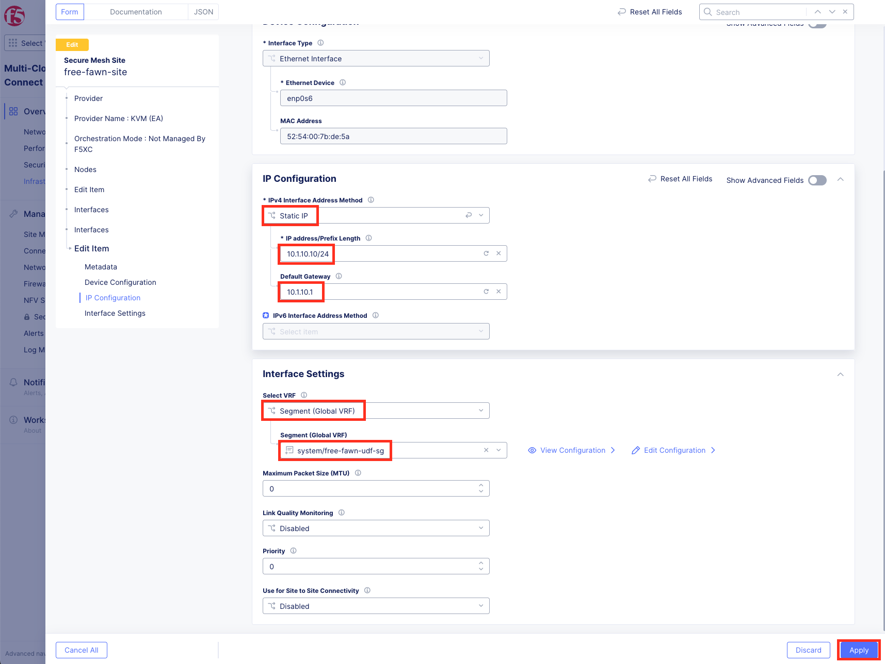
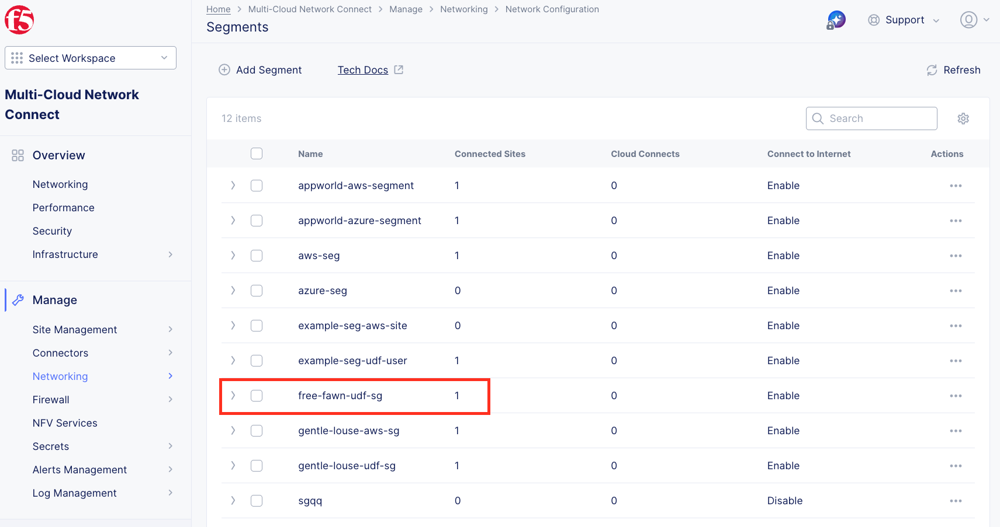
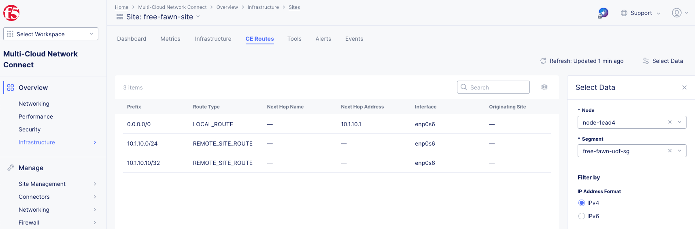
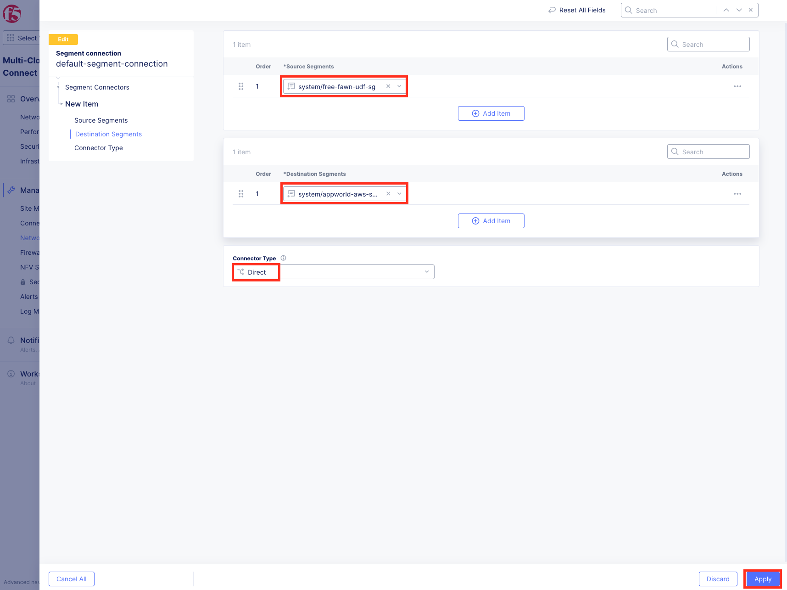
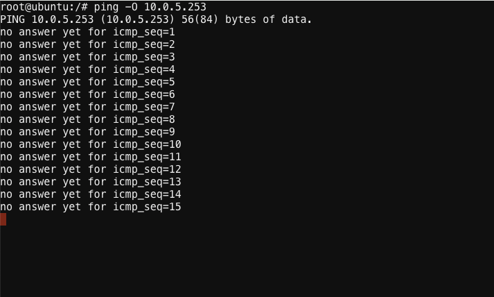