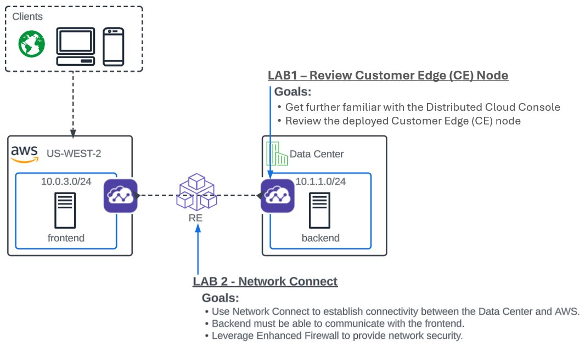

Module 1: Network Connect
=======================================================

.. image:: ../images/netconnect.png

**Narrative**:

As described in the intro, you work at ACME corp as a Network Engineer and have been tasked with privately and securely connecting the backend server with the frontend server in AWS. 
Your solution must be future-proof to allow for additional backends or frontends in the future. 

**In Lab 1** we will be deploying an XC Node to establish the Customer Edge (CE) which will provide connectivity to remote environments or sites. 

**In Lab 2** we will configure the XC Nodes to act as Software-Defined Routers to stitch together the Data Center and AWS networks using Network Connect. 

.. toctree::
   :maxdepth: 1
   :glob:

   lab*
