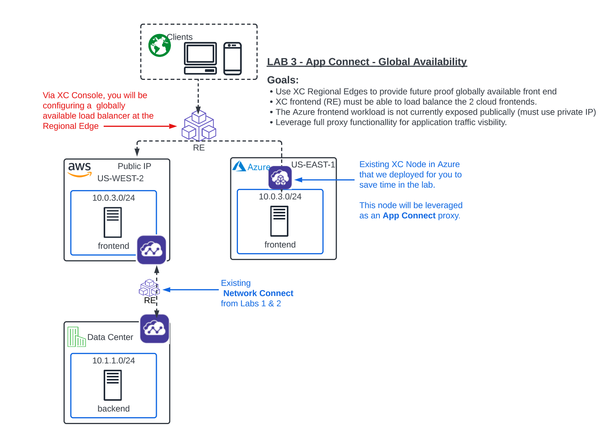
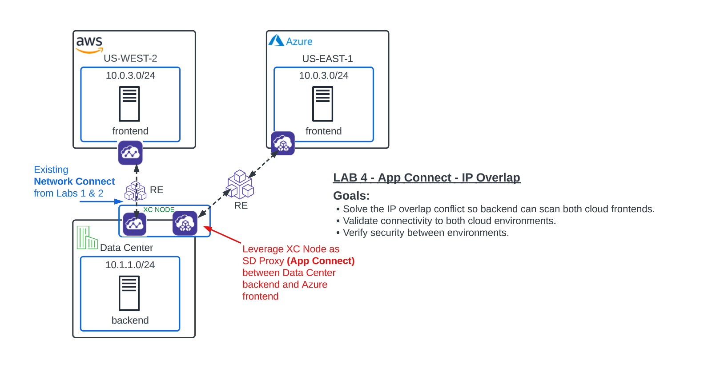
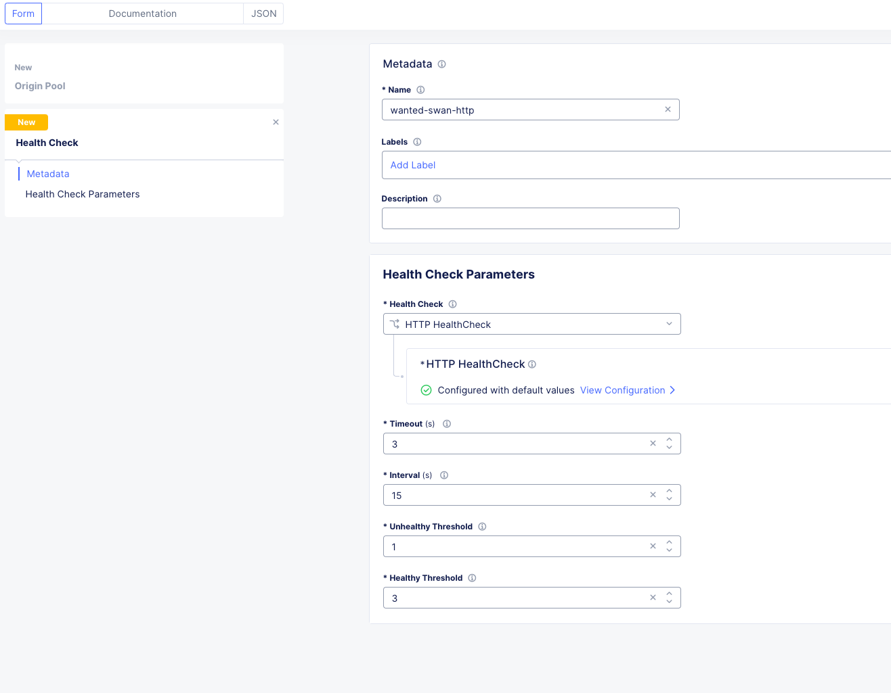
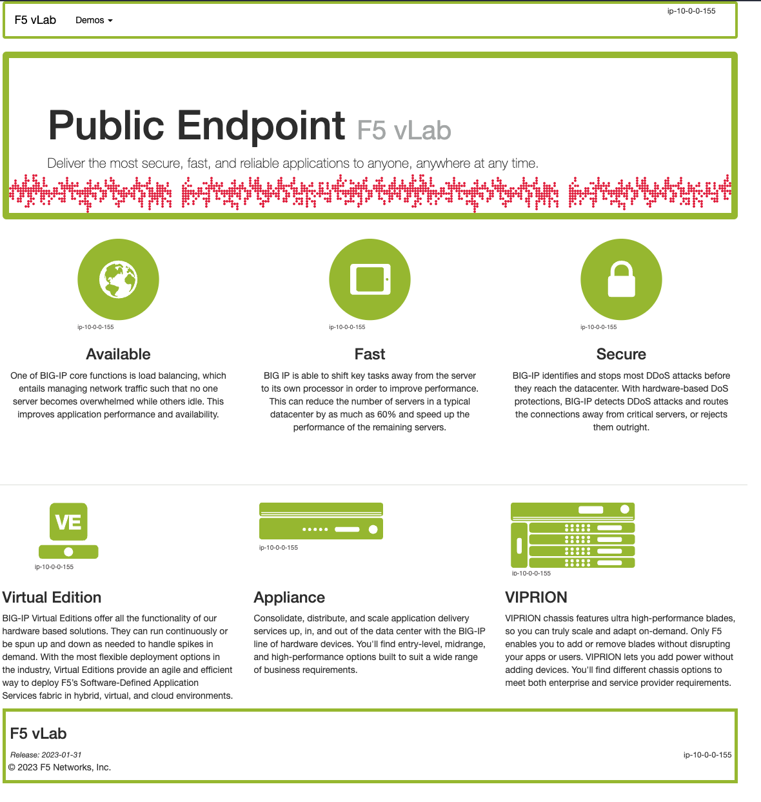
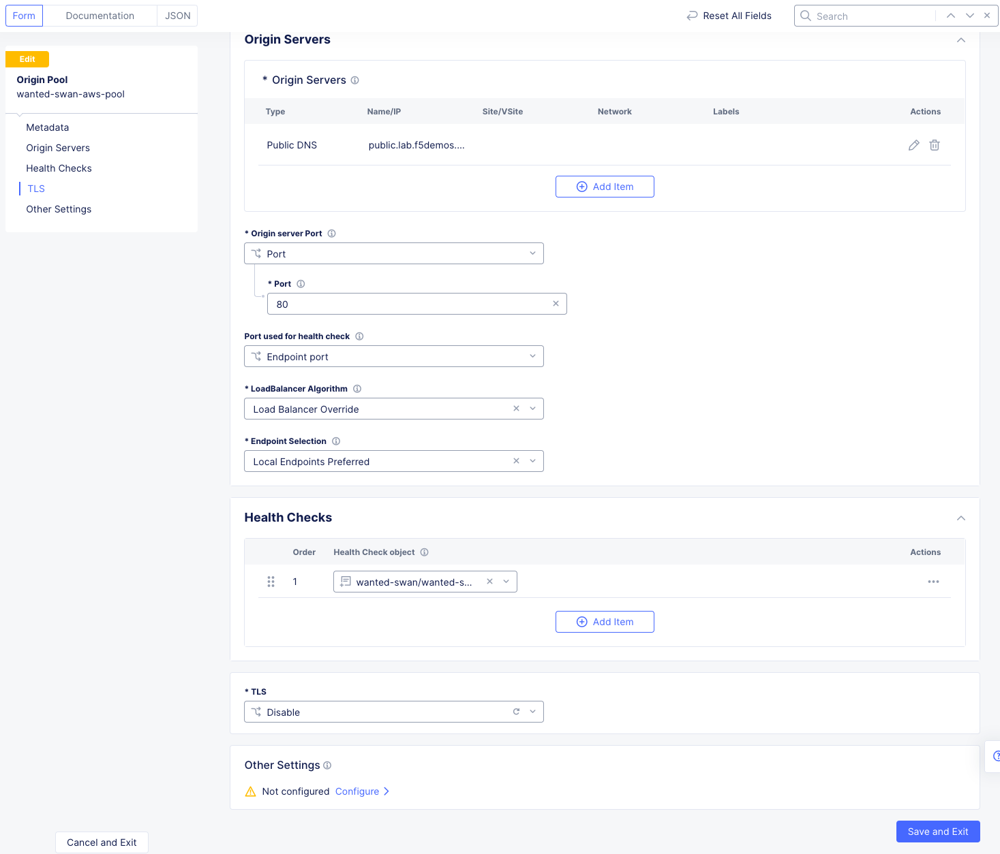
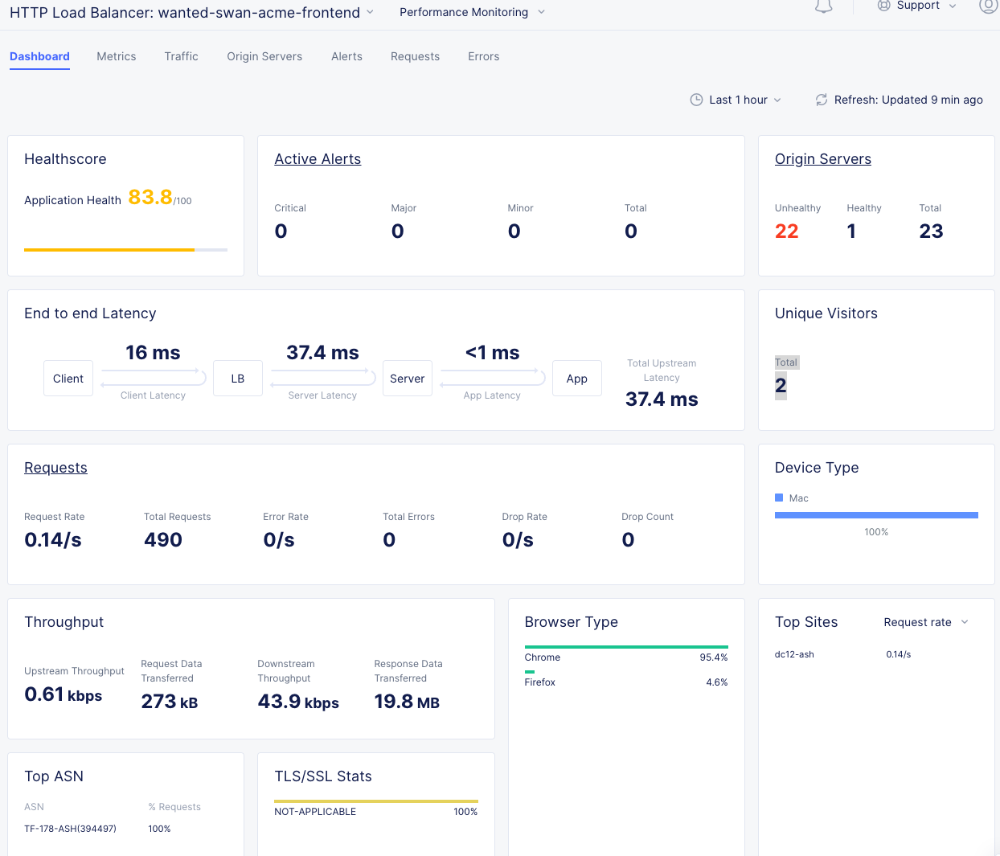

Lab 3: Globally Available Front End 
=======================================

**Objective:**

* Use XC Regional Edges to provide future-proof, globally available frontend.

* XC frontend (RE) must be able to load balance the 2 cloud frontends. 

* Expose Azure private frontend without adding a public IP for the workload. 

* Always prefer the AWS frontend for ingress traffic. 

**What they want:**

.. image:: ../images/mod2bizreq.png

**Narrative:**

Unfortunately, after doing your due diligence, you find that the Azure VNET overlaps with the AWS subnets. To make matters worse, 
the Azure server is not associated with any public IP and there is a security directive in place to not have any workload servers in Azure associated with a public IP without a security device. 

Lately, the site has been getting pounded with attack traffic and frontend security has become a hot topic at ACME. 
You think to yourself, this is going to be tricky, and reach out to your trusted F5 Solutions Engineer to see how this will work with Distributed Cloud. 

Your F5 Solutions Engineer explains that IP overlap between sites is a common problem and one that can be easily solved with Distributed Cloud App Connect. 
App Connect alleviates this problem by leveraging the XC Nodes as Software-Defined Proxies rather than Software-Defined Routers as they were configured with Network Connect. Additionally App Connect enforces a default deny architecture, where only the port and domain name defined on the load balancer will accept traffic. 

Also, you are informed that by using F5 Distributed Cloud Regional Edges for the frontend workloads, you will be able to have full proxy security, visibility and analytics for the client traffic, so the Security team will be pleased. 

After reviewing the architecture with you, your Solutions Engineer advises you to break up these requirements in to 2 specific deliverables. 

**Deliverable 1:**

Create a globally scaled and future-proof frontend with the XC Regional Edges **(Lab 3)**

|

|

**Deliverable 2:**

Leverage App Connect for secure site to site connectivity regardless of IP overlap. **(Lab 4)**

|

|

Multi-Cloud App Connect
----------------------------

With **Network Connect** you connected routed networks with your CE Node which acted as a Software-Defined Router. 

Now with **App Connect** you will be configuring our Regional Edges and your CE Nodes as Sofware-Defined-Proxies to provide connectivity between workloads. The CE's can do both functions simultaneously!!  

In the **Side menu** select service **Multi-Cloud App Connect**, then navigate to **Manage** click on **Load Balancers** >> **Origin Pools** and click the **Add Origin Pool** button. 

AWS Origin Pool
----------------

|

.. image:: ../images/orig.png

|

Enter the following Values:

==============================  =====
Variable                        Value
==============================  =====
Name                            animal-name-aws-pool
Origin Server Port              80
Origin Servers                  See Below 
Health Checks                   See Below 
==============================  =====

**Origin Servers:** Click **Add Item**

In the dropdown keep:  **Public DNS Name of Origin Server** and type: **public.lab.f5demos.com** and click **Apply**. 

**Health Checks:** Under "Health Check object" click the **Select Item*** dropdown and click **Add Item**. 

For the Name use: **[animal-name]-http** and take the rest as defaults. 

Click **Continue**

|

|

Your Origin Pool should now look like this: 

|

.. image:: ../images/origaws.png

|

Leave everything else as **default** and click **Save and Exit**.

Azure Origin Pool
---------------------

Click the **Add Origin Pool** button at the top the screen. 

==============================  =====
Variable                        Value
==============================  =====
Name                            animal-name-azure-pool
Origin Server Port              80
Origin Servers                  See Below 
Health Checks                   [animal-name]-http
==============================  =====

**Origin Servers:** 
Hit the dropdown for **Select Type of Origin Server** and choose **IP Address of Origin Server on given Sites**. 

==============================  =====
Variable                        Value
==============================  =====
IP                              10.0.3.253 (Note: this is not a typo. The CSP workloads have IP overlap)
Site or Virtual Site            Site
Site:                           **system/student-azurenet**
Select Network on the site      Inside Network
==============================  =====

Click **Apply**. 

Health Checks: Under “Health Check object” click the **Select Item** dropdown and choose the object that you created previously for the AWS origin pool. The name of the health check should be [animal-name]/[animal-name]-http.

Your config should look like this: 

|

.. image:: ../images/origazure.png

|

Leave everything else as **default** and click **Save and Exit**.

Now that we have defined both of our Origin Server pools which are a public DNS Name in AWS and a private IP in Azure, we will set up the App Connect Proxy to provide a Global Frontend to load balance them.

Global Frontend
----------------------------

In the **Side menu** under **Manage** click on **Load Balancers** >> **HTTP Load Balancers** and click the **Add HTTP Load Balancer** button. 

==================================    =====
Variable                              Value
==================================    =====
Name                                  animal-name-acme-frontend
Domains and LB Type                   animal-name-acme-frontend.lab-mcn.f5demos.com
Load Balancer Type                    HTTP
Automatically Manage DNS Records      **check**
HTTP Port                             80
Origin Pools                          See Below 
==================================    =====

**Origin Pools**

Click **Add Item** and under "Origin Pool" select the **AWS pool** with your animal name. Leave everything else as **default** and click **Apply**.

|

.. image:: ../images/awspri.png

|

Click **Add Item** again and under "Origin Pool" select the **Azure pool** with your animal name. This time, change the priority to **0** and click **Apply**.

.. Note:: A zero value priority makes that pool the lowest priority. A value of **1** is the highest priority. AWS was set to **1** by default. 

|

.. image:: ../images/azurepri.png

|

Click **Apply** and you should now be back to the **HTTP Load Balancer** configuration screen which should look like this. 

|

.. image:: ../images/httplb.png

|

Leave everything else as **default** and scroll down to the bottom to click **Save and Exit**.

You should now see your Globally Available frontend in the **HTTP Load Balancers** screen.

|

.. image:: ../images/newlb.png

|

Testing
---------------------

Go ahead and open up a **Command Prompt** or **Terminal** on your personal machine and type the following command: 

**nslookup [animal-name]-acme-frontend.lab-mcn.f5demos.com** and note the IP address that is returned. 

In my example, I am using a terminal on MAC and my animal-name was **rested-tiger**.

.. Note:: This may take a few moments to become resolvable depending on your local DNS configuration. 

|

.. image:: ../images/nslookup.png

|

Now open up a new tab in your browser and try http://[animal-name]-acme-frontend.lab-mcn.f5demos.com

If you reached this page, you set it up right! Nice work. 

|

|

Hit **[Shift + Refresh]** a few times in your browser and make sure you are staying on the same site. You should NOT be seeing a **blue page** at any point. 

In **XC Console**, navigate to **Manage >> Load Balancers >> Origin Pools**, click on the **3 Button** Actions Menu and choose **Manage Configuration** for your **[animal-name]-aws-pool**. 

Click **Edit Configuration** in the upper right and then scroll to the bottom of the **AWS origin Servers** configuration screen. 

Under **TLS**, hit the dropdown and choose **Enable** and click **Save and Exit**.

|

.. image:: ../images/tlsenable.png

|

.. Important:: What you are doing here, is enabling TLS on the backend connection to the Origin Server of the AWS pool. This WILL FAIL, as the Server is not expecting TLS which will effectively cause the monitors to fail. This will take down the AWS pool and allow us to test the Azure failover as if the AWS workload itself was failing. 

**Check it out....**

Go back to your browser tab that you had open to http://[animal-name]-frontend.lab-mcn.f5demos.com and hit **[Shift + Refresh]**.

|

.. image:: ../images/azurepub.png

|

Go back to XC Console and edit the AWS pool again to disable TLS and bring the AWS site back online. 

|

|

Click **Save and Exit**.

Go back to your browser tab that you had open to http://[animal-name]-frontend.lab-mcn.f5demos.com and hit **[Shift + Refresh]**.

.. note:: If you receive a 503 error, please wait a moment and [Shift + Refresh] your browser.

You should be back to the AWS page now. 

|

|

.. 
  **Testing Load Balancing**

  Although this isn't an ACME requirement at the moment, you decide to test an Active/Active pool configuration. 
  Currrently, you have a Global frontend [http://animal-name-acme-frontend.lab-mcn.f5demos.com] that points to a pool with a public EC2 workload in AWS and a pool with a private IP workload in Azure sitting behind the CE.
  You are configured for Active/Standby load-balancing of the pools due to the priority setting in the pool. 

  In **XC Console**, navigate to **Manage >> HTTP Load Balancers**,  click on the **3 Button** Actions Menu and choose **Manage Configuration** for your **[animal-name]-acme-frontend**. 

  Click **Edit Configuration** in the upper right and then click the **pencil/edit** icon next to the Azure Origin Pool. 

  |
  
  .. image:: ../images/editazure.png

  |

  Change the priority to **1**, click **Apply** and **Save and Exit**.

  Go back to your browser tab that you had open to http://[animal-name]-frontend.lab-mcn.f5demos.com and hit **[Shift + Refresh]**.

  |

  .. image:: ../images/weird-results.png

  |

Dashboard and Analytics
-------------------------

Now that we've sent several requests to our shiny new **Globally Available Frontend**, we can take a look at the traffic dashboards. 

In **XC Console** >> **Multi-Cloud App Connect** >> **Overview** click on **Performance**. 

Scroll all the way to the bottom and under **Load Balancers**, click directly on your **[animal-name-acme-frontend]**.

|

.. image:: ../images/lbs.png

|

This will take you to the **Performance Monitoring** Dashboard. If you took a break or don't see any live traffic, try tuning your time-frame. 

|

.. image:: ../images/time.png

|

You should see a number of metrics including a **Application Health** score which may NOT be at **100** due to the AWS site being offline earlier when we tested failover.

|

|

Notice the invaluable **End to end Latency** analytic. Click on the **Metrics** tab. 

|

.. image:: ../images/met1.png

|

Click on the **Health** Percent metric over on the right side. Use the time-sliders at the bottom to try and zoom in to the approximate time when the applications health was poor. 

|

.. image:: ../images/timeslide.png

|

In my example, I am zooming in to approx 12:33AM and can click the color block to get a filtered view of the requests as they were being served at that time. 

|

.. image:: ../images/timeslide2.png

|

We can confirm that the Standby Azure workload was sure enough serving up requests during that time. 

|

.. image:: ../images/requests.png

|

Click the **Traffic Tab** in the top menu and change your time-frame back to **1 hour**. 

This graph shows you a visual representation on where your traffic is ingressing our Regional Edges. In my example below, I am local to the DC area, so you can see I consistently hit the DC12 RE in Ashburn Virginia. 

You may see different Source Sites depending where you are geographically located. In production you would see several source sites here if your customer traffic is geographically diverse. 

You can also see the load balancer name and the Origin Servers to the right. If you hover over them you will get a Request Rate metric.

|

.. image:: ../images/traffic.png

|

Click the **Origin Servers Tab** in the top menu and change your time-frame to **1 hour**. At the bottom left, change your setting to **50** items per page. 

Why do you think there are so many Origin Servers showing for the AWS EC2 workload DNS name?

|

.. image:: ../images/originserve.png

|

Click the **Requests Tab** in the top menu and change your time-frame to **1 hour**. At the bottom left, change your setting to **50** items per page. 

The request log has a wealth of information. Literally everything about the request is logged and analyzed.

Choose any request in the log and click the **expand** arrow next to the time-stamp. 

Every request has built in End-to-End analytics. You can also click on **JSON** to see the request log in JSON format. 

|

.. image:: ../images/rl.png

|

Feel free to explore additional requests and/or fields while other students are getting caught up. 

Sanity Check
-------------
**This is what you just deployed.**

|

.. image:: ../images/lab3review.png

|

**We hope you enjoyed this lab!**

**End of Lab 3**

 

 

