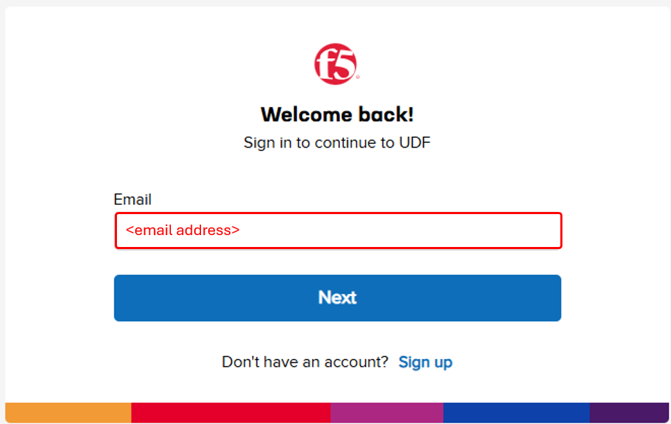
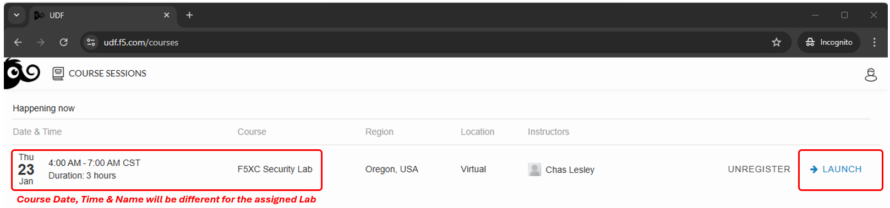

F5 Distributed Cloud: Code, Secure, Repeat
====================================================

Introduction
~~~~~~~~~~~~~

Welcome to the **F5 Distributed Cloud – Code. Secure. Repeat.** lab.

This lab is designed to feel less like a traditional step-by-step workshop and more like a day in the life of a modern DevSecOps team. You’ll move fast, break things (on purpose), and see how security can be built *into* the workflow instead of bolted on at the end.

You’ll start by onboarding into a fully browser-based development environment—no installs, no local dependencies, and no “works on my laptop” moments. From there, you’ll experience how AI-assisted development (*vibe coding*) can dramatically accelerate delivery, while also introducing real security risks that teams face every day.

As the lab progresses, you’ll see how those risks are addressed using **CI/CD-driven security controls**, **policy-as-code**, and **runtime protection** with F5 Distributed Cloud. Security decisions won’t rely on manual reviews or heroics—instead, they’ll be enforced automatically through the pipeline and continuously validated in production-like conditions.

By the end of the lab, you’ll have walked through the full lifecycle:

* Writing code fast with AI
* Catching issues early with Static Application Security Testing (**SAST**)
* Enforcing guardrails using **DevSecOps and policy as code**
* Protecting live applications with **WAAP**
* Validating security posture using Dynamic Application Security Testing (**DAST**) through Web App Scanning

This lab isn’t about memorizing steps—it’s about understanding *why* modern teams build security the way they do, and how platforms like F5 Distributed Cloud help make speed and security work together.

Let’s get started.

.. note::  

   If you’ve already joined the UDF lab environment and your deployment status shows all green, you may proceed directly to  **Module 0**. If you have not yet joined the UDF lab environment, please complete the steps outlined in the Course/Lab Invitation and Accessing UDF sections first.

Course/Lab Invitation
~~~~~~~~~~~~~~~~~~~~~~

Access to the lab environment is provided via an invitation email sent to the registration address you submitted. Please check your inbox and spam folder. If you did not receive an invitation, contact a member of the lab team for assistance.

+----------------------------------------------------------------------------------------------+
| Course/Lab Attendees will receive an email similar to the graphic displayed in this section. |
| The email will come from courses@notify.udf.f5.com.                                          |
|                                                                                              |
| As attendees may be registered for several lab/courses, ensure the correctly identified course|
| is selected.  Use either the first or second link position (indicated by arrows) based on    |
| the attendee's F5 UDF (Unified Demo Framework) Account Status.                               |
|                                                                                              |
| # **New UDF Users**                                                                          |
| # **Returning UDF Users going directly to Course**                                           |
|                                                                                              |
| .. note::                                                                                    |
|    *Note The steps for new UDF Users or the steps for resetting UDF User account passwords*  |
|    *are not shown. Please contact a member of the lab team if further assistance is needed.* |
+----------------------------------------------------------------------------------------------+
| |intro-01|                                                                                   |
+----------------------------------------------------------------------------------------------+

Accessing UDF (F5 Unified Demo Framework)
~~~~~~~~~~~~~~~~~~~~~~~~~~~~~~~~~~~~~~~~~~

+----------------------------------------------------------------------------------------------+
| The following will guide attendees through the initial Lab environment access within F5 UDF. |
| Following the instructions from the Course/Lab invitation above, attendees will be prompted  |
| to login at  https://udf.f5.com                                                              |
|                                                                                              |
| .. note::                                                                                    |
|    *Note The steps for new UDF Users or the steps for resetting UDF User account passwords*  |
|    *are not shown. Please contact a member of the lab team if further assistance is needed.* |
+----------------------------------------------------------------------------------------------+
| |intro-02|                                                                                   |
+----------------------------------------------------------------------------------------------+

+----------------------------------------------------------------------------------------------+
| Attendees will be prompted to enter their UDF account, password and complete MFA as shown.   |
| MFA must be completed by either selecting **Send Push** or **Enter Code**.                   |
|                                                                                              |
| .. note::                                                                                    |
|    *MFA process will vary based on the MFA integration selected for the UDF Account. OKTA*   |
|    *Verify is shown.*                                                                        |
+----------------------------------------------------------------------------------------------+
| |intro-03|                                                                                   |
|                                                                                              |
| |intro-04|                                                                                   |
|                                                                                              |
| |intro-05|                                                                                   |
+----------------------------------------------------------------------------------------------+

+----------------------------------------------------------------------------------------------+
| Attendees will then be presented their scheduled course sessions. Locate the course/lab with |
| the appropriate **Date**, **Time** and **Name** and then click **Launch**.                   |
+----------------------------------------------------------------------------------------------+
| |intro-06|                                                                                   |
+----------------------------------------------------------------------------------------------+

+----------------------------------------------------------------------------------------------+
| Once redirected to the selected Course/Lab, click the **Join** button.                       |
+----------------------------------------------------------------------------------------------+
| |intro-07|                                                                                   |
+----------------------------------------------------------------------------------------------+

+----------------------------------------------------------------------------------------------+
| The Lab environment window will now be displayed.  Click on the **Documentation** tab in the |
| horizontal navigation links.  Locate and observe the state of **Client** system.             |
|                                                                                              |
| In approximately 5-7 minutes the associated **yellow gear** starting icon will change to a   |
| **green arrow** (running) icon and attendees will proceed to the next section of steps.      |
|                                                                                              |
| .. note::                                                                                    |
|    *Your specific lab environment may vary from the graphics shown below. The **Client***    |
|    *will, however, be consistent.*                                                           |
+----------------------------------------------------------------------------------------------+
| |intro-08|                                                                                   |
|                                                                                              |
| |intro-09|                                                                                   |
+----------------------------------------------------------------------------------------------+

+----------------------------------------------------------------------------------------------+
| **Beginning of Lab:**  You are now ready to begin the lab, Enjoy! Ask questions as needed.   |
+----------------------------------------------------------------------------------------------+
| |labbgn|                                                                                     |
+----------------------------------------------------------------------------------------------+

Lab Modules
~~~~~~~~~~~~

.. toctree::
   :maxdepth: 1
   :glob:

   module0/module0
   module1/module*
   module2/module*
   module3/module*
   module4/module*

.. |intro-01| image:: images/intro/intro-01.png
   :width: 800px
.. |intro-02| image:: images/intro/intro-02.png
   :width: 800px

.. |intro-04| image:: images/intro/intro-04.png
   :width: 800px
.. |intro-05| image:: images/intro/intro-05.png
   :width: 800px

.. |intro-07| image:: images/intro/intro-07.png
   :width: 800px
.. |intro-08| image:: images/intro/intro-08.png
   :width: 800px
.. |intro-09| image:: images/intro/intro-09.png
   :width: 800px
.. |labbgn| image:: images/intro/labbgn.png
   :width: 800px