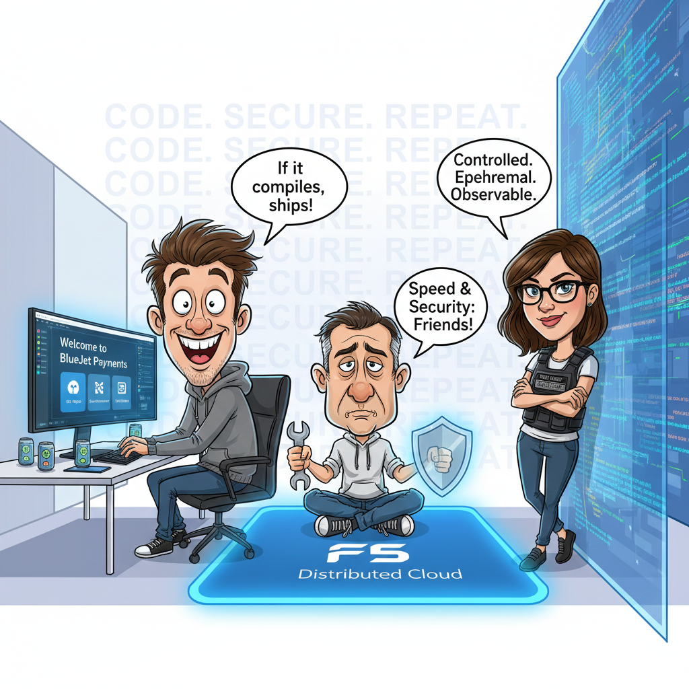

Module 0 – Intro & Environment
===============================

Narrative
---------

+----------------------------------------------------------------------------------------------+
| **Welcome to BlueJet Payments!!**                                                            |
|                                                                                              |
| BlueJet Payments is a fast-growing fintech startup. Think real-time payments, APIs           |
| everywhere, and a leadership team obsessed with shipping fast.                               |
|                                                                                              |
| They’re not reckless—but they are **modern**.                                                |
|                                                                                              |
| **Meet the Personas**                                                                        |
|                                                                                              |
| * **Alex (App Developer)**                                                                   |
|   *Ships features fast. Loves AI tools. Lives in VS Code. “If it compiles, it ships.”*       |
|                                                                                              |
| * **Riley (Security Engineer)**                                                              |
|   *Owns the pipeline, not the code. Believes security should block bad decisions             |
|   automatically, not rely on heroics.*                                                       |
|                                                                                              |
| * **Victor (Platform Engineer / DevSecOps)**                                                 |
|   *Victor's job is to make speed and security stop fighting each other.*                     |
|                                                                                              |
| This lab is their story.                                                                     |
|                                                                                              |
| Alex just joined BlueJet and is onboarding. Instead of a 40-page wiki, you hand them a       |
| browser-based dev environment, a Git repo, and access to the security platform.              |
|                                                                                              |
| **Alex:** *No installs. No “works on my laptop.” Everything already feels… modern!*          |
|                                                                                              |
| **Riley:** *I am happy too because the environment is **controlled**, **ephemeral**, and*     |
| ***observable**.*                                                                            |
|                                                                                              |
| |Module_0_story|                                                                             |
+----------------------------------------------------------------------------------------------+

**What this module is really about**
------------------------------------

* Setting expectations: this is an **end-to-end system**, not a bunch of tools
* Understanding the loop you’ll repeat all lab long:
                                  
**Code → Commit → Scan → Protect → Learn → Repeat**

**Real-world parallel**
-----------------------

This mirrors how platform teams onboard engineers today:

* Golden environments
* Pre-wired pipelines
* Guardrails, not gates

No one starts with security turned **off**—they start with it **invisible**.

Module 0 Tasks:
---------------

.. toctree::
   :maxdepth: 1
   :glob:

   task*

