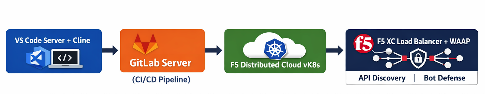

Task 1 – Lab Environment Overview
================================

Before we start building and breaking things, let’s do a quick tour of the lab environment.  
This lab is designed to mirror a **real-world DevSecOps workflow**—just compressed into a couple of hours and fully pre-wired so you can focus on outcomes, not setup.

This task is about **orientation**, not configuration. The goal is to understand *what each component does* and *how they work together* before you touch anything.

VS Code Server and Cline Extension
----------------------------------

This is your primary workspace throughout the lab.

- **VS Code Server** runs entirely in your browser—no local installs required.
- You will write code, edit files, and commit changes from here.
- The **Cline extension** adds AI-assisted coding using Gemini.
- This is where “vibe coding” happens—fast iteration, fast results.

*What to notice:*
- New files may be created automatically by Cline.
- Cline may open and use its **own terminal**, identifiable by the Cline icon.
- You are always working inside a real Git repository.

GitLab Server
-------------

GitLab is the backbone of the CI/CD workflow in this lab.

- It hosts the application source code.
- It runs the CI/CD pipelines that build, test, and deploy the app.
- It enforces security decisions declared as code.
- It provides visibility into *why* something passed or failed.

*What to notice:*
- Pipelines trigger automatically when you push code.
- Each stage has a clear purpose (policy, test, build, deploy).
- Failures are expected and intentional in this lab.

F5 Distributed Cloud vK8s
-------------------------

This is where your application actually runs.

- **vK8s (Virtual Kubernetes)** is a managed Kubernetes environment provided by F5 Distributed Cloud.
- You do not manage clusters, nodes, or upgrades.
- GitLab pipelines deploy your containerized application into vK8s.

*What to notice:*
- You never log into Kubernetes directly.
- Deployments are driven entirely by CI/CD.
- Application updates only occur after pipeline success.

F5 Distributed Cloud Load Balancer, WAAP, Bot Defense, and API Discovery
------------------------------------------------------------------------

This is the runtime security layer in front of your application.

- The **Load Balancer (LB)** exposes your application to the internet.
- **WAAP (WAF)** inspects and blocks malicious web traffic.
- **API Discovery** learns and enforces expected API behavior.
- **Bot Defense** protects sensitive user-facing flows from automated abuse.

*What to notice:*
- All application traffic flows through this layer.
- Security controls are attached to the load balancer.
- Features are enabled or blocked based on policy-as-code.
- These controls are configured automatically using Terraform.

Lab Architecture at a Glance
~~~~~~~~~~~~~~~~~~~~~~~~~~~~

Below is a simplified view of how the lab components fit together:

   |lab-diagram|

Wrap-Up
~~~~~~~

At this point, you should have a clear mental model of:

- Where you write code
- Where automation happens
- Where the app runs
- Where security is enforced

Next, you’ll validate access and start interacting with these components directly—moving from orientation to execution.

Welcome to **Code. Secure. Repeat.**

