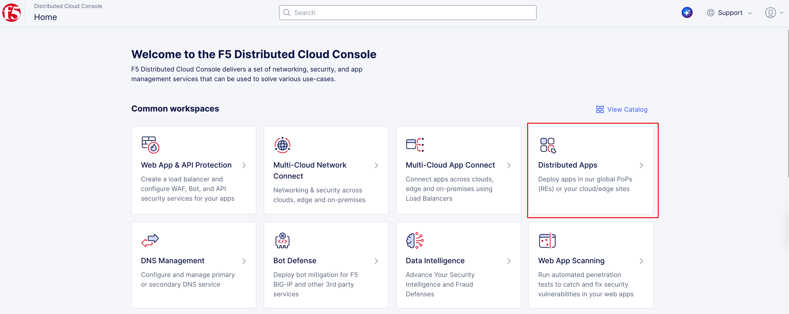
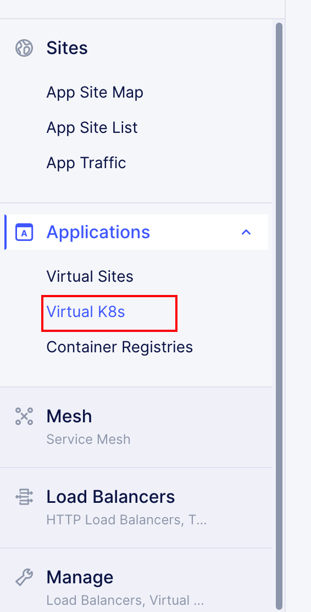
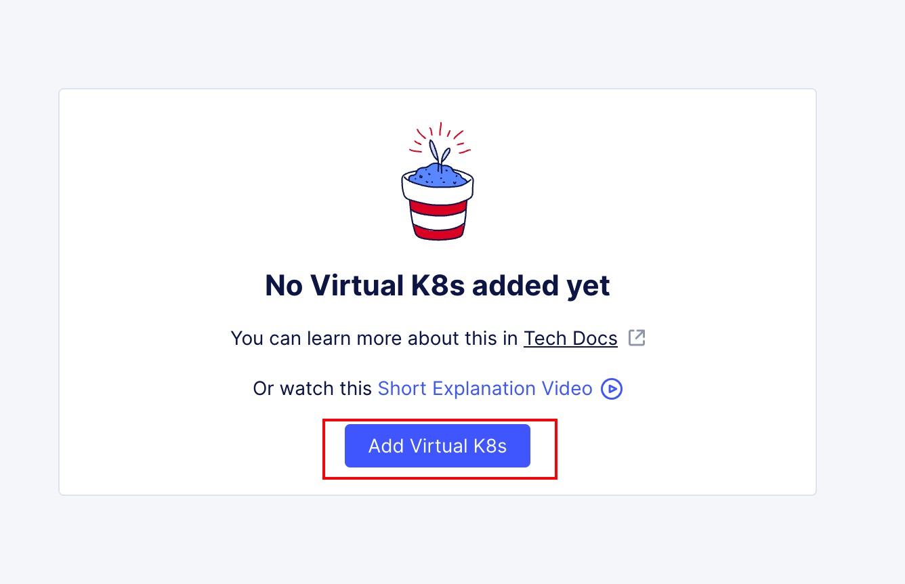
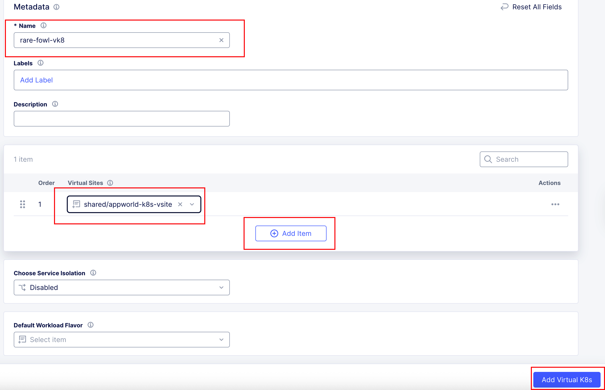
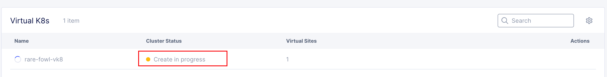
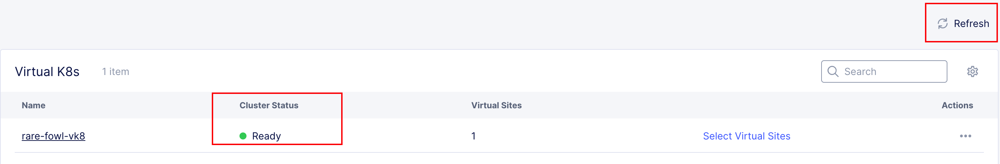
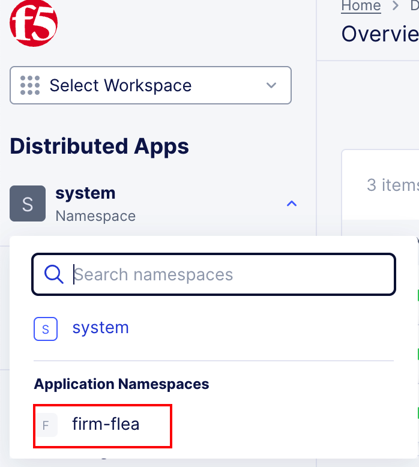

Task 2 – Accessing F5 Distributed Cloud
========================================

In this task, you will access the F5 Distributed Cloud (F5XC) tenant assigned to you for the lab, identify your unique namespace, and generate the API certificate required for automation later in the lab.

This task is about **identity, isolation, and access**—everything that follows in the lab depends on these foundations being correct.

Accessing F5 Distributed Cloud
~~~~~~~~~~~~~~~~~~~~~~~~~~~~~~

1. Accept the F5 Distributed Cloud invitation email.

   After the **Client System** transitions to a **green arrow** (running) state, you will receive an email invitation similar to the one shown below.  
   Click **Accept Invitation** to begin onboarding.

   |f5xc-email-invitation|

   .. note::
      You can also access the tenant directly at: `https://f5-xc-lab-app.console.ves.volterra.io/ <https://f5-xc-lab-app.console.ves.volterra.io/>`_

2. Authenticate using Single Sign-On (SSO).

   When prompted, click **Sign on with Okta**.  
   SSO authentication will complete automatically and onboarding will continue.

3. Accept the Terms of Service and Privacy Policy.

   Review the Terms of Service and Privacy Policy, check the box, and click **Accept and Agree**.

   |f5xc-terms|

4. Complete the initial console login.

   Once authentication is complete, you will be logged into the F5 Distributed Cloud Console.

5. Select your user preferences.

   Choose the following options when prompted:

   - **Role:** Super User
   - **Experience Level:** Advanced

   |f5xc-superuser|
   |f5xc-user-level|

   .. note::
      *Guidance tooltips or welcome notices may appear. These can be safely dismissed.*

Assigned Namespace
~~~~~~~~~~~~~~~~~~

Namespaces are used in F5 Distributed Cloud to isolate applications, configurations, and access.  
Each lab attendee has been assigned a **unique namespace** that will be used throughout the lab.

1. Locate your assigned namespace.

   - Click the account icon in the top-left corner.
   - Select **Account Settings**.

   |f5xc-console-account-settings|

2. View your namespaces.

   - In the left-hand menu, select **My Namespaces** under **Personal Management**.

   |f5xc-console-account-settings-namespaces|

3. Identify your assigned namespace.

   Under **My Namespaces**, you should see:

   - ``system``
   - Your assigned namespace

   |f5xc-console-account-settings-namespaces-2|

   .. note::
      *Your assigned namespace follows an adjective-animal format (for example:*
      *ready-skink).*

   *What to notice:*

   - You only deploy applications into your assigned namespace.
   - Namespaces prevent collisions between lab attendees.
   - Namespaces were pre-created before the lab.
   - CI/CD pipelines reference your namespace dynamically.

4. Save your assigned namespace on a notepad.

   You will need this value in multiple upcoming tasks, including CI/CD and Terraform-driven deployments.

Generate F5XC API Certificate
~~~~~~~~~~~~~~~~~~~~~~~~~~~~~

To allow GitLab and Terraform to interact with F5 Distributed Cloud programmatically, you must generate an **API certificate**.

1. In the same **Account Settings** page navigate to API credential settings.

   ::

      Account Settings → Credentials → Add Credentials

   |f5xc-console-account-settings-credentials|

2. Click "Add Credentials" and create a new one with the following settings.

   Fill in the following fields:

   - **Credential Name:** ``<namespace>-api-cert``
      *(Example: ready-skink-api-cert)*
    - **Credential Type:** API Certificate
    - **Password:** ``@ppW0rld2026!``
    - **Expiry Date:** 2 days

    .. note::
       *Do NOT change the password.*  
       *The GitLab server is preconfigured to expect this exact password.*

    |f5xc-console-account-settings-credentials-cert-1|

3. Download the API certificate.

    Click **Download**.  
    The file will be downloaded to your local system as:

    ::

       f5-xc-lab-app.console.ves.volterra.io.api-creds.p12

    .. note::
       *Do NOT rename this file*  
       *The GitLab server is preconfigured to expect this exact filename.*

   *What to notice:*

   - The file is in P12 format.
   - This certificate will be reused by automation.
   - GitLab and Terraform will use it to deploy and manage F5XC objects.

Verify the Virtual K8s Cluster
~~~~~~~~~~~~~~~~~~~~~~~~~~~~~~

In the AppWorld 2026 lab environment, the **F5 Distributed Cloud Virtual Kubernetes (vK8s)** cluster is **automatically created at lab boot time** in the student's assigned namespace.  
You do **not normally need to create it manually**.

To verify that the automation worked, follow the steps below.

1. Log in to the **F5 Distributed Cloud Console**.
2. Navigate to:

   **Distributed Apps → Applications → Virtual K8s**

3. In the list of Virtual K8s clusters, you should see:

   **<YOUR NAMESPACE>-vk8**

4. Verify that the **Status** shows **Ready (green)**.

If the cluster appears and the status is **Ready**, no further action is required and you are ready to proceed to the next task.

|f5xc-console-distro-app|

|f5xc-console-distro-app-vk8-1|

Manual vk8Creation (Only if Automation Failed)
~~~~~~~~~~~~~~~~~~~~~~~~~~~~~~~~~~~~~~~~~~~~~~~~~~

If the Virtual K8s cluster **does not appear** in your namespace, you can create it manually using the following procedure.

F5 Distributed Cloud Virtual Kubernetes (vK8s) is a managed Kubernetes abstraction that allows you to deploy containerized applications without operating or maintaining a traditional Kubernetes cluster.  
You do not manage nodes, control planes, or scaling—instead, F5 handles the infrastructure while you deploy workloads into a logical namespace.

In the AppWorld 2026 lab, **vK8s is where the AI-generated application will run after the GitLab CI/CD pipeline builds and pushes the container image.**

1. From the F5XC home page, click the **Distributed Applications** tile.

   |f5xc-console-distro-app|

2. Under **Applications**, click **Virtual K8s**, then click **Add Virtual K8s**.

   |f5xc-console-distro-app-vk8-2|

   .. note::
      If you do not see the **Applications** section, you are likely not in the correct namespace.  
      Change to your namespace under **Application Namespaces** in **Distributed Apps**.

   |f5xc-console-distro-app-vk8-6|

3. Fill in the form with the following values and click **Add Virtual K8s**.

   - **Name:** <YOUR NAMESPACE>-vk8
   - **Site:** Click **Add Item** and select the virtual site **shared/appworld-k8s-vsite**

   |f5xc-console-distro-app-vk8-3|

4. The Virtual K8s cluster will be created in a few moments.

   Click **Refresh** after a minute or two.  
   The **Status** should change to **Running**.

   |f5xc-console-distro-app-vk8-4|

   |f5xc-console-distro-app-vk8-5|

Wrap-Up
~~~~~~~

At this point, you have:

- Accessed the F5 Distributed Cloud tenant
- Identified your unique namespace
- Generated the API certificate required for automation

These steps establish identity, isolation, and trust—the foundation for everything that follows.

Next, you will configure GitLab and begin deploying applications and security controls using CI/CD.

.. |f5xc-email-invitation| image:: ../images/module0/f5xc-email-invitation.png
   :width: 800px
.. |f5xc-terms| image:: ../images/module0/f5xc-terms.png
   :width: 800px
.. |f5xc-superuser| image:: ../images/module0/f5xc-superuser.png
   :width: 800px
.. |f5xc-user-level| image:: ../images/module0/f5xc-user-level.png
   :width: 800px
.. |f5xc-console-account-settings| image:: ../images/module0/f5xc-console-account-settings.png
   :width: 800px
.. |f5xc-console-account-settings-namespaces| image:: ../images/module0/f5xc-console-account-settings-namespaces.png
   :width: 800px
.. |f5xc-console-account-settings-namespaces-2| image:: ../images/module0/f5xc-console-account-settings-namespaces-2.png
   :width: 800px
.. |f5xc-console-account-settings-credentials| image:: ../images/module0/f5xc-console-account-settings-credentials.png
   :width: 800px
.. |f5xc-console-account-settings-credentials-cert-1| image:: ../images/module0/f5xc-console-account-settings-credentials-cert-1.png
   :width: 400px

