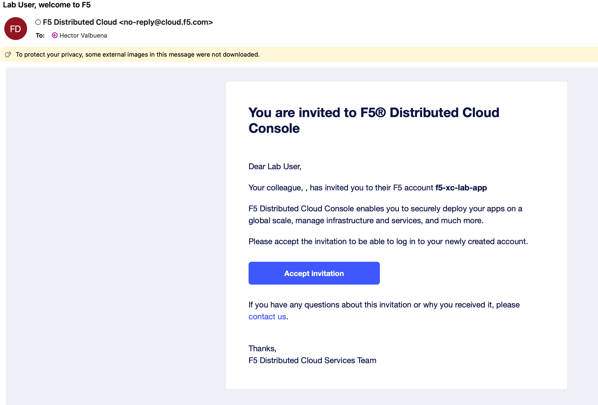
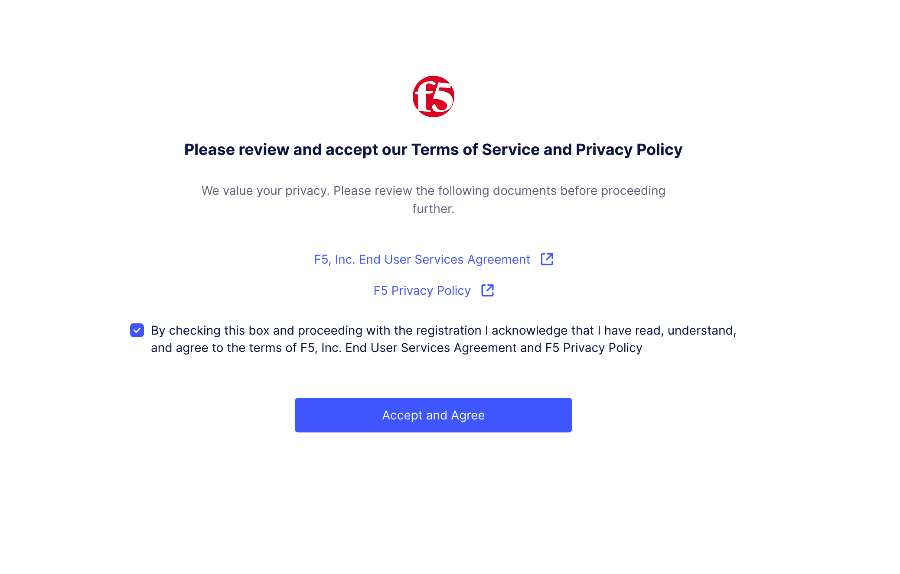
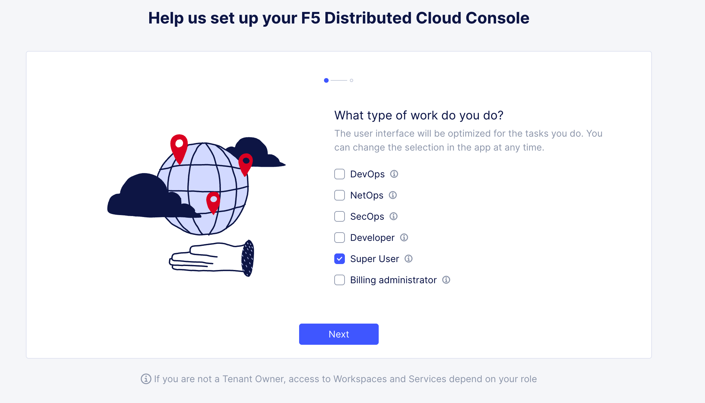
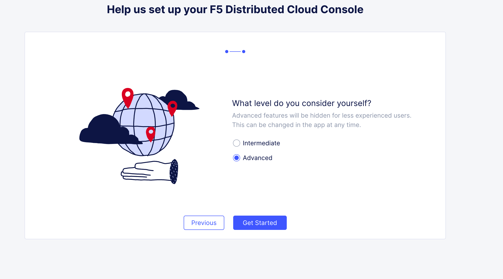
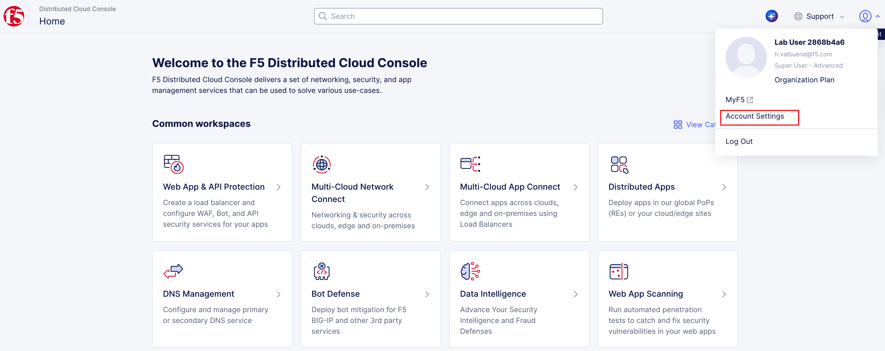
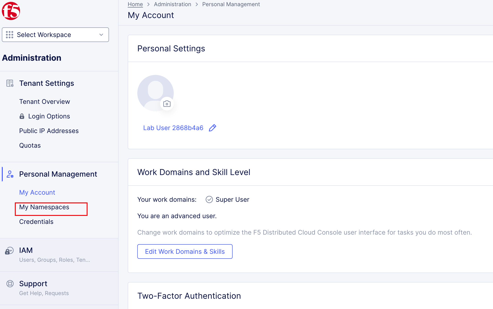
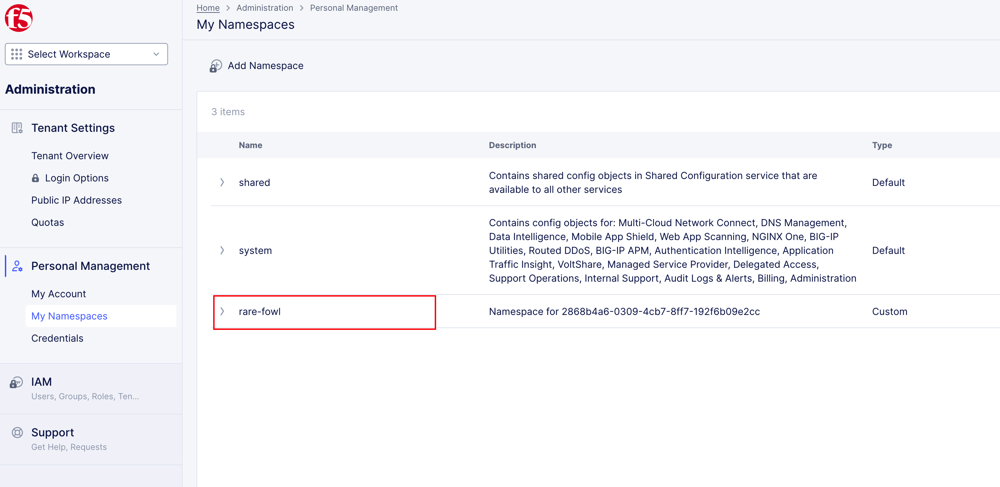
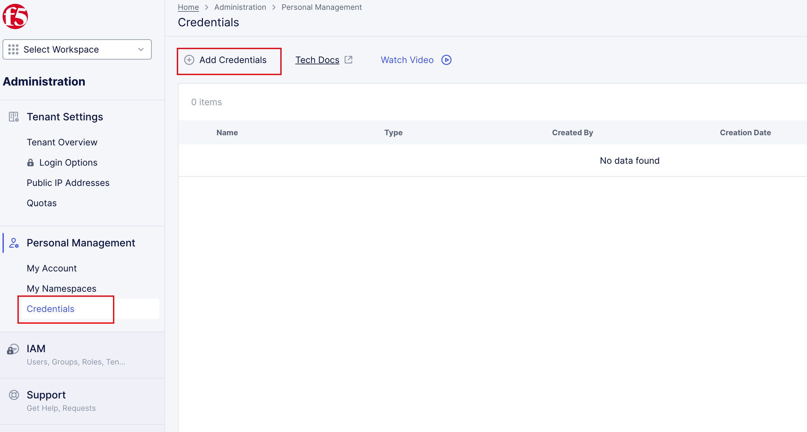
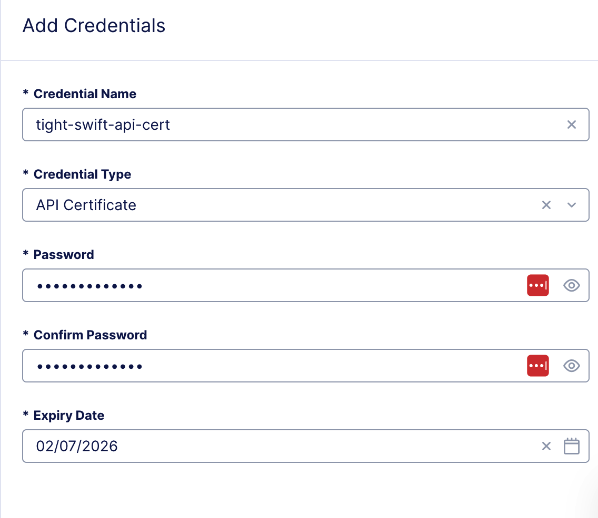

Task 2 – Accessing F5 Distributed Cloud
======================================

In this task, you will access the F5 Distributed Cloud (F5XC) tenant assigned to you for the lab, identify your unique namespace, and generate the API certificate required for automation later in the lab.

This task is about **identity, isolation, and access**—everything that follows in the lab depends on these foundations being correct.

Accessing F5 Distributed Cloud
~~~~~~~~~~~~~~~~~~~~~~~~~~~~~~

1. Accept the F5 Distributed Cloud invitation email.

   After the **Client System** transitions to a **green arrow** (running) state, you will receive an email invitation similar to the one shown below.  
   Click **Accept Invitation** to begin onboarding.

   |f5xc-email-invitation|

   .. note::
      *You can also access the tenant directly at:*  
      *https://f5-xc-lab-app.console.ves.volterra.io/*

   *What to notice:*
   - Each attendee receives a unique invitation.
   - This invitation links your user identity to the lab tenant.

   *What happened behind the scenes:*
   - Your user account was pre-provisioned in the F5XC tenant.
   - Access is scoped specifically for this lab environment.

2. Authenticate using Single Sign-On (SSO).

   When prompted, click **Sign on with Okta**.  
   SSO authentication will complete automatically and onboarding will continue.

   *What to notice:*
   - No local credentials are created.
   - Identity is federated and centrally managed.

   *What happened behind the scenes:*
   - Okta validates your identity.
   - F5XC maps your identity to tenant-level permissions.

3. Accept the Terms of Service and Privacy Policy.

   Review the Terms of Service and Privacy Policy, check the box, and click **Accept and Agree**.

   |f5xc-terms|

4. Complete the initial console login.

   Once authentication is complete, you will be logged into the F5 Distributed Cloud Console.

5. Select your user preferences.

   Choose the following options when prompted:
   - **Role:** Super User
   - **Experience Level:** Advanced

   |f5xc-superuser|
   |f5xc-user-level|

   .. note::
      *Guidance tooltips or welcome notices may appear. These can be safely dismissed.*

   *What to notice:*
   - The console exposes advanced features immediately.
   - You have visibility across all required objects for the lab.

   *What happened behind the scenes:*
   - Role-based access controls were applied.
   - Your account was granted permissions scoped to your namespace.

Assigned Namespace
~~~~~~~~~~~~~~~~~~

Namespaces are used in F5 Distributed Cloud to isolate applications, configurations, and access.  
Each lab attendee has been assigned a **unique namespace** that will be used throughout the lab.

6. Locate your assigned namespace.

   - Click the account icon in the top-left corner.
   - Select **Account Settings**.

   |f5xc-console-account-settings|

7. View your namespaces.

   - In the left-hand menu, select **My Namespaces** under **Personal Management**.

   |f5xc-console-account-settings-namespaces|

8. Identify your assigned namespace.

   Under **My Namespaces**, you should see:
   - ``system``
   - Your assigned namespace

   |f5xc-console-account-settings-namespaces-2|

   .. note::
      *Your assigned namespace follows an adjective-animal format (for example:*
      *ready-skink).*

   *What to notice:*
   - You only deploy applications into your assigned namespace.
   - Namespaces prevent collisions between lab attendees.

   *What happened behind the scenes:*
   - Namespaces were pre-created before the lab.
   - CI/CD pipelines reference your namespace dynamically.

9. Save your assigned namespace.

   You will need this value in multiple upcoming tasks, including CI/CD and Terraform-driven deployments.

Generate F5XC API Certificate
~~~~~~~~~~~~~~~~~~~~~~~~~~~~~

To allow GitLab and Terraform to interact with F5 Distributed Cloud programmatically, you must generate an **API certificate**.

10. Navigate to API credential settings.

    In the F5XC console, go to:

    ::

       Account Settings → Credentials → Add Credentials

    |f5xc-console-account-settings-credentials|
    |f5xc-console-account-settings-credentials-cert-1|

11. Create a new API certificate.

    Fill in the following fields:

    - **Credential Name:** ``<namespace>-api-cert``  
      *(Example: ready-skink-api-cert)*
    - **Credential Type:** API Certificate
    - **Password:** ``@ppW0rld2026!``
    - **Expiry Date:** 2 days

12. Download the API certificate.

    Click **Download**.  
    The file will be downloaded to your local system as:

    ::

       f5-xc-lab-app.console.ves.volterra.io.api-creds.p12

    .. note::
       *Do NOT rename this file and do NOT change the password.*  
       *The GitLab server is preconfigured to expect this exact filename and password.*

   *What to notice:*
   - The file is in P12 format.
   - This certificate will be reused by automation.

   *What happened behind the scenes:*
   - The certificate enables secure API authentication.
   - GitLab and Terraform will use it to deploy and manage F5XC objects.

Wrap-Up
~~~~~~~

At this point, you have:

- Accessed the F5 Distributed Cloud tenant
- Identified your unique namespace
- Generated the API certificate required for automation

These steps establish identity, isolation, and trust—the foundation for everything that follows.

Next, you will configure GitLab and begin deploying applications and security controls using CI/CD.

