Task 3 – Configure GitLab Server
=================================

In this task, you will access the GitLab Server, verify connectivity, configure required CI/CD variables, and upload the F5XC API certificate used by automation later in the lab.

This task connects **identity**, **secrets**, and **automation**—all prerequisites for a successful CI/CD-driven deployment.

GitLab Server Access
~~~~~~~~~~~~~~~~~~~~

1. Access the GitLab Server from the Jump Host.

   In your UDF deployment, locate the **Jump Host** tile and click **Access**.

   |code-server-access-1|

2. Launch the Firefox browser.

   Click **FIREFOX** to open a browser session inside the lab environment.

   |firefox-access|

3. Open GitLab using the browser bookmark.

   A new browser tab will open with the Firefox landing page.  
   Click the **GitLab** bookmark to access the GitLab server.

   |firefox-landing|

4. Log in to GitLab.

   When the GitLab login page appears, enter the following credentials:

   - **Username:** student
   - **Password:** @ppW0rld2026!

   |gitlab-landing|

5. Confirm access to the GitLab home page.

   After logging in, you should see the GitLab home page.

   |gitlab-home-page|

   *What to notice:*
   - You are logged in as a pre-created lab user.
   - The GitLab UI is fully accessible.
   - The GitLab server was preconfigured with users, projects, and runners.

Configure GitLab Project Variables
----------------------------------

CI/CD variables are how GitLab securely passes secrets and environment-specific values into pipelines.

1. Open the Module 2 project.

   - Click **Projects** in the left navigation menu.
   - Select **appworld2026 / module2-app** from the project list.

2. Navigate to CI/CD variables.

   - Hover over **Settings** in the left navigation menu.
   - Click **CI/CD**.
   - Expand the **Variables** section.
   - Scroll down to view both **Project** and **Group** variables.

   |gitlab-project-variables|

   .. note::
      *The variables **VES_P12_PASSWORD** and **F5XC_NAMESPACE** are critical for the pipeline.*
      *VES_P12_PASSWORD is preconfigured with the password used when generating the F5XC API certificate.*
      *If you used a different password, you must update this variable.*
      *F5XC_NAMESPACE is not preconfigured and must be set manually.*

3. Set the F5XC namespace variable.

   - Click the **Edit** (pencil) icon next to **F5XC_NAMESPACE**.
   - Enter your assigned F5 Distributed Cloud namespace.
   - Click **Save changes**.
   - Close the variable edit view.

   |gitlab-project-variables-namespace|

4. Return to the project main page.

   Click the project name **module2-app** in the left navigation menu.

Upload F5XC P12 API Certificate
--------------------------------

The CI/CD pipeline uses an API certificate to authenticate to F5 Distributed Cloud.  
This certificate must be uploaded to the GitLab server.

10. Access the Filebrowser service.

    In your UDF deployment, locate the **GitLab Server** tile and click **Access**.

11. Open **FILEBROWSER**.

    On the Filebrowser login page, enter the following credentials:

    - **Username:** student
    - **Password:** @ppW0rld2026!

    |filebrowser-login|

12. Open the upload interface.

    After logging in, you should see the Filebrowser landing page.  
    Click the **Upload** button in the top-right corner.

   .. note::
      The filename MUST be "f5-xc-lab-app.console.ves.volterra.io.api-creds.p12". 
      If you have an old file with the same name, please delete the old file and rename the new one. 
      The pipeline expects the filename to be "f5-xc-lab-app.console.ves.volterra.io.api-creds.p12" 

    |filebrowser-landing|

13. Upload the F5XC API certificate.

    - Click **Select Files**.
    - Navigate to your **Downloads** folder.
    - Select the file:

      ::

         f5-xc-lab-app.console.ves.volterra.io.api-creds.p12

    - Click **Upload** to complete the upload.

    |filebrowser-upload|

14. Confirm the upload and log out.

    After the upload completes, verify that the file appears in the Filebrowser list.  
    Click **Logout** in the top-right corner to exit Filebrowser.

    |filebrowser-file-logout|

   *What to notice:*
   - The certificate file is stored on the GitLab server.
   - The filename and password must match pipeline expectations.

Wrap-Up
~~~~~~~

At this point, you have:

- Verified access to the GitLab server
- Configured required CI/CD variables
- Uploaded the F5 Distributed Cloud API certificate

GitLab is now fully prepared to drive automated builds, deployments, and security configuration in the next modules.

Next, you will begin committing code and observing how CI/CD enforces security controls.

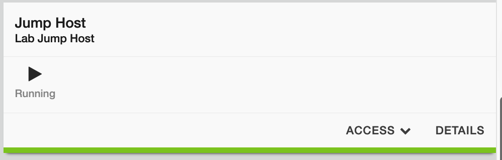
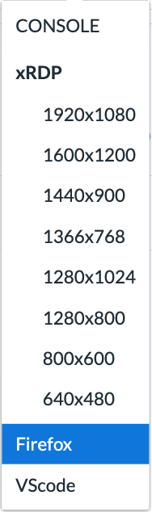
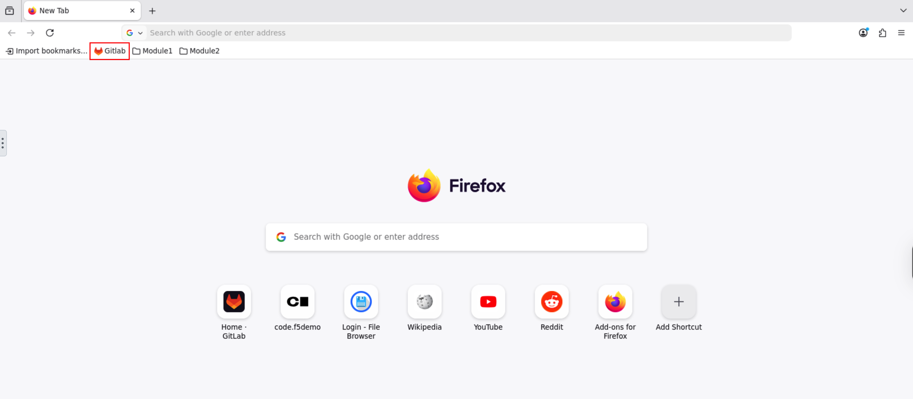
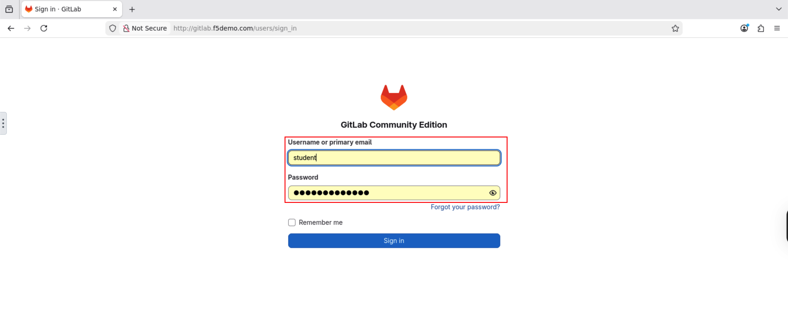
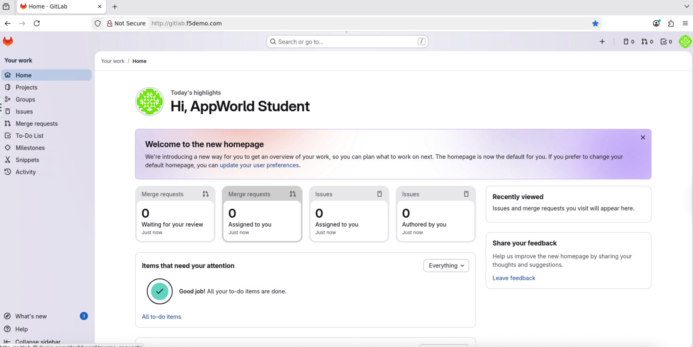
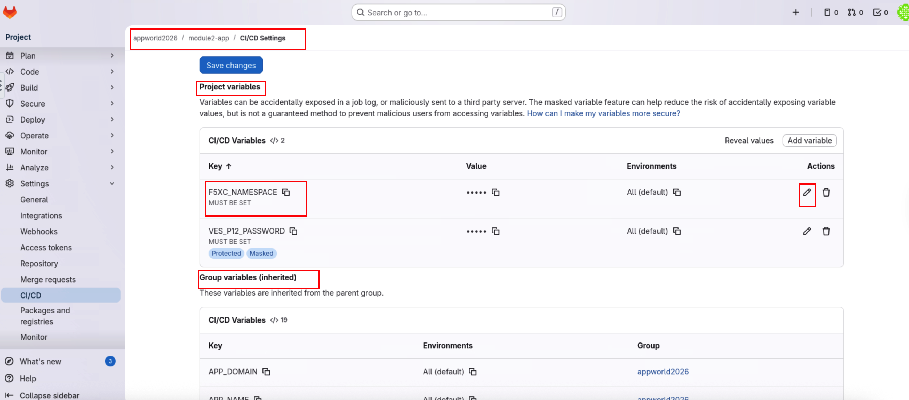
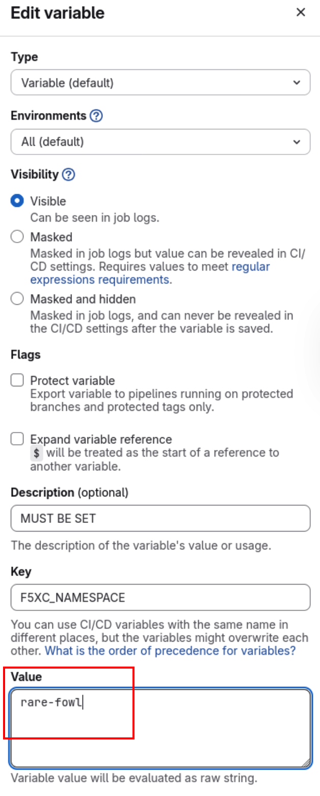
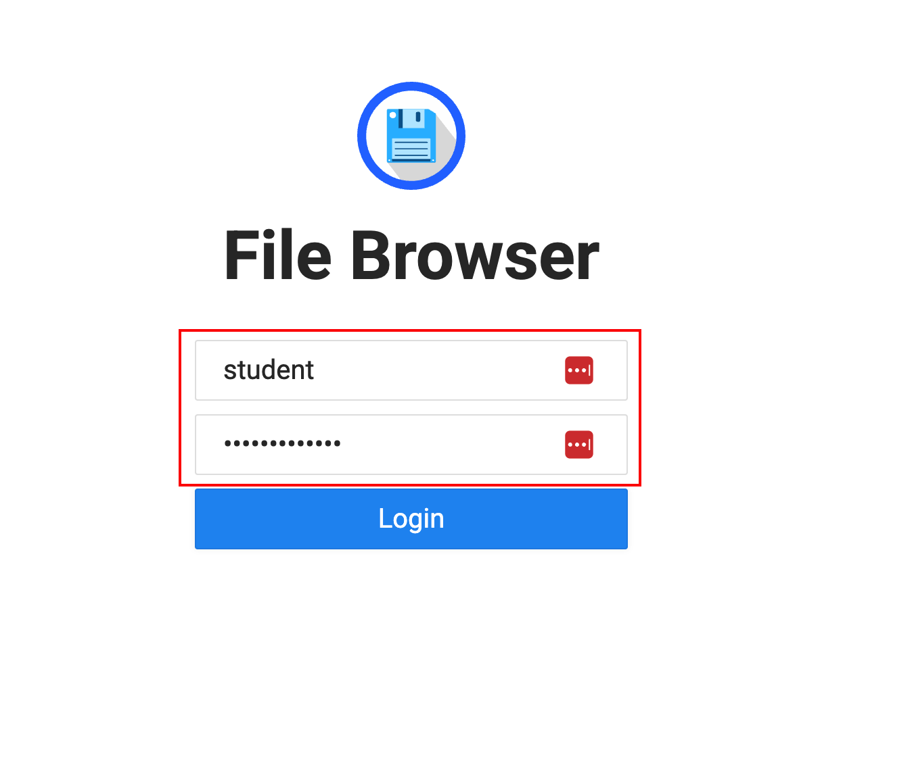
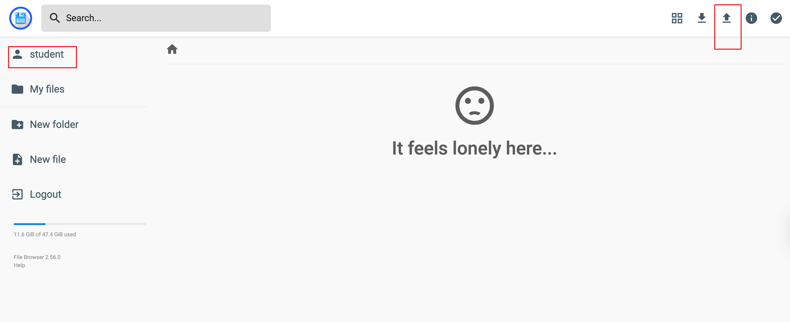
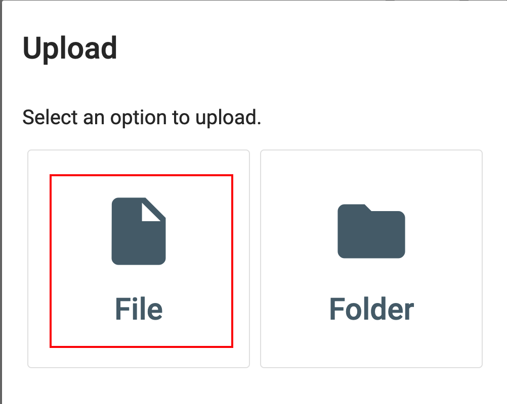
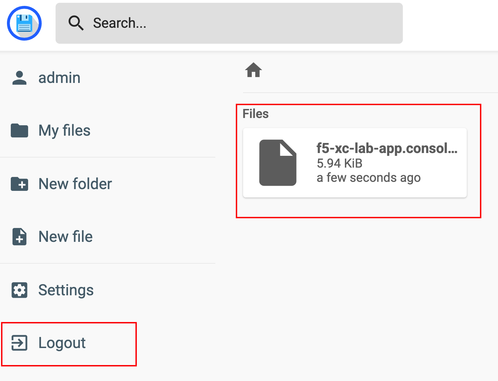