Task 4 – Configure VS Code Server
==================================

In this task, you will access the browser-based VS Code Server and configure the **Cline extension** to use Gemini.  
This step prepares your development environment for AI-assisted coding used throughout the rest of the lab.

The goal here is simple: **make sure your coding environment works before you start coding**.

Visual Studio Code Server Access
~~~~~~~~~~~~~~~~~~~~~~~~~~~~~~~~

1. Access the VS Code Server from the Jump Host.

   In your UDF deployment, locate the **Jump Host** tile and click **Access**.

   |code-server-access-1|

2. Launch the VS Code Server.

   Click **VSCODE** to open the VS Code Server interface.

   |code-server-access|

3. Authenticate to VS Code Server.

   A new browser tab will open with the VS Code Server password prompt.  
   Enter the following password:

   - **Password:** @ppW0rld2026!

   |code-server-access-password|

4. Confirm access to the VS Code Server workspace.

   After authentication, you should see the VS Code Server landing page.

   - The **Explorer** (left panel) should show the workspace **MODULE1-SANDBOX**
   - The **Copilot / chat panel** may be open on the right—this can be safely closed

   |code-server-landing|

   .. note::
      *You may see browser pop-ups requesting permission to access text or images on the clipboard.*  
      *Click **Allow**—this is required for copy/paste and image-based prompts.*

   |chrome-pop-ups|

VS Code Quick Orientation (For Beginners) - OPTIONAL
~~~~~~~~~~~~~~~~~~~~~~~~~~~~~~~~~~~~~~~~~~~~~~~~~~~~~

If you are new to VS Code, here is a quick tour of the interface you’re looking at. If you are 
familiar with the VS Code application you can safely skip this step.

**Left Panel – Activity Bar & Explorer**
   - The vertical icon bar on the far left is the **Activity Bar**.
   - The top icon (two files) opens the **Explorer**, where you see folders and files.
   - The branch icon opens **Source Control** (used for Git commits).
   - The Cline icon opens the **Cline AI chat**.
   - Think of this panel as your navigation center.

   |task4-vscode-left-bar| 

**Center Panel – Code Editor**
   - This is where files open.
   - You can have multiple tabs open at once.
   - This is where you review and edit code generated by Cline.

**Bottom Panel – Terminal**
   - This is where commands run (e.g., ``flask run``, ``pytest``).
   - Cline may also open and use its own terminal session.
   - You can resize this panel by dragging its top border.

Opening a New Terminal
-----------------------

To open a new terminal manually:

- Click **Terminal → New Terminal** from the top menu  
  OR  
- Use the shortcut: ``Ctrl + ` ``

You can open multiple terminals if needed.

|task4-vscode-open-terminal|

|task4-vscode-new-terminal|

Accessing Source Control
--------------------------

To commit changes to GitLab:

- Click the **Source Control** icon (branch icon) in the left Activity Bar.
- Review changed files.
- Enter a commit message.
- Click the checkmark to commit.
- Click **Sync Changes** to push to GitLab.

|task4-vscode-source-control| 

Accessing Cline
-----------------

To open Cline:

- Click the **Cline icon** in the left Activity Bar.
- Use **Plan mode** to review proposed changes.
- Use **Act mode** to allow file modifications.

|task4-vscode-cline|

*What to notice:*

- Everything happens inside the browser.
- You control when code is written.
- You control when code is committed.
- You are always in charge of what gets executed.

Configure VS Code Cline Extension
~~~~~~~~~~~~~~~~~~~~~~~~~~~~~~~~~~

The Cline extension enables AI-assisted coding using Gemini.  
In this step, you will connect Cline to the preconfigured Gemini backend.

1. Open the Cline extension.

   In VS Code, locate the **Cline** icon on the left activity bar and click it.

   |cline-icon|

2. Choose to bring your own API key.

   In the Cline extension setup screen, select **Bring my own API key**, then click **Continue**.

   |cline-config-1|

3. Configure the Gemini provider.

   In the **Configure the provider** screen, enter the following values:

   - **API Provider:** GCP Vertex AI
   - **Google Cloud Project ID:** f5-gcs-4261-sales-appworld2026
   - **Google Cloud Region:** global
   - **Model:** ``gemini-3-flash-preview``

   Click **Continue** to proceed.

   |cline-config-2|

4. Close the Cline configuration popup.

   Once configuration is complete, close the popup window.

   |cline-config-3|

   *What to notice:*

   - No API keys are pasted manually.
   - The provider and model are explicitly defined.
   - Cline is now ready to interact with Gemini.

Validate Gemini Connectivity
~~~~~~~~~~~~~~~~~~~~~~~~~~~~

1. Test the connection to Gemini.

   In the Cline chat window:

   - Make sure **Plan** mode is selected (not **Act**)
   - Enter the following prompt:

   .. code-block:: text

      Hi Gemini!! Welcome to AppWorld 2026!! We are going to have fun vibe coding !!

   |gemini-hello-prompt|

2. Verify the response from Gemini.

   If everything is configured correctly, you should receive a response similar to the one shown below.

   |gemini-hello-response|

Wrap-Up
~~~~~~~

At this point, you have:

- Accessed the VS Code Server
- Verified workspace readiness
- Configured the Cline extension
- Confirmed connectivity to Gemini
- Understood how to navigate VS Code panels and terminals

Your development environment is now fully prepared for **vibe coding**.

Next, you will begin using Cline to generate and modify application code—putting the **Code. Secure. Repeat.** workflow into action.

.. |code-server-access-1| image:: ../images/module0/code-server-access-1.png
   :width: 400px
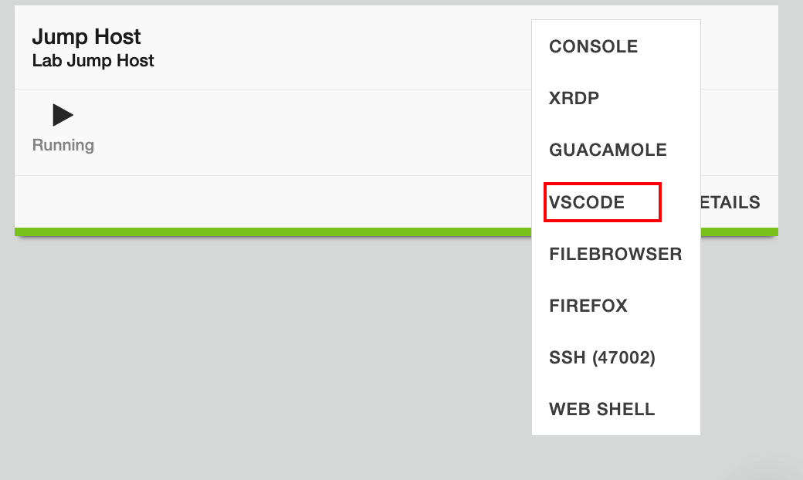
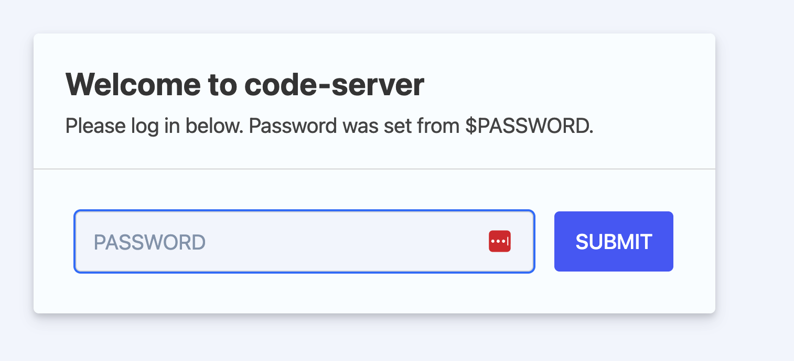
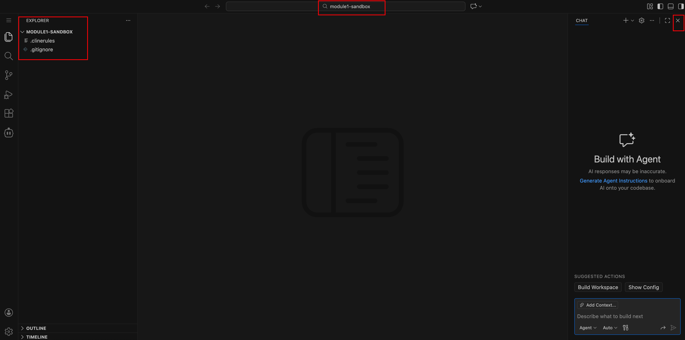
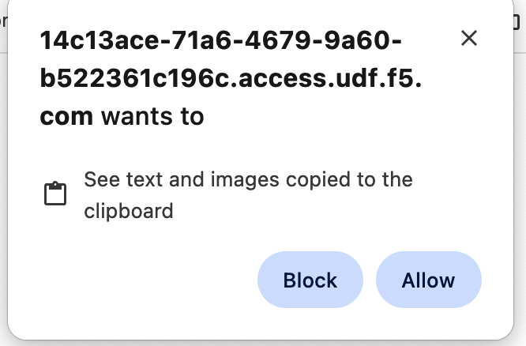
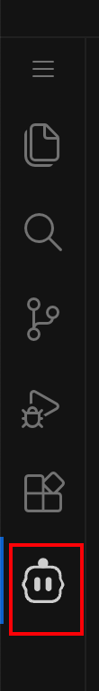
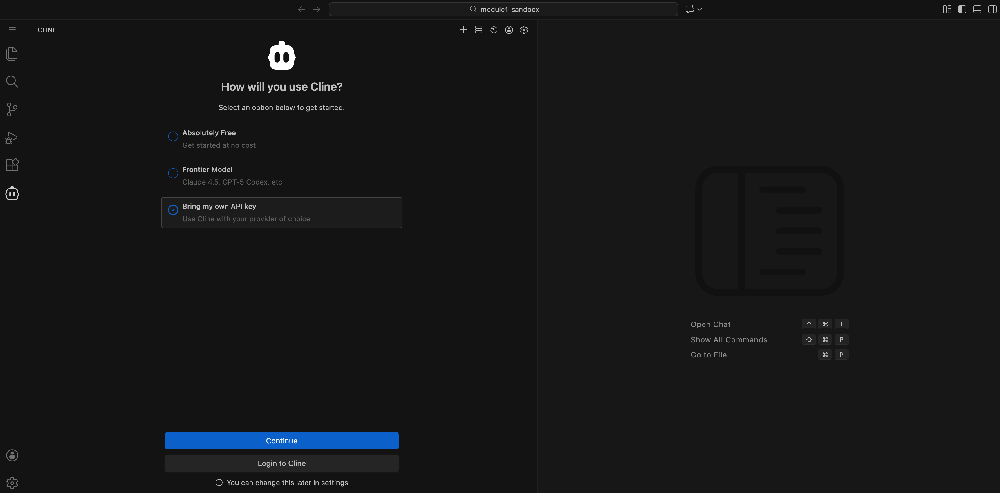
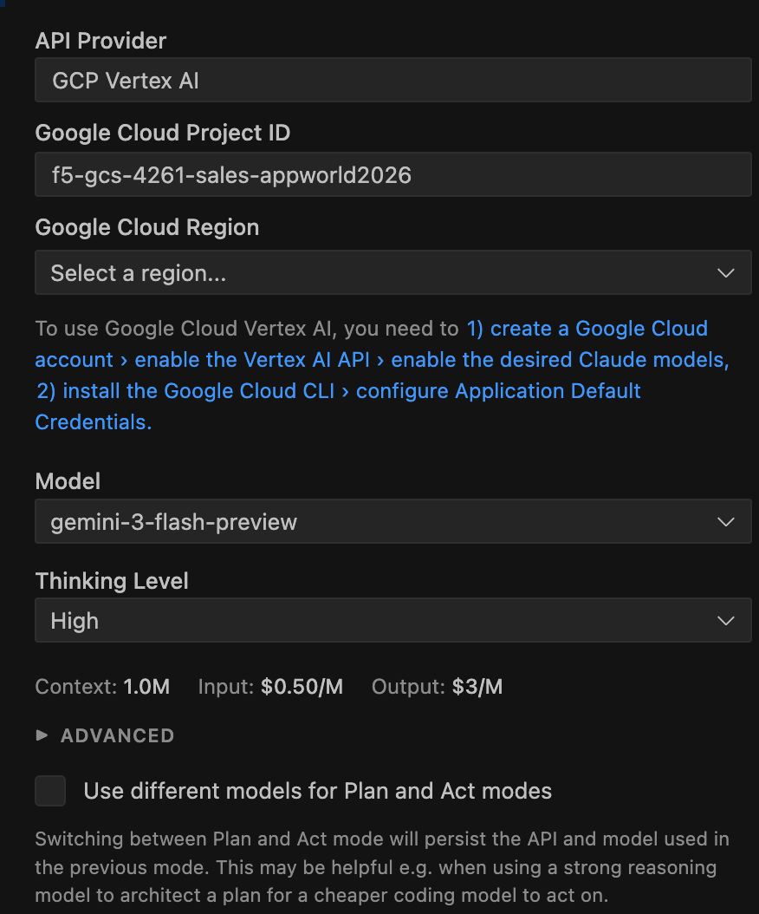
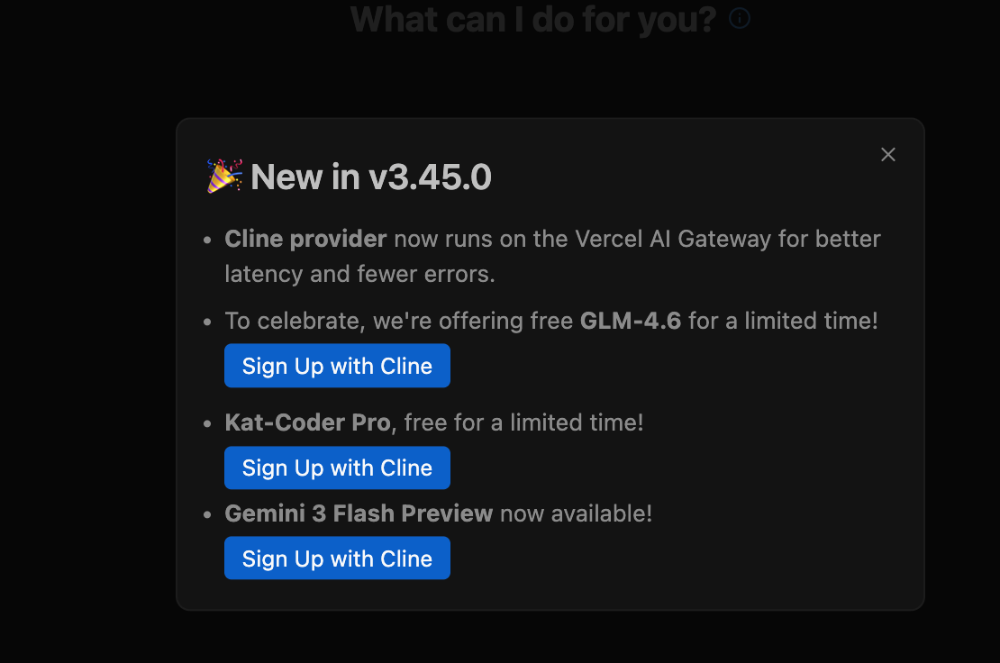
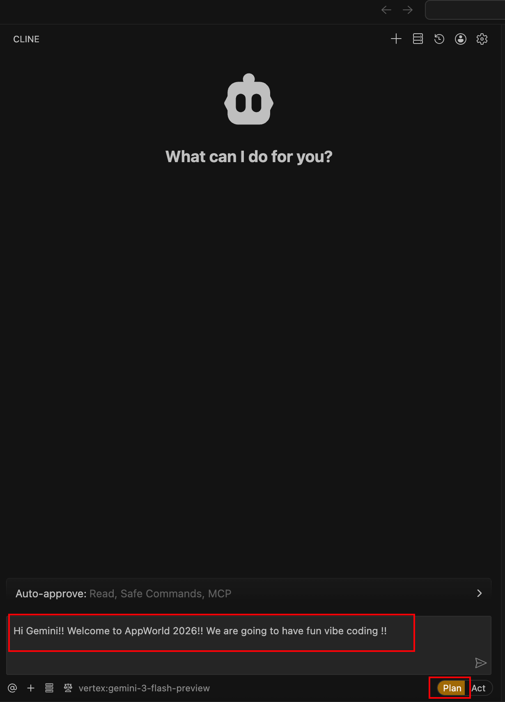
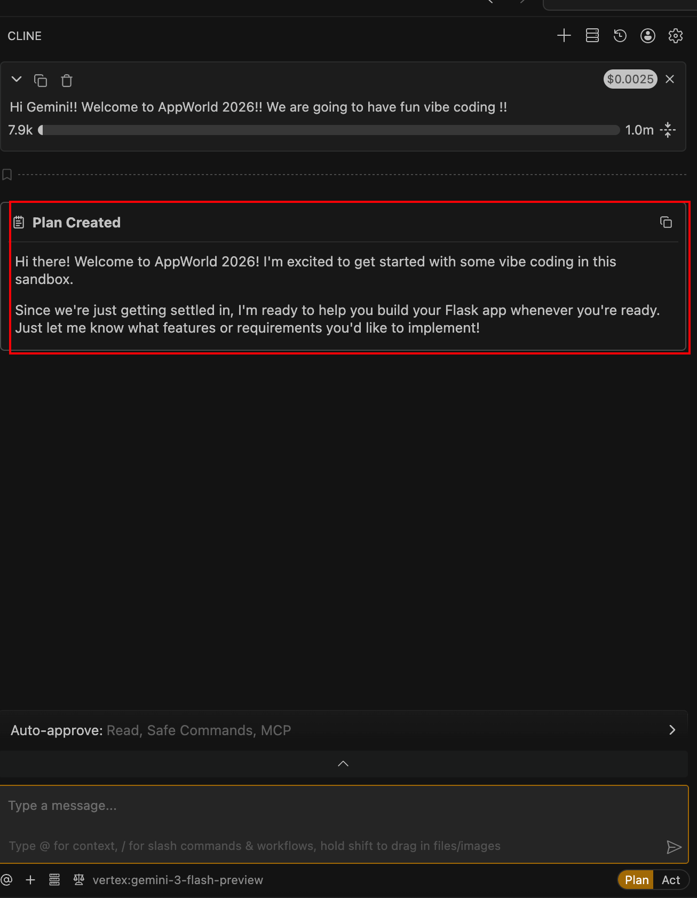
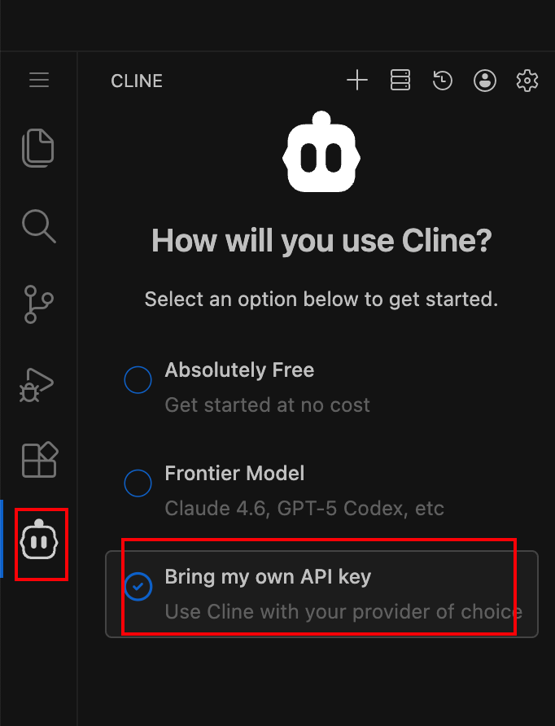
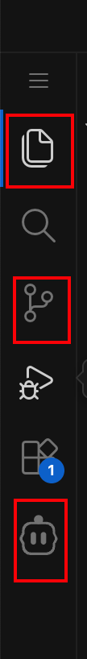
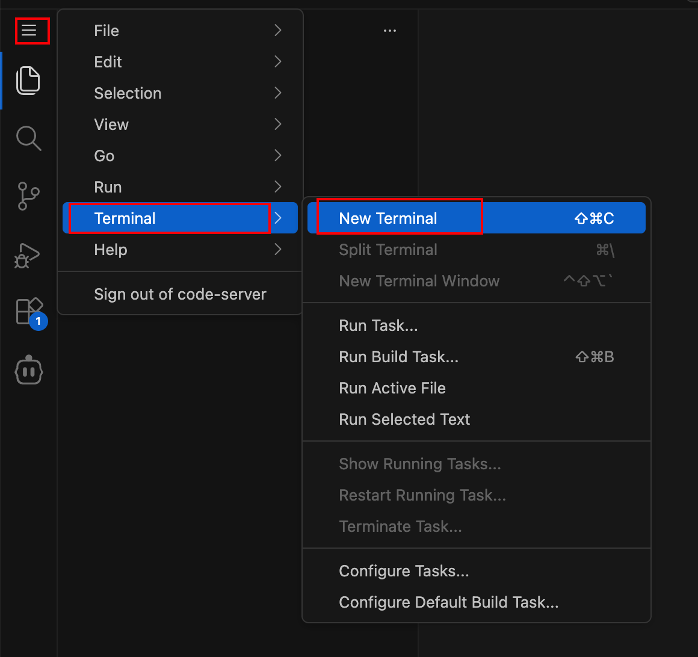
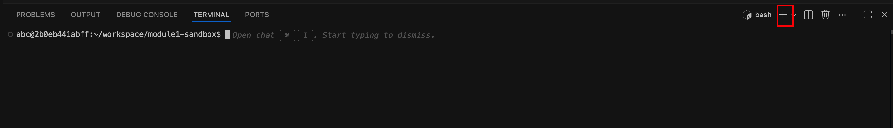
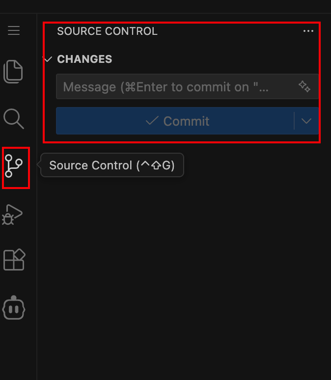