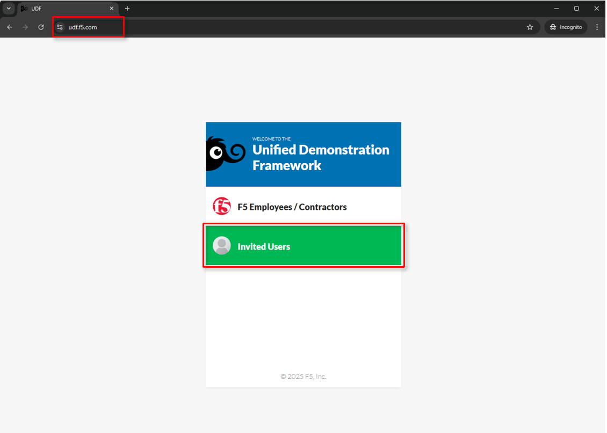
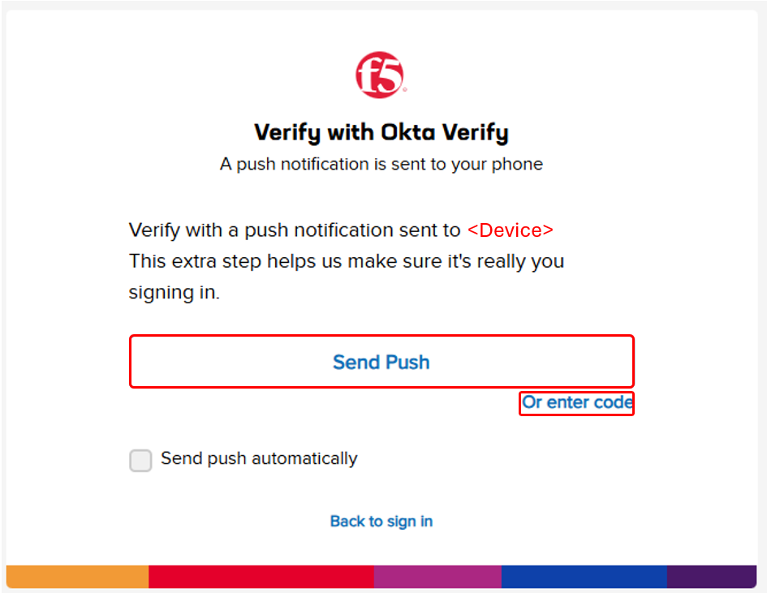
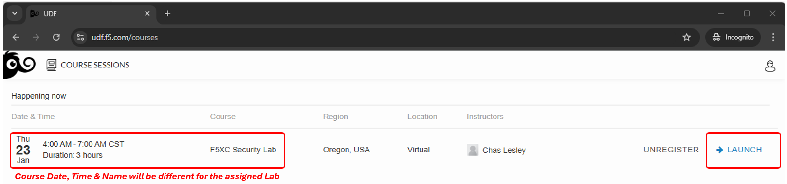

Lab 2 - Accessing F5 Distributed Cloud Console
==============================================

Welcome to this F5 Distributed Cloud Lab. The following tasks will guide you through the initial
access requirements for the associated lab environment.  Lab attendees should have received an
invitation email to the lab environment based on the submitted registration email.  Please check
email and spam folders if it has not been received.  If you have not received an email, please
contact a member of the lab team.

F5 Distributed Cloud Console, where this lab will be conducted, is a SaaS control-plane for
services that provides a UI and API for managing network, security, and compute services. The F5
Distributed Cloud Console can manage "sites" in existing on-premises data centers and sites in
AWS, Azure, and GCP cloud environments.

Course/Lab Invitation
~~~~~~~~~~~~~~~~~~~~~

 Course/Lab Attendees will receive an email similar to the graphic displayed in this section.
 The email will come from courses@notify.udf.f5.com.

 As attendees maybe registered for several lab/courses, ensure the corrcetly identified course
 is selected.  Use either the first or second link position (indicated by arrows) based on
 the attendee's F5 UDF (Unified Demo Framework) Account Status.

 #. **New UDF Users**
 #. **Returning UDF Users going directly to Course**

   |intro001|

Accessing UDF (F5 Unified Demo Framework)
~~~~~~~~~~~~~~~~~~~~~~~~~~~~~~~~~~~~~~~~~

The following will guide attendees through the initial Lab environment access within F5 UDF.
Following the instructions from the Course/Lab invitation above, attendees will be prompted
to login at  https://udf.f5.com

.. note::
   *The steps for new UDF Users or the steps for resetting UDF User account passwords are*
   *not shown. Please contact a member of the lab team if further assistance is needed.*

   |intro002|

Attendees will be prompted to enter their UDF account, password and complete MFA as shown.
MFA must be completed by either selecting **Send Push** or **Enter Code**.

.. note::
   *MFA process will very based on the MFA integration selected for the UDF Account. OKTA*
   *Verify is shown.*

   |intro003|

   |intro004|

   |intro005|

Attendees will then be presented their scheduled course sessions. Locate the course/lab with
the appropriate **Date**, **Time** and **Name** and then click **Launch**.

   |intro006|

Once redirected to the selected Course/Lab, click the **Join** button.

   |intro007|

The Lab environment window will now be displayed.  Click on the **Documentation** tab in the
horizontal navigation links.  Locate and observe the state of **Client** system.

In approximately 5-7 minutes the associated **yellow gear** starting icon will change to a
**green arrow** (running) icon and attendees will proceed to the next section of steps.

.. note::
   *Your specific lab environment may vary from the graphics shown below. The **Client***
   *will, however, be consistent.*

   |intro008|

   |intro009|

Accessing F5 Distributed Cloud
~~~~~~~~~~~~~~~~~~~~~~~~~~~~~~

Following the state change of the **Client System** to a **green arrow** (running) icon,
attendees will receive a second email.  This email will come from no-reply@cloud.f5.com.
Click the **Accept invitation** with in the email.

.. note::
   *This link should be accessed in the same browser session as UDF was accessed for*
   *seamless experience.*

.. warning::
   *Attendess should not attempt access to F5 Distributed Cloud tenant prior to receiving*
   *email. Lab permissions may need to be re-applied.*

   |intro010|

The initial logon prompt will be presented.  Click **Sign on with Okta** to proceed.  SSO
will process and onboarding to the tenant will proceed.

   |intro011|

Next the **Terms of Service and Privacy Policy** will display, check the box and then click **Accept and Agree**.

In the following screen, Select all persona roles and click **Next**. This allows attendees to see all the various configurations. Personas can be changed anytime later within the console if desired.

In the next screen, click **Advanced** to expose more menu options and then **Get Started** to begin. You can change this setting after logging in as well.

.. note::
   *Several Guidance ToolTips or Notices may appear.  Attendees can safely close these out*
   *in order to begin the lab.*

   |intro012|

   |intro013|

   |intro014|

Attendees will now be presented the Home page of the F5 Distributed Cloud Console with all the workspaces, features and services available.

   |intro015|

**Exercise 2 - Explore F5 Distributed Cloud Console**

  .. NOTE::
     For the purposes of this lab, permissions have been restricted to lab operations. Some menus will be locked and not visible.

#. You can adjust your work domains and skill level (not required) by clicking on the **Account** icon in the top right of the screen and then clicking on **Account Settings**.

   .. image:: ../images/M1-L1-account.png
      :width: 400pt

#. In the resulting window you can observe the **Work domains and skill level** section and other administrative functions.

#. Namespaces, which provide an environment for isolating configured applications or enforcing role-based
   access controls, are leveraged within the F5 Distributed Cloud Console.  For the purposes of this lab,
   each lab attendee has been provided a unique **namespace** which you will defaulted to (in terms of GUI navigation)
   for all tasks performed through the course of this lab.

#. Click on the **Select Workspace** in the left-hand navigation. In the resulting fly out navigation, click **Multi-Cloud App Connect**.

   .. image:: ../images/M1-L1-multi-cloud-dist-apps.png
      :width: 400pt

#. In the **Multi-Cloud App Connect** configuration screen observe the URL in your address bar. In the URI path, locate the **<adjective-animal>**
   namespace that you have been assigned. It will be located in the portion of the URI path
   between */namespaces/* and */sites/* as shown in this example below.

   Write down or copy off your unique namespace as it will be used throughout the lab exercises that follow.

   .. image:: ../images/M1-L1-mcac-namespace.png
      :width: 400pt

#. Click on the **Select Workspace** navigation menu, then click the **DNS Management** tile.

   .. image:: ../images/M1-L1-dns-management.png
      :width: 400pt

#. Select **DNS Zone Management** under **Manage**, and note the delegated domain name, **lab-app.f5demos.com**.

   .. image:: ../images/M1-L1-dns-zone-dlg-domn.png
      :width: 400pt

   .. NOTE::
      - Your namespace name should captured/written down as it will be referenced later in the labs
      - A namespace is a Kubernetes construct. For more Kubernetes concepts, please review `Kubernetes Documentation <https://kubernetes.io/docs/concepts/>`_
      - The delegated Domain Name should be captured/written down, as it will be leveraged later in the lab.

**Beginning of Lab:**  You are now ready to begin the lab, Enjoy! Ask questions as needed.

   |labbgn|

.. |intro001| image:: ../images/intro-01.png
   :width: 800px
   :class: no-scaled-link

.. |intro003| image:: ../images/intro-03.png
   :width: 800px
   :class: no-scaled-link

.. |intro004| image:: ../images/intro-04.png
   :width: 800px
   :class: no-scaled-link

.. |intro010| image:: ../images/intro-10.png
   :width: 800px
   :class: no-scaled-link

.. |intro012| image:: ../images/intro-12.png
   :width: 800px
   :class: no-scaled-link
.. |intro013| image:: ../images/intro-13.png
   :width: 800px
   :class: no-scaled-link
.. |intro014| image:: ../images/intro-14.png
   :width: 800px
   :class: no-scaled-link

