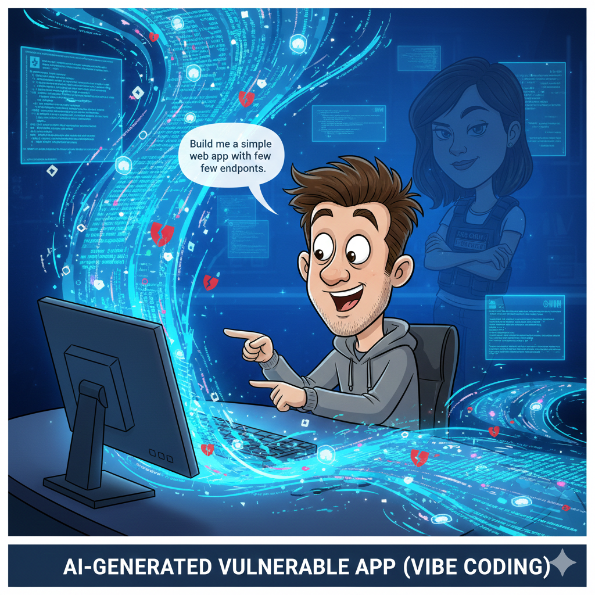

Module 1 – Vibe Coding a Simple Web App
========================================

Narrative
---------

+----------------------------------------------------------------------------------------------+
| **“AI writes code… now what?”**                                                              |
|                                                                                              |
| Alex opens VS Code, fires up an AI assistant, and says something like:                       |
|                                                                                              |
|   “Build me a simple web app with a few endpoints.”                                          |
|                                                                                              |
| And boom!!—files appear. Routes. Templates. Logic.                                           |
| In minutes, Alex has more code than they could’ve written in an hour.                        |
|                                                                                              |
| It feels magical.                                                                            |
|                                                                                              |
| Riley watches quietly.                                                                       |
|                                                                                              |
| Because Riley knows something Alex doesn’t yet:                                              |
| **AI is great at generating functionality—but terrible at judgment.**                        |
|                                                                                              |
| The app *works*.                                                                             |
| It’s also vulnerable in ways Alex didn’t intend and didn’t notice.                           |
|                                                                                              |
| |Module_1_story|                                                                             |
+----------------------------------------------------------------------------------------------+

**What this module is really about**
------------------------------------

* Experiencing the **speed boost** of AI-assisted development
* Seeing how:
    * Vulnerabilities aren’t always intentional
    * “It works” ≠ “It’s safe”
* Understanding why **vibe coding accelerates risk just as fast as features**

**Real-world parallel**
-----------------------

This is exactly what’s happening in enterprises right now:

* AI copilots increase output
* Security teams inherit the consequences
* Vulnerabilities aren’t malicious—they’re accidental

This is why **security can’t live only in code review anymore**.

Module 1 Tasks:
---------------

.. toctree::
   :maxdepth: 1
   :glob:

   task*

