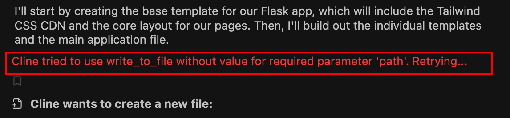

Task 1 – Understanding Vibe Coding with Cline Extension
========================================================

This task introduces **AI-assisted “Vibe Coding”**—how it works, why it’s powerful, and where it can go wrong.  
You will not write production-perfect code here. Instead, you’ll learn how AI accelerates development *and* why guardrails and review still matter.

This mindset carries through the entire lab.

Understanding VS Code, Cline, and Gemini Interaction
~~~~~~~~~~~~~~~~~~~~~~~~~~~~~~~~~~~~~~~~~~~~~~~~~~~~

Cline is the AI coding assistant inside VS Code for this lab. It connects VS Code to the **Gemini** model and helps you generate code, files, and application logic by describing *what you want*, not by writing every line yourself.

This style is commonly referred to as **vibe coding**—fast, creative, and intentionally imperfect.

How the Interaction Works
-------------------------

The basic loop looks like this:

* You write a prompt in Cline.
* Cline sends it to Gemini.
* Gemini proposes code and actions.
* Cline applies those changes directly in VS Code.
* You review, save, clean up, and move on.

New Files Being Created
-----------------------

Cline may create new files and folders automatically.

* This is expected behavior.
* Don’t freak out 🙂

Always skim new files before deleting or modifying anything.

Command Execution
-----------------

Cline may run or suggest commands (installing packages, running the app, etc.).

* Cline opens and uses **its own VS Code terminal**, identifiable by the **Cline application icon**.
* This is separate from terminals you open manually.
* You can always see exactly what command is being executed.
* Treat it like a helpful teammate typing for you—but you’re still in control.

Automated Testing with Pytest
-----------------------------

Cline may automatically run **pytest** to validate the code it generates.

* If tests fail, Cline will attempt to modify the code and re-run the tests.
* This loop can repeat multiple times until the tests pass.
* If the **same failure occurs five times**, Cline stops and exits the process.

Save File Prompts
-----------------

VS Code will frequently prompt you to save files.

* This happens often during AI-generated changes.
* Save early and save often.
* Unsaved files lead to confusion later.

Clean Up as You Go
------------------

Keep your workspace tidy as you work:

* Close files once you’re done reviewing them.
* Fewer open tabs = less confusion.
* Delete or refactor obvious duplicates early.

Cline Errors
------------

You may occasionally see error messages. In most cases, these can be safely ignored.

Cline runs in a restricted lab environment and may try actions that are not allowed. When that happens, it automatically adjusts and retries using a different approach.

This is normal behavior and partly due to the non-deterministic nature of LLMs.

|module1-task1-cline-path-error|

Wrap-Up
~~~~~~~

The key takeaway from this task:

- AI accelerates development
- AI does not replace review
- Speed increases risk without guardrails

Throughout this lab, you’ll see how **CI/CD pipelines and runtime security** compensate for the weaknesses of vibe coding—without slowing teams down.

You’re still in control.  
Cline just moves fast.

