Task 2 – Let’s Vibe Code!
========================

In this task, you will use **Cline** to generate a simple Flask application using AI-assisted “vibe coding.”  
The goal is not to build a perfect app—it’s to experience the **speed**, **workflow**, and **tradeoffs** of AI-generated code before we secure it in later modules.

Build a Simple Flask Web Application
~~~~~~~~~~~~~~~~~~~~~~~~~~~~~~~~~~~~

1. Open the Cline extension and start a new task.

   In VS Code Server, open the **Cline chat** and initiate a new task.

   |module1-cline-start-new-task|

   *What to notice:*
   - Cline opens its own chat panel inside VS Code.
   - You are still working inside your real workspace.

2. Generate the application request (Plan mode).

   Copy and paste the prompt below into the Cline chat window.

   .. note::
      *Make sure the Cline toggle under the chat window is set to **Plan** mode.*

   .. code-block:: text

      You are building a LAB-ONLY demo application for AppWorld 2026.

      Create a simple Flask web application that demonstrates basic functionality and is intentionally minimal. This app will be used later to showcase security features, so do NOT over-engineer it.

      ============================================================
      IMPORTANT LAB CONSTRAINTS
      ============================================================
      - This is a demo app ONLY.
      - Keep the app intentionally simple and readable.
      - Do NOT add authentication, databases, ORMs, or advanced logic.
      - Do NOT refactor or restructure unless explicitly instructed.
      - Use Flask (not FastAPI).
      - Use inline HTML templates (Jinja2) stored in a /templates folder.
      - Do NOT use echo, open, or shell commands to generate files.

      ============================================================
      FILE WRITE RULES
      ============================================================
      - Assume the workspace root is the current folder.
      - When creating or writing files, ALWAYS use explicit relative paths.
      - Valid paths for this task are ONLY:
      - app.py
      - templates/base.html
      - templates/index.html
      - templates/about.html
      - NEVER attempt to write a file without a resolved path value.
      - If a path is unclear, infer it from the Deliverables section below.

      ============================================================
      APP REQUIREMENTS
      ============================================================

      1. Flask Application
      - Create app.py
      - Run on host 0.0.0.0 and port 5000
      - Enable debug mode
      - Use Flask's render_template

      1. Routes
      - "/"       → Home page
      - "/about"  → About page

      1. HTML Structure
      - Use a base template with:
      - A simple header
      - Navigation links: Home | About
      - A content block
      - Other pages must extend the base template

      1. Content
      - Home page:
      - Title: "AppWorld 2026 Demo App"
      - Short description explaining this is a demo application
      - About page:
      - Explain this app is used for learning CI/CD and security concepts

      1. Styling
      - Keep CSS minimal
      - Use CDN TailwindCSS
      - Inline CSS inside the base template is acceptable
      - No external CSS frameworks

      ============================================================
      DELIVERABLES
      ============================================================
      Create ONLY the following files:

      - app.py
      - templates/base.html
      - templates/index.html
      - templates/about.html

      Do NOT create additional files or folders.

      ============================================================
      FINAL CHECK
      ============================================================
      - Ensure all files are syntactically correct
      - Ensure Flask runs without errors
      - Keep everything simple and readable

   Make Clien is on **Plan** mode and before you submit the prompt.

   |module1-cline-demo-app-plan|

3. Review the AI plan.

   Cline will respond with a **plan** describing which files it intends to create and how.

   |module1-cline-demo-app-plan-response|

   *What to notice:*
   - No files are created yet.
   - This is your chance to sanity-check the approach.

4. Generate the code (Act mode).

   Switch the Cline toggle to **Act** mode and approve the plan.

   |module1-cline-demo-app-act|

   At this point, Cline will start generating the files directly in your workspace.

   |module1-cline-demo-app-act-2|

   .. note::
      *After generating each file, Cline will prompt you to save it before continuing.*

   *What happened behind the scenes:*
   - Gemini generates code for each file.
   - Cline writes the files directly into your workspace.
   - VS Code prompts you to save changes as they occur.

5. Review the generated files.

   Inspect the created files, especially ``app.py``, which defines the ``/`` and ``/about`` routes.

   |module1-cline-demo-app-act-3-task-completed|

Run and Test the Application
~~~~~~~~~~~~~~~~~~~~~~~~~~~~

1. Run the Flask application.

   On a new terminal window within VS Code serve start the application using the command below.

   .. code-block:: bash

      python3 app/app.py

   |module1-cline-demo-app-act-3-flask-command|

2. Verify the application is running.

   Confirm that the Flask server starts successfully and listens on the specified host and port.

   |module1-cline-demo-app-terminal-4-flask-running|

3. Access the application.

   Access the application using the Firefox container running on the Jump Host.

   |module1-cline-demo-app-terminal-4-firefox|

   Click on the bookmark folder **Module 1** and then **Module 1 Demo App** link to open the home page.
 
    .. note::
       *Flask must be running for the home page to be accessible.*

   |module1-cline-demo-app-terminal-4-firefox-module1-bookmark|

4. Stop the application and clean up.

   Press ``Ctrl+C`` in the terminal to stop the Flask server. Or on another terminal, you can run the command below.

   .. code-block:: bash

      pkill -f "python3 app/app.py"

   |module1-cline-demo-app-terminal-ctrlc-close|

   Clean up any files you no longer need.

   |module1-cline-demo-app-cleanup|

Wrap-Up
~~~~~~~

You have successfully:

- Generated an application using AI-assisted vibe coding
- Reviewed and executed AI-generated code
- Run the application locally in the lab environment

At this point, the app is **fast to build** but **not secure**—and that’s intentional.

In the next modules, you’ll start adding **CI/CD guardrails** and **runtime security**, transforming this demo app into a protected workload following the **Code. Secure. Repeat.** workflow.

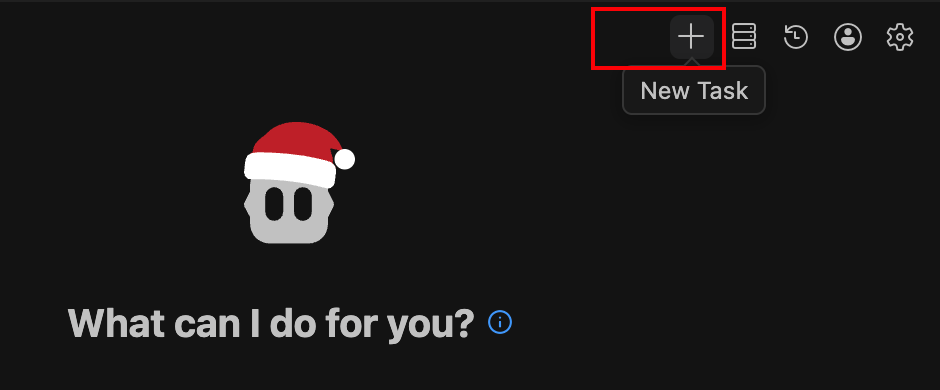
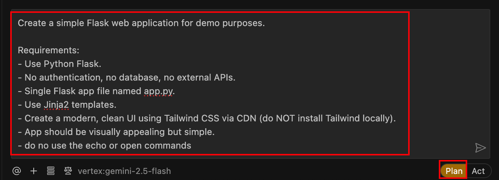
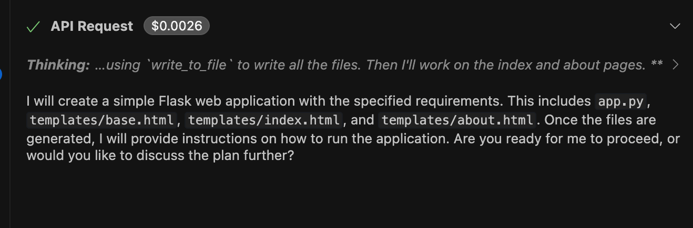
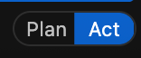
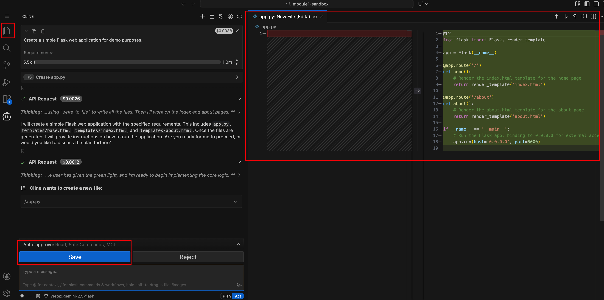
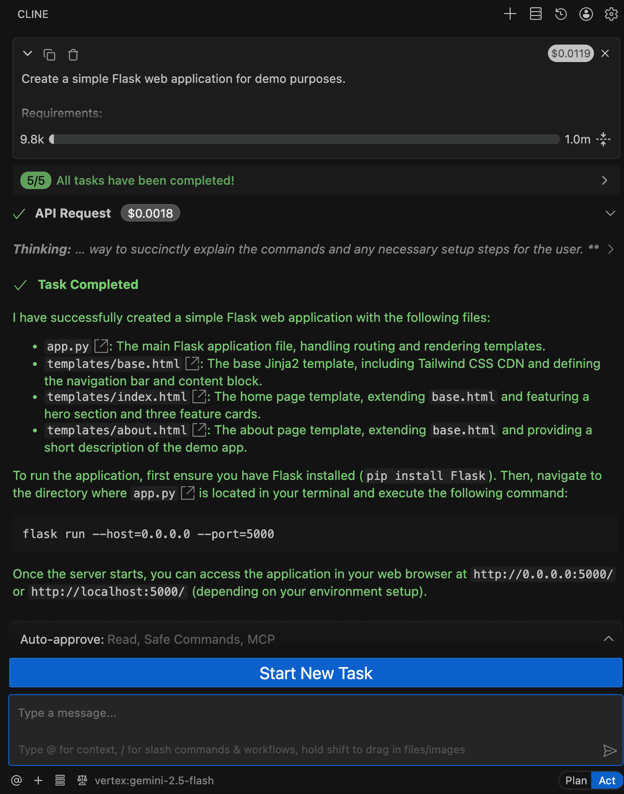
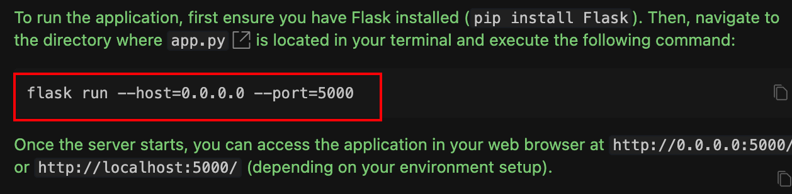
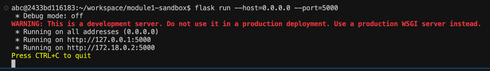
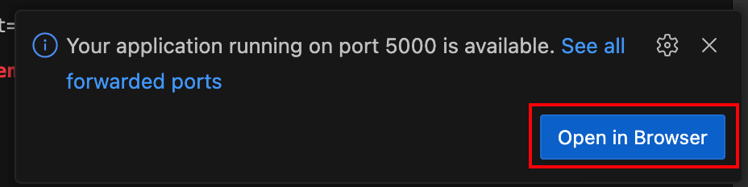
.. |module1-cline-demo-app-terminal-4-firefox| image:: ../images/module1/module1-cline-demo-app-terminal-4-firefox.png
   :width: 800px
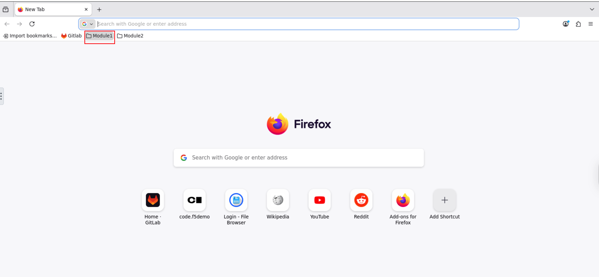
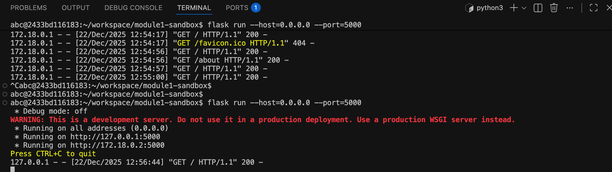
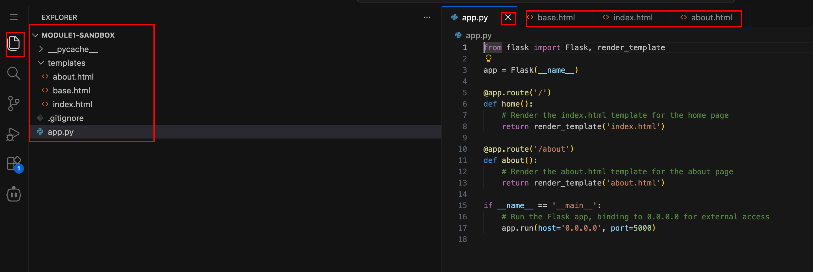
