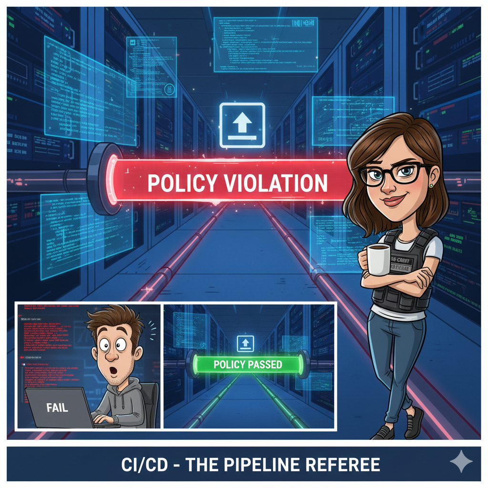

Module 2 – CI/CD + Basic Runtime Security
==================================================

Narrative
---------

+----------------------------------------------------------------------------------------------+
| **“The pipeline becomes the referee”**                                                       |
|                                                                                              |
| Alex commits the app.                                                                        |
|                                                                                              |
| Nothing fancy. Just a push.                                                                  |
|                                                                                              |
| And then… the pipeline fails.                                                                |
|                                                                                              |
| Alex didn’t break the build.                                                                 |
| Alex didn’t fail a test.                                                                     |
| Alex violated a **policy**.                                                                  |
|                                                                                              |
| Riley didn’t Slack Alex.                                                                     |
| Riley didn’t open a ticket.                                                                  |
| The **pipeline enforced security automatically**.                                            |
|                                                                                              |
| Security is no longer a meeting—it’s a condition of deployment.                              |
|                                                                                              |
| Alex flips a switch (intentionally), commits again, and this time the pipeline flows:        |
|                                                                                              |
| * Image builds                                                                               |
| * Infrastructure deploys                                                                     |
| * The app goes live—with protections                                                         |
|                                                                                              |
| |Module_2_story|                                                                             |
+----------------------------------------------------------------------------------------------+

**What this module is really about**
------------------------------------

* Security as **code**, not tribal knowledge
* Pipelines as **control points**, not just automation
* The shift from:
    * “Please enable WAF”
    * to “You can’t deploy without it”

**Real-world parallel**
-----------------------

This is how mature orgs scale security:

* Guardrails, not approvals
* Failing fast, early, and consistently
* Security decisions made *before* runtime

No heroics. Just policy.

Module 2 Tasks:
---------------

.. toctree::
   :maxdepth: 1
   :glob:

   task*

