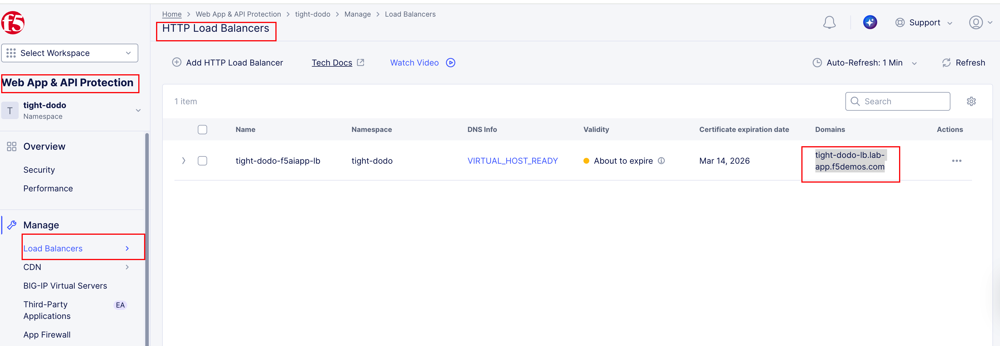
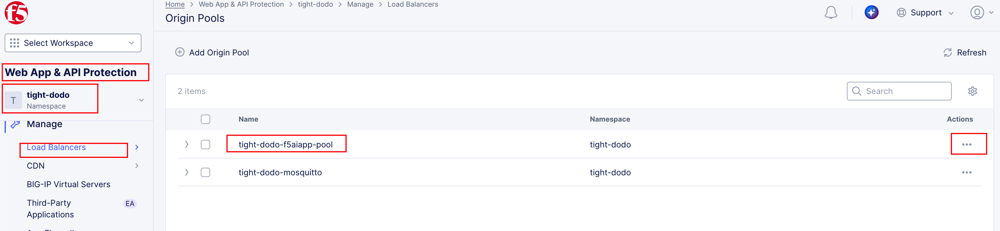
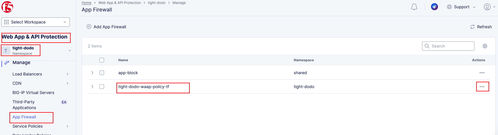
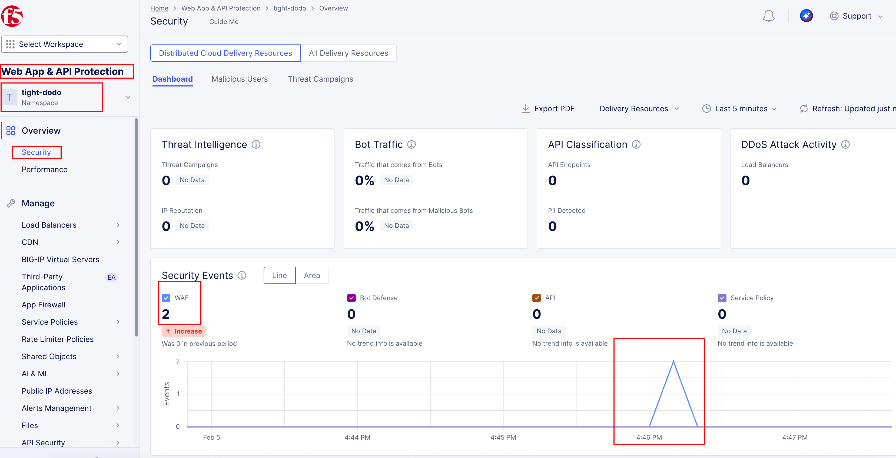
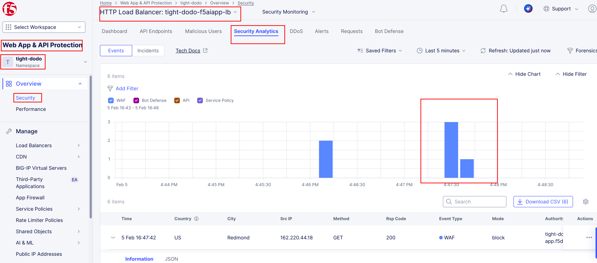
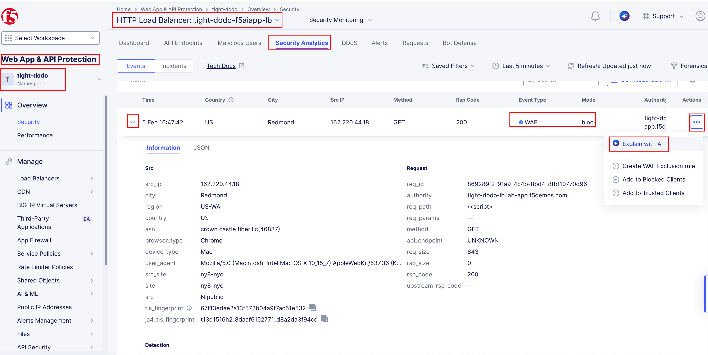
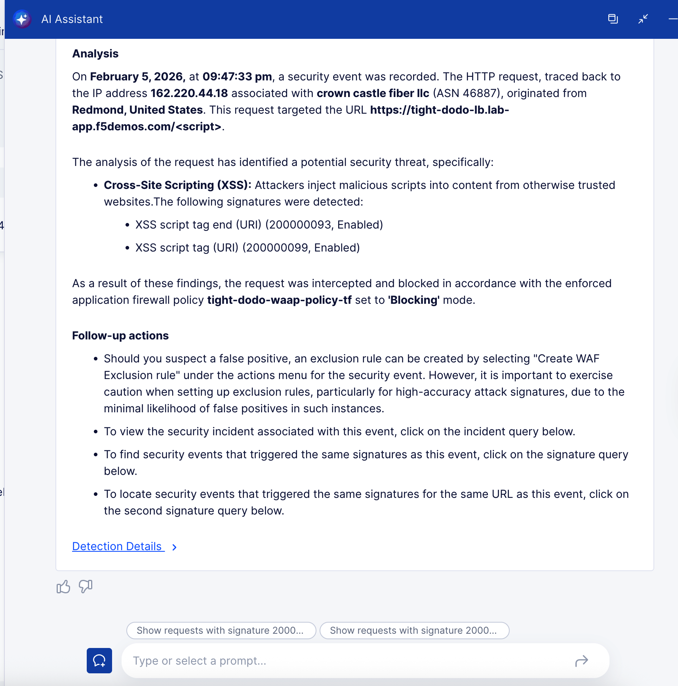
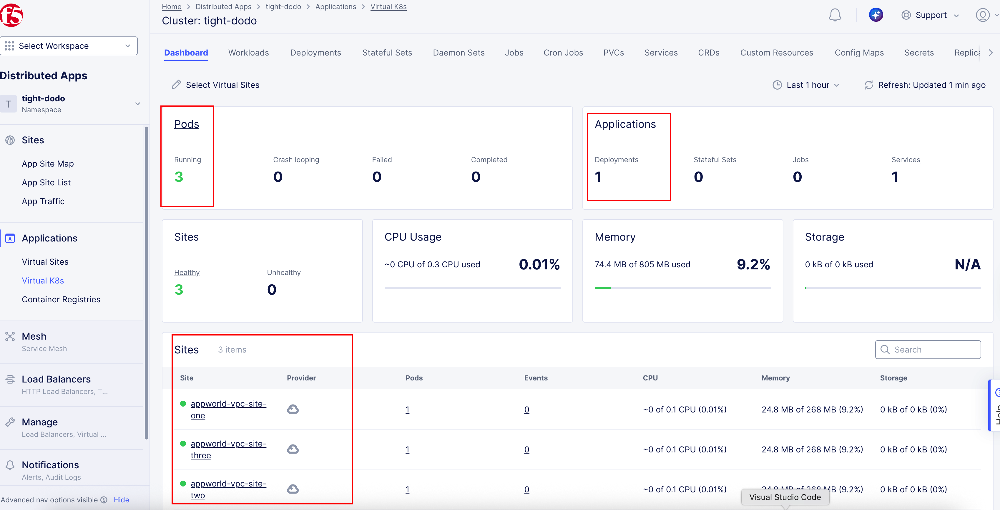

Task 2 - Explore F5 AI-generated Application & Runtime Security
===============================================================

In this task, you will explore the F5 Distributed Cloud configuration that was deployed by the CI/CD pipeline, then generate traffic and intentionally trigger security events. The goal is to **see runtime protection in action**, not to break anything.

Explore the Deployed Application
~~~~~~~~~~~~~~~~~~~~~~~~~~~~~~~~

1. Open the application URL in your browser.

   Navigate to the following URL, replacing ``<NAMESPACE>`` with your assigned namespace:

   ::

      https://<NAMESPACE>-lb.lab-app.f5demos.com

   You should see the AI-generated web application load successfully.

   *What you’re seeing:*
   
   - Your request is being processed by the F5 Distributed Cloud HTTPS Load Balancer and forwarded to your application running in vK8s.

2. Browse the application normally.

   Click around the application and load a few pages.

   *What this does:*
   
   - This generates **baseline traffic**, which helps populate logs and provides a clean reference before launching attacks.

Explore F5 Distributed Cloud Configuration
~~~~~~~~~~~~~~~~~~~~~~~~~~~~~~~~~~~~~~~~~~

3. Review the HTTPS Load Balancer configuration in F5 Distributed Cloud.

   In the F5 Distributed Cloud console, locate the HTTPS Load Balancer associated with your namespace.

   Navigate to:

   ::

     Web App & API Protection → Manage → Load Balancers → HTTP Load Balancers

   Click the "..." symbol under the Actions column to explore your load balancer configuration.

   |module2-f5xc-waap-lb-config|

   *What to notice:*

   - The public DNS name matches your application URL.
   - WAAP is attached to the load balancer.
   - Traffic is routed to an origin configured for vK8s.

4. Review the origin pool and vK8s workload.

   Navigate to the origin pool and inspect the associated vK8s workload.

   Navigate to:

   ::

      Web App & API Protection → Manage → Load Balancers → Origin Pools

   Click the "..." symbol under the Actions column to explore the origin pool configuration.

   |module2-f5xc-waap-lb-origin-config|

   Navigate to:

   ::

      Distributed Apps → Applications → Virtual K8s → "Click on your vk8" → Dashboard

   |module2-f5xc-distapp-vk8-workload.png|

   *What you’re seeing:*

   - The origin points to a Kubernetes service.
   - The workload was created automatically by the CI/CD pipeline.
   - No manual deployment was required.

5. Review the WAF policy attached to the application.

   Open the WAF configuration associated with the HTTPS Load Balancer.

   Navigate to:

   ::

      Web App & API Protection → Manage → Load Balancers → Origin Pools

   Click the "..." symbol under the Actions column to explore your WAF policy.

   |module2-f5xc-waap-lb-waf-config|

   *What to notice:*

   - Web Application Firewall (WAF) is enabled.
   - Baseline protections are active.
   - Security enforcement happens at runtime, not just during scans.

Generate Attack Traffic
~~~~~~~~~~~~~~~~~~~~~~~

6. Launch a simple injection attempt using your browser.

   Modify the application URL to include a basic script injection pattern:

   ::

      https://<NAMESPACE>-lb.lab-app.f5demos.com/

   *What’s happening:*
   
   - The request is inspected and blocked by WAAP before it can reach the application.

7. Try a few additional variations.

   Optionally, test other simple patterns such as:
   
   - Encoded script tags
   - Suspicious query parameters
   - Invalid or unexpected URL paths

   Keep the tests lightweight—this lab focuses on visibility, not exploitation.

Review Security Events
~~~~~~~~~~~~~~~~~~~~~~

8. Open the security events view in F5 Distributed Cloud.

   In the F5 Distributed Cloud console, navigate to the **Security Events** section for your application.

   Navigate to:

   ::

      Web App & API Protection → Overview → Security

   Scroll all the way down and click in your load balancer to see events specific to your application.

   |module2-f5xc-waap-security-dashboard|

   *What you should see:*

   - The security dashboard is consolidated view of security events across all load balancers in the namespace.
   - There are also stats for threat intelligence, bot traffic, and other security metrics.

9. Inspect events specific to your application.

   Under "Security Analytics", review security events related to the attack traffic you generated.

   *What to look for:*

   - The reason the request was blocked.
   - Which security control triggered the action.
   - The level of context provided for each request.
   - Explore the "Explain with AI" feature to see how AI can enhance event details.

   |module2-f5xc-waap-security-lb-sec-events.png|

   Click on "Explain with AI".

   |module2-f5xc-waap-security-lb-sec-events-details|

   |module2-f5xc-waap-security-lb-sec-events-details-ai|

Wrap-Up
~~~~~~~

At this point, you have confirmed that:

- The application is live and reachable.
- Traffic flows through the F5 Distributed Cloud Load Balancer.
- WAF actively inspects and blocks malicious requests.
- Security events are visible immediately without additional tooling.
- AI can enhance security event details for faster investigation.

In the next module, you will expand the application and enable additional security controls—continuing the **Code. Secure. Repeat.** workflow.

