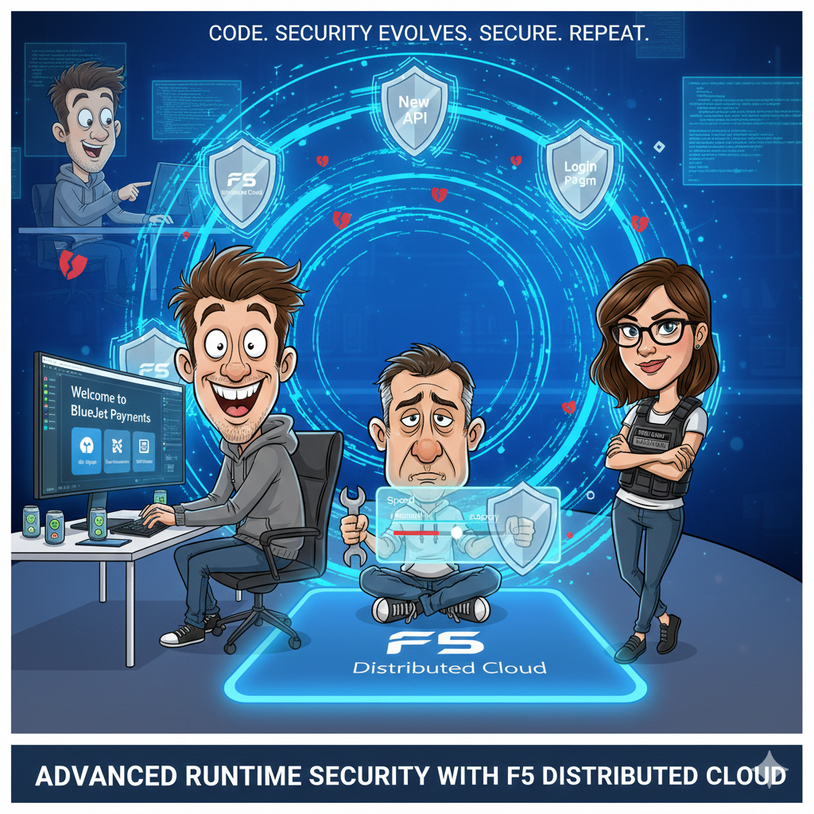

Module 3 – Deploy Advanced Runtime Security 
============================================

Narrative
---------

+----------------------------------------------------------------------------------------------+
| **“The app evolves—and security keeps up”**                                                  |
|                                                                                              |
| Alex isn’t done.                                                                             |
|                                                                                              |
| The product team wants:                                                                      |
|                                                                                              |
| * New APIs                                                                                   |
| * A login page                                                                               |
| * A contact form                                                                             |
|                                                                                              |
| Alex uses AI again.                                                                          |
| New endpoints appear. New routes. New risk.                                                  |
|                                                                                              |
| Here’s the key moment:                                                                       |
| **The pipeline already knows how to react.**                                                 |
|                                                                                              |
| When APIs appear:                                                                            |
|                                                                                              |
| * Discovery kicks in                                                                         |
| * Schemas matter                                                                             |
| * Behavior becomes observable                                                                |
|                                                                                              |
| When login pages appear:                                                                     |
|                                                                                              |
| * Bots become relevant                                                                       |
| * Automation becomes suspicious                                                              |
| * Controls adapt                                                                             |
|                                                                                              |
| |Module_3_story|                                                                             |
+----------------------------------------------------------------------------------------------+

**What this module is really about**
------------------------------------

* Runtime security that:
    * Understands APIs
    * Learns behavior
    * Detects abuse
* Security controls that are:
    * Declarative
    * Versioned
    * Repeatable

**Real-world parallel**
-----------------------

This is modern app security:

* APIs are the product
* Bots are the threat
* Runtime signals matter more than static assumptions

Security becomes *dynamic*, not brittle.

Module 3 Tasks:
---------------

.. toctree::
   :maxdepth: 1
   :glob:

   task*

