Task 1 – Enable F5XC API Discovery
===================================

In this task, you will extend the existing application by adding new API endpoints using AI-assisted coding and then enable **API Discovery** through policy-as-code.  
This demonstrates how application changes and security controls evolve *together* through CI/CD—without manual configuration in the security platform.

You’ll see how an API specification becomes a required artifact and how F5 Distributed Cloud uses it to discover and protect APIs at runtime.

Extend the Application Using Cline
~~~~~~~~~~~~~~~~~~~~~~~~~~~~~~~~~~

1. Open the Module 2 application workspace in VS Code Server.

   Make sure you are working in the ``module2-app`` folder and that your previous pipeline completed successfully.

2. Use the provided pre-canned prompt to add new API endpoints.

   Using the **Cline extension**, run the pre-canned prompt provided by the instructor to extend the application with additional API endpoints.

   .. code-block:: text

      SYSTEM / ROLE
      You are an AI software engineer using Cline with Gemini 3 Flash in the AppWorld 2026 lab.
      You MUST follow the repository guardrails defined in the .clinerules file.

      Context:
      - Module 2 (base app) is COMPLETE.
      - This task is Module 3 – API endpoints + OpenAPI ONLY.
      - Login page and HTML form will be added in a later step.

      ====================================================================
      SCOPE FOR THIS CHANGE (API ONLY)
      ====================================================================
      - Implement ONLY Module 3 API endpoints.
      - Do NOT add login, authentication, or HTML forms.
      - Do NOT refactor unrelated Module 2 code.
      - Keep changes minimal, incremental, and explainable in a lab setting.

      ====================================================================
      CI/CD FEATURE DETECTION (CRITICAL)
      ====================================================================
      - Create the file: openapi/openapi.json
      - Must be valid JSON
      - Must conform to OpenAPI 3.0.x
      - Do NOT create:
      - app/templates/login.html
      - app/templates/contact.html

      ====================================================================
      API REQUIREMENTS (STRICT)
      ====================================================================
      - Prefix ALL endpoints with /api/
      - APIs MUST return JSON responses ONLY
      - No HTML, no text/plain responses

      Implement EXACTLY these endpoints:
      1) GET /api/status
      2) GET /api/vibe-coding
      3) GET /api/ai-assisted-coding

      CONTENT RULES (MANDATORY):
      - API responses MUST source their content from:
      docs/Vibe-Coding.txt
      - Parse, summarize, or structure content from that file into JSON.
      - If a requested topic is NOT explicitly present in the file:
      - Return a short summary labeled exactly as:
         "AI-generated synthesis (no direct quote)."
      - Do NOT fabricate quotes or sources.
      - Keep payloads concise, readable, and demo-focused.

      ====================================================================
      OPENAPI SPEC REQUIREMENTS
      ====================================================================
      Create openapi/openapi.json with:
      - openapi: "3.0.3" (or another 3.0.x)
      - info:
      - title
      - version
      - servers:
      - placeholder URL only (no real domains)
      - paths:
      - MUST include all three API endpoints
      - For each endpoint:
      - summary
      - description
      - 200 response
      - application/json content type
      - Schemas:
      - Keep minimal (strings, arrays, simple objects)
      - Do NOT over-model
      - Do NOT add:
      - securitySchemes
      - authentication definitions

      ====================================================================
      DOCUMENTATION UPDATE REQUIREMENTS
      ====================================================================
      You MUST update the following files:

      README.md:
      - Add a brief Module 3 section describing:
      - New API endpoints
      - Purpose of the APIs
      - Location of OpenAPI spec (openapi/openapi.json)
      - Keep tone educational and lab-focused.
      - Do NOT rewrite the entire README.

      CHANGELOG.md:
      - Add a new entry:
      - Version: v0.2
      - Description:
         - "Module 3: Added JSON API endpoints and OpenAPI specification"
      - Preserve existing entries.

      ====================================================================
      TESTING REQUIREMENTS
      ====================================================================
      Update or add tests so CI validates:
      - All three endpoints return HTTP 200
      - All three endpoints return Content-Type: application/json
      - Response bodies are valid JSON
      - openapi/openapi.json exists and parses as JSON

      Tests must:
      - Run via pytest
      - Have no external dependencies
      - Not require network access

      ====================================================================
      OUTPUT EXPECTATION
      ====================================================================
      Provide changes as:
      - Minimal diffs OR full updated files for:
      - app/app.py
      - openapi/openapi.json (new)
      - app/tests/test_app.py
      - README.md
      - CHANGELOG.md

      After implementation, include:
      - pytest following .clienerules mandatory instructions
      - curl examples for each API endpoint

      ====================================================================
      IMPLEMENTATION STEPS
      ====================================================================
      1) Inspect current Flask app structure and existing routes.
      2) Add the three /api routes without breaking existing pages:
         / , /about, /docs, /healthz
      3) Read content from docs/Vibe-Coding.txt and return it as JSON.
      4) Create openapi/openapi.json matching the implementation.
      5) Update tests, README.md, and CHANGELOG.md.
      6) Ensure all tests pass.

      Proceed now.

   Make sure the Cline toggle is set to **Plan** mode before submitting the prompt.

   |module3-vscode-cline-api-prompt|

   Clean up, close all open files.

Vibe Coding Experience in VS Code (What You’ll See)
~~~~~~~~~~~~~~~~~~~~~~~~~~~~~~~~~~~~~~~~~~~~~~~~~~~

1. Review the plan in **Plan** mode before letting Cline make changes.

   After you paste the API prompt, Cline will respond with an implementation plan.

   |module3-vscode-cline-plan-response|

2. Switch to **Act** mode to allow Cline to implement changes.

   Toggle Cline from **Plan** to **Act** mode to begin file creation and code changes.

   |module3-vscode-cline-switch-to-act|

3. Save files as Cline generates them.

   As Cline completes each file update, VS Code will prompt you to save before it continues.

   |module3-vscode-cline-save-file|

4. Cline command execution requests and Pytest tests.

   During implementation, Cline may run commands and execute pytest to validate the work.

   |module3-vscode-cline-run-command|

   Cline will also run Pytest as described in Module 0:

   |module3-vscode-cline-pytest-failed|

   If tests pass, you’ll see a successful run:

   |module3-vscode-cline-pytest-passed|

   *What to notice:*
   - Cline uses the test output as feedback to fix issues.
   - If the same failure repeats several times, Cline may stop the task.

5. Confirm the Cline task completes successfully.

   When finished, Cline will mark the task as completed.

   |module3-vscode-cline-completed-task|

6. Verify that an OpenAPI specification was created.

   In the VS Code Explorer, confirm that the following file now exists:

   ::

      openapi/openapi.json

   *What to notice:*
   
   - This file describes the API structure, methods, and paths.
   - The CI/CD pipeline **requires** this file when API Discovery is enabled.
   - Without it, the pipeline will fail at deployment time.

Enable API Discovery Using Policy-as-Code
~~~~~~~~~~~~~~~~~~~~~~~~~~~~~~~~~~~~~~~~~

10. Open the ``security-controls.yaml` file in VS Code.

   This is the same policy file you used in Module 2 to enable WAF.

11. Enable API Discovery in the security policy.

   Update the file so it looks like this:

   .. code-block:: yaml

      controls:
         waf:
            enabled: true
         api_discovery:
            enabled: true
         bot_advanced:
            enabled: false
         rate_limiting:
            enabled: false

   |module3-vscode-security-controls|

Commit and Push the Changes
~~~~~~~~~~~~~~~~~~~~~~~~~~~

1.  Save your changes and commit them to GitLab.

   Use the Source Control panel in VS Code Server and commit your changes with a message similar to:

   ::

      Commit Module 3 Task1 – Enable API Discovery

   |module3-vscode-source-control-commit|

2.  Push the commit to GitLab.

   Sync your changes to push them to the remote repository.

   |module3-vscode-source-control-sync-changes|

   *What happens next:*
   
   - A new CI/CD pipeline run is triggered automatically.

Observe the CI/CD Pipeline
~~~~~~~~~~~~~~~~~~~~~~~~~~

14. Navigate to the pipeline in GitLab.

    If you are not already logged in:

   - From your deployment, locate the **Jump Host** tile and click **Access**
   - Click **FIREFOX**

   |module2-firefox-access|

   - Click the GitLab bookmark in Firefox

   When prompted, enter the following credentials:

   - **Username:** student
   - **Password:** @ppW0rld2026!

   |module2-gitlab-login|

   In the left navigation menu, click **Projects**
  
   |module2-gitlab-student-dashboard|

   Click on project **appworld2026 / module2-app**

   |module2-gitlab-student-project-1|

   Then In the left navigation menu, hover over **Build** and then click **Pipeline**

   |module3-gitlab-build-pipeline| 

15. Open the most recent pipeline run.

   |module3-gitlab-api-pipeline|

   |module3-gitlab-api-run|

16. Confirm that all stages complete successfully.

   *What this means:*
   
   - A new application image (v1.1) is running in vK8s.
   - An F5 Distributed Cloud API Definition was created.
   - API Discovery is now enabled on the HTTPS Load Balancer.

Generate Traffic to Exercise the New API Endpoints
~~~~~~~~~~~~~~~~~~~~~~~~~~~~~~~~~~~~~~~~~~~~~~~~~~

1.  Generate traffic to the newly added API endpoints.

   Once the pipeline has completed successfully and the application is deployed, open a browser and access the following URLs (replace the namespace if needed):

   ::

      https://<NAMESAPCE>.lab-app.f5demos.com/api/status
      https://<NAMESAPCE>.lab-app.f5demos.com/api/vibe-coding
      https://<NAMESAPCE>.lab-app.f5demos.com/api/ai-assisted-coding

   You should receive **JSON responses** from each endpoint.

   This traffic is critical. It gives F5 Distributed Cloud visibility into **actual API usage**, which will surface in API Discovery dashboards and security events.

Review API Endpoints in F5 Distributed Cloud
~~~~~~~~~~~~~~~~~~~~~~~~~~~~~~~~~~~~~~~~~~~~

1.  Open the F5 Distributed Cloud console and navigate to your application **Security Dashboard**.

   To go back to the main F5XC home page, click the F5 logo, then:

   Click on the Web App & API Protection tile

   |module3-f5xc-waap-tile|

   Under the "Overview" section, make sure you are the Security Dashboard

   |module3-f5xc-waap-security|

   Then Scroll all the way down and click in your load balancer to go to the Security Dashboard for your application.

   |module3-f5xc-waap-security-dashboard|

2.  Review API Endpoints configuration and schema.

   Click on the **API Endpoints** tab to see discovered API endpoints and their correlation with the OpenAPI specification.

   |module3-f5xc-waap-security-api-endpoints-traffic|

   *What to notice:*
   
   - API Discovery is now enabled for the application.
   - Discovered endpoints align with the OpenAPI specification.
   - Runtime traffic is being analyzed against expected API behavior.

Wrap-Up
~~~~~~~

You have successfully:

- Extended a live application using AI-assisted coding
- Introduced an OpenAPI specification into the workflow
- Enabled API Discovery entirely through CI/CD
- Deployed updated security controls without manual configuration

In the next task, you will build on this foundation by enabling **Bot Defense** and protecting user-facing flows such as login and contact pages—continuing the **Code. Secure. Repeat.** cycle.

.. |module2-firefox-access| image:: ../images/module2/module2-firefox-access.png
   :width: 400px
.. |module2-gitlab-login| image:: ../images/module2/module2-gitlab-login.png
   :width: 400px
.. |module2-gitlab-student-dashboard| image:: ../images/module2/module2-gitlab-student-dashboard.png
   :width: 800px
.. |module2-gitlab-student-project-1| image:: ../images/module2/module2-gitlab-student-project-1.png
   :width: 800px
.. |module2-gitlab-student-project-2| image:: ../images/module2/module2-gitlab-student-project-2.png
   :width: 800px
.. |module3-gitlab-build-pipeline| image:: ../images/module3/module3-gitlab-build-pipeline.png
   :width: 800px
.. |module3-f5xc-waap-tile| image:: ../images/module3/module3-f5xc-waap-tile.png
   :width: 800px
.. |module3-f5xc-waap-security| image:: ../images/module3/module3-f5xc-waap-security.png
   :width: 200px
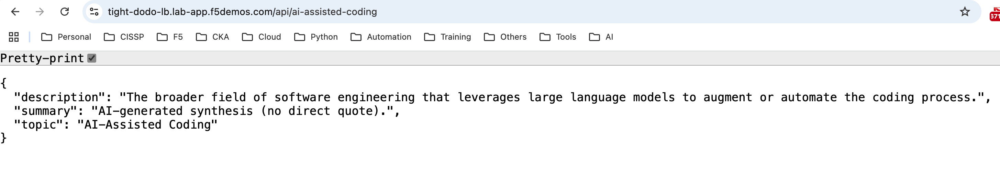
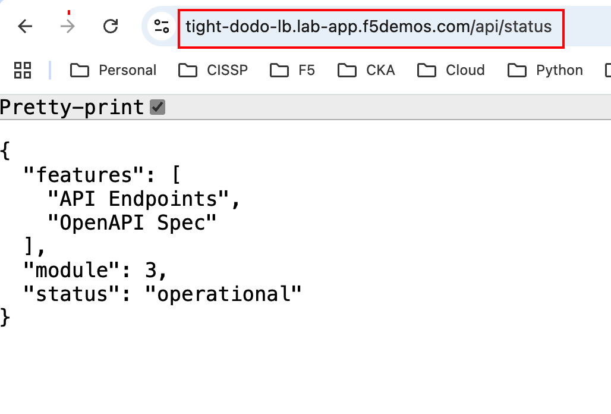
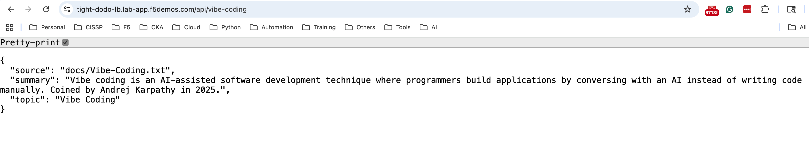
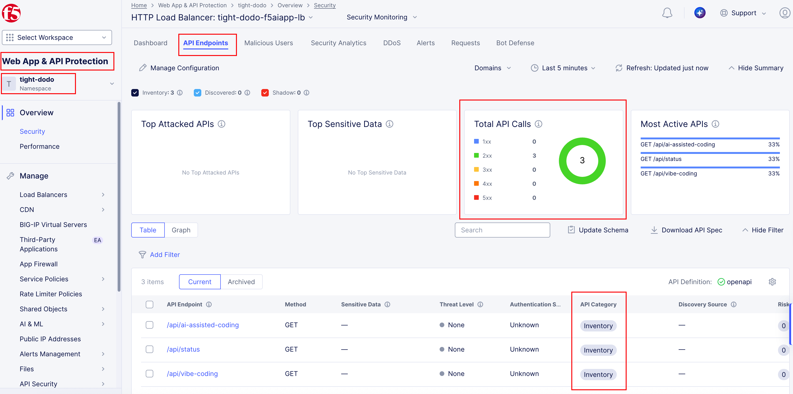
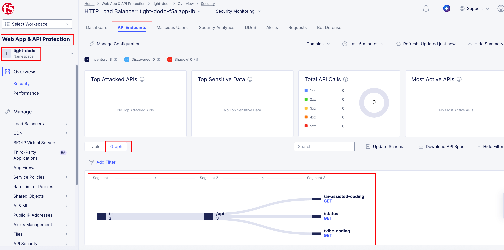
.. |module3-f5xc-waap-security-dashboard| image:: ../images/module3/module3-f5xc-waap-security-dashboard.png
   :width: 800px
.. |module3-f5xc-waap-tile-extra| image:: ../images/module3/module3-f5xc-waap-tile.png
   :width: 800px
.. |module3-vscode-cline-api-prompt| image:: ../images/module3/module3-fvscode-cline-api-prompt.png
   :width: 400px
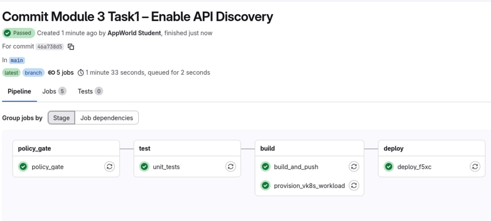
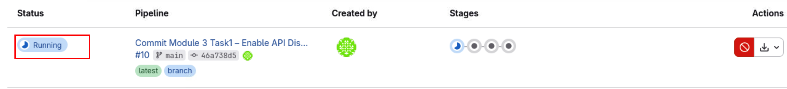
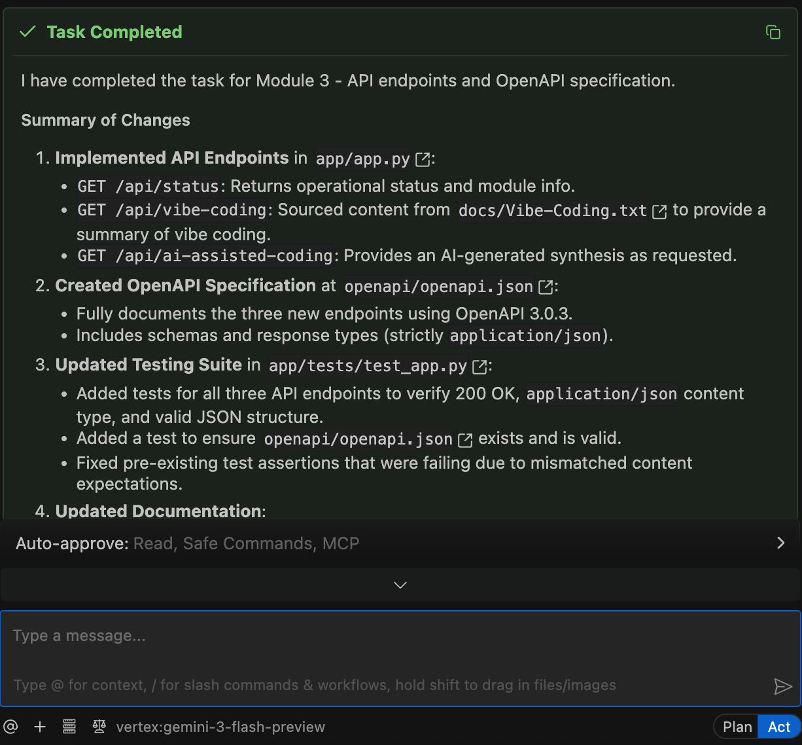
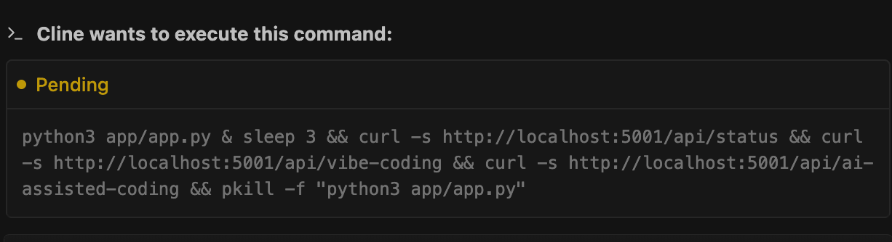
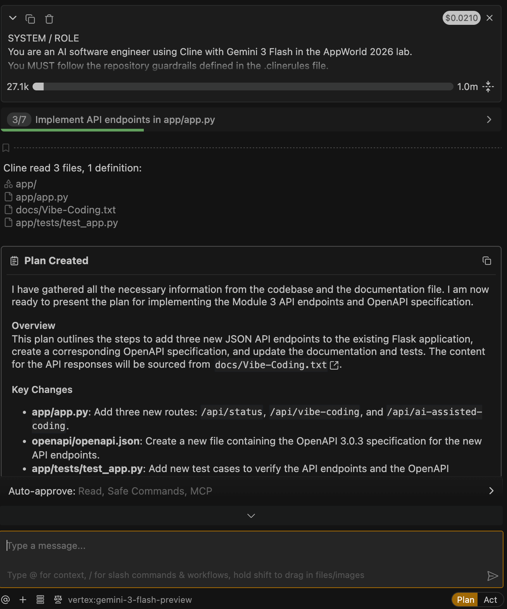
.. |module3-vscode-cline-pytest-failed-2| image:: ../images/module3/module3-vscode-cline-pytest-failed-2.png
   :width: 400px
.. |module3-vscode-cline-pytest-failed| image:: ../images/module3/module3-vscode-cline-pytest-failed.png
   :width: 400px
.. |module3-vscode-cline-pytest-passed| image:: ../images/module3/module3-vscode-cline-pytest-passed.png
   :width: 400px
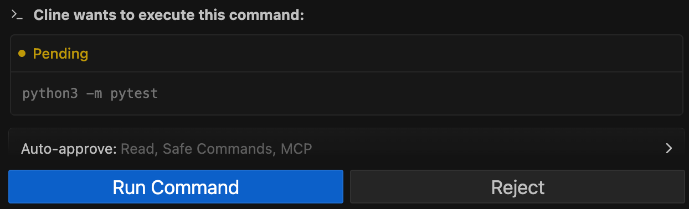
.. |module3-vscode-cline-save-file| image:: ../images/module3/module3-vscode-cline-save-file.png
   :width: 800px
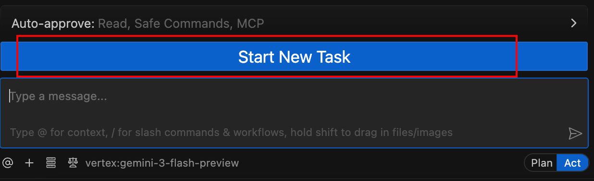
.. |module3-vscode-cline-switch-to-act| image:: ../images/module3/module3-vscode-cline-switch-to-act.png
   :width: 800px
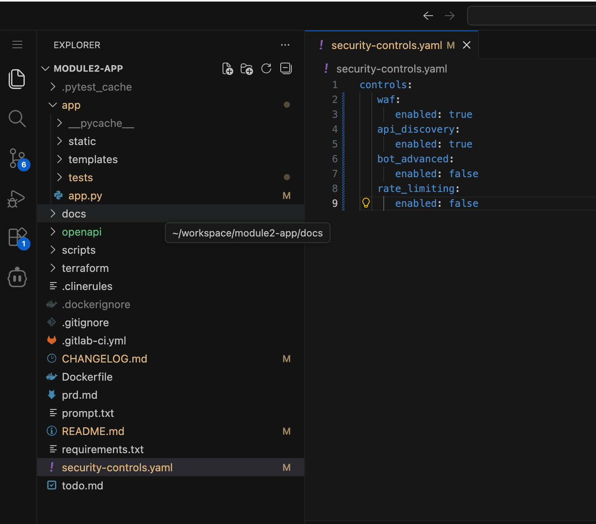
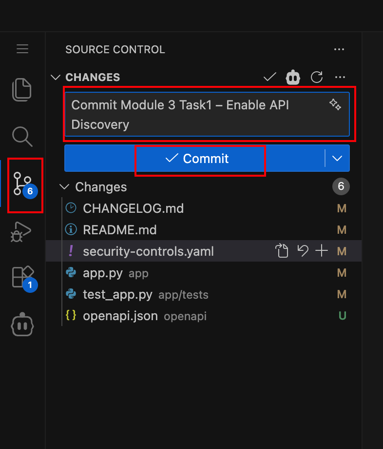
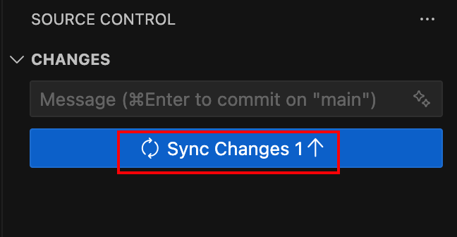
