Task 2 – Enable F5 Bot Protection on Login and Contact Pages
=============================================================

In this task, you will extend the application with user-facing pages and enable **Bot Defense** using policy-as-code.  
This demonstrates how CI/CD can enforce *behavioral protections*—not just vulnerability protections—without manual security configuration.

You will add new pages using AI-assisted coding, declare bot protection in code, and observe how GitLab automatically deploys the updated controls.

Extend the Application with User-Facing Pages
~~~~~~~~~~~~~~~~~~~~~~~~~~~~~~~~~~~~~~~~~~~~~

1. Open the Module 2 application workspace in VS Code Server.

   Ensure you are working in the ``module2-app`` folder and that the previous pipeline from Module 3 Task 1 completed successfully.

2. Use the provided pre-canned prompt to generate a login page and contact page.

   Using the **Cline extension**, run the instructor-provided prompt to add:
   - A login page
   - A contact page

   .. code-block:: text

      SYSTEM / ROLE
      You are an AI software engineer using Cline with Gemini 3 Flash in the AppWorld 2026 lab.
      You MUST follow the repository guardrails defined in the .clinerules file for Modules 2 and 3.
      This prompt highlights only what is CRITICAL for this task and for CI/CD success.
      Do NOT restate or reimplement rules already enforced by .clinerules.

      ====================================================================
      MODULE 3 – TASK 2
      Add Login + Contact Pages (Bot Protection Enablement)
      ====================================================================

      You are now working on **Module 3 – Task 2**.

      The API work and `openapi/openapi.json` file were completed in the previous task.
      **CRITICAL CI/CD NOTE**:
      - `openapi/openapi.json` MUST remain present and valid JSON.
      - Do NOT rename, delete, move, or regenerate this file.
      - The CI/CD pipeline explicitly checks for this file when API Discovery is enabled.

      This task focuses ONLY on:
      - Login page
      - Contact page
      - Navigation updates required to expose them

      Nothing else.

      ====================================================================
      CI/CD FEATURE DETECTION (DO NOT BREAK)
      ====================================================================
      The pipeline will FAIL if these files do not exist at the exact paths:

      - app/templates/login.html
      - app/templates/contact.html

      Do NOT rename these files.
      Do NOT move them.
      Do NOT gate them behind conditionals.

      They must exist in the repository after this change.

      ====================================================================
      SCOPE (STRICT)
      ====================================================================
      You MAY:
      - Add Flask routes for:
      - GET /login
      - POST /login
      - GET /contact
      - POST /contact
      - Create the two templates listed above
      - Update the top navigation to include Login and Contact
      - Add minimal demo-only logic to support form submission

      You MUST NOT:
      - Modify existing API endpoints
      - Modify `openapi/openapi.json`
      - Refactor unrelated Module 2 or Module 3 code
      - Add databases, auth frameworks, OAuth, or external services

      This is a **lab-only demo app**.

      ====================================================================
      LOGIN PAGE – UX + BEHAVIOR
      ====================================================================
      Design the login page to visually match the provided reference image:

      Visual characteristics:
      - Centered login card
      - F5 logo at the top
      - Title text similar to:
      “Sign in to your account”
      - Subtext indicating:
      “LAB ENVIRONMENT – MODULE 3”
      - Username and password fields
      - “Remember me” checkbox (UI only)
      - “Forgot your password?” link (non-functional)
      - Primary red “Sign In” button
      - Demo credentials visible at the bottom:
      f5user / f5password

      Functional requirements:
      - Route:
      - GET /login → render page
      - POST /login → validate credentials
      - Authentication:
      - Single demo user:
         - username: f5user
         - password: f5password
      - Password MUST be stored as a hash (not plaintext)
      - Use a simple flat file for credentials
      - On success:
      - Show a logged-in state (e.g., “Welcome, f5user”)
      - Use Flask sessions only (demo-only)

      Security constraints:
      - No rate limiting
      - No CAPTCHA
      - No MFA
      These characteristics are intentional for Bot Protection demonstrations.

      ====================================================================
      CONTACT PAGE – UX + BEHAVIOR
      ====================================================================
      Design the contact page to visually match the provided reference image:

      Layout requirements:
      - Two-column card layout
      - Left panel (dark):
      - “Contact Us” header
      - Supporting text about AppWorld 2026 lab
      - Email: lab-support@f5.com
      - Location: Las Vegas, NV (AppWorld 2026)
      - Right panel (light):
      - First Name
      - Last Name
      - Email Address
      - Message textarea
      - Red “Send Message” button

      Functional requirements:
      - Route:
      - GET /contact → render page
      - POST /contact → accept submission
      - Validation:
      - Required fields present
      - Email loosely validated (simple check)
      - Handling:
      - Log submission to stdout OR store in memory
      - Return a friendly confirmation message
      - No email sending
      - No database
      - No file uploads

      ====================================================================
      NAVIGATION UPDATES (BASE TEMPLATE)
      ====================================================================
      Update the top navigation to include:
      - “Contact” link (next to Docs)
      - Links to GET /contact
      - “Login” button on the right
      - Links to GET /login
      - Styled as a primary red CTA

      Navigation must appear consistently across pages using the base template.

      ====================================================================
      TESTING (REQUIRED FOR CI)
      ====================================================================
      Update or add pytest tests to validate:
      - GET /login returns HTTP 200
      - GET /contact returns HTTP 200
      - POST /login with valid credentials succeeds
      - POST /contact returns confirmation

      All tests MUST pass.
      Do NOT weaken assertions or skip tests.

      ====================================================================
      DOCUMENTATION UPDATES
      ====================================================================
      Update README.md:
      - Add Module 3 section:
      - Login page (demo-only)
      - Contact page (demo-only)
      - Document demo credentials:
      - f5user / f5password
      - Clearly state credentials are lab-only and hashed

      Update CHANGELOG.md:
      - Add a Module 3 entry noting:
      “Added login and contact pages for Bot Protection demo”

      ====================================================================
      REMINDERS
      ====================================================================
      - Minimal changes
      - Predictable behavior
      - CI/CD compliance is more important than polish
      - This task exists to enable **F5 Bot Protection visibility**

      Proceed with implementation now.

   Make sure **Cline** is on **Plan** mode

   |module3-vscode-cline-api-prompt|

   .. note::
      *Let Cline work through the pytest loop. If tests fail, it will update the code and re-run pytest until it passes (or exits after repeated failures).*

3. Switch to **Act** mode to allow Cline to implement changes.

   Toggle Cline from **Plan** to **Act** mode to begin file creation and code changes.

   |module3-vscode-cline-switch-to-act|

4. Save files as Cline generates them.

   As Cline completes each file update, VS Code will prompt you to save before it continues.

   |module3-vscode-cline-save-file|

   Cline will run Pytest again as described in Module 0:

   |module3-vscode-cline-pytest-failed.png|

   If tests pass, you’ll see a successful run:

   |module3-vscode-cline-pytest-passed.png|

5. Verify that the required template files were created.

   In the VS Code Explorer, confirm the following files exist:

   ::

      app/templates/login.html
      app/templates/contact.html

   *Why this matters:*
   
   - These pages represent high-risk bot interaction points.
   - The CI/CD pipeline **requires these files** when Bot Defense is enabled.
   - Missing files will cause the pipeline to fail.

   |module3-task2-vscode-login-contact-html.png|

Enable Bot Defense Using Policy-as-Code
~~~~~~~~~~~~~~~~~~~~~~~~~~~~~~~~~~~~~~~

6. Open the ``security-controls.yaml`` file.

   This is the same policy file used to enable WAF and API Discovery.

7. Enable Bot Defense in the security policy.

   Update the file so it looks like this:

   .. code-block:: yaml

      controls:
         waf:
            enabled: true
         api_discovery:
            enabled: true
         bot_advanced:
            enabled: true
         rate_limiting:
            enabled: false

Commit and Push the Changes
~~~~~~~~~~~~~~~~~~~~~~~~~~~

8. Save your changes and commit them to GitLab.

   Use the Source Control panel in VS Code Server and commit your changes with a message similar to:

   ::

      Commit Module 3 Task2 – Enable Bot Defense

9. Push the commit the changes. GitLab CI/CD detects the changes and starts a new pipeline run.

Observe the CI/CD Pipeline
~~~~~~~~~~~~~~~~~~~~~~~~~~

10. Navigate to the pipeline in GitLab.

    If you are not already logged in:

   - From your deployment, locate the **Jump Host** tile and click **Access**
   - Click **FIREFOX**

   |module2-firefox-access|

   - Click the GitLab bookmark in Firefox

   When prompted, enter the following credentials:

   - **Username:** student
   - **Password:** @ppW0rld2026!

   |module2-gitlab-login|

   In the left navigation menu, click **Projects**
  
   |module2-gitlab-student-dashboard|

   Click on project **appworld2026 / module2-app**

   |module2-gitlab-student-project-1|

   Then In the left navigation menu, hover over **Build** and then click **Pipeline**

   |module3-gitlab-build-pipeline| 

11. Open the most recent pipeline run.

   |module3-task2-gitlab-bot-pipeline.png|

   *What to notice as it progresses:*
   
   - The ``policy_gate`` stage validates that Bot Defense is enabled **and** that the required templates exist.
   - The ``test`` stage runs and validates login/contact routes.
   - The ``build`` stage creates a new image version (v1.2) and pushes it to the container registry.
   - The ``deploy`` stage applies updated F5XC configuration for Bot Defense Standard on the ``/login`` and ``/contact`` paths.

12.  Confirm that all stages complete successfully.

   *What this means:*
   
   - Application image version v1.2 is running in vK8s.
   - Bot Defense is configured on the HTTPS Load Balancer.
   - Login and contact pages are now protected from automated abuse.

Test Bot Defense in Browser vs curl (Why Results Differ)
~~~~~~~~~~~~~~~~~~~~~~~~~~~~~~~~~~~~~~~~~~~~~~~~~~~~~~~~

13. Open the login page in a browser and observe the bot protection behavior.

   When Bot Defense is enabled, the browser experience may include an injected JavaScript challenge (or additional client-side signals).

   After The CI/CD pipeline updates the app and F5XC. Navigate to he login or contact page in you application. This will trigger the JavaScript injection.
   
   |module3-task2-browser-login-test.png|

   |module3-task2-browser-bot-telemetry-1.png|

   |module3-task2-browser-bot-telemetry-2.png|

   |module3-task2-browser-bot-telemetry-3.png|

   **What this means:**
   - Real browsers can execute JavaScript and provide client signals.
   - Bot Defense uses these signals to distinguish browsers from automation.
   - This is why browser access can be allowed while scripted clients are blocked.

14. Generate simulated bot traffic using curl (expected to be blocked).

   Now send non-browser, automated POST requests to protected pages.

   .. note::
      *Update the URLs below with your namespace.*

   **Login Page Test**

   .. code-block:: bash

      curl -s https://<NAMESPACE>-lb.lab-app.f5demos.com/login \
        -d "username=test&password=test" \
      | sed -n 's/.*<body>\(.*\) .*/\1/p'

   **Contact Page Test**

   .. code-block:: bash

      curl -s https://<NAMESAPCE>-lb.lab-app.f5demos.com/contact \
        -d "name=test&email=test@test.com&message=hello" \
      | sed -n 's/.*<body>\(.*\) .*/\1/p'

   |module3-task2-curl-commands-test.png|

   *What to notice:*
   - curl does not execute JavaScript or provide browser telemetry.
   - The request is classified as automation and is blocked.
   - The response shows a block outcome (or block message).

Review Bot Defense in F5 Distributed Cloud
~~~~~~~~~~~~~~~~~~~~~~~~~~~~~~~~~~~~~~~~~~

15.  Open the F5 Distributed Cloud console and navigate to the WAAP security view.

   Return to the Security dashboards and review bot-related events after generating traffic. To go back to the main F5XC home page, click the F5 logo, then:

   Click on the Web App & API Protection tile

   |module3-f5xc-waap-tile|

   Under the "Overview" section, make sure you are the Security Dashboard

   |module3-f5xc-waap-security|

   Then Scroll all the way down and click in your load balancer to go to the Security Dashboard for your application.

   |module3-f5xc-waap-security-dashboard.png|

16.  Open the Bot Defense dashboard.

   In the Security view, select the **Bot Defense** dashboard to review bot-specific signals.

   |module3-task2-waap-security-bot-dashboard|

   *What to notice:*
   
   - Bot Defense is enabled for the application.
   - Login and contact pages are identified as protected endpoints.
   - Events appear for ``/login`` and ``/contact``.
   - You can correlate browser activity vs curl-based automation.
   - Bot Defense provides visibility into classification and enforcement.

Wrap-Up
~~~~~~~

You have successfully:

- Added user-facing pages using AI-assisted coding
- Enabled Bot Defense through policy-as-code
- Triggered automated deployment via CI/CD
- Observed runtime enforcement differences between browser traffic and scripted traffic

In the next module, you will step back from building and enforcing controls and focus on **validation**.

You’ll review **F5 Web Application Scanning (WAS)** results as a DAST tool to compare:
- The application *before* security controls
- The application *after* WAF, API Discovery, and Bot Defense are enabled

This closes the loop by answering the most important question in DevSecOps:

**Did our security controls actually make the application safer?**

That final comparison brings the lab to its conclusion—and reinforces the full **Code. Secure. Repeat.** workflow.

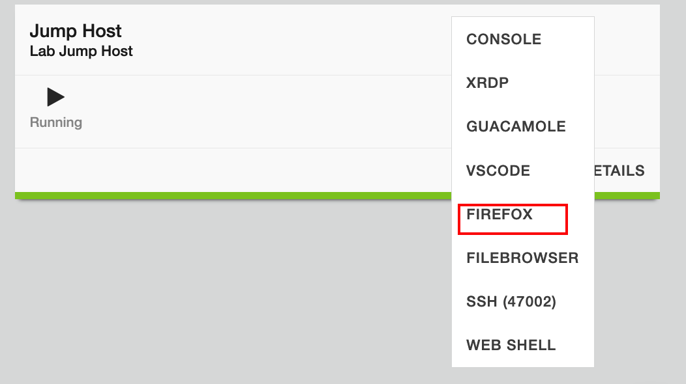
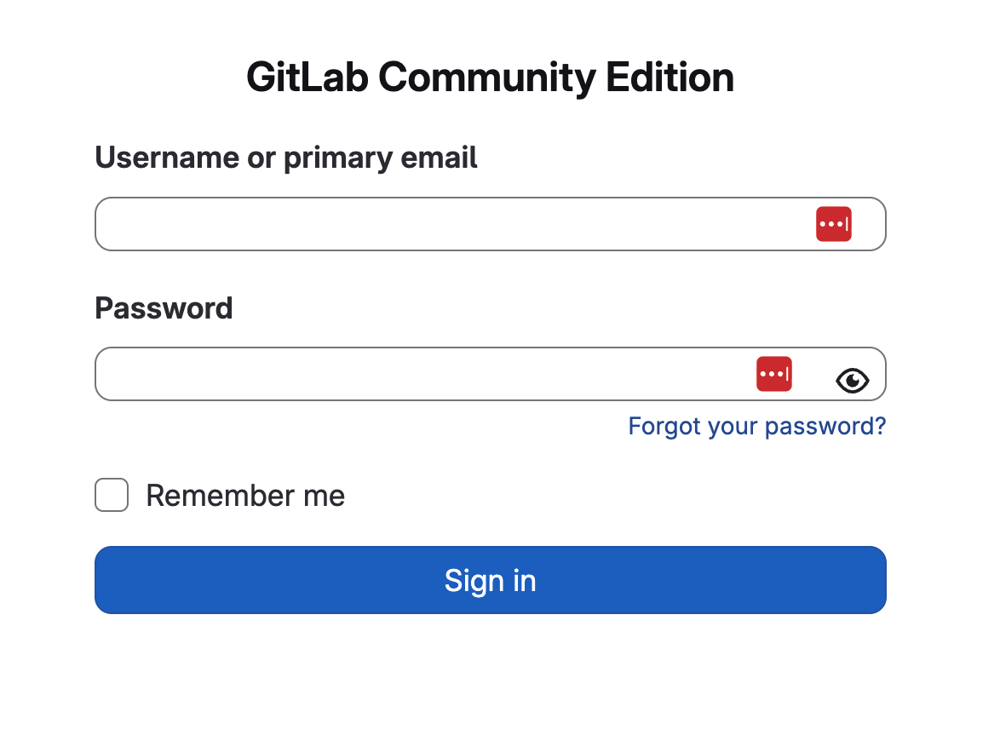
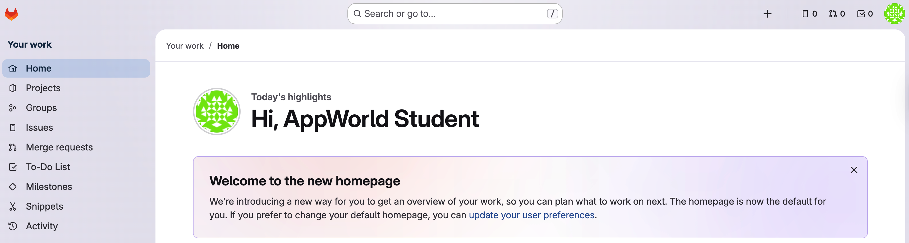
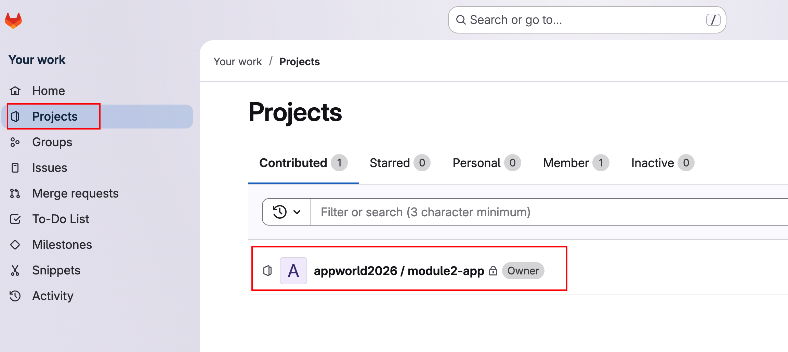
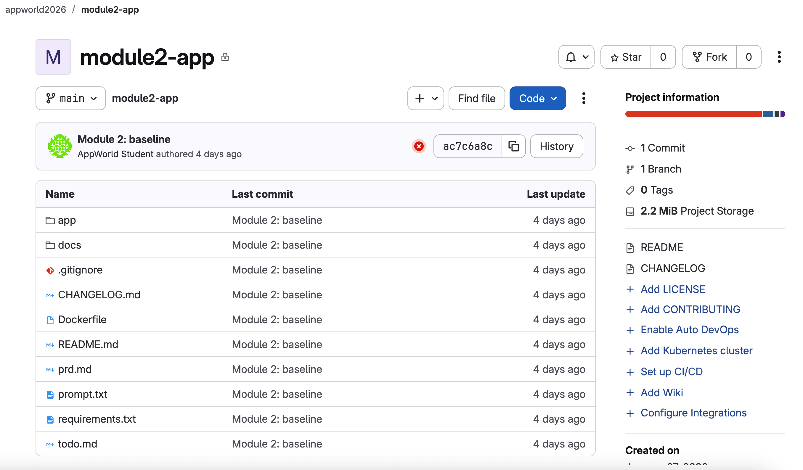
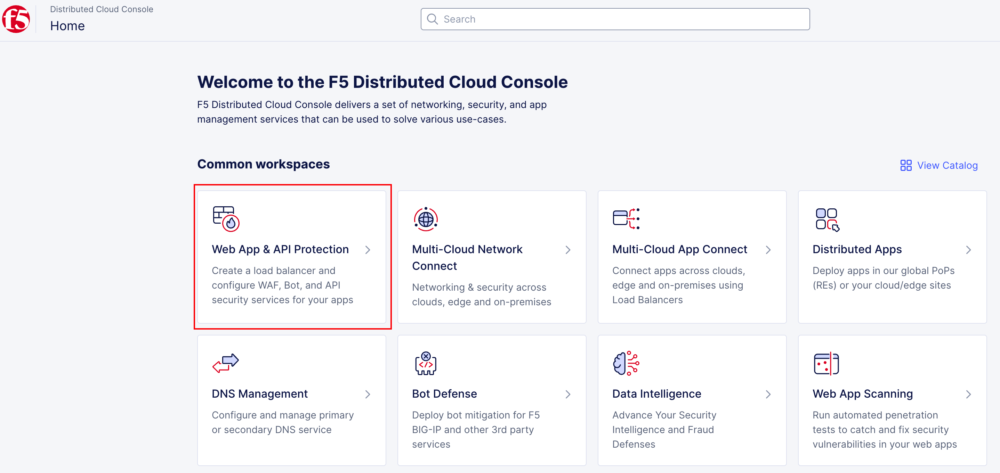
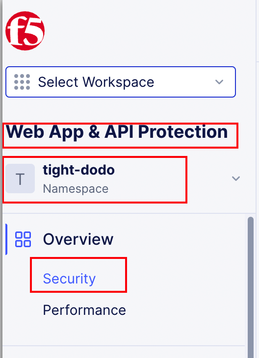
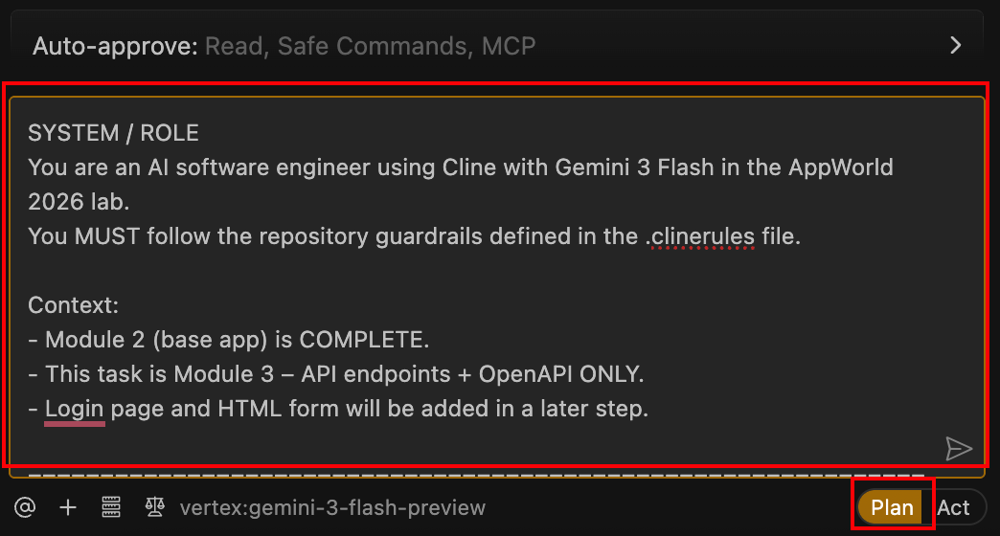
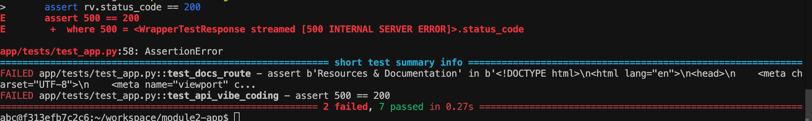
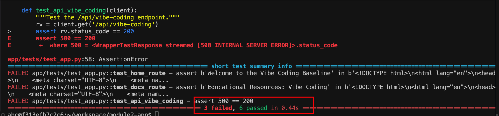
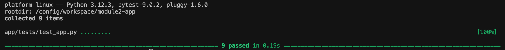
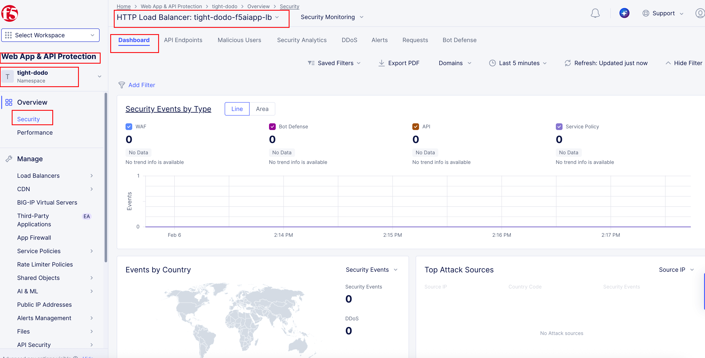
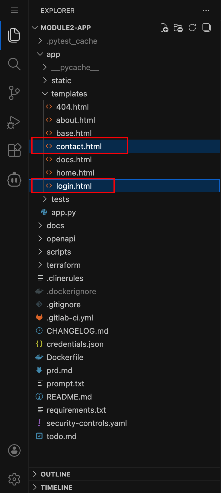
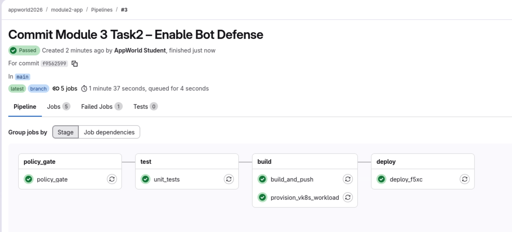
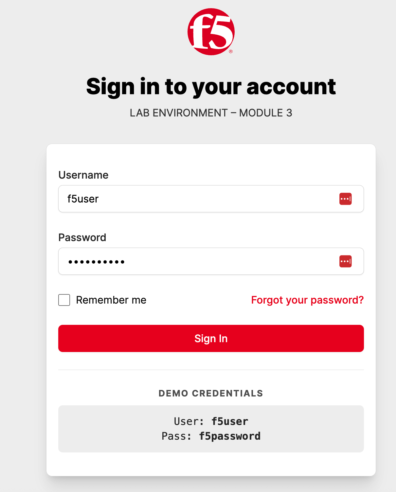
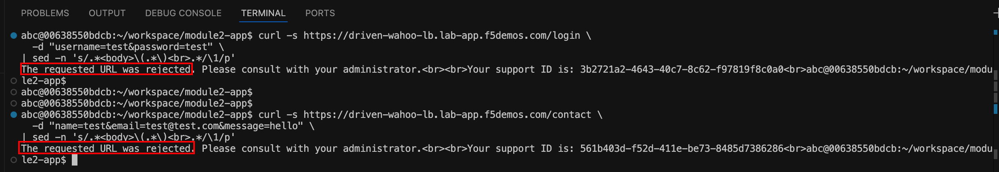
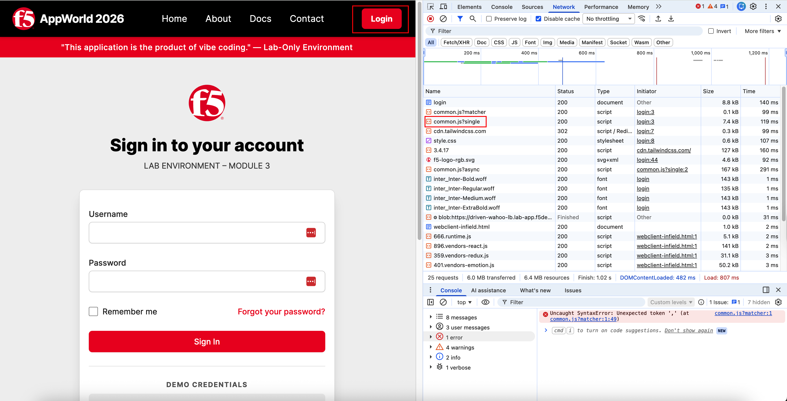
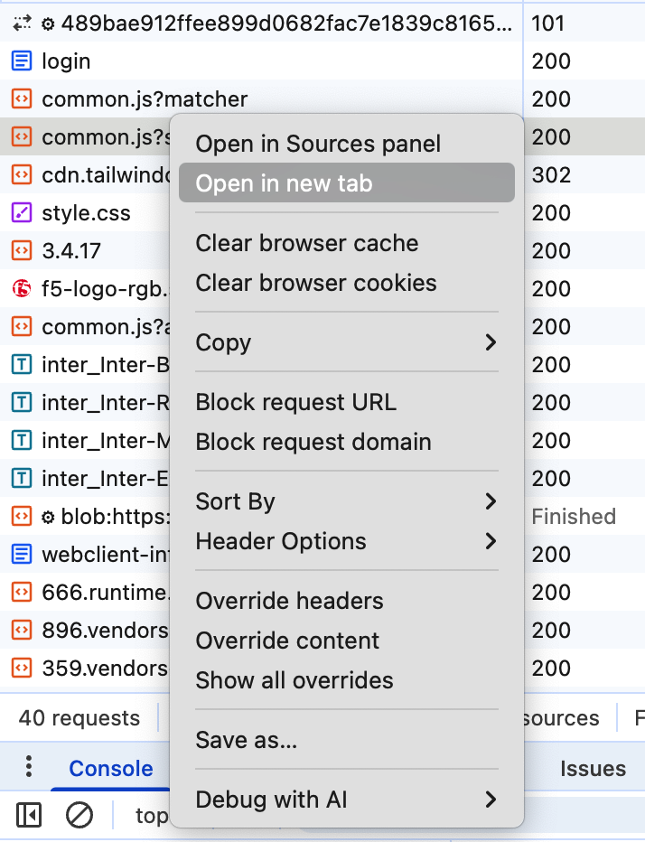
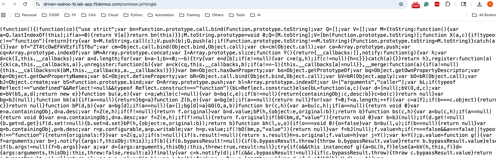
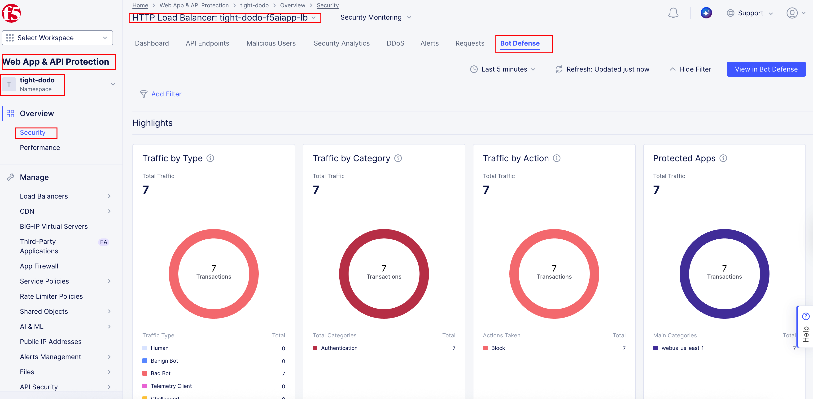
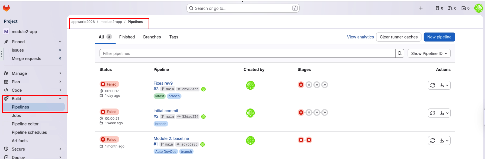
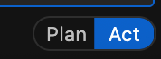
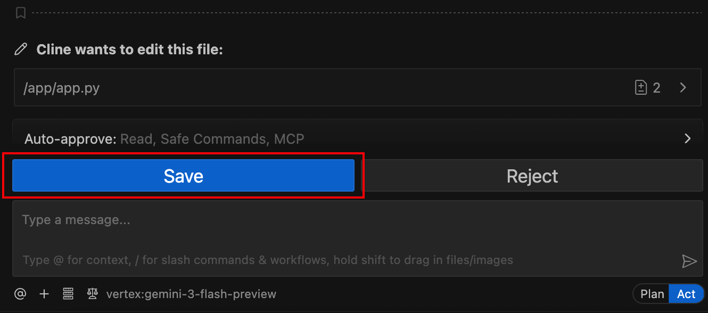