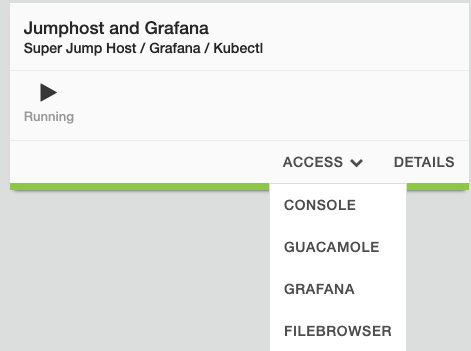
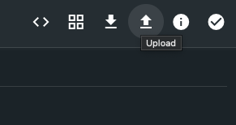

Lab 3 - Configure your local kubectl to access your virtual K8s
===============================================================

F5 Distributed Cloud App Stack provides the ability to manage your vK8s namespace via command line with `kubectl`

In this lab, we will learn perform the following:

-  Download the kubeconfig, and then upload the kubeconfig file to the jumpbox to allow for access your virtual k8s using native kubectl commands.

**Core Concepts**

   *Virtual Kubernetes vK8s*
      `F5 Distributed Cloud Services support a Kubernetes compatible API for centralized orchestration of applications across a fleet of sites (customer sites or F5 Distributed Cloud Regional Edge). This API is "Kubernetes compatible" because not all Kubernetes APIs or resources are supported. However, for the API(s) that are supported, it is hundred percent compatible. We have implemented a distributed control plane within our global infrastructure to manage scheduling and scaling of applications across multiple (tens to hundreds of thousands of) sites, where each site in itself is also a managed physical K8s cluster.`

   *kubectl*
      `Standard upstream kubectl CLI tool can be used on the vK8s API URL or the downloaded kubeconfig file can be used to access the vK8s APIs.`

   For more core concepts, please review `F5 Distributed Cloud documentation <https://docs.cloud.f5.com/docs/ves-concepts/dist-app-mgmt>`_

**Exercise 1 - Log into F5 Distributed Cloud Console**

#. Click the distributed apps tile on the F5 Distributed Cloud Services home page.

   .. image:: ../images/distributedappclick-updated.png
      :width: 400pt

#. Click virtual K8s under the applications section.

   .. image:: ../images/distributedappclickvirtualk8s.png
      :width: 180pt

#. Click the three dots under the "Action" column and then click **Kubeconfig**.

   .. image:: ../images/distributedappclickvirtualk8kubeconfig-updated.png
      :width: 650pt

#. When prompted to select an expiration date, pick a future date that will give you adequate time to complete the lab.

   .. image:: ../images/kubeconfigexpirydate.png
      :width: 650pt

#. If your browser prompts you for a location to download the file, select a directory you prefer and click **Save**.

#. Click the config kubeconfig is downloaded, and follow the Kubernetes documentation to configure your local kubctl tool.

    `Organizing Cluster Access Using kubeconfig Files <https://kubernetes.io/docs/concepts/configuration/organize-cluster-access-kubeconfig/>`_

#. If you have kubectl available on your computer, you would be able to interact with your vK8s cluster using the downloaded kubeconfig file.

For the purposes of this lab, we will use the jumpbox to interact with the vK8s cluster. Before we can do that, we need to upload the kubeconfig file to the jumpbox.

From the lab components view, find the jumpbox and click the *Access* button. From the access list, select **File Browser**.

Login with *admin/admin* credentials.

.. image:: ../images/filebrowser-login.png
   :width: 350pt

Within File Browser, click the **Upload** upload icon, `Choose File` and then select the kubeconfig file you downloaded. Select this file and complete the upload.

