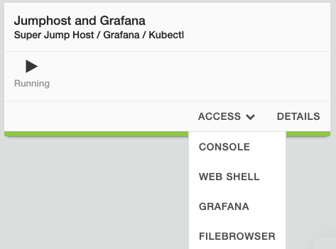

Lab 2 - Deploy Containers on vK8s and Build Grafana Dashboard
=============================================================

**Steps**

Environment Setup:

- Ensure that the NAMESPACE environment variable is set.
- Deploy Grafana using docker compose which will be procongigured to match your namespace name for each of the 3 regions.

#. Returning back to the Lab Components view, click the jumpbox and then click the *Access* button. From the access list, select **Web Shell**.

From Web Shell, run the following commands to set the NAMESPACE environment variable:

.. code-block:: bash

  ### Enter your own namespace value
  export NAMESPACE=<namespace>

Next, we'll configure you environment to access the vK8s cluster using the kubeconfig file that you downloaded in the previous lab.

.. code-block:: bash

  export KUBECONFIG=/srv/filebrowser/ves_$NAMESPACE\_$NAMESPACE-vk8s.

  #Let's review again to confirm that we can reach the cluster:
  kubectl config view

Now we can deploy the containers into the vK8s cluster.

**Deploy Manifests**

.. code-block:: bash

  cd ~/caaslab
  kubectl apply -f vk8s/

**Deploy Grafana**

.. code-block:: bash

  cd ~/caaslab
  docker-compose up -d

**Access Grafana**

Within the lab

