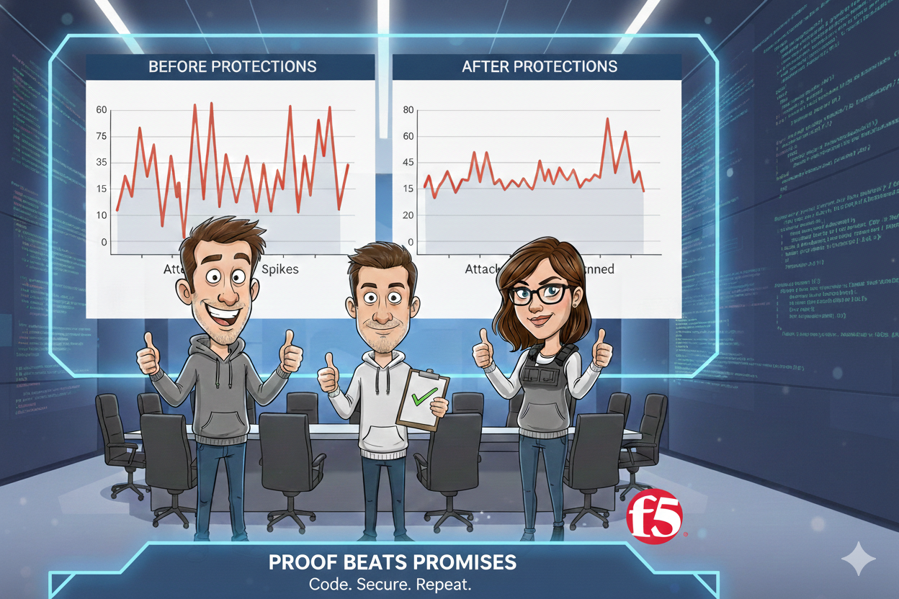

Module 4 – Web App Scanning & Conclusion
=====================================================

Narrative
---------

+----------------------------------------------------------------------------------------------+
| **“Proof beats promises”**                                                                   |
|                                                                                              |
| At the end of the sprint, leadership asks the question everyone asks:                        |
|                                                                                              |
|   “Are we actually more secure?”                                                             |
|                                                                                              |
| Instead of opinions, you show **evidence**.                                                  |
|                                                                                              |
| You compare:                                                                                 |
|                                                                                              |
| * The app *before* protections                                                               |
| * The app *after* protections                                                                |
|                                                                                              |
| Same code. Same team. Very different outcomes.                                               |
|                                                                                              |
| Riley smiles—not because everything is blocked, but because everything is **measured**.      |
|                                                                                              |
| |Module_4_story|                                                                             |
+----------------------------------------------------------------------------------------------+

**What this module is really about**
------------------------------------

* DAST as **feedback**, not fear
* Validation of:
    * WAF effectiveness
    * API protections
    * Bot mitigation
* Closing the loop: **Code. Secure. Repeat.**

**Real-world takeaway**
-----------------------

This is what mature DevSecOps looks like:

* AI accelerates development
* Pipelines enforce intent
* Runtime security adapts
* Scanning validates reality

No silver bullets. Just a loop that gets better every time.

Module 4 Tasks:
---------------

.. toctree::
   :maxdepth: 1
   :glob:

   task*

