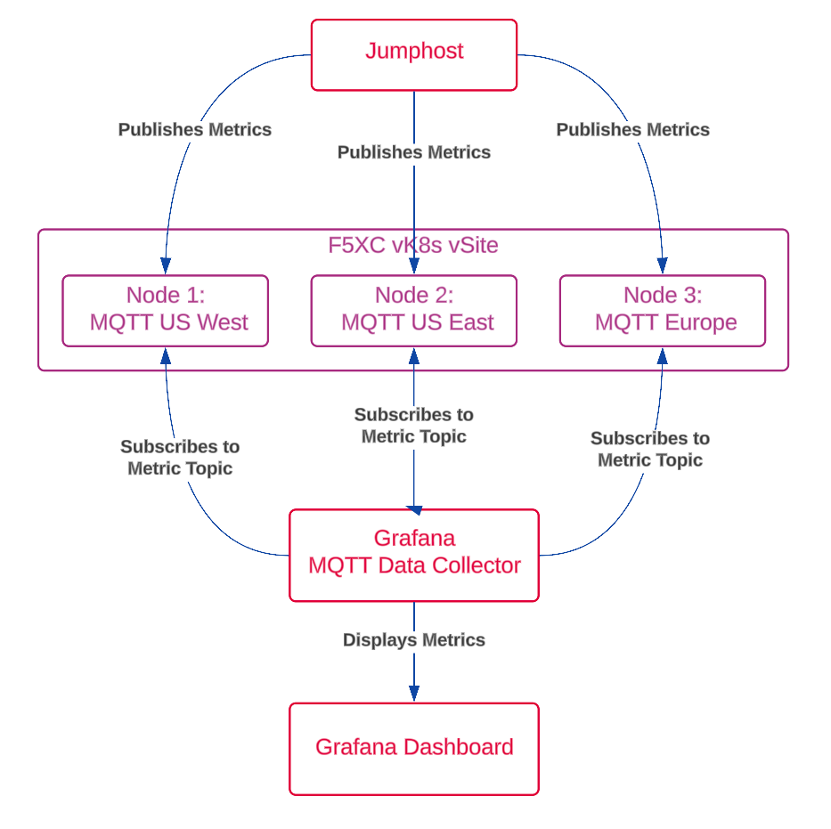

Module 4: Monitoring Operating System Metrics with MQTT and Grafana
===================================================================

**Objective**

This lab will demonstate leveraging vk8s to deploy a workload distributed across the globe but managed as a single application.

This lab exercise will leveage bash script to publish data to MQTT brokers located in US East, US West, and Europe. Data from each region will then be visualized on a Grafana dashboard.

**Overview**

Participants will learn how set telemetry data using a bash script to collect and publish system metrics such as CPU usage, memory usage, network throughput, and top processes to MQTT brokers. These metrics will be displayed on a Grafana dashboard for real-time monitoring and analysis.

**Lab Topology**

**Key Learning Points**

Understanding how to collect system metrics using bash commands.
Learning how to publish data to MQTT brokers.
Configuring and using Grafana to visualize real-time data.
Troubleshooting common issues related to MQTT and Grafana.

**Expected Outcome**

By the end of this lab exercise, participants will have used F5 Distrubuted Cloud and 3 globally distributed MQTT brokers and demonstation a working setup that continuously monitors and displays system metrics on a Grafana dashboard.

.. toctree::
   :maxdepth: 1
   :glob:

   lab*
