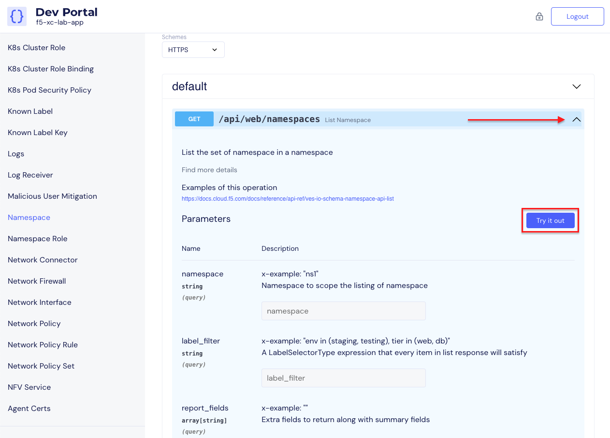
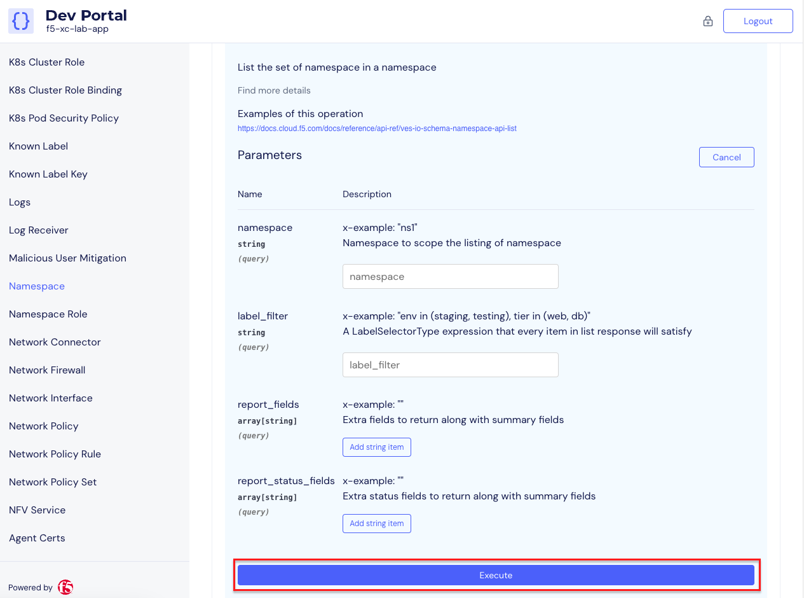
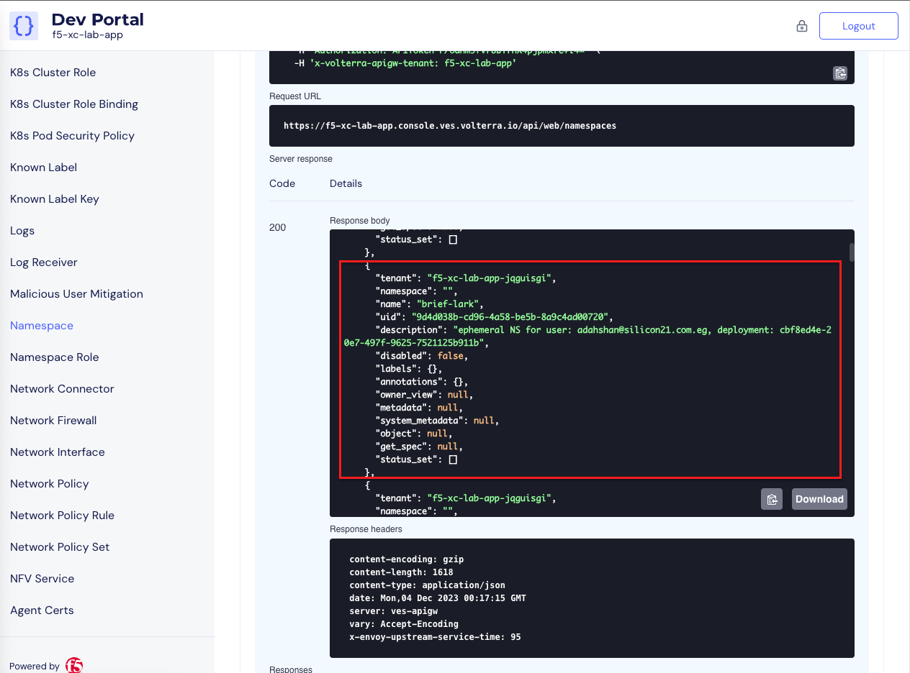

Lab 1: API-First Console
==========================================================================================

This lab will focus on demonstrating the API-First capabilities of the F5 Distribured Cloud
Console. Students will begin by creating an API token for authenticating to the API. Next,
students will explore the Distributed Cloud Developer Portal and utilize it to query live 
configuration. The lab concludes with using Postman to deploy an application.

For the tasks that follow, you should have already noted your individual **namespace**. If you
failed to note it, return to the **Introduction** section of this lab, follow the instructions
provided and note your **namespace** accordingly. The **Delegated Domain** and the F5
Distributed Cloud **Tenant** are listed below for your convenience as they will be the same for
all lab attendees.

* **Delegated Domain:** *.lab-app.f5demos.com*
* **F5 Distributed Cloud Tenant:** https://f5-xc-lab-sec.console.ves.volterra.io

Following the tasks in the prior **Introduction** Section, you should now be able to access the
F5 Distributed Cloud Console, having set your Work Domain Roles and Skill levels. If you have
not done so already, please login to your tenant for this lab and proceed to Task 1.

Task 1: Review Developer Portal
~~~~~~~~~~~~~~~~~~~~~~~~~~~~~~~~~~~~~~~~~~~~~~~

The following steps will allow you to create an API Token and query the Distributed Cloud API
utilizing the Developer Portal.  

+---------------------------------------------------------------------------------------------------------------+
| 1. Following the **Introduction** section  instructions, you should now be in the **Multi-Cloud App Connect** |
|                                                                                                               |
|    configuration window. If for some reason you are not in the **Multi-Cloud App Connect** window, use the    |
|                                                                                                               |
|    **Select Service** in the left-hand navigation, and click **Multi-Cloud App Connect** as shown in the      |
|                                                                                                               |
|    *Introduction section, Task 2, Step 9*.                                                                    |
|                                                                                                               |
| 2. In the top right corner of the Distributed Cloud Console click the **User Icon** dropdown and select       |
|                                                                                                               |
|    **Account Settings**.                                                                                      |
|                                                                                                               |
| 3. In the resulting screen click **Credentials** under the Peronal Management Heading on the left.            |
|                                                                                                               |
| 4. Click **Add Credentials**.                                                                                 |
|                                                                                                               |
| 5. Fill in the resulting form with the following values                                                       |
|                                                                                                               |
|     * **Credential Name ID:**  *<namespace>-api-token*                                                        |
|     * **Credential Type: Select:** *API Token*                                                                |
|     * **Expiry Date: Select:** *<date two day in the future of today's date>*                                 |
|                                                                                                               |
| 6. Click **Generate**.                                                                                        |
|                                                                                                               |
| 7. On the form that appears copy your API token and save it for use later.  Then click **Done**.              |
|                                                                                                               |
| .. note::                                                                                                     |
|    *If you don't save your API token or you lose it, you will need to generate a new API token. After an API* |
|                                                                                                               |
|    *token is generated, it can not be retrieved again later.*                                                 |
+---------------------------------------------------------------------------------------------------------------+
| |lab1-Account_Settings|                                                                                       |
|                                                                                                               |
| |lab1-Credentials|                                                                                            |
|                                                                                                               |
| |lab1-Add_Credentials|                                                                                        |
|                                                                                                               |
| |lab1-Generate_API_Token|                                                                                     |
|                                                                                                               |
| |lab1-API_Token|                                                                                              |
+---------------------------------------------------------------------------------------------------------------+

+---------------------------------------------------------------------------------------------------------------+
| 8. In the top right corner of the Distributed Cloud Console click the **Support** dropdown and select **API** |
|                                                                                                               |
|    **Docummentation**.                                                                                        |
|                                                                                                               |
| .. note::                                                                                                     |
|    *This takes you to the online documentation for the F5 Distributed Cloud Services API.  Here you can*     |
|                                                                                                               |
|    *review or download the API specification.*                                                                |
|                                                                                                               |
| 9. In the resulting screen click the **API Developer Portal** link in the top menu.                           |
+---------------------------------------------------------------------------------------------------------------+
| |lab1-API_Documentation|                                                                                      |
|                                                                                                               |
| |lab1-API_Developer_Portal|                                                                                   |
+---------------------------------------------------------------------------------------------------------------+

+---------------------------------------------------------------------------------------------------------------+
| 10. In the resulting window, enter **f5-xc-lab-app** in the **Please enter your domain** text field and click |
|                                                                                                               |
|     **Access portal.**                                                                                        |
|                                                                                                               |
| 11. In the resulting screen click the **Authorize** link in the top right corner.                             |
|                                                                                                               |
| 12. In the form that appears, enter your API Token in the **Paste your API token** field and click            |
|                                                                                                               |
|     **Authorize**.                                                                                            |
+---------------------------------------------------------------------------------------------------------------+
| |lab1-Portal_Domain|                                                                            |
|                                                                                                               |
| |lab1-Portal_Authorize|                                                                                       |
|                                                                                                               |
| |lab1-Portal_Set_Token|                                                                                       |
+---------------------------------------------------------------------------------------------------------------+

+---------------------------------------------------------------------------------------------------------------+
| 13. In the Dev Portal, scroll through the APIs on the left until you find **Namespace** and then click        |
|                                                                                                               |
|     **Namespace**.                                                                                            |
|                                                                                                               |
| 14. Under the **default** section in schemes, click the arrow to expand **GET /api/web/namespaces** and then  |
|                                                                                                               |
|     click **Try it out**.                                                                                     |
|                                                                                                               |
| 15. Click **Execute**.  You may have to scroll down slightly to show the **Execute** icon depending on your   |
|                                                                                                               |
|     screen resolution.                                                                                        |
|                                                                                                               |
| 16. Review the **Response body** data. You may have to scroll down slightly to show the **Response body** data|
|                                                                                                               |
|     depending on your screen resolution.                                                                      |
|                                                                                                               |
| 17. The Reponse body is a JSON formatted representation of all of the namespaces configured within the        |
|                                                                                                               |
|     the **f5-xc-lab-app** tenant.  Find the JSON section for your namespace.                                  |
+---------------------------------------------------------------------------------------------------------------+
| |lab1-Portal_Namespace|                                                                                       |
|                                                                                                               |
| |lab1-Portal_Try_It_Out|                                                                                      |
|                                                                                                               |
| |lab1-Portal_Execute|                                                                                         |
|                                                                                                               |
| |lab1-Portal_Namespaces_JSON|                                                                                        |
+---------------------------------------------------------------------------------------------------------------+

Next you will set parameters within the API query to limit the results that are returned.

+---------------------------------------------------------------------------------------------------------------+
| 18. Scroll down through the **Namespace** APIs until you find **GET /api/web/namespaces/{name}** and click the|
|                                                                                                               |
|     the arrow to expand this API and then click **Try it out**.                                               |
|                                                                                                               |
| 19. Enter your tenant name in the **namespace** field and then click **Execute**.                             |
|                                                                                                               |
| 20. Review the **Response body** data. You may have to scroll down slightly to show the **Response body** data|
|                                                                                                               |
|     depending on your screen resolution.                                                                      |
|                                                                                                               |
| .. note::                                                                                                     |
|    *The parameters you entered in the name field were used to execute the API query and limit the returned*   |
|                                                                                                               |
|    *values.  Parameters can also be used when creating new objects.*                                          |
|                                                                                                               |
+---------------------------------------------------------------------------------------------------------------+
| |lab1-Portal_Namespaces_Name|                                                                                 |
|                                                                                                               |
| |lab1-Portal_Namespaces_Name_Execute|                                                                         |
|                                                                                                               |
| |lab1-Portal_Namespaces_Name_JSON|                                                                            |
+---------------------------------------------------------------------------------------------------------------+

Task 2: Create & Review Our First Proxy Configuration
~~~~~~~~~~~~~~~~~~~~~~~~~~~~~~~~~~~~~~~~~~~~~~~~~~~~~~~~~~

The following steps will create an origin pool and http load balancer utilizing Postman to post JSON definitions
to the Distributed Cloud API. For this task you will be using a Windows 10 host that is part of the UDF 
deployment.  The Windows 10 host has Postman pre-installed to save time in the lab.  To install and utilize 
postman outside of the lab visit https://www.postman.com/downloads/.

An RDP client is recommended to access the Windows 10 host.  Current versions of Microsoft Windows should 
include an RDP client pre-installed.  If you are using an operating system other than Windows, below are 
documentation and download links for installing an RDP client.

+-------------------+-------------------------------------------------------------------------------------------+
| Operating System  | Documentation and Download Link                                                           | 
+===================+===========================================================================================+
| macOS             | 'Remote Desktop Mac'_                                                                     |
+-------------------+-------------------------------------------------------------------------------------------+
| iOS/iPadOS        | https://learn.microsoft.com/en-us/windows-server/remote/remote-desktop-services/clients/  |
|                   | remote-desktop-ios                                                                        |
+-------------------+-------------------------------------------------------------------------------------------+
| Android/Chrome OS | https://learn.microsoft.com/en-us/windows-server/remote/remote-desktop-services/clients/  |
|                   | remote-desktop-android                                                                    |
+-------------------+-------------------------------------------------------------------------------------------+
| Linux             | https://remmina.org/                                                                      |
+-------------------+-------------------------------------------------------------------------------------------+

If you are unable to install an RDP client or cannot connect via RDP to the Windows 10 host, you can use the 
WebRDP jump host within the UDF environment to access the Windows 10 host via a web browser. Here are 
instructions for connecting to the Windows 10 host via RDPClient_. Here are instructions for connecting to the
Windows 10 host via WebRDP_. 

+---------------------------------------------------------------------------------------------------------------+
| 1.                                                                                                            |
+---------------------------------------------------------------------------------------------------------------+
|                                                                                                               |
+---------------------------------------------------------------------------------------------------------------+

+---------------------------------------------------------------------------------------------------------------+
| **End of Lab 1:**  This concludes Lab 1.  In this lab you created an origin pool to connect to the            |
|                                                                                                               |
| application, you then created a load balancer and associated the origin pool to the load balancer.  This      |
|                                                                                                               |
| allowed the application to be advertised via the F5 Distributed Cloud Global Network.  The Distributed Cloud  |
|                                                                                                               |
| Console was then used to review telemetry data gathered for the application.  Next an Application Firewall    |
|                                                                                                               |
| policy was created and assigned to protect the application.  Finally a sample attack was run against the      |
|                                                                                                               |
| application and the security event data was reviewed within the Distributed Cloud Console.                    |
|                                                                                                               |
| A brief presentation will be shared prior to the beginning of Lab 2.                                          |
+---------------------------------------------------------------------------------------------------------------+
| |labend|                                                                                                      |
+---------------------------------------------------------------------------------------------------------------+

.. |lab1-Account_Settings| image:: _static/lab1-Account_Settings.png
   :width: 800px
.. |lab1-Credentials| image:: _static/lab1-Credentials.png
   :width: 800px
.. |lab1-Add_Credentials| image:: _static/lab1-Add_Credentials.png
   :width: 800px
.. |lab1-Generate_API_Token| image:: _static/lab1-Generate_API_Token.png
   :width: 800px
.. |lab1-API_Token| image:: _static/lab1-API_Token.png
   :width: 800px
.. |lab1-API_Documentation| image:: _static/lab1-API_Documentation.png
   :width: 800px
.. |lab1-API_Developer_Portal| image:: _static/lab1-API_Developer_Portal.png
   :width: 800px
.. |lab1-Portal_Domain| image:: _static/lab1-Portal_Domain.png
   :width: 800px
.. |lab1-Portal_Authorize| image:: _static/lab1-Portal_Authorize.png
   :width: 800px
.. |lab1-Portal_Set_Token| image:: _static/lab1-Portal_Set_Token.png
   :width: 800px
.. |lab1-Portal_Namespace| image:: _static/lab1-Portal_Namespace.png
   :width: 800px

.. |lab1-Portal_Namespaces_Name| image:: _static/lab1-Portal_Namespaces_Name.png
   :width: 800px
.. |lab1-Portal_Namespaces_Name_Execute| image:: _static/lab1-Portal_Namespaces_Name_Execute.png
   :width: 800px
.. |lab1-Portal_Namespaces_Name_JSON| image:: _static/lab1-Portal_Namespaces_Name_JSON.png
   :width: 800px
.. |labend| image:: _static/labend.png
   :width: 800px

.. _'Remote Desktop Mac': https://learn.microsoft.com/en-us/windows-server/remote/remote-desktop-services/clients/remote-desktop-mac
.. _RDPClient doc::  rdpclient.rst
.. _WebRDP  doc:: webrdp.rst
