Lab 1: API-First Console
========================

This lab will focus on demonstrating the API-first capabilities of the F5 Distributed Cloud
Console. Students will begin by creating an API token for authenticating to the API, followed 
by exploring the Distributed Cloud Developer Portal and utilizing it to query a live 
configuration. Finally, the lab concludes with using Postman to deploy an application.

For the tasks that follow, you should have already noted your individual **namespace**. If you
failed to note it, return to the **Introduction** section of this lab, follow the instructions
provided and note your **namespace** accordingly. The **Delegated Domain** and the F5
Distributed Cloud **Tenant** are listed below for your convenience as they will be the same for
all lab attendees.

* **Delegated Domain:** *.lab-app.f5demos.com*
* **F5 Distributed Cloud Tenant:** https://f5-xc-lab-app.console.ves.volterra.io

By following the tasks in the prior **Introduction** Section, you should now be able to access the
F5 Distributed Cloud Console, having set your Work Domain Roles and Skill levels. If you have
not done so already, please login to your tenant for this lab and proceed to Task 1.

Task 1: Review Developer Portal
~~~~~~~~~~~~~~~~~~~~~~~~~~~~~~~

The following steps will allow you to create an API Token and query the Distributed Cloud API
utilizing the Developer Portal.  

+---------------------------------------------------------------------------------------------------------------+
| **Create API Token from the Distributed Cloud Console**                                                       |
+===============================================================================================================+
| 1. Following the **Introduction** section instructions, you should now be in the **Web App & API Protection** |
|                                                                                                               |
|    configuration window. If, for some reason, you are not in the **Web App & API Protection** window, use the |
|                                                                                                               |
|    **Select Service** in the left-hand navigation, and click **Web App & API Protection** as shown in the     |
|                                                                                                               |
|    *Introduction section, Task 2, Step 9*.                                                                    |
+---------------------------------------------------------------------------------------------------------------+
| 2. In the top right corner of the Distributed Cloud Console, click the **User Icon** dropdown and select      |
|                                                                                                               |
|    **Account Settings**.                                                                                      |
|                                                                                                               |
| |lab1-Account_Settings|                                                                                       |
+---------------------------------------------------------------------------------------------------------------+
| 3. In the resulting screen, click **Credentials** under the Peronal Management Heading on the left.           |
|                                                                                                               |
| |lab1-Credentials|                                                                                            |
+---------------------------------------------------------------------------------------------------------------+
| 4. Click **Add Credentials**.                                                                                 |
|                                                                                                               |
| |lab1-Add_Credentials|                                                                                        |
+---------------------------------------------------------------------------------------------------------------+
| 5. Fill in the resulting form with the following values                                                       |
|                                                                                                               |
|    * **Credential Name ID:**  *<namespace>-api-token*                                                         |
|    * **Credential Type: Select:** *API Token*                                                                 |
|    * **Expiry Date: Select:** *<date two days in the future of today's date>*                                 |
|                                                                                                               |
| 6. Click **Generate**.                                                                                        |
|                                                                                                               |
| |lab1-Generate_API_Token|                                                                                     |
+---------------------------------------------------------------------------------------------------------------+
| 7. On the form that appears, copy your API token and save it for use later.  Then click **Done**.             |
|                                                                                                               |
| |lab1-API_Token|                                                                                              |
|                                                                                                               |
| .. note::                                                                                                     |
|    *If you don't save your API token or you lose it, you will need to generate a new API token. After an API* |
|    *token is generated, it **cannot be retrieved again later**.*                                              |
+---------------------------------------------------------------------------------------------------------------+

+---------------------------------------------------------------------------------------------------------------+
| **Access the Distributed Cloud Developer Portal**                                                             |
+===============================================================================================================+
| 8. In the top right corner of the Distributed Cloud Console, click the **Support** dropdown and select **API**|
|                                                                                                               |
|    **Documentation**.                                                                                         |
|                                                                                                               |
| |lab1-API_Documentation|                                                                                      |
|                                                                                                               |
| .. note::                                                                                                     |
|    *This takes you to the online documentation for the F5 Distributed Cloud Services API.  Here, you can*     |
|    *review or download the API specification.*                                                                |
+---------------------------------------------------------------------------------------------------------------+
| 9. In the resulting screen, click the **API Developer Portal** link in the top menu.                          |
|                                                                                                               |
| |lab1-API_Developer_Portal|                                                                                   |
+---------------------------------------------------------------------------------------------------------------+
| 10. In the resulting window, enter **f5-xc-lab-app** in the **Please enter your domain** text field and click |
|                                                                                                               |
|     **Access portal.**                                                                                        |
|                                                                                                               |
| |lab1-Portal_Domain|                                                                                          |
+---------------------------------------------------------------------------------------------------------------+
| 11. In the resulting screen, click the **Authorize** link in the top right corner.                            |
|                                                                                                               |
| |lab1-Portal_Authorize|                                                                                       |
+---------------------------------------------------------------------------------------------------------------+
| 12. In the form that appears, enter your API Token in the **Paste your API token** field and click            |
|                                                                                                               |
|     **Authorize**.                                                                                            |
|                                                                                                               |
| |lab1-Portal_Set_Token|                                                                                       |
+---------------------------------------------------------------------------------------------------------------+

+---------------------------------------------------------------------------------------------------------------+
| **Use the Distributed Cloud Developer Portal to Query Data**                                                  |
+===============================================================================================================+
| 1. In the Dev Portal, scroll through the APIs on the left until you find **Namespace** and then click         |
|                                                                                                               |
|     **Namespace**.                                                                                            |
|                                                                                                               |
| |lab1-Portal_Namespace|                                                                                       |
+---------------------------------------------------------------------------------------------------------------+
| 2. Under the **default** section in schemes, scroll down through the **Namespace** APIs until you find        |
|                                                                                                               |
|     **GET /api/web/namespaces/{name}** and click the arrow to expand this API and then click **Try it out**.  |
|                                                                                                               |
| |lab1-Portal_Namespaces_Name|                                                                                 |
+---------------------------------------------------------------------------------------------------------------+
| 3. Enter your namespace name in the **name** field and then click **Execute**.                                |
|                                                                                                               |
| .. note::                                                                                                     |
|    *Your namespace name is unique to your deployment. You should have recorded your namespace name in the*    |
|    *Introduction Lab Task 2 Step 10.  If you don't remember your namespace, please refer back to the*         |
|    *Introduction Lab.*                                                                                        |
|                                                                                                               |
| |lab1-Portal_Namespaces_Name_Execute|                                                                         |
+---------------------------------------------------------------------------------------------------------------+
| 4. Review the **Response body** data. You may have to scroll down slightly to show the **Response body** data |
|                                                                                                               |
|     depending on your screen resolution.                                                                      |
|                                                                                                               |
| |lab1-Portal_Namespaces_Name_JSON|                                                                            |
|                                                                                                               |
| .. note::                                                                                                     |
|    *The parameters you entered in the name field were used to execute the API query and limit the returned*   |
|    *values. Parameters can also be used when creating new objects.*                                           |
+---------------------------------------------------------------------------------------------------------------+

+---------------------------------------------------------------------------------------------------------------+
| **Use the Distributed Cloud Developer Portal to Create an Object**                                            |
+===============================================================================================================+
| 1. In the Dev Portal, scroll through the APIs on the left until you find **Application Firewall** and then    |
|                                                                                                               |
|    click **Application Firewall**.                                                                            |
|                                                                                                               |
| |lab1-Portal_Firewall|                                                                                        |
+---------------------------------------------------------------------------------------------------------------+
| 2. Under the **default** section in schemes, find the                                                         |
|                                                                                                               |
|     **POST \/api\/config\/namespaces\/{metadata.namespace}\/app_firewalls** and click the arrow to expand this|
|                                                                                                               |
|     API and then click **Try it out**.                                                                        |
|                                                                                                               |
| |lab1-Portal_Firewall_Post|                                                                                   |
+---------------------------------------------------------------------------------------------------------------+
| 3. Enter your namespace name in the **metadata.namespace** field and in the body object field paste the       |
|                                                                                                               |
|    following content.                                                                                         |
|                                                                                                               |
| .. code-block:: bash                                                                                          |
|                                                                                                               |
|    {                                                                                                          |
|        "metadata": {                                                                                          |
|           "name": "non-standard",                                                                             |
|           "namespace": "<namespace>"                                                                          |
|        },                                                                                                     |
|        "spec": {                                                                                              |
|           "blocking": null,                                                                                   |
|           "default_detection_settings": null,                                                                 |
|           "default_bot_setting": null,                                                                        |
|           "allow_all_response_codes": null,                                                                   |
|           "default_anonymization": null,                                                                      |
|           "use_default_blocking_page": null                                                                   |
|        }                                                                                                      |
|    }                                                                                                          |
|                                                                                                               |
| .. note::                                                                                                     |
|    *Be sure to change the **<namespace>** value in the above JSON block to match your namespace.*             |
|                                                                                                               |
| |lab1-Portal_Firewall_Post_Execute|                                                                           |
+---------------------------------------------------------------------------------------------------------------+
| 4. Review the **Response body** data. If everything worked correctly you should have received a 200 response  |
|                                                                                                               |                                                                                                              |
|    code along with a response body.                                                                           |
|                                                                                                               |
| |lab1-Portal_Firewall_Post_JSON|                                                                              |
+---------------------------------------------------------------------------------------------------------------+
| 5. Open the Distribute Cloud Console tab in your web browser to validate the App Firewall was created.  You   |  
|                                                                                                               |
|    still be in the **My Account** configuration window.  From here use the **Select Workspace dropdown in the |
|                                                                                                               |
|    in the left-hand navigation, and click **Web App & API Protection**.                                       |
|                                                                                                               |
| |lab1-Portal_Console_WebApp|                                                                                  |
+---------------------------------------------------------------------------------------------------------------+

+---------------------------------------------------------------------------------------------------------------+
| 6. From the left navigation sidebar click **Manage** and click **App Firewall**.  You should see an App       |
|                                                                                                               |
|    Firewall named **non-standard**.                                                                           |
|                                                                                                               |
| |lab1-Portal_Console_WebApp_Firewall|                                                                         |
|                                                                                                               |
| .. note::                                                                                                     |
|    * The firewall you create in this section of the lab will be used in future labs.  If you don't see the*   |
|    * App Firewall named non-standard please verify and repeat the steps in this section.  If you are still*   |
|    * not seeing the non-standard App Firewall please ask a lab assistant for help.*                           |
+---------------------------------------------------------------------------------------------------------------+

+---------------------------------------------------------------------------------------------------------------+
| **End of Lab 1**                                                                                              |
+===============================================================================================================+
| This concludes Lab 1. In this lab, you learned about the Distributed Cloud Developer Portal and how it can    |
|                                                                                                               |
| help you test API calls.                                                                                      |
|                                                                                                               |
| |labend|                                                                                                      |
+---------------------------------------------------------------------------------------------------------------+

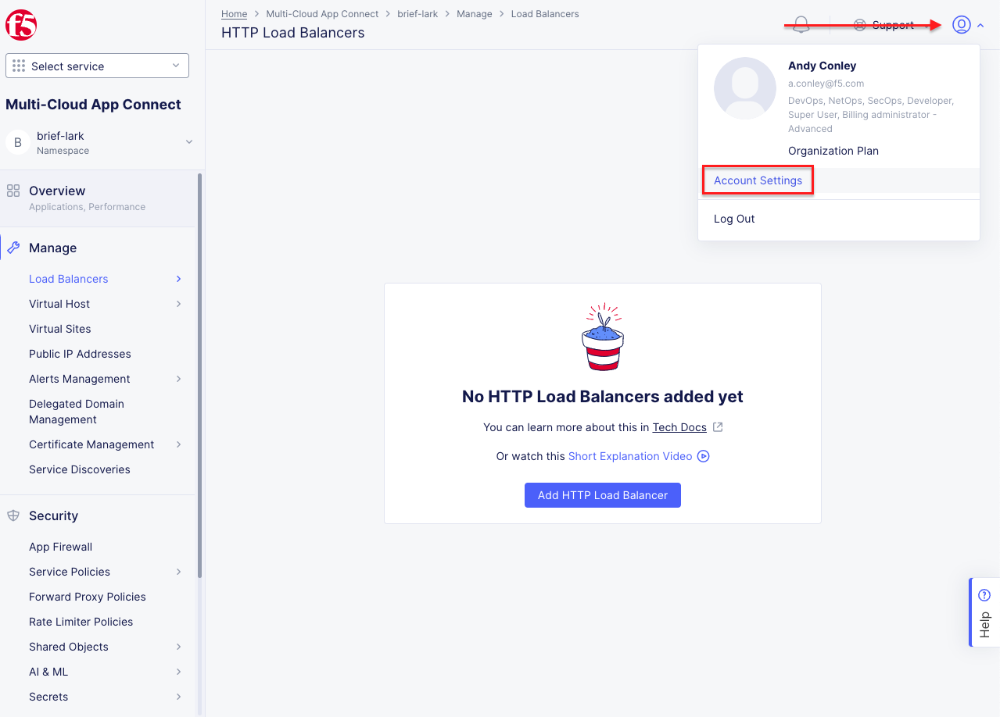
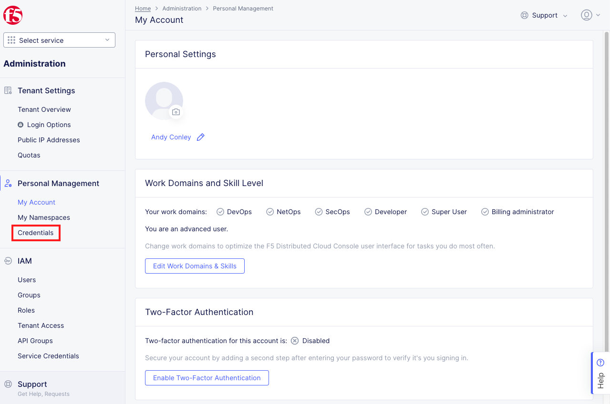
.. |lab1-Add_Credentials| image:: _static/lab1-Add_Credentials.png
   :width: 800px
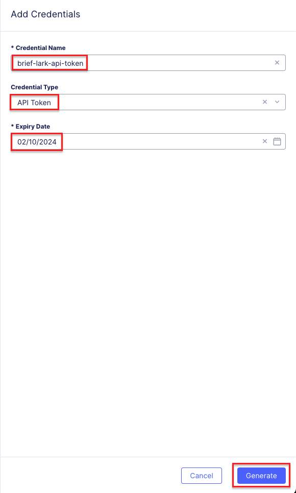
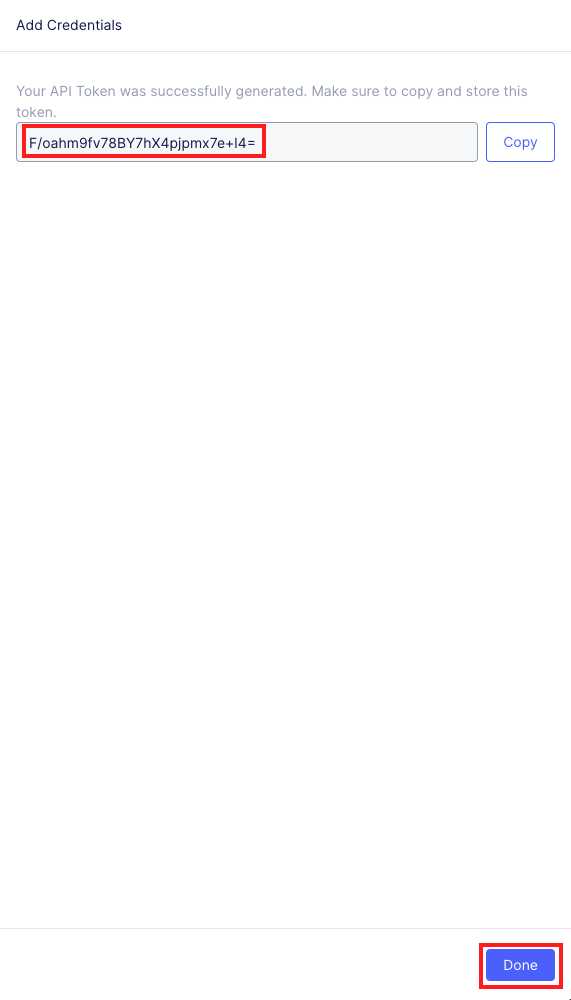
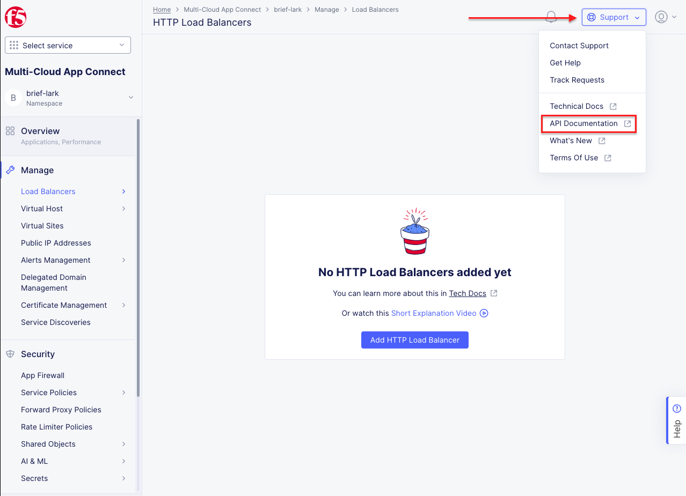
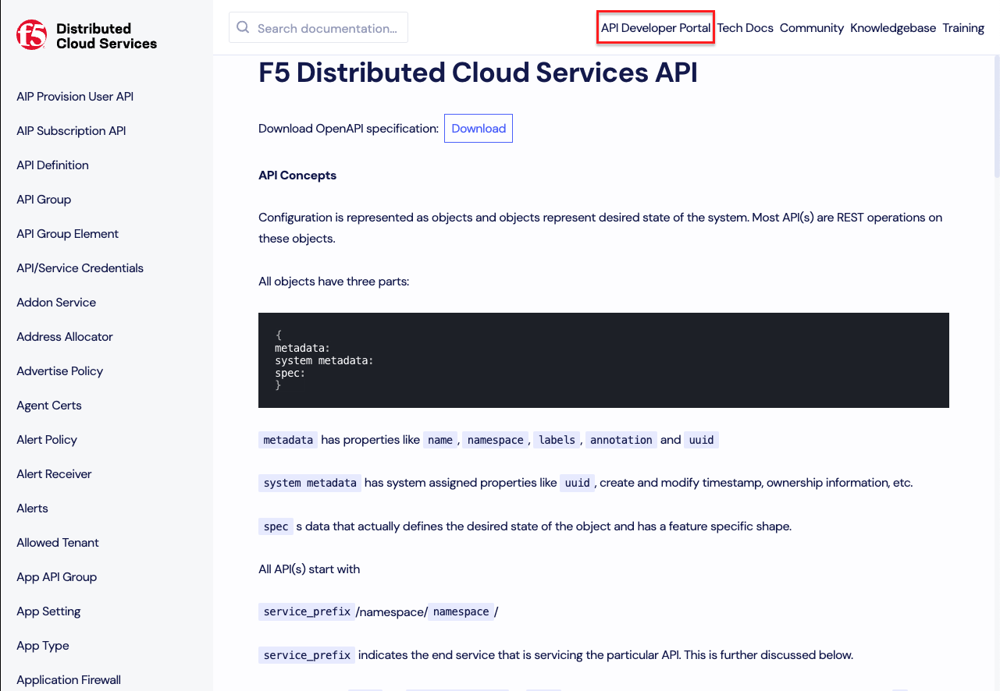
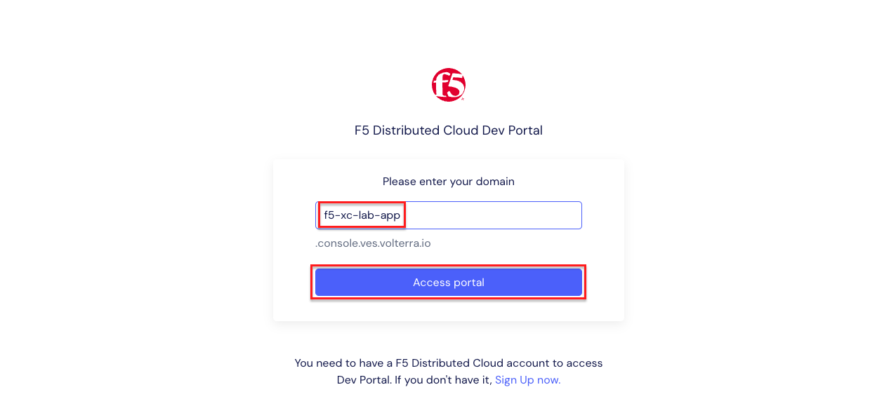
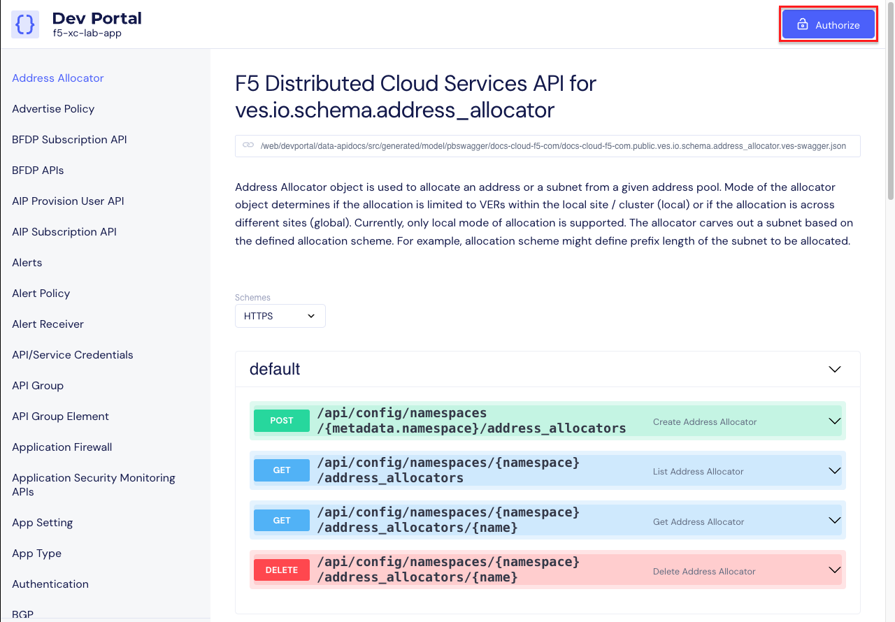
.. |lab1-Portal_Set_Token| image:: _static/lab1-Portal_Set_Token.png
   :width: 800px
.. |lab1-Portal_Namespace| image:: _static/lab1-Portal_Namespace.png
   :width: 800px
.. |lab1-Portal_Namespaces_Name| image:: _static/lab1-Portal_Namespaces_Name.png
   :width: 800px
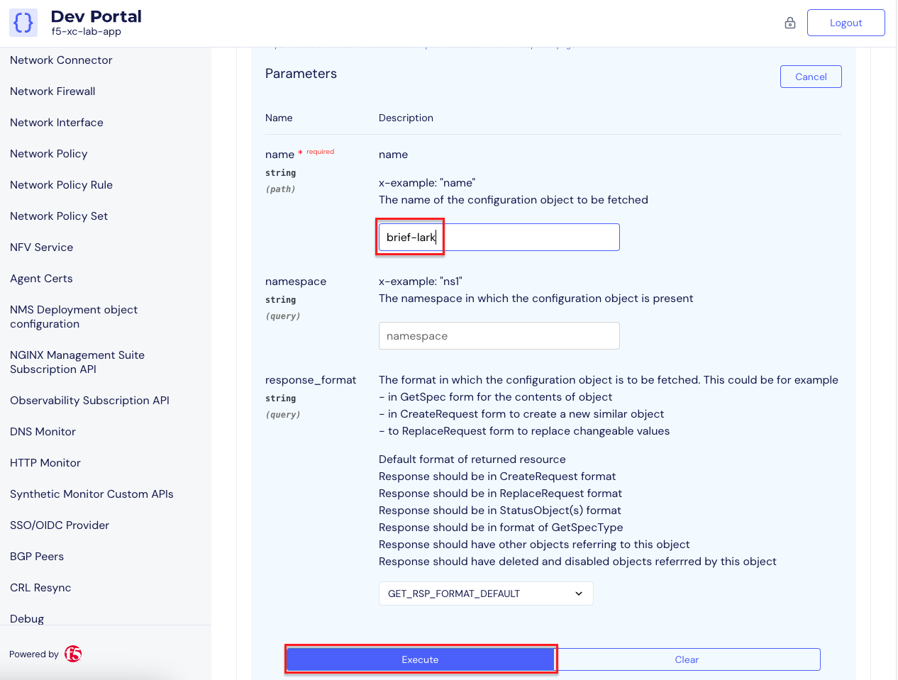
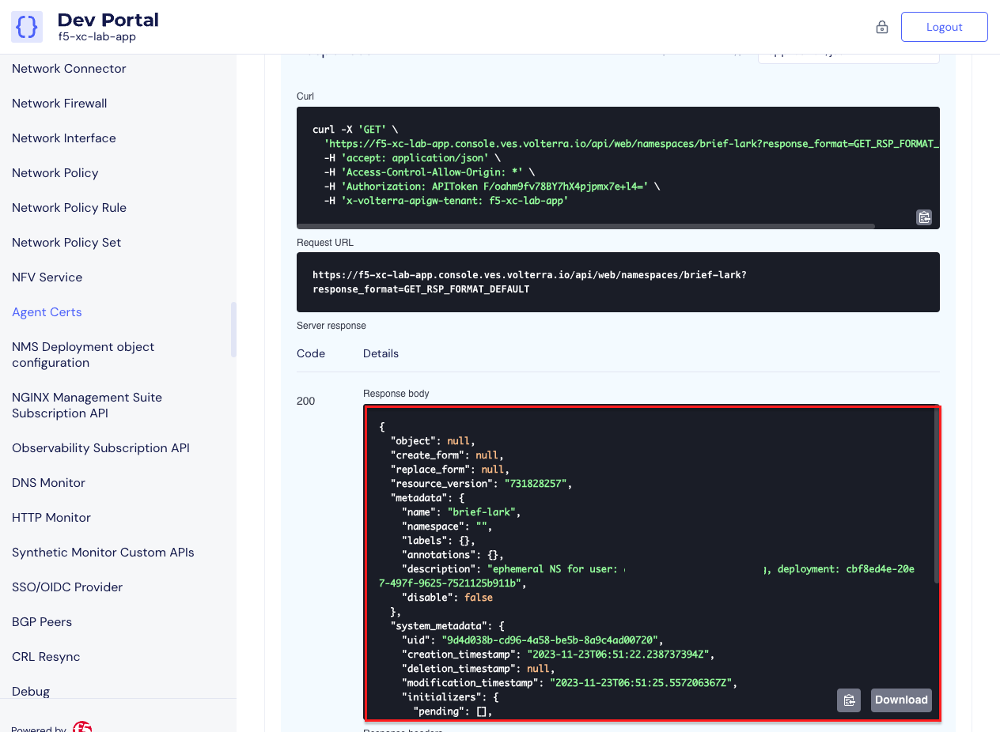
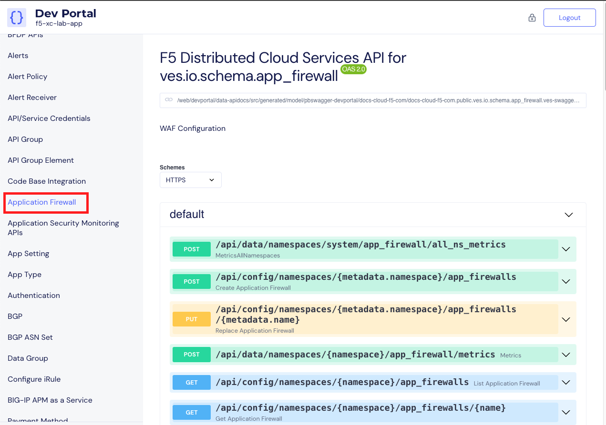
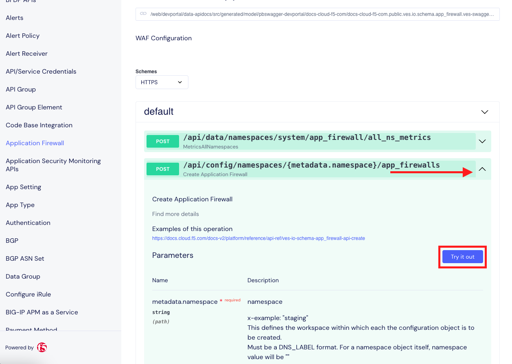
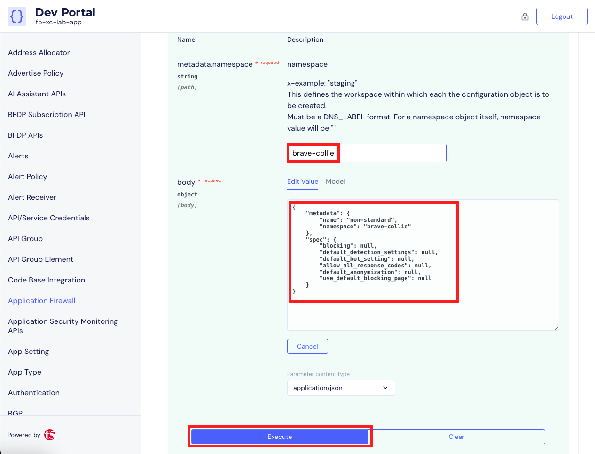
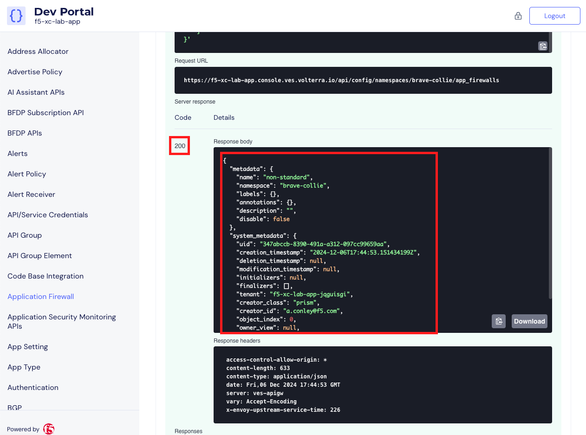
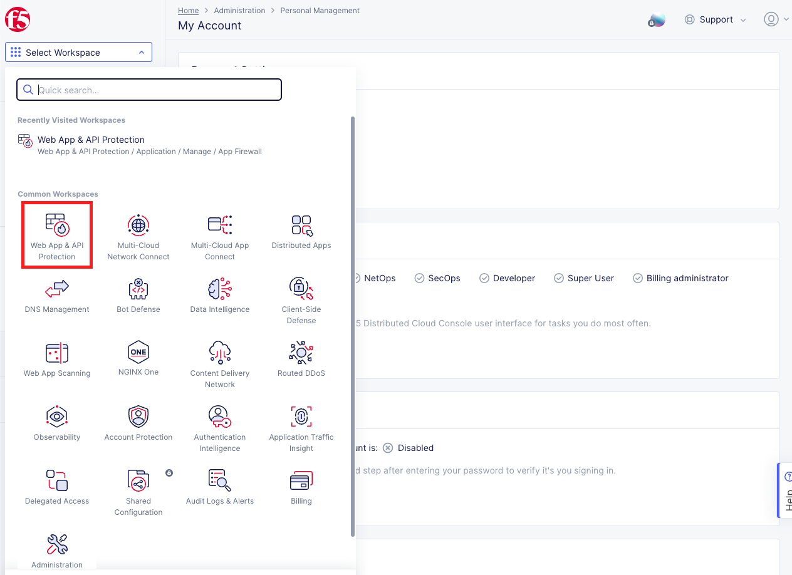

.. |labend| image:: _static/labend.png
   :width: 800px

