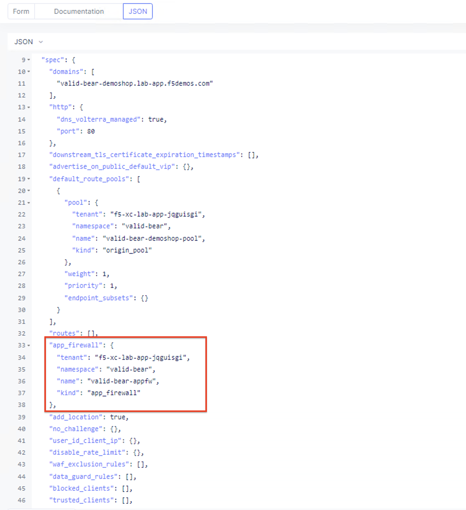

Lab 2: Operationalize Security Configurations
=============================================

The following lab tasks will guide you through using Postman to modify an existinga HTTP Load Balancer deployment
to apply a Web Application Firewall and Service Policy configuration. This lab demonstrates the use of the PUT 
method to modify an existing object in Distributed Cloud.  Students will then use the DELETE method to delete
the objects created in Lab 1 and Lab 2 in prepration for Lab 3.

**Expected Lab Time: 20 minutes**

Task 1: Create & Attach WAAP Policy  
~~~~~~~~~~~~~~~~~~~~~~~~~~~~~~~~~~~
In this task you will use Postman to create an Application Firewall policy with the default settings. Postman 
will then be used to attach the Application Firewall to the HTTP Load Balancer created in Lab 1. 

This lab will begin back in the Windows 10 client deployed as part of the UDF.

+---------------------------------------------------------------------------------------------------------------+
| 1. Return to **Postman**, in the workspace pane expand **Appworld - XC Automation** if it isn't already,      |
|                                                                                                               |
|    click on **Create App Firewall**, click on **Body**, and review the raw JSON content.                      |
|                                                                                                               |
| |lab2-Postman_AppFW_Body|                                                                                     |
+---------------------------------------------------------------------------------------------------------------+
| 2. Click **Send** to POST the JSON to the Distributed Cloud API.                                              |
|                                                                                                               |
| |lab2-Postman_AppFW_Send|                                                                                     |
+---------------------------------------------------------------------------------------------------------------+
| 3. Review the results in the **Body** section of Postman. You should see a 200 OK response code.              |
|                                                                                                               |
| |lab2-Postman_AppFW_Results|                                                                                  |
+---------------------------------------------------------------------------------------------------------------+

+---------------------------------------------------------------------------------------------------------------+
| 4. From **Postman**, in the workspace pane click on **Add App FW to HTTP Load Balancer**, click on **Body**,  |
|                                                                                                               |
|    and review the raw JSON content.                                                                           |
|                                                                                                               |
| |lab2-Postman_LB_AppFW_Body|                                                                                  |
+---------------------------------------------------------------------------------------------------------------+
| 5. Click **Send** to PUT the JSON to the Distributed Cloud API.                                               |
|                                                                                                               |
| |lab2-Postman_LB_AppFW_Send|                                                                                  |
+---------------------------------------------------------------------------------------------------------------+
| 6. Review the results in the **Body** section of Postman. You should see a 200 OK response code.              |
|                                                                                                               |
| |lab2-Postman_LB_AppFW_Results|                                                                               |
|                                                                                                               |
| .. note::                                                                                                     |
|    *Since you are modifying an existing object, you use the PUT method here instead of the POST method.*      |
+---------------------------------------------------------------------------------------------------------------+

+---------------------------------------------------------------------------------------------------------------+
| 7. From the Windows 10 client deployed as part of the UDF, open Chrome.                                       |
|                                                                                                               |
| |lab1-Chrome|                                                                                                 |
+---------------------------------------------------------------------------------------------------------------+
| 8. Click on the **XC Console** bookmark to be taken to the XC Console login.                                  |
|                                                                                                               |
| |lab1-XC_Bookmark|                                                                                            |
+---------------------------------------------------------------------------------------------------------------+
| 9. Enter your e-mail address in the **Email** form and password in the **Password** form and click **Sign**   |
|                                                                                                               |
|    **In**.                                                                                                    |
|                                                                                                               |
| |lab1-XC_Signin|                                                                                              |
+---------------------------------------------------------------------------------------------------------------+

+---------------------------------------------------------------------------------------------------------------+
| 10. Within the Distributed Cloud dashboard select the **Multi-Cloud App Connect** tile.                       |
|                                                                                                               |
| |lab1-XC_App_Connect|                                                                                         |
+---------------------------------------------------------------------------------------------------------------+
| 11. In the resulting screen, expand the **Manage** menu and click **Load Balancers** and then select          |
|                                                                                                               |
|     *HTTP Load Balancers**.                                                                                   |
|                                                                                                               |
| |lab1-XC_LB|                                                                                                  |
+---------------------------------------------------------------------------------------------------------------+
| 12. From the HTTP Load Balancers page, locate the HTTP Load Balancer that you created via Postman.  Click the |
|                                                                                                               |
|     **ellipsis** under **Actions** and select **Manage Configuration**.                                       |
|                                                                                                               |
| |lab1-XC_LB_Manage|                                                                                           |
+---------------------------------------------------------------------------------------------------------------+
| 13. From the resulting screen, review the HTTP Load Balancer configuration data and then click **JSON**.      |
|                                                                                                               |
| |lab1-XC_LB_JSON|                                                                                             |
+---------------------------------------------------------------------------------------------------------------+
| 14. Review the resulting JSON data.  The **app_firewall** section matches JSON from the body section of       |
|                                                                                                               |
|     Postman PUT that added the Web Application Firewall to the HTTP Load Balancer.                            |
|                                                                                                               |
| |lab2-XC_LB_AppFW_JSON_Data|                                                                                  |
|                                                                                                               |
| .. note::                                                                                                     |
|    *There may be slight variations in the JSON because you don't need to post default values when calling the*|
|                                                                                                               |
|    *API. If you want to automate a task in Distributed Cloud but are unsure of the required JSON, you can*    |
|                                                                                                               |
|    *configure a test object via the GUI and then use this JSON tab to get the corresponding JSON config.*     |
+---------------------------------------------------------------------------------------------------------------+
| 15. Click **Cancel and Exit** to close out the Load Balancer configuration.                                   |
+---------------------------------------------------------------------------------------------------------------+

Task 2: Create & Attach a Service Policy  
~~~~~~~~~~~~~~~~~~~~~~~~~~~~~~~~~~~~~~~~
In this task you will use Postman to create a Service Policy that only allows specific contries to access your 
application. Postman will then be used to attach the Service Policy to the HTTP Load Balancer created in Lab 1. 

+---------------------------------------------------------------------------------------------------------------+
| 1. Return to **Postman**, in the workspace pane expand **Appworld - XC Automation** if it isn't already,      |
|                                                                                                               |
|    click on **Create Service Policy**, click on **Body**, and review the raw JSON content.                    |
|                                                                                                               |
| |lab2-Postman_SP_Body|                                                                                        |
+---------------------------------------------------------------------------------------------------------------+
| 2. Click **Send** to POST the JSON to the Distributed Cloud API.                                              |
|                                                                                                               |
| |lab2-Postman_SP_Send|                                                                                        |
+---------------------------------------------------------------------------------------------------------------+
| 3. Review the results in the **Body** section of Postman. You should see a 200 OK response code.              |
|                                                                                                               |
| |lab2-Postman_SP_Results|                                                                                     |
+---------------------------------------------------------------------------------------------------------------+

+---------------------------------------------------------------------------------------------------------------+
| 4. From **Postman**, in the workspace pane click on **Add Service Policy to HTTP Load Balancer**, click on    |
|                                                                                                               |
|    **Body**, and review the raw JSON content.                                                                 |
|                                                                                                               |
| |lab2-Postman_LB_SP_Body|                                                                                     |
+---------------------------------------------------------------------------------------------------------------+
| 5. Click **Send** to PUT the JSON to the Distributed Cloud API.                                               |
|                                                                                                               |
| |lab2-Postman_LB_SP_Send|                                                                                     |
+---------------------------------------------------------------------------------------------------------------+
| 6. Review the results in the **Body** section of Postman. You should see a 200 OK response code.              |
|                                                                                                               |
| |lab2-Postman_LB_SP_Results|                                                                                  |
|                                                                                                               |
| .. note::                                                                                                     |
|    *Since you are modifying an existing object, you use the PUT method here instead of the POST method.*      |
+---------------------------------------------------------------------------------------------------------------+

+---------------------------------------------------------------------------------------------------------------+
| 7. From the Windows 10 client deployed as part of the UDF, open Chrome.                                       |
|                                                                                                               |
| |lab1-Chrome|                                                                                                 |
+---------------------------------------------------------------------------------------------------------------+
| 8. Click on the **XC Console** bookmark to be taken to the XC Console login.                                  |
|                                                                                                               |
| |lab1-XC_Bookmark|                                                                                            |
+---------------------------------------------------------------------------------------------------------------+
| 9. Enter your e-mail address in the **Email** form and password in the **Password** form and click **Sign**   |
|                                                                                                               |
|    **In**.                                                                                                    |
|                                                                                                               |
| |lab1-XC_Signin|                                                                                              |
+---------------------------------------------------------------------------------------------------------------+

+---------------------------------------------------------------------------------------------------------------+
| 10. Within the Distributed Cloud dashboard select the **Multi-Cloud App Connect** tile.                       |
|                                                                                                               |
| |lab1-XC_App_Connect|                                                                                         |
+---------------------------------------------------------------------------------------------------------------+
| 11. In the resulting screen, expand the **Manage** menu and click **Load Balancers** and then select          |
|                                                                                                               |
|     *HTTP Load Balancers**.                                                                                   |
|                                                                                                               |
| |lab1-XC_LB|                                                                                                  |
+---------------------------------------------------------------------------------------------------------------+
| 12. From the HTTP Load Balancers page, locate the HTTP Load Balancer that you created via Postman.  Click the |
|                                                                                                               |
|     **ellipsis** under **Actions** and select **Manage Configuration**.                                       |
|                                                                                                               |
| |lab1-XC_LB_Manage|                                                                                           |
+---------------------------------------------------------------------------------------------------------------+
| 13. From the resulting screen, review the HTTP Load Balancer configuration data and then click **JSON**.      |
|                                                                                                               |
| |lab1-XC_LB_JSON|                                                                                             |
+---------------------------------------------------------------------------------------------------------------+
| 14. Review the resulting JSON data.  The **app_firewall** section matches JSON from the body section of       |
|                                                                                                               |
|     Postman PUT that added the Web Application Firewall to the HTTP Load Balancer.                            |
|                                                                                                               |
| |lab2-XC_LB_SP_JSON_Data|                                                                                     |
|                                                                                                               |
| .. note::                                                                                                     |
|    *There may be slight variations in the JSON because you don't need to post default values when calling the*|
|                                                                                                               |
|    *API. If you want to automate a task in Distributed Cloud but are unsure of the required JSON, you can*    |
|                                                                                                               |
|    *configure a test object via the GUI and then use this JSON tab to get the corresponding JSON config.*     |
+---------------------------------------------------------------------------------------------------------------+
| 15. Click **Cancel and Exit** to close out the Load Balancer configuration.                                   |
+---------------------------------------------------------------------------------------------------------------+

Task 3: Delete the Objects Created with Postman
~~~~~~~~~~~~~~~~~~~~~~~~~~~~~~~~~~~~~~~~~~~~~~~~
In this task you will use Postman to delete the HTTP Load Balancer, Service Policy, App Firewall, Origin Pool, 
and Health Check.  This demonstrates how to use Postman to delete objects when they are no longer needed, and
cleans up the environment in prepation for Lab3.

+---------------------------------------------------------------------------------------------------------------+
| 1. Return to **Postman**, in the workspace pane expand **Appworld - XC Automation** if it isn't already,      |
|                                                                                                               |
|    click on **Delete HTTP Load Balancer**, click on **Send**.                                                 |
|                                                                                                               |
| |lab2-Postman_LB_Delete_Send|                                                                                 |
+---------------------------------------------------------------------------------------------------------------+
| 2. Review the results in the **Body** section of Postman. You should see a 200 OK response code.              |
|                                                                                                               |
| |lab2-Postman_LB_Delete_Results|                                                                              |
+---------------------------------------------------------------------------------------------------------------+

+---------------------------------------------------------------------------------------------------------------+
| 3. From **Postman**, in the workspace pane click on **Delete Service Policy** and click **Send**.             |
|                                                                                                               |
| |lab2-Postman_SP_Delete_Send|                                                                                 |
+---------------------------------------------------------------------------------------------------------------+
| 4. Review the results in the **Body** section of Postman. You should see a 200 OK response code.              |
|                                                                                                               |
| |lab2-Postman_SP_Delete_Results|                                                                              |
+---------------------------------------------------------------------------------------------------------------+

+---------------------------------------------------------------------------------------------------------------+
| 5. From **Postman**, in the workspace pane click on **Delete App Firewall** and click **Send**.               |
|                                                                                                               |
| |lab2-Postman_AppFW_Delete_Send|                                                                              |
+---------------------------------------------------------------------------------------------------------------+
| 6. Review the results in the **Body** section of Postman. You should see a 200 OK response code.              |
|                                                                                                               |
| |lab2-Postman_AppFW_Delete_Results|                                                                           |
+---------------------------------------------------------------------------------------------------------------+

+---------------------------------------------------------------------------------------------------------------+
| 7. From **Postman**, in the workspace pane click on **Delete Origin Pool** and click **Send**.                |
|                                                                                                               |
| |lab2-Postman_Pool_Delete_Send|                                                                               |
+---------------------------------------------------------------------------------------------------------------+
| 8. Review the results in the **Body** section of Postman. You should see a 200 OK response code.              |
|                                                                                                               |
| |lab2-Postman_Pool_Delete_Results|                                                                            |
+---------------------------------------------------------------------------------------------------------------+

+---------------------------------------------------------------------------------------------------------------+
| 9. From **Postman**, in the workspace pane click on **Delete Health Check** and click **Send**.               |
|                                                                                                               |
| |lab2-Postman_HC_Delete_Send|                                                                                 |
+---------------------------------------------------------------------------------------------------------------+
| 10. Review the results in the **Body** section of Postman. You should see a 200 OK response code.             |
|                                                                                                               |
| |lab2-Postman_HC_Delete_Results|                                                                              |
+---------------------------------------------------------------------------------------------------------------+

+---------------------------------------------------------------------------------------------------------------+
| **End of Lab 2:**  This concludes Lab 2. In this lab you learned how to use Postman to create an Web          |
|                                                                                                               |
| Application Firewall policy and Service Policy. You then used Postman to modify the HTTP Load Balancer you    |
|                                                                                                               |
| created in Lab 1 and apply the Web Application Firewall and Service policy. Lastly you used Postman to delete |
|                                                                                                               |
| all of the configuration from Lab 1 and Lab 2 in preperation for Lab 3.                                       |
|                                                                                                               |
| A brief presentation will be shared prior to the beginning of Lab 3.                                          |
|                                                                                                               |
| |labend|                                                                                                      |
+---------------------------------------------------------------------------------------------------------------+

.. |lab2-Postman_AppFW_Body| image:: _static/lab2-Postman_AppFW_Body.png
   :width: 800px
.. |lab2-Postman_AppFW_Send| image:: _static/lab2-Postman_AppFW_Send.png
   :width: 800px
.. |lab2-Postman_AppFW_Results| image:: _static/lab2-Postman_AppFW_Results.png
   :width: 800px
.. |lab2-Postman_LB_AppFW_Body| image:: _static/lab2-Postman_LB_AppFW_Body.png
   :width: 800px
.. |lab2-Postman_LB_AppFW_Send| image:: _static/lab2-Postman_LB_AppFW_Send.png
   :width: 800px
.. |lab2-Postman_LB_AppFW_Results| image:: _static/lab2-Postman_LB_AppFW_Results.png
   :width: 800px
.. |lab1-Chrome| image:: _static/lab1-Chrome.png
   :width: 800px
.. |lab1-XC_Bookmark| image:: _static/lab1-XC_Bookmark.png
   :width: 800px
.. |lab1-XC_Signin| image:: _static/lab1-XC_Signin.png
   :width: 800px
.. |lab1-XC_App_Connect| image:: _static/lab1-XC_App_Connect.png
   :width: 800px
.. |lab1-XC_LB| image:: _static/lab1-XC_LB.png
   :width: 800px
.. |lab1-XC_LB_Manage| image:: _static/lab1-XC_LB_Manage.png
   :width: 800px
.. |lab1-XC_LB_JSON| image:: _static/lab1-XC_LB_JSON.png
   :width: 800px

.. |lab2-Postman_SP_Body| image:: _static/lab2-Postman_SP_Body.png
   :width: 800px
.. |lab2-Postman_SP_Send| image:: _static/lab2-Postman_SP_Send.png
   :width: 800px
.. |lab2-Postman_SP_Results| image:: _static/lab2-Postman_SP_Results.png
   :width: 800px
.. |lab2-Postman_LB_SP_Body| image:: _static/lab2-Postman_LB_SP_Body.png
   :width: 800px
.. |lab2-Postman_LB_SP_Send| image:: _static/lab2-Postman_LB_SP_Send.png
   :width: 800px
.. |lab2-Postman_LB_SP_Results| image:: _static/lab2-Postman_LB_SP_Results.png
   :width: 800px
.. |lab2-XC_LB_SP_JSON_Data| image:: _static/lab2-XC_LB_SP_JSON_Data.png
   :width: 800px
.. |lab2-Postman_LB_Delete_Send| image:: _static/lab2-Postman_LB_Delete_Send.png
   :width: 800px
.. |lab2-Postman_LB_Delete_Results| image:: _static/lab2-Postman_LB_Delete_Results.png
   :width: 800px
.. |lab2-Postman_SP_Delete_Send| image:: _static/lab2-Postman_SP_Delete_Send.png
   :width: 800px
.. |lab2-Postman_SP_Delete_Results| image:: _static/lab2-Postman_SP_Delete_Results.png
   :width: 800px
.. |lab2-Postman_AppFW_Delete_Send| image:: _static/lab2-Postman_AppFW_Delete_Send.png
   :width: 800px
.. |lab2-Postman_AppFW_Delete_Results| image:: _static/lab2-Postman_AppFW_Delete_Results.png
   :width: 800px
.. |lab2-Postman_Pool_Delete_Send| image:: _static/lab2-Postman_Pool_Delete_Send.png
   :width: 800px
.. |lab2-Postman_Pool_Delete_Results| image:: _static/lab2-Postman_Pool_Delete_Results.png
   :width: 800px
.. |lab2-Postman_HC_Delete_Send| image:: _static/lab2-Postman_HC_Delete_Send.png
   :width: 800px
.. |lab2-Postman_HC_Delete_Results| image:: _static/lab2-Postman_HC_Delete_Results.png
   :width: 800px
.. |labend| image:: _static/labend.png
   :width: 800px