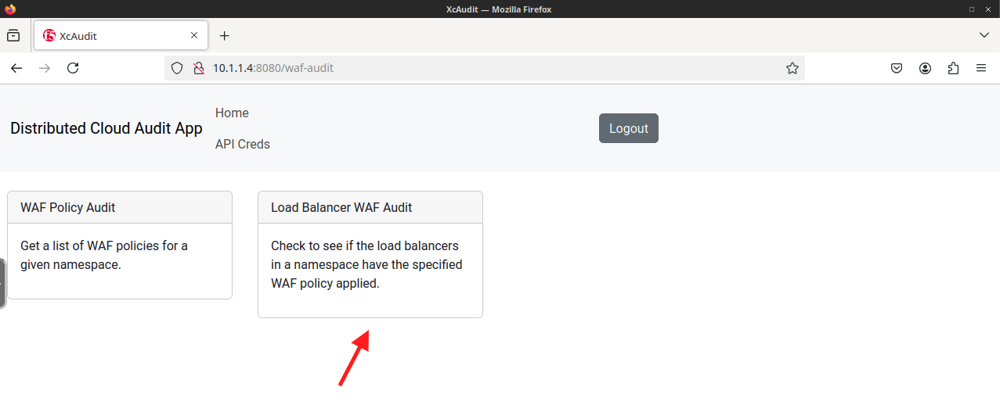
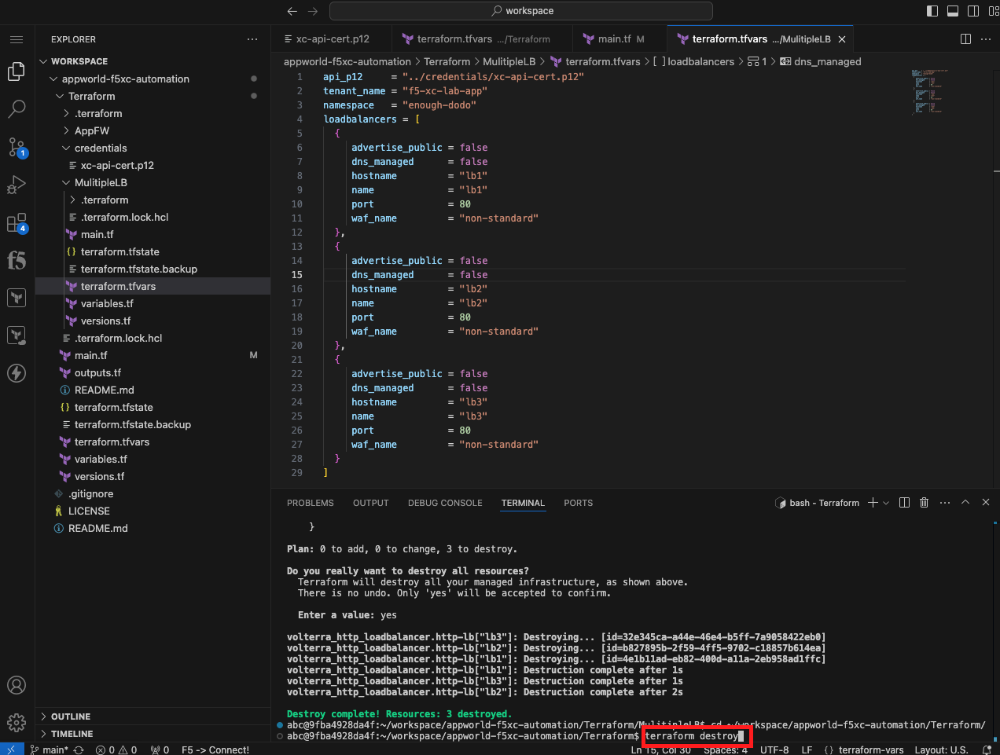
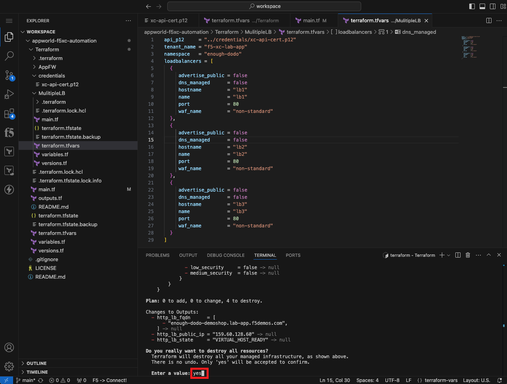

Lab 3: Utilize Automation to Audit XC Configurations
====================================================

The following lab tasks will guide you through using automation to audit deployed configurations within
Distributed Cloud.  Terraform will be utilized to deploy multiple HTTP Load balancers so that their 
configurations can be compared against a desired configuration state. A custom python API backend with a 
web front end will then be utilized to compare the HTTP Load balancer states.

**Expected Lab Time: 40 minutes**

Task 1: Deploy multiple HTTP load balanceres with Terraform  
~~~~~~~~~~~~~~~~~~~~~~~~~~~~~~~~~~~~~~~~~~~~~~~~~~~~~~~~~~~
In this task, you will create a **tfvars** file to specify environment variables unique to your environment.
This **tfvars** file is slightly more advanced than the file used in **Lab 2**.  This **tfvars** file utilizes a
list object to specify mulitple key value pairs for each load balancer you want to create.  The list object is 
utilized within a **for** expression within the Terraform **resource** to loop through each item in the list.
This allows Terraform to create multiple objects using a single resource definition.  After the **tfvars** file
is created, you will **intialize**, **plan**, and **apply** your Terraform configuration to create multiple HTTP 
load balancers within your namespace. 

+---------------------------------------------------------------------------------------------------------------+
| **Create a tfvars File for Specifying Environment Specific Variables**                                        |
+===============================================================================================================+
| 1. If you aren't already in the **Visual Studio Code** browser tab, select that tab.  If you closed the tab   |
|                                                                                                               |
|    you can re-open **Visual Studio Code** by opening your UDF deployment and clicking on the **VS CODE**      |
|                                                                                                               |
|    Access method under the **Client** system.                                                                 |
+---------------------------------------------------------------------------------------------------------------+
| 2. From the **EXPLORER** panel within Visual Studio Code, right click the **MultipleLB** folder, and then     |
|                                                                                                               |
|    select new file. Enter the name **terraform.tfvars** for the new file that is created and press enter.     |
|                                                                                                               |
| |lab3-Terraform_Tfvars|                                                                                       |
|                                                                                                               |
| .. note::                                                                                                     |
|    *Make sure you are right clicking on the MultipLB folder.  We want to create this terraform.tfvars file    |     
|    *within that directory so it only applies to the configuration within that same directory.*                |
+---------------------------------------------------------------------------------------------------------------+
| 3. This will open the **terraform.tfvars** file in the right panel of Visual Studio Code, enter the following |
|                                                                                                               |
|    values into the file:                                                                                      |
|                                                                                                               |
| .. code-block:: bash                                                                                          |
|                                                                                                               |
|    api_p12     = "../credentials/xc-api-cert.p12"                                                             |
|    tenant_name = "f5-xc-lab-app"                                                                              |
|    namespace   = "<namespace>"                                                                                |
|    loadbalancers = [                                                                                          |
|      {                                                                                                        |
|         advertise_public = false                                                                              |
|         dns_managed      = false                                                                              |
|         hostname         = "lb1"                                                                              |
|         name             = "lb1"                                                                              |
|         port             = 80                                                                                 |
|         waf_name         = "non-standard"                                                                     |
|      },                                                                                                       |
|      {                                                                                                        |
|         advertise_public = false                                                                              |
|         dns_managed      = false                                                                              |
|         hostname         = "lb2"                                                                              |
|         name             = "lb2"                                                                              |
|         port             = 80                                                                                 |
|         waf_name         = "non-standard"                                                                     |
|      },                                                                                                       |
|      {                                                                                                        |
|         advertise_public = false                                                                              |
|         dns_managed      = false                                                                              |
|         hostname         = "lb3"                                                                              |
|         name             = "lb3"                                                                              |
|         port             = 80                                                                                 |
|         waf_name         = "non-standard"                                                                     |
|      }                                                                                                        |
|    ]                                                                                                          |
|                                                                                                               |
| |lab3-Terraform_Tfvars_Values|                                                                                |
|                                                                                                               |
| .. note::                                                                                                     |
|    *Replace <namespace> with your assigned namespace. You need to wrap the namespace in "". If your assigned* |     
|    *namespace is brave-collie, enter: namespace = "brave-collie"*                                             |
+---------------------------------------------------------------------------------------------------------------+

+---------------------------------------------------------------------------------------------------------------+
| **Initialize, Plan, and Apply Your Terraform Code**                                                           |
+===============================================================================================================+
| 1. In the Terminal at the bottom of Visual Studio Code, change directory into the **MultipleLB** folder.:     |
|                                                                                                               |
| .. code-block:: bash                                                                                          |
|                                                                                                               |
|    cd ~/workspace/appworld-f5xc-automation/Terraform/MulitipleLB/                                             |
|                                                                                                               |
| |lab3-Terraform_Deploy_Directory|                                                                             |
+---------------------------------------------------------------------------------------------------------------+
| 2. In the Terminal at the bottom of Visual Studio Code, run the following command to initialize the Terraform |
|                                                                                                               |
|    environment:                                                                                               |
|                                                                                                               |
| .. code-block:: bash                                                                                          |
|                                                                                                               |
|    terraform init                                                                                             |
|                                                                                                               |
| |lab3-Terraform_Deploy_Init|                                                                                  |
+---------------------------------------------------------------------------------------------------------------+
| 3. Review the Init Results. You should see a **Terraform has been successfully initialized!** message.        |
|                                                                                                               |
|    **DO NOT PROCEED AND ASK A LAB ASSISTANT FOR HELP IF YOU DON'T SEE THE SUCCESSFULLY INITIALIZED MESSAGE.** |
|                                                                                                               |
| |lab3-Terraform_Deploy_Init_Success|                                                                          |
+---------------------------------------------------------------------------------------------------------------+
| 4. In the Terminal, enter the following command and press Enter:                                              |
|                                                                                                               |
| .. code-block:: bash                                                                                          |
|                                                                                                               |
|    terraform plan                                                                                             |
|                                                                                                               |
| |lab3-Terraform_Deploy_Plan|                                                                                  |
+---------------------------------------------------------------------------------------------------------------+
| 5. Review the Plan results. This shows what Terraform is planning to create.                                  |
|                                                                                                               |
| |lab3-Terraform_Deploy_Plan_Results|                                                                          |
+---------------------------------------------------------------------------------------------------------------+
| 6. In the Terminal, enter the following command and press Enter:                                              |
|                                                                                                               |
| .. code-block:: bash                                                                                          |
|                                                                                                               |
|    terraform apply                                                                                            |
|                                                                                                               |
| |lab3-Terraform_Deploy_Apply|                                                                                 |
+---------------------------------------------------------------------------------------------------------------+
| 7. When prompted **Do you want to perform these actions?**, type **yes** and press Enter.                     |
|                                                                                                               |
| |lab3-Terraform_Deploy_Apply_Yes|                                                                             |
+---------------------------------------------------------------------------------------------------------------+
| 8. Review the Apply results. This shows what Terraform created.                                               |
|                                                                                                               |
| |lab3-Terraform_Deploy_Apply_Results|                                                                         |
+---------------------------------------------------------------------------------------------------------------+

Task 2: Audit your load balancer configurations 
~~~~~~~~~~~~~~~~~~~~~~~~~~~~~~~~~~~~~~~~~~~~~~~
In this task, you will use a custom written web frontend and python API backend to audit your Distributed Cloud
load balancer configurations.  The python API backend utilizes the Distributed Cloud API to gather information 
from Distributed Cloud and format or tranform that data for presentation in the Web frontend.  Creating the web 
frontend and python API backend are beyond the scope of this lab, but the source code is available if you would 
like to review outside of the lab.

Web Frontend API - https://github.com/aconley245/xc-audit

Python API Backend - https://github.com/aconley245/xc-audit-api

+---------------------------------------------------------------------------------------------------------------+
| **Use the XcAudit Web Application**                                                                           |
+===============================================================================================================+
| 1. Open Firefox from your UDF deployment by clicking on the **FIREFOX** Access method under the **Client**    |
|                                                                                                               |
|    system.                                                                                                    |
+---------------------------------------------------------------------------------------------------------------+
| 2. Firefox should load the XcAudit Web App by default, but if it doesn't enter http://10.1.1.4:8080 into the  |
|                                                                                                               |
|    url bar in Firefox.                                                                                        |
|                                                                                                               |
| |lab3-XcAudit_Firefox_Url|                                                                                    |
+---------------------------------------------------------------------------------------------------------------+
| 3. Enter **f5-xc-lab-app** in the Distributed Cloud Tenant field and your API Token value in the Distributed  |
|                                                                                                               |
|    Cloud API Token field and then click **Submit**.                                                           |
|                                                                                                               |
| |lab3-XcAudit_Token|                                                                                          |
|                                                                                                               |
| .. note::                                                                                                     |
|    *If you didn't save your API Token, you can create a new one following the procedure outlined in Lab 1.*   |
+---------------------------------------------------------------------------------------------------------------+
| 4. An Alert pop up will let you know that your Distributed Cloud Credentials have been saved.  Click **OK**.  |
|                                                                                                               |
| |lab3-XcAudit_Token_Ok|                                                                                       |
+---------------------------------------------------------------------------------------------------------------+
| 5. Click on the **WAF Audit** tile to Audit your deployed WAF policies.                                       |
|                                                                                                               |
| |lab3-XcAudit_WafAudit|                                                                                       |
+---------------------------------------------------------------------------------------------------------------+
| 6. Click on the **Load Balancer WAF Audit** tile to Audit your deployed load balancers.                       |
|                                                                                                               |
| |lab3-XcAudit_WafAudit_Lb|                                                                                    |
+---------------------------------------------------------------------------------------------------------------+
| 7. Select your Namespace from the **Select Namespace** dropdown and then select the WAF policy that you want  |
|                                                                                                               |
|    to audit against from the **Select WAF Policy** dropdown.  In a few seconds, the table will populate       |
|                                                                                                               |
|    showing all of the configured load balancers and their configured WAF policy name.  If the WAF policy      |
|                                                                                                               |
|    matches the WAF policy matches the WAF policy selected, the table row will be highlighted in green.  If the|
|                                                                                                               |
|    WAF policy doesn't match or if a WAF policy is not defined, the table row will be highlighted in yellow.   |
|                                                                                                               |
| |lab3-XcAudit_WafAudit_Lb_Results|                                                                            |
+---------------------------------------------------------------------------------------------------------------+

Task 3: Modify the MulitipleLB Terraform configuration so the load balancers are using different WAF policies   
~~~~~~~~~~~~~~~~~~~~~~~~~~~~~~~~~~~~~~~~~~~~~~~~~~~~~~~~~~~~~~~~~~~~~~~~~~~~~~~~~~~~~~~~~~~~~~~~~~~~~~~~~~~~~
In this task, you will modify your MultiLB Terraform configuration so the load balancers are using different WAF
policies and then verify the changes in the XcAudit web application.  This task is designed to use the skills you
have learned in the previous tasks/labs and does not include detailed step by step directions.  

+---------------------------------------------------------------------------------------------------------------+
| **Modify the MulitipleLB Terraform Configuration**                                                            |
+===============================================================================================================+
| 1. Modify the MulitipleLB Terraform configuration so the configured load balancers are using the WAF policy   |
|                                                                                                               |
|    that was created in Lab 2.                                                                                 |
|                                                                                                               |
| .. note::                                                                                                     |
|    *You do not need to modify the main.tf file to accomplish this step.*                                      |     
+---------------------------------------------------------------------------------------------------------------+
| 2. Plan and apply your new configuration.                                                                     |
+---------------------------------------------------------------------------------------------------------------+
| 3. Verify the results within the XcAudit web application.                                                     |
+---------------------------------------------------------------------------------------------------------------+

Task 4: Clean up the Distributed Cloud environment   
~~~~~~~~~~~~~~~~~~~~~~~~~~~~~~~~~~~~~~~~~~~~~~~~~~
In this task, you will remove the load balancers you created using the Terraform destroy command.

+---------------------------------------------------------------------------------------------------------------+
| **Clean up the Distributed Cloud environment**                                                                |
+===============================================================================================================+
| 1. If you aren't already in the **Visual Studio Code** browser tab, select that tab.  If you closed the tab   |
|                                                                                                               |
|    you can re-open **Visual Studio Code** by opening your UDF deployment and clicking on the **VS CODE**      |
|                                                                                                               |
|    Access method under the **Client** system.                                                                 |
+---------------------------------------------------------------------------------------------------------------+
| 2. In the Terminal at the bottom of Visual Studio Code, change directory into the **MultipleLB** folder.:     |
|                                                                                                               |
| .. code-block:: bash                                                                                          |
|                                                                                                               |
|    cd ~/workspace/appworld-f5xc-automation/Terraform/MulitipleLB/                                             |
|                                                                                                               |
| |lab3-Terraform_Deploy_Directory|                                                                             |
+---------------------------------------------------------------------------------------------------------------+
| 3. In the Terminal, enter the following command and press Enter:                                              |
|                                                                                                               |
| .. code-block:: bash                                                                                          |
|                                                                                                               |
|    terraform destroy                                                                                          |
|                                                                                                               |
| |lab3-Terraform_Destroy|                                                                                      |
+---------------------------------------------------------------------------------------------------------------+
| 4. When prompted **Do you really want to destroy all resources?**, type **yes** and press Enter.              |
|                                                                                                               |
| |lab3-Terraform_Destroy_Yes|                                                                                  |
+---------------------------------------------------------------------------------------------------------------+
| 5. Review the results and verify that the three load balancers were destroyed.                                |
|                                                                                                               |
| |lab3-Terraform_Destroy_Results|                                                                              |
+---------------------------------------------------------------------------------------------------------------+
| 6. In the Terminal at the bottom of Visual Studio Code, change directory into the **Terraform** folder.:      |
|                                                                                                               |
| .. code-block:: bash                                                                                          |
|                                                                                                               |
|    cd ~/workspace/appworld-f5xc-automation/Terraform/                                                         |
|                                                                                                               |
| |lab3-Terraform_Destroy_Directory|                                                                            |
+---------------------------------------------------------------------------------------------------------------+
| 7. In the Terminal, enter the following command and press Enter:                                              |
|                                                                                                               |
| .. code-block:: bash                                                                                          |
|                                                                                                               |
|    terraform destroy                                                                                          |
|                                                                                                               |
| |lab3-Terraform_Destroy2|                                                                                     |
+---------------------------------------------------------------------------------------------------------------+
| 8. When prompted **Do you really want to destroy all resources?**, type **yes** and press Enter.              |
|                                                                                                               |
| |lab3-Terraform_Destroy2_Yes|                                                                                 |
+---------------------------------------------------------------------------------------------------------------+
| 9. Review the results and verify that the three load balancers were destroyed.                                |
|                                                                                                               |
| |lab3-Terraform_Destroy2_Results|                                                                             |
+---------------------------------------------------------------------------------------------------------------+

+---------------------------------------------------------------------------------------------------------------+
| **End of Lab 3**                                                                                              |
+===============================================================================================================+
| This concludes Lab 3. In this lab, you learned how to use a for loop in Terraform to create multiple objects  |
|                                                                                                               |
| from a single Terraform resource block.  You then utilized the XcAudit Web Application to audit the WAF       |
|                                                                                                               |
| policies applied to the load balancers within your namespace. Finally you used the **terraform destroy**      |
|                                                                                                               |
| command to remove all of the Distributed Cloud objects that you created using Terraform.                      |
+---------------------------------------------------------------------------------------------------------------+
| |labend|                                                                                                      |
+---------------------------------------------------------------------------------------------------------------+

.. |lab3-Terraform_Deploy_Plan| image:: _static/lab3-Terraform_Deploy_Plan.png
   :width: 800px

.. |labend| image:: _static/labend.png
   :width: 800px