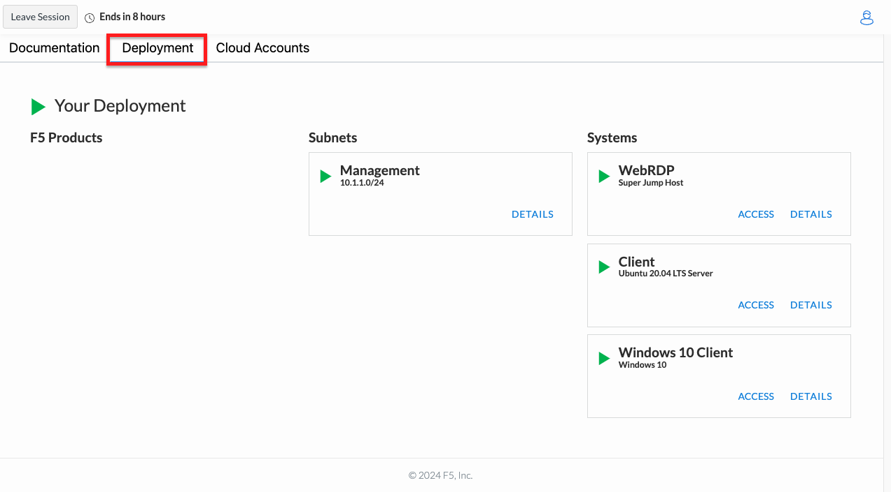
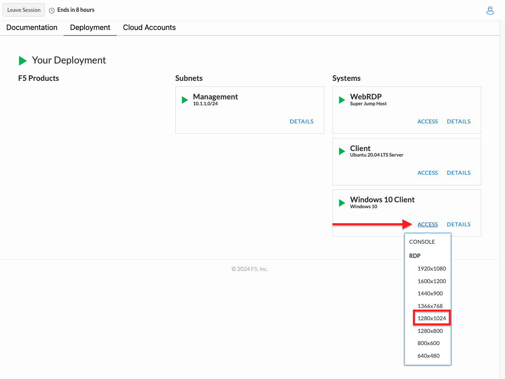

RDP Client
==========

If you don't already have an RDP client installed, you can download the RDP client that corresponds to your
operating system by following the links below.

+-------------------+-------------------------------------------------------------------------------------------+
| Operating System  | Documentation and Download Link                                                           | 
+===================+===========================================================================================+
| macOS             | `Remote Desktop Mac`_                                                                     |
+-------------------+-------------------------------------------------------------------------------------------+
| iOS/iPadOS        | `Remote Desktop iOS`_                                                                     |
+-------------------+-------------------------------------------------------------------------------------------+
| Android/Chrome OS | `Remote Desktop Android`_                                                                 |
+-------------------+-------------------------------------------------------------------------------------------+
| Linux             | `Remote Desktop Linux`_                                                                   |
+-------------------+-------------------------------------------------------------------------------------------+

The username and password for the Windows 10 host are:

+----------------------+----------------------+
| Username             | Password             | 
+======================+======================+
| .. code-block:: bash | .. code-block:: bash | 
|                      |                      |
|  labuser             |  F5L@bUser!          |
+----------------------+----------------------+

+---------------------------------------------------------------------------------------------------------------+
| Accessing the UDF Windows 10 Client via RDP                                                                   |
+===============================================================================================================+
| 1. From the Webrowser tab that you used to login to the UDF environment, select **Deployment** if you aren't  |
|                                                                                                               |
|    already there.                                                                                             |
|                                                                                                               |
| |lab1-RDP_Client_Deployment|                                                                                  |
|                                                                                                               |
| 2. On the Deployment screen click the **ACCESS** link under the **Windows 10 Client** and choose the screen   |
|                                                                                                               |
|    resolution you would like to use under RDP.  This will start the download of a .rdp file with the RDP      |
|                                                                                                               |
|    connection information.                                                                                    |
|                                                                                                               |
| |lab1-RDP_Client_Download|                                                                                    |
|                                                                                                               |
| .. note::                                                                                                     |
|    *This will start the download of a .rdp file with RDP connection information. Please note where you saved* |
|    *this file.*                                                                                               |
|                                                                                                               |
| 3. Open the .rdp file you downloaded in step 3. This file should automatically open in your RDP client.       |
|                                                                                                               |
| 4. Enter **labuser** for the Username and **F5L@bUser!** for the password then click **Continue**.            |
|                                                                                                               |
| |lab1-RDP_Client_Login|                                                                                       |
|                                                                                                               |
| .. note::                                                                                                     |
|    *Your RDP client may look different depending on the operating system you are using.*                      |
|                                                                                                               |
| 5. You should now be logged into the Windows 10 client virtual machine.                                       |
|                                                                                                               |
| |lab1-RDP_Windows10_Desktop|                                                                                  |
+---------------------------------------------------------------------------------------------------------------+

.. _Remote Desktop Mac: https://learn.microsoft.com/en-us/windows-server/remote/remote-desktop-services/clients/remote-desktop-mac/
.. _Remote Desktop iOS: https://learn.microsoft.com/en-us/windows-server/remote/remote-desktop-services/clients/remote-desktop-ios/
.. _Remote Desktop Android: https://learn.microsoft.com/en-us/windows-server/remote/remote-desktop-services/clients/remote-desktop-android/
.. _Remote Desktop Linux: https://remmina.org/ 

.. |lab1-RDP_Client_Windows10| image:: _static/lab1-RDP_Client_Windows10.png
   :width: 800px

.. |lab1-RDP_Client_Login| image:: _static/lab1-RDP_Client_Login.png
   :width: 800px
.. |lab1-RDP_Windows10_Desktop| image:: _static/lab1-RDP_Windows10_Desktop.png
   :width: 800px