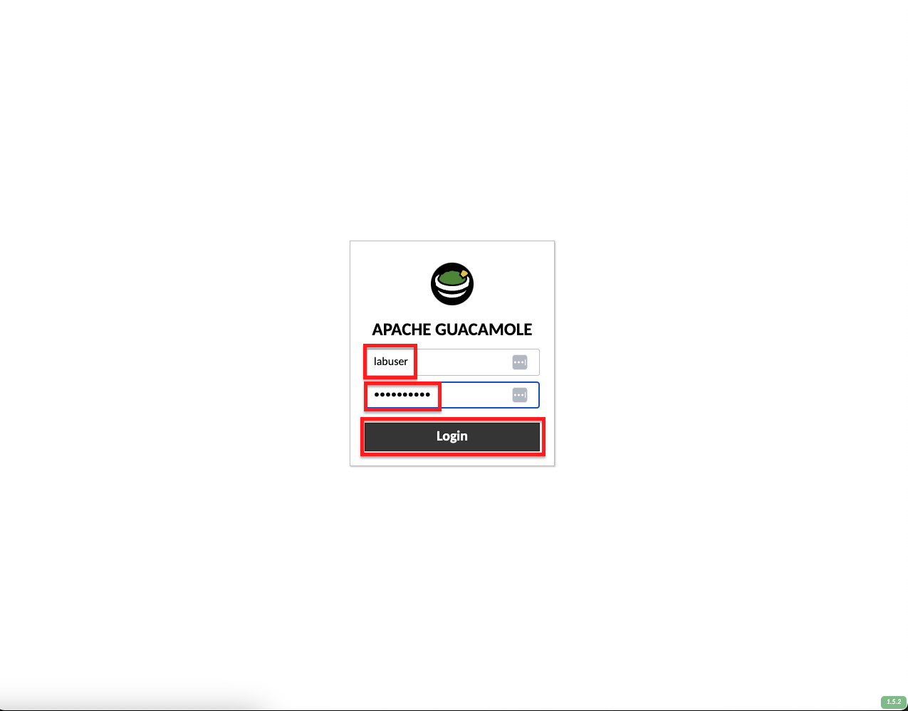

Web RDP
=======

The username and password for the Windows 10 host are:

+----------------------+----------------------+
| Username             | Password             | 
+======================+======================+
| .. code-block:: bash | .. code-block:: bash | 
|                      |                      |
|  labuser             |  F5L@bUser!          |
+----------------------+----------------------+

+---------------------------------------------------------------------------------------------------------------+
| Accessing the UDF Windows 10 Client via Web RDP                                                               |
+===============================================================================================================+
| 1. From the Webrowser tab that you used to login to the UDF environment, select deployment if you aren't      |
|                                                                                                               |
|    already there.                                                                                             |
|                                                                                                               |
| |lab1-RDP_Client_Deployment|                                                                                  |
|                                                                                                               |
| 2. Click the **ACCESS** button under the WebRDP system and select **Guacamole**.                              |
|                                                                                                               |
| |lab1-WebRDP_Guacamole|                                                                                       |
|                                                                                                               |
| 3. If you are not automatically logged in, enter *labuser* for the **Username** and *F5L@bUser!* for the      |
|                                                                                                               |
|    **Password** and click **Login**.                                                                          |
|                                                                                                               |
| |lab1-WebRDP_Guacamole_Login|                                                                                 |
|                                                                                                               |
| 6. You should now be logged into the Windows 10 client virtual machine.                                       |
|                                                                                                               |
| |lab1-WebRDP_Windows10_Desktop|                                                                               |
|                                                                                                               |
| .. note::                                                                                                     |
|    *You should be automatically logged into the Windows 10 client, but if you are not use the Username*       |
|    *labuser and the password F5L@bUser!*                                                                      |
+---------------------------------------------------------------------------------------------------------------+

.. |lab1-RDP_Client_Deployment| image:: _static/lab1-RDP_Client_Deployment.png
   :width: 800px
.. |lab1-WebRDP_Guacamole| image:: _static/lab1-WebRDP_Guacamole.png
   :width: 800px

.. |lab1-WebRDP_Windows10_Desktop| image:: _static/lab1-WebRDP_Windows10_Desktop.png
   :width: 800px