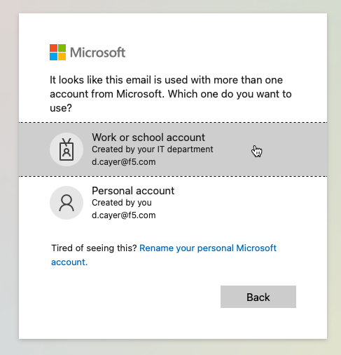

Introduction: F5 WAF **Policy Supervisor**
==========================================

Welcome to this F5 WAF **Policy Supervisor** Lab. The following tasks will guide you through the initial 
access requirements for this lab. Lab attendees should have received an invitation 
email to the lab environment based on the submitted registration email. Please check email and
spam folders if it has not been received. If you have not received an email, please contact a 
member of the lab team.

Task 1: Overview of the Lab Environment
~~~~~~~~~~~~~~~~~~~~~~~~~~~~~~~~~~~~~~~

+----------------------------------------------------------------------------------------------+
| The image below represents an overview of the lab environment.                               |
|                                                                                              |
| * **F5 Unified Demo Framework (UDF)**                                                        |
| * **F5 Distributed Cloud Console**                                                           |
| * **F5 Policy Supervisor Console**                                                           |
|                                                                                              |
+----------------------------------------------------------------------------------------------+
| **<insert an image that shows UDF components and Policy Supervisor here>**                   |
|                                                                                              |
| |intro001|                                                                                   |
|                                                                                              |
| **<insert an image that shows UDF components and Policy Supervisor here>**                   |
+----------------------------------------------------------------------------------------------+

Task 2: Accessing the UDF Virtual Lab Environment
~~~~~~~~~~~~~~~~~~~~~~~~~~~~~~~~~~~~~~~~~~~~~~~~~

This is a multi-step process that will involve:

1. Finding email invite to lab
2. Creating F5 account (If you don't have one already)
3. Setting up MFA for your F5 account (If you haven't already)
4. Signing into the lab environment

.. NOTE:: **Prerequisite** You should have received a UDF Course Registration email from F5 <courses@notify.udf.f5.com> as shown below:
+----------------------------------------------------------------------------------------------+
| .. image:: _static/email-invite.png                                                          |
|   :width: 800px                                                                              |
+----------------------------------------------------------------------------------------------+
| Click on the link below "You can login to the UDF here" (link is unique for each account).   |
|                                                                                              |
| If you do not already have an F5 account you, will be prompted to create one.                |
+----------------------------------------------------------------------------------------------+
| .. image:: _static/create-account.png                                                        |
|    :width: 400px                                                                             |
+----------------------------------------------------------------------------------------------+
| You should then receive a new email to activate your account.                                |
+----------------------------------------------------------------------------------------------+
| .. image:: _static/activate-account.png                                                      |
|    :width: 800px                                                                             |
+----------------------------------------------------------------------------------------------+
| After you click on 'Activate Account' you should see the following screen.                   |
+----------------------------------------------------------------------------------------------+
| .. image:: _static/account-activated.png                                                     |
|    :width: 400px                                                                             |
+----------------------------------------------------------------------------------------------+
| Now go to https://udf.f5.com (Yes, I know this is a lot of steps, sorry!)                    |
+----------------------------------------------------------------------------------------------+
| .. image:: _static/udf-login.png                                                             |
|    :width: 400px                                                                             |
+----------------------------------------------------------------------------------------------+
| Click on "Invited Users".                                                                    |
|                                                                                              |
| You will now be prompted to set up MFA access to the lab environment (mandatory).            |
+----------------------------------------------------------------------------------------------+
| .. image:: _static/mfa-setup.png                                                             |
|    :width: 400px                                                                             |
+----------------------------------------------------------------------------------------------+
| After you complete your setup by selecting "Finish", you will be able to launch this course. |
| Click **-> LAUNCH** now (it takes a few minutes for the lab components to launch).           |
+----------------------------------------------------------------------------------------------+
| .. image:: _static/launch-course.png                                                         |
|    :width: 800px                                                                             |
+----------------------------------------------------------------------------------------------+

Task 3: Accessing the F5 Distributed Cloud Console
~~~~~~~~~~~~~~~~~~~~~~~~~~~~~~~~~~~~~~~~~~~~~~~~~~
 
F5 Distributed Cloud Console is a SaaS control-plane for 
services that provides a UI and API for managing network, security, and compute services. The F5
Distributed Cloud Console can manage "sites" in existing on-premises data centers and sites in
AWS, Azure, and GCP cloud environments.

The following steps will guide you through the initial Lab environment access within the 
F5 Distributed Cloud Console. 

.. NOTE:: **Prerequisite** You should have received an email from F5 Distributed Cloud <no-reply@cloud.f5.com> a few minutes after launching your course as instructed in the previous task.
+----------------------------------------------------------------------------------------------+
| Click on the **Update Password** button/link in the email you received from                  |
| *F5 Distributed Cloud <no-reply@cloud.f5.com>* to set your credentials.                      |
+----------------------------------------------------------------------------------------------+
| .. image:: _static/updatepasswdemail.png                                                     |
|    :width: 800px                                                                             |
+----------------------------------------------------------------------------------------------+
| Ensure you adhere to the password strength restrictions and make a mental note of these      |
| credentials as you will need them several times throughout this lab today.                   |
| For this exercise, we recommend using the value *Canada123!* for your password.              |
+----------------------------------------------------------------------------------------------+
| |PSUpdatePassword|                                                                           |
+----------------------------------------------------------------------------------------------+
| Once you've set your new password (*including 1 upper, 1 lower and 1 special character*,     |
| you will be asked to "Log In" and presented with the following screens (click to login):     |
+----------------------------------------------------------------------------------------------+
| .. image:: _static/PSPasswordUpdated.png                                                     |
|    :width: 800px                                                                             |
+----------------------------------------------------------------------------------------------+
| In the domain field, enter: **f5-xc-lab-mcn**, click **Next** and sign in with your email    |
| address and password you've just set (i.e, *Canada123!*), and proceed to accepting the       |
| Terms and Conditions.                                                                        |
+----------------------------------------------------------------------------------------------+
| .. image:: _static/tenantlogin.png                                                           |
|    :width: 800px                                                                             |
+----------------------------------------------------------------------------------------------+
| Put a checmark in the box and click **Accept and Agree**.                                    |
+----------------------------------------------------------------------------------------------+
| .. image:: _static/PSTsandCs.png                                                             |
|    :width: 800px                                                                             |
+----------------------------------------------------------------------------------------------+

.. warning:: If you have not received the email to change your credentials or ran into problems changing your credentials, please stop and get help from one of the Lab Assistants.

**Logging into the XC Console**
---------------------------------

After accepting the Terms of Service and Privacy Policy, you are prompted to select your *Persona*.

+----------------------------------------------------------------------------------------------+
| Put a checkmark to select **"NetOps"** for your persona and click **next**.                  |
+----------------------------------------------------------------------------------------------+
| .. image:: _static/PSPersona.png                                                             |
|    :width: 800px                                                                             |
+----------------------------------------------------------------------------------------------+
| Select **"Intermediate"** for your *level* and then click **Get Started**.                   |
+----------------------------------------------------------------------------------------------+
| .. image:: _static/PSLevel.png                                                               |
|    :width: 800px                                                                             |
+----------------------------------------------------------------------------------------------+
| Your persona will highlight workflows within F5 Distributed Cloud.                           |
| You will be able to access all services, but making use of personas can focus your view on   |
| particular tasks that are relevant to your role.                                             |
|                                                                                              |
| *For informational purposes only:*  You can change these settings at any time.               |
+----------------------------------------------------------------------------------------------+
| Click on your *Account* icon in the top right of the screen and then click on                | 
| **Account Settings**.                                                                        |
| In the resulting window you can observe the **Work domains and skill level** section and     |
| other administrative functions.                                                              |
+----------------------------------------------------------------------------------------------+
| .. image:: _static/intro1.png                                                                |
|    :width: 800px                                                                             |
+----------------------------------------------------------------------------------------------+
| In the resulting window you can observe the **Work domains and skill level** section and     |
| other administrative functions.                                                              |
+----------------------------------------------------------------------------------------------+
| .. image:: _static/intro1.png                                                                |
|    :width: 800px                                                                             |
+----------------------------------------------------------------------------------------------+
.. note:: *For the purposes of this lab, permissions have been restricted to lab operations. Some menus/functions will be locked and/or not visible.*

Task 4: Accessing the F5 **Policy Supervisor** Console
~~~~~~~~~~~~~~~~~~~~~~~~~~~~~~~~~~~~~~~~~~~~~~~~~~~~~~
The same credentials for the **f5-xc-lab-mcn** tenant in the F5 Distributed Cloud Console can
be used to access the F5 **Policy Supervisor** console.

+----------------------------------------------------------------------------------------------+
| Login to https://policysupervisor.io by clicking on **Sign In with Azure AD**.               |
+----------------------------------------------------------------------------------------------+
| |intro010|                                                                                   |
+----------------------------------------------------------------------------------------------+
| If prompted, click on **Work or shcool account** and proceed to login with the same          |
| credentials configured in Task 3 above.                                                      |
+----------------------------------------------------------------------------------------------+
| |intro011|                                                                                   |
+----------------------------------------------------------------------------------------------+
| The **Policy Supervisor** console opens on the **Providers** page upon successful login.     |
+----------------------------------------------------------------------------------------------+
| .. image:: _static/image9.png                                                                |
|    :width: 800px                                                                             |
+----------------------------------------------------------------------------------------------+

**Let's begin!**
~~~~~~~~~~~~~~~~

+----------------------------------------------------------------------------------------------+
| You are now ready to begin the lab, Enjoy! Ask questions as needed.                          |
+----------------------------------------------------------------------------------------------+
| |labbgn|                                                                                     |
+----------------------------------------------------------------------------------------------+

.. |intro001| image:: _static/intro-001.png
   :width: 800px
.. |intro002| image:: _static/intro-002.png
   :width: 800px
.. |intro003| image:: _static/intro-003.png
   :width: 800px
.. |intro004| image:: _static/intro-004.png
   :width: 800px
.. |intro005| image:: _static/intro-005.png
   :width: 800px
.. |intro006| image:: _static/intro-006.png
   :width: 800px
.. |intro007| image:: _static/intro-007.png
   :width: 800px
.. |intro008| image:: _static/intro-008.png
   :width: 800px
.. |intro009| image:: _static/intro-009.png
   :width: 800px
.. |intro010| image:: _static/PSLoginWindow.png
   :width: 800px

.. |labbgn| image:: _static/labbgn.png
   :width: 800px
.. |PSUpdatePassword| image:: _static/PSUpdatePassword.png
      :width: 800px
