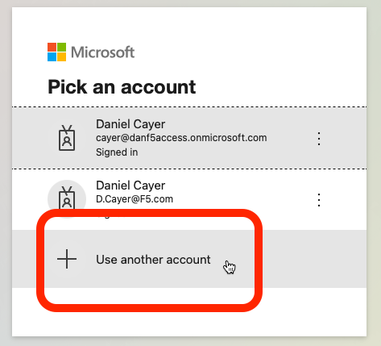
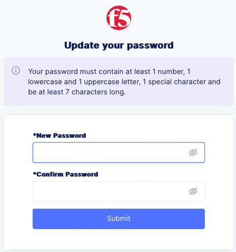

Introduction and Login
======================

Welcome to this F5 WAF **Policy Supervisor** Lab. The following tasks will guide you through the initial 
access requirements for this lab. Lab attendees should have already received an invitation 
email to the lab environment based on the email address used during the registration process. Please check
your email spam folders if it has not been received. If you have not received an email, please contact a 
member of the lab team.

Task 1: Overview of the Lab Environment
~~~~~~~~~~~~~~~~~~~~~~~~~~~~~~~~~~~~~~~

+----------------------------------------------------------------------------------------------+
| The image below represents an overview of the lab environment, which is comprised of:        |
|                                                                                              |
| * F5 Unified Demo Framework (UDF) - *F5's dedicated Private Cloud for demos and labs*        |
| * F5 Distributed Cloud Console - *F5 Public Cloud SaaS offerings*                            |
| * F5 Policy Supervisor Console - *F5 WAF Policy Supervisor Service*                          |
|                                                                                              |
+----------------------------------------------------------------------------------------------+
| |intro001|                                                                                   |
+----------------------------------------------------------------------------------------------+

Task 2: Accessing the UDF Virtual Lab Environment
~~~~~~~~~~~~~~~~~~~~~~~~~~~~~~~~~~~~~~~~~~~~~~~~~

This is a multi-step process that will involve:

1. Finding your invitation email for this UDF lab
2. Creating your F5 UDF account (If you don't have one already)
3. Setting up MFA for your F5 UDF account (If you haven't already)
4. Signing into the UDF lab environment

+----------------------------------------------------------------------------------------------+
| Locate your UDF Course Registration email from F5 <courses@notify.udf.f5.com>.               |
+----------------------------------------------------------------------------------------------+
| .. image:: _static/email-invite.png                                                          |
|   :width: 800px                                                                              |
+----------------------------------------------------------------------------------------------+
| Click on the link below **You can login to the UDF here** (link is unique for each account). |
|                                                                                              |
| If you do not already have an F5 account you, will be prompted to create one.                |
+----------------------------------------------------------------------------------------------+
| .. image:: _static/create-account.png                                                        |
|    :width: 400px                                                                             |
+----------------------------------------------------------------------------------------------+
| You should then receive a new email to activate your account.                                |
+----------------------------------------------------------------------------------------------+
| .. image:: _static/activate-account.png                                                      |
|    :width: 800px                                                                             |
+----------------------------------------------------------------------------------------------+
| After you click on **Activate Account**, you should see the following screen.                |
+----------------------------------------------------------------------------------------------+
| .. image:: _static/account-activated.png                                                     |
|    :width: 400px                                                                             |
+----------------------------------------------------------------------------------------------+
| Browse to https://udf.f5.com                                                                 |
+----------------------------------------------------------------------------------------------+
| .. image:: _static/udf-login.png                                                             |
|    :width: 400px                                                                             |
+----------------------------------------------------------------------------------------------+
| Click on **Invited Users**.                                                                  |
|                                                                                              |
| You will now be prompted to set up 2-step authentication to the lab environment (mandatory). |
+----------------------------------------------------------------------------------------------+
| .. image:: _static/mfa-setup.png                                                             |
|    :width: 400px                                                                             |
+----------------------------------------------------------------------------------------------+
| Follow the instructions and prompts to complete the account setup.                           |
+----------------------------------------------------------------------------------------------+
| .. image:: _static/UDFJoinClass.png                                                          |
|    :width: 800px                                                                             |
+----------------------------------------------------------------------------------------------+
| On the UDF LOBBY page, click **Join**.                                                       |
| Click **Continue Anyway** if prompted.                                                       |
+----------------------------------------------------------------------------------------------+
| .. image:: _static/launch-course.png                                                         |
|    :width: 800px                                                                             |
+----------------------------------------------------------------------------------------------+
| Click **-> LAUNCH** (it takes several minutes for the virtual machines to deploy and start.) |
+----------------------------------------------------------------------------------------------+

Task 3: Setup your new credentials for the F5 Distributed Cloud Console
~~~~~~~~~~~~~~~~~~~~~~~~~~~~~~~~~~~~~~~~~~~~~~~~~~~~~~~~~~~~~~~~~~~~~~~
 
F5 Distributed Cloud Console is a SaaS control-plane for 
services that provides a UI and API for managing network, security, and compute services. The F5
Distributed Cloud Console can manage *sites* in existing on-premises data centers and sites in
AWS, Azure, and GCP cloud environments.

The following steps will guide you through the initial Lab environment access within the 
F5 Distributed Cloud Console. 

.. NOTE:: 
   Please wait for an email from 
   **F5 Distributed Cloud <no-reply@cloud.f5.com>**, which should be delivered to your email
   inbox a few minutes after initial launch of this course in UDF.

.. warning:: If you have not received the email to change your credentials or ran into problems changing your credentials specifically for *Account name*: **f5-xc-lab-mcn**, please stop and get help from one of the Lab Assistants.

+----------------------------------------------------------------------------------------------+
| Locate the **Update Your Account** email sent to you from                                    |
| *F5 Distributed Cloud <no-reply@cloud.f5.com>*.                                              |
+----------------------------------------------------------------------------------------------+
| .. image:: _static/updatepasswdemail.png                                                     |
|    :width: 800px                                                                             |
+----------------------------------------------------------------------------------------------+
| Click the **Update Password** button/link in that email to set your credentials.             |
+----------------------------------------------------------------------------------------------+
| |PSUpdatePassword|                                                                           |
+----------------------------------------------------------------------------------------------+
| Ensure you adhere to the password strength restrictions and make a mental note of these      |
| credentials as you will need them several times throughout this lab today.                   |
| *For this exercise, feel free to use the same password that was configured for you on*       |
| *the two BIG-IP appliances of your UDF virtual lab environment* (**Canada123!**).            |
| Click **Submit**.                                                                            |
| Once you've set your new password (*including 1 upper, 1 lower and 1 special character*),    |
| you will be prompted to **Log In**.                                                          |
+----------------------------------------------------------------------------------------------+
| .. image:: _static/PSPasswordUpdated.png                                                     |
|    :width: 800px                                                                             |
+----------------------------------------------------------------------------------------------+
| Click the **Log In** button.                                                                 |
+----------------------------------------------------------------------------------------------+
| .. image:: _static/tenantlogin.png                                                           |
|    :width: 800px                                                                             |
+----------------------------------------------------------------------------------------------+
| In the domain field, enter: **f5-xc-lab-mcn** and click **Next**.                            |
+----------------------------------------------------------------------------------------------+
| .. image:: _static/tenantlogin2.png                                                          |
|    :width: 800px                                                                             |
+----------------------------------------------------------------------------------------------+
| Sign in with your email address and password you've just set (i.e, **Canada123!**),          |
| and proceed to accepting the Terms and Conditions page.                                      |
+----------------------------------------------------------------------------------------------+
| .. image:: _static/PSTsandCs.png                                                             |
|    :width: 800px                                                                             |
+----------------------------------------------------------------------------------------------+
| Put a checmark in the box and click to **Accept and Agree**.                                 |
| Upon the first successful login, you are prompted to select your *Persona*.                  |
+----------------------------------------------------------------------------------------------+
| .. image:: _static/PSPersona.png                                                             |
|    :width: 800px                                                                             |
+----------------------------------------------------------------------------------------------+
| Put a checkmark to select **NetOps** for your persona and click **next**.                    |
+----------------------------------------------------------------------------------------------+
| .. image:: _static/PSLevel.png                                                               |
|    :width: 800px                                                                             |
+----------------------------------------------------------------------------------------------+
| Select **Intermediate** for your *level* and then click **Get Started**.                     |
+----------------------------------------------------------------------------------------------+
| Your persona will highlight workflows within F5 Distributed Cloud.                           |
| You will be able to access all services, but making use of personas can focus your view on   |
| particular tasks that are relevant to your role.                                             |
|                                                                                              |

Optional: Logging into the F5 Distributed Cloud Console
-------------------------------------------------------

+----------------------------------------------------------------------------------------------+
| *For informational purposes only:*  You can change your persona settings at any time.        |
+----------------------------------------------------------------------------------------------+
| .. image:: _static/intro1.png                                                                |
|    :width: 800px                                                                             |
+----------------------------------------------------------------------------------------------+
| Click on your *Account* icon in the top right of the screen and then click on                | 
| **Account Settings**.                                                                        |
+----------------------------------------------------------------------------------------------+
| .. image:: _static/intro2.png                                                                |
|    :width: 800px                                                                             |
+----------------------------------------------------------------------------------------------+
| In the resulting window you can observe the **Work domains and skill level** section and     |
| other administrative functions.                                                              |
+----------------------------------------------------------------------------------------------+
.. note:: *For the purposes of this lab, permissions on your ephemeral account have been restricted to lab operations. Some menus/functions will be locked and/or not visible.*

Task 4: Accessing the F5 **Policy Supervisor** Console
~~~~~~~~~~~~~~~~~~~~~~~~~~~~~~~~~~~~~~~~~~~~~~~~~~~~~~
**Policy Supervisor** uses the Microsoft Azure AD authentication service for login. You must have a valid Azure AD account to proceed with this lab.

+----------------------------------------------------------------------------------------------+
| Browse to https://policysupervisor.io.                                                       |
+----------------------------------------------------------------------------------------------+
| |intro010|                                                                                   |
+----------------------------------------------------------------------------------------------+
| Click on **Sign In with Azure AD**.                                                          |
+----------------------------------------------------------------------------------------------+
| |intro011|                                                                                   |
+----------------------------------------------------------------------------------------------+
| Follow the prompts to login with a valid Microsoft account.                                  |
| click **User another account** or **Back** if your existing account is not listed or if you  |
| wish to create a new Microsoft account (follow the **Create one!** link) .                   |
+----------------------------------------------------------------------------------------------+
| .. image:: _static/image9.png                                                                |
|    :width: 800px                                                                             |
+----------------------------------------------------------------------------------------------+
| The **Policy Supervisor** console opens on the **Providers** page upon successful login.     |
+----------------------------------------------------------------------------------------------+

+----------------------------------------------------------------------------------------------+
| **Let's begin!** You are now ready to begin the lab. Enjoy! Ask questions as needed.         |
+----------------------------------------------------------------------------------------------+
| |labbgn|                                                                                     |
+----------------------------------------------------------------------------------------------+

.. |intro001| image:: _static/intro-001.png
   :width: 800px
.. |intro002| image:: _static/intro-002.png
   :width: 800px
.. |intro003| image:: _static/intro-003.png
   :width: 800px
.. |intro004| image:: _static/intro-004.png
   :width: 800px
.. |intro005| image:: _static/intro-005.png
   :width: 800px
.. |intro006| image:: _static/intro-006.png
   :width: 800px
.. |intro007| image:: _static/intro-007.png
   :width: 800px
.. |intro008| image:: _static/intro-008.png
   :width: 800px
.. |intro009| image:: _static/intro-009.png
   :width: 800px
.. |intro010| image:: _static/PSLoginWindow.png
   :width: 800px

.. |labbgn| image:: _static/labbgn.png
   :width: 800px

